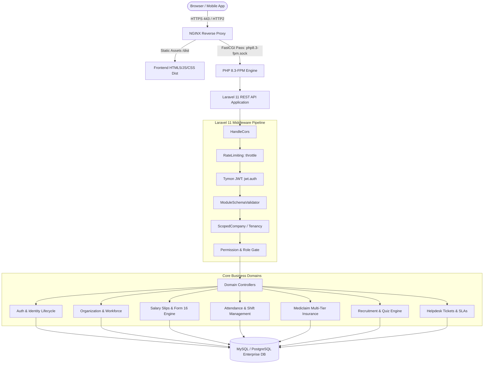
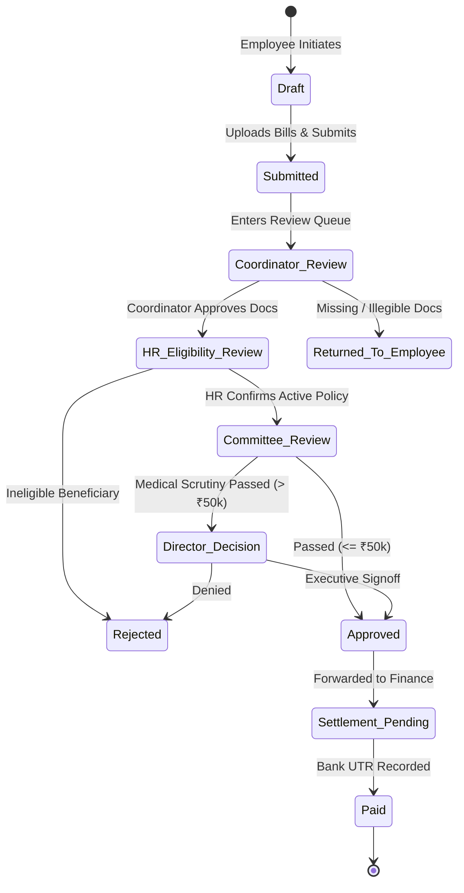

# NISS HRMS (Human Resource Management System) - Master Technical Architecture & Specification

> **System Version:** 2.4.0-Enterprise  
> **Production Host:** AWS EC2 (`ip-172-31-36-37` / `niss.pro`)  
> **Environment:** Production (Ubuntu 22.04 LTS, NGINX Reverse Proxy with HTTP/2 SSL, PHP 8.3-FPM, MySQL 8.0 / PostgreSQL, PM2)  
> **Codebase Path:** `\\192.168.1.53\f\HRMS oldd`  
> **Classification:** Comprehensive Technical & Operational Reference Manual

---

## Table of Contents
1. [Executive Summary & Technology Stack](#1-executive-summary--technology-stack)
2. [Enterprise Architecture & Relational Data Model](#2-enterprise-architecture--relational-data-model)
3. [Authentication, Security & Enterprise RBAC Framework](#3-authentication-security--enterprise-rbac-framework)
4. [Comprehensive Frontend Pages, Controls, Settings & Functions](#4-comprehensive-frontend-pages-controls-settings--functions)
   - [4.1 Authentication, Onboarding & Public Pages](#41-authentication-onboarding--public-pages)
   - [4.2 Careers Portal & Candidate Management](#42-careers-portal--candidate-management)
   - [4.3 Employee Self-Service (ESS) Portal](#43-employee-self-service-ess-portal)
   - [4.4 Admin Core & Payroll Operations](#44-admin-core--payroll-operations)
   - [4.5 HR Hub & Workforce Architecture](#45-hr-hub--workforce-architecture)
   - [4.6 Enterprise Mediclaim Insurance Hub](#46-enterprise-mediclaim-insurance-hub)
5. [Exhaustive Backend API Route Directory](#5-exhaustive-backend-api-route-directory)
   - [5.1 Authentication, Sessions & Profile Endpoints](#51-authentication-sessions--profile-endpoints)
   - [5.2 Role, Policy, Permission Matrix & Delegation Endpoints](#52-role-policy-permission-matrix--delegation-endpoints)
   - [5.3 Organization & Workforce Architecture Endpoints](#53-organization--workforce-architecture-endpoints)
   - [5.4 Employee Lifecycle & Appointment Endpoints](#54-employee-lifecycle--appointment-endpoints)
   - [5.5 Attendance & Shift Scheduling Endpoints](#55-attendance--shift-scheduling-endpoints)
   - [5.6 Payroll, Salary Slips & Form 16 Endpoints](#56-payroll-salary-slips--form-16-endpoints)
   - [5.7 Recruitment, Candidate Pipeline & Interview Endpoints](#57-recruitment-candidate-pipeline--interview-endpoints)
   - [5.8 Support Tickets & Control Center Endpoints](#58-support-tickets--control-center-endpoints)
   - [5.9 Enterprise Mediclaim Insurance Endpoints](#59-enterprise-mediclaim-insurance-endpoints)
6. [Business Logic, Mathematical Formulations & Statutory Rules](#6-business-logic-mathematical-formulations--statutory-rules)
   - [6.1 Monthly Payroll, Allowances & Proration Math](#61-monthly-payroll-allowances--proration-math)
   - [6.2 Statutory Deductions (PF, ESI, PT, LWF)](#62-statutory-deductions-pf-esi-pt-lwf)
   - [6.3 Income Tax (TDS) Engine & Form 16 (Old vs New Regime 115BAC)](#63-income-tax-tds-engine--form-16-old-vs-new-regime-115bac)
   - [6.4 Attendance, Shift Rules, Grace Periods & Late Penalties](#64-attendance-shift-rules-grace-periods--late-penalties)
   - [6.5 Mediclaim Floater Sum Insured, Co-Pay & Multi-Tier Review Engine](#65-mediclaim-floater-sum-insured-co-pay--multi-tier-review-engine)
   - [6.6 Recruitment Assessment & Automated Candidate Scoring](#66-recruitment-assessment--automated-candidate-scoring)
   - [6.7 Profile Completion Weighted Metric](#67-profile-completion-weighted-metric)
7. [Production Deployment, DevOps & Infrastructure Runbook](#7-production-deployment-devops--infrastructure-runbook)
8. [Summary & Operational Signoff](#8-summary--operational-signoff)

---

## 1. Executive Summary & Technology Stack

NISS HRMS is an enterprise Human Resource Management, Payroll, Attendance, Recruitment, and Mediclaim Insurance platform engineered to support multi-company, multi-unit corporate conglomerates. It provides unified workforce governance, real-time biometric and tabular attendance tracking, compliance-backed Indian payroll computation (including Indian Income Tax Act Form 16 Part A/B and Section 115BAC dual-regime tax modeling), an integrated careers portal with candidate screening quizzes, a multi-tier group health insurance claims approval pipeline, and fine-grained Attribute/Role-Based Access Control (ABAC/RBAC).

### Technology Stack Matrix

| Layer | Technology | Version / Tooling | Architectural Responsibility |
|---|---|---|---|
| **Frontend Framework** | React | 18.x with JSX | Client-side Single Page Application (SPA), state management, dynamic UI rendering |
| **Build & Bundler** | Vite | 5.x | High-speed ESM bundling, code-splitting, Hot Module Replacement (HMR) |
| **Styling & UI Kit** | Tailwind CSS & Lucide Icons | Tailwind 3.x, Lucide React | Modern responsive design tokens, dark/light themes, enterprise dashboard components |
| **Data Grid Engine** | AG Grid Community | 32.x with Community Modules | High-performance client-side and server-side tabular data grids (Attendance, Salary Slips, Employees) |
| **Mobile Packaging** | Capacitor | 6.x | Hybrid Android APK / PWA deployment for mobile self-service workforce |
| **PDF & Export Engine** | jsPDF & html2canvas | Standard | Client-side vector & canvas payslip export and statutory Form 16 document generation |
| **Backend Framework** | Laravel | 11.x (PHP 8.3) | RESTful API engine, service layer, Eloquent ORM, database migrations, middleware |
| **Authentication Engine**| Tymon JWT / Sanctum | JWT Auth with Bearer Tokens | Secure token issuance, HMAC-SHA256 signing, claims embedding (`company_code`, `role`, `unit`) |
| **Database Engine** | MySQL / PostgreSQL | 8.0+ / 15+ | Relational data persistence with strict foreign keys, atomic upserts, JSON payload columns |
| **Web Server / Proxy** | NGINX | 1.18+ with HTTP/2 & SSL | Reverse proxy, static asset caching, rate-limiting, SSL termination (`niss.pro`) |
| **PHP Process Manager**| PHP-FPM | 8.3-FPM (unix socket) | High-concurrency FastCGI backend pool with OPcache bytecode caching |
| **Process Daemon** | PM2 | Latest | Node.js microservice management and Laravel worker daemonization |

---

## 2. Enterprise Architecture & Relational Data Model

The platform operates across four decoupled layers:
1. **Presentation Tier:** React SPA served via NGINX with client-side routing, optimistic UI updates, and tokenized API communications.
2. **Gateway & Security Tier:** NGINX reverse proxy terminating TLSv1.3, forwarding `/api/*` and `/v1/*` requests to PHP-FPM via `/var/run/php/php8.3-fpm.sock`.
3. **Application & Service Tier:** Laravel 11 application implementing Domain-Driven services (Authorization, Payroll, Mediclaim, Recruitment, Attendance).
4. **Data Persistence Tier:** Relational database enforcing ACID transactions, scoped tenant isolation (`company_code`, `unit`), and audit trails.

### System Architecture Flow Diagram



### Core Database Entities & Schemas

| Table Name | Primary Key | Foreign Keys / Relationships | Key Columns & Indexes | Description |
|---|---|---|---|---|
| `users` | `id` (BIGINT) | `shift_id` -> `shifts.id` | `emp_code` (UNIQUE), `email`, `role`, `company_code`, `unit`, `department`, `designation`, `pan_number`, `aadhaar_number` (encrypted), `is_deleted` | Central workforce and administrative directory |
| `roles` | `id` (BIGINT) | None | `name`, `code` (UNIQUE), `description`, `level`, `is_system`, `is_active` | System and user-defined authorization roles |
| `permissions` | `id` (BIGINT) | None | `name` (UNIQUE), `display_name`, `module`, `action`, `description` | Granular operational permissions (e.g. `hr.attendance.update`) |
| `authorization_role_assignments` | `id` (BIGINT) | `user_id` -> `users.id`, `role_id` -> `roles.id` | `assigned_by`, `valid_from`, `valid_until`, `scope_type`, `scope_id` | Scoped and time-bounded role assignments |
| `authorization_policies` | `id` (BIGINT) | None | `name`, `code`, `rules` (JSON), `status`, `version` | Dynamic attribute-based security access policies |
| `emergency_accesses` | `id` (BIGINT) | `user_id` -> `users.id`, `granted_by` -> `users.id` | `reason`, `duration_minutes`, `expires_at`, `revoked_at`, `status` | Break-glass emergency privilege escalation logs |
| `delegations` | `id` (BIGINT) | `delegator_id`, `delegatee_id` -> `users.id` | `start_date`, `end_date`, `permissions` (JSON), `status` | Temporary proxy authorization delegations |
| `companies` / `legal_entities` | `id` (BIGINT) | None | `company_code` (UNIQUE), `name`, `legal_name`, `pan`, `tan`, `gstin`, `cin`, `status` | Multi-tenant corporate legal entities |
| `units` / `organization_units` | `id` (BIGINT) | `company_id` -> `companies.id` | `unit_code`, `name`, `company_code`, `location_id`, `type`, `status` | Operational branch offices, factories, and work units |
| `departments` | `id` (BIGINT) | None | `name`, `code`, `description`, `status` | Functional workforce departments |
| `shifts` | `id` (BIGINT) | None | `name`, `company_code`, `unit`, `start_time`, `end_time`, `grace_minutes` | Work schedule shifts and punch-in grace tolerances |
| `attendances` | `id` (BIGINT) | `user_id` -> `users.id` | `emp_code`, `company_code`, `date`, `status` (`present`, `absent`, `half_day`, `leave`), `marked_by`, UNIQUE(`emp_code`,`company_code`,`date`) | Daily employee attendance ledger |
| `upload_batches` | `id` (BIGINT) | `uploaded_by` -> `users.id` | `type` (`attendance`,`salary`,`employee`), `company_code`, `unit`, `month`, `year`, `total_rows`, `success_count`, `failed_count` | Audit batch headers for bulk Excel/CSV file imports |
| `upload_batch_rows` | `id` (BIGINT) | `batch_id` -> `upload_batches.id` | `row_number`, `status` (`passed`,`failed`), `reason`, `row_data` (JSON) | Detailed per-row validation failure/success audit log |
| `salaries` / `salaries_slips` | `id` (BIGINT) | None | `month`, `year`, `emp_code`, `name`, `working_days`, `present_days`, `leave`, `salary`, `basic`, `da`, `hra`, `wa`, `con_al`, `edu_a`, `gross_salary`, `pf`, `esi`, `pt`, `tds`, `net_salary`, `is_deleted` | Itemized monthly compensation and statutory deductions ledger |
| `job_requisitions` | `id` (BIGINT) | `hiring_manager_id` -> `users.id` | `requisition_number` (UNIQUE), `job_title`, `department`, `openings`, `status`, `target_hire_date`, `min_salary`, `max_salary` | Formal hiring requests and pipeline initiation |
| `candidates` | `id` (BIGINT) | `requisition_id` -> `job_requisitions.id` | `first_name`, `last_name`, `email`, `phone`, `current_stage`, `resume_path`, `overall_score`, `source` | Talent pipeline applicant database |
| `interviews` | `id` (BIGINT) | `candidate_id` -> `candidates.id` | `round_number`, `round_type`, `scheduled_at`, `status`, `meeting_link`, `interviewer_notes` | Multi-round interview coordination and scoring |
| `training_quizzes` | `id` (BIGINT) | None | `title`, `slug`, `time_limit_minutes`, `passing_percentage`, `questions` (JSON), `is_published` | Pre-screening and recruitment candidate skills tests |
| `quiz_attempts` | `id` (BIGINT) | `quiz_id` -> `training_quizzes.id`, `candidate_id` -> `candidates.id` | `token` (UNIQUE), `started_at`, `submitted_at`, `score`, `percentage`, `status` (`passed`,`failed`) | Candidate online test sessions and score audit |
| `assets` | `id` (BIGINT) | None | `asset_tag` (UNIQUE), `name`, `category`, `serial_number`, `status`, `purchase_date` | IT hardware and enterprise asset register |
| `asset_allocations` | `id` (BIGINT) | `asset_id` -> `assets.id`, `user_id` -> `users.id` | `allocated_at`, `returned_at`, `condition_on_alloc`, `condition_on_return` | Chain-of-custody asset tracking |
| `tickets` | `id` (BIGINT) | `user_id` -> `users.id`, `assigned_to` -> `users.id` | `ticket_number` (UNIQUE), `category_id`, `priority`, `status` (`open`,`in_progress`,`resolved`,`closed`), `subject`, `description` | Workforce support desk and SLA ticketing |
| `mediclaim_policies` | `id` (BIGINT) | None | `policy_number` (UNIQUE), `name`, `insurer_name`, `tpa_name`, `type` (`floater`,`individual`), `base_sum_insured`, `start_date`, `end_date` | Group health insurance corporate policies |
| `mediclaim_enrollments` | `id` (BIGINT) | `user_id` -> `users.id`, `policy_id` -> `mediclaim_policies.id` | `emp_code`, `status`, `effective_date`, `premium_deduction`, `cards_issued` | Active employee policy enrollments |
| `mediclaim_members` | `id` (BIGINT) | `enrollment_id` -> `mediclaim_enrollments.id` | `name`, `relation` (`self`,`spouse`,`child`,`parent`), `gender`, `dob`, `age`, `card_number`, `status` | Covered dependents and family beneficiaries |
| `mediclaim_intimations` | `id` (BIGINT) | `enrollment_id` -> `mediclaim_enrollments.id`, `member_id` -> `mediclaim_members.id` | `intimation_number` (UNIQUE), `hospital_name`, `admission_date`, `expected_cost`, `illness_description`, `status` | Pre-authorization and emergency hospital intimation notices |
| `mediclaim_claims` | `id` (BIGINT) | `intimation_id`, `member_id`, `policy_id` | `claim_number` (UNIQUE), `claim_type` (`cashless`,`reimbursement`), `hospital_id`, `total_claimed_amount`, `approved_amount`, `current_stage`, `status` | Medical reimbursement and cashless claim dossiers |
| `mediclaim_claim_expenses` | `id` (BIGINT) | `claim_id` -> `mediclaim_claims.id` | `category` (`room_rent`,`icu`,`surgeon_fees`,`pharmacy`,`diagnostics`,`investigations`), `bill_number`, `bill_date`, `claimed_amount`, `approved_amount` | Itemized medical expenditure line items |
| `mediclaim_claim_decisions` | `id` (BIGINT) | `claim_id` -> `mediclaim_claims.id`, `reviewer_id` -> `users.id` | `stage` (`coordinator`,`hr`,`committee`,`director`), `decision` (`approved`,`rejected`,`queried`), `amount`, `notes` | Multi-tier approval stage signoffs |
| `mediclaim_settlements` | `id` (BIGINT) | `claim_id` -> `mediclaim_claims.id` | `payment_ref_number`, `settled_amount`, `tds_deducted`, `paid_at`, `payment_mode`, `bank_utr` | Finance department final disbursement records |

---

## 3. Authentication, Security & Enterprise RBAC Framework

### Multi-Tier Authentication & Access Tokens
1. **Password Authentication (`POST /api/login`):**
   - Validates `emp_code` or `email` against `users` table.
   - Enforces rate-limiting: 30 requests per minute.
   - Issues HMAC-SHA256 Tymon JWT Bearer token with custom payload claims:
     ```json
     {
       "sub": 1042,
       "iss": "https://niss.pro/api",
       "emp_code": "EMP0142",
       "role": 1,
       "company_code": "NIDHI",
       "unit": "SURAT-MAIN",
       "permissions": ["hr.attendance.read", "payroll.payslip.read"]
     }
     ```
2. **OTP Login Challenge (`POST /api/login/otp/send` & `POST /api/login/otp/verify`):**
   - Rate-limited to 6 sends/min and 12 verifications/min to prevent brute-force attacks.
   - Dispatches a 6-digit numeric OTP via SMS/Email gateway with a 10-minute expiry window.
3. **Public Candidate Portal Authentication (`POST /api/candidate/login` & `POST /api/candidate/register`):**
   - Candidate accounts are isolated in `candidate_accounts` table to prevent credential escalation into employee systems.

### Aadhaar Masking & Data Protection
- Government Aadhaar identification numbers are stored with application-level AES-256 encryption.
- In UI views and export previews, Aadhaar is systematically masked to the last 4 digits: `XXXX-XXXX-1234`.
- Decryption is restricted to users with `compliance.aadhaar.export` permission and logged in `aadhaar_export_authorizations`.

### Role Hierarchy & Permissions Engine
The platform supports a 5-tier role hierarchy:
- **Role 0 (Super Admin):** Unrestricted platform-wide tenant and system access.
- **Role 1 (Company Admin):** Unrestricted access scoped strictly to their assigned `company_code`.
- **Role 2 (Unit Manager):** Scoped access to designated `company_code` and operational `unit`.
- **Role 3 (Standard Employee):** Access restricted exclusively to self-service resources (`emp_code = auth.emp_code`).
- **External Agent:** Restricted to candidate intake and new hire appointment form generation.

### Emergency Access & Delegation Mechanism
- **Delegation (`/api/v1/delegations`):** Allows an executive or manager on leave to designate a peer to approve attendance, job requisitions, or mediclaim reviews for a defined calendar window.
- **Emergency Break-Glass (`/api/v1/emergency-access`):** Grants temporary elevated rights (e.g. during an IT crisis). Requires mandatory ticket reference and reason. Automatically revokes privileges after expiry (e.g. 120 minutes) and notifies audit logs.

---

## 4. Comprehensive Frontend Pages, Controls, Settings & Functions

### 4.1 Authentication, Onboarding & Public Pages

#### 1. User Authentication (`/login`)
- **Component:** `src/pages/auth/Login.jsx`
- **Access Guard:** Public (Unauthenticated)
- **UI Controls & Settings:**
  - Standard Login Tab: Identifier input (`emp_code` or `email`), password field with visibility toggle, "Remember Me" checkbox.
  - OTP Login Tab: Phone number input, "Send OTP" button, 6-digit verification code input cells, resend countdown timer (60s).
  - Quick role preview switchers for staging/testing environments.
- **Functions & Handlers:**
  - `handleSubmit(e)`: Dispatches credentials to `POST /api/login`. On success, extracts JWT Bearer token and user profile into `AuthContext` and persists to `localStorage`.
  - `handleSendOtp()`: Dispatches request to `POST /api/login/otp/send`. Triggers countdown timer.
  - `handleVerifyOtp()`: Dispatches OTP payload to `POST /api/login/otp/verify`.
- **Connected APIs:**
  - `POST /api/login` -> Authenticates user and returns JWT + user object.
  - `POST /api/login/otp/send` -> Dispatches OTP code.
  - `POST /api/login/otp/verify` -> Validates OTP and returns JWT.

#### 2. Candidate Online Test Session (`/quiz/test/:quizId` & `/quiz/:token`)
- **Component:** `src/pages/careers/CandidateQuiz.jsx`
- **Access Guard:** Candidate Token / Public link
- **UI Controls & Settings:**
  - Test header with quiz title, total question count, and live circular countdown timer.
  - Question navigation palette with status markers (Answered, Unanswered, Marked for Review).
  - Single-choice and multiple-choice question options, code snippet blocks, and text responses.
  - "Previous", "Next", and "Submit Test" buttons with submission confirmation modal.
- **Functions & Handlers:**
  - `startQuiz()`: Initializes session via `GET /api/quiz/test/{id}` or token verification.
  - `selectAnswer(qIndex, optionId)`: Records answer state in local storage to prevent data loss on browser refresh.
  - `submitQuiz()`: Dispatches final responses to `POST /api/quiz/submit`. Displays immediate scoring card if configured.
- **Connected APIs:**
  - `GET /api/quiz/test/{id}` -> Fetches quiz structure and question list.
  - `POST /api/quiz/submit` -> Submits answers and generates score.

#### 3. Public Mediclaim Card Verification (`/mediclaim/verify/:token`)
- **Component:** `src/features/mediclaim/pages/MediclaimCardVerify.jsx`
- **Access Guard:** Public (QR Code destination)
- **UI Controls & Settings:**
  - Verification badge (Verified / Active / Expired / Invalid).
  - Digital Mediclaim card rendered with policyholder name, employee code, relationship, valid dates, TPA provider, and 24x7 emergency helpline numbers.
- **Functions & Handlers:**
  - `verifyToken()`: Triggers on mount with route token param. Calls `GET /api/v1/mediclaim/cards/verify/{token}`.
- **Connected APIs:**
  - `GET /api/v1/mediclaim/cards/verify/{token}` -> Validates digital card token authenticity.

---

### 4.2 Careers Portal & Candidate Management

#### 1. Public Careers Job Board (`/careers`)
- **Component:** `src/pages/careers/CareersPortal.jsx`
- **Access Guard:** Public
- **UI Controls & Settings:**
  - Search input (Keyword, Title, Skill), Department filter dropdown, Employment Type filter (Full-Time, Part-Time, Contract, Internship), Location filter dropdown.
  - Job card list showing title, department, location, experience range, posted date, and "Apply Now" button.
- **Functions & Handlers:**
  - `fetchJobs()`: Calls `GET /api/public/jobs` with search queries.
  - `applyJob(slug)`: Routes to `/careers/jobs/:slug`.
- **Connected APIs:**
  - `GET /api/public/jobs` -> Retrieves active published job requisitions.

#### 2. Job Detail & Application Submission (`/careers/jobs/:slug`)
- **Component:** `src/pages/careers/JobDetail.jsx`
- **Access Guard:** Public / Candidate Account
- **UI Controls & Settings:**
  - Full Job Specification (Overview, Responsibilities, Requirements, Benefits).
  - Application Form Modal: First name, Last name, Email, Phone, Current CTC, Expected CTC, Notice Period, Resume File Upload (PDF/DOCX max 5MB), Cover note.
- **Functions & Handlers:**
  - `handleApplicationSubmit()`: Sends multipart form data to `POST /api/public/candidates/apply`.
- **Connected APIs:**
  - `GET /api/public/jobs/{slug}` -> Retrieves complete job details.
  - `POST /api/public/candidates/apply` -> Submits candidate profile and resume.

#### 3. Candidate Self-Service Dashboard (`/careers/account/applications`)
- **Component:** `src/pages/careers/CandidateDashboard.jsx`
- **Access Guard:** Candidate JWT
- **UI Controls & Settings:**
  - Active applications summary cards (Applied, Under Review, Interview Scheduled, Offer Extended, Rejected).
  - Interactive status timeline showing stage transitions.
- **Functions & Handlers:**
  - `loadApplications()`: Calls `GET /api/candidate/applications`.
- **Connected APIs:**
  - `GET /api/candidate/applications` -> Retrieves logged-in candidate's applications.

---

### 4.3 Employee Self-Service (ESS) Portal

#### 1. Employee Payslips (`/employee/payslips`)
- **Component:** `src/pages/employee/Payslips.jsx`
- **Access Guard:** Employee (`payroll.payslip.read`)
- **UI Controls & Settings:**
  - Financial Year filter dropdown (e.g. 2024-25, 2025-26), Month selector pills (Jan - Dec).
  - Interactive Payslip Preview Card:
    - Company branding header (Nidhi Impex, address, PAN, TAN).
    - Employee summary (Code, Name, Department, Designation, Bank Account, UAN, PF Number, PAN).
    - Itemized Earnings: Basic Salary, DA, HRA, Conveyance Allowance, Education Allowance, Washing Allowance, Medical Allowance, Bonus, Incentives.
    - Itemized Deductions: PF, ESI, Professional Tax (PT), TDS, Labour Welfare Fund (LWF), Salary Advance recovery.
    - Summary Net Pay in numbers and currency words (e.g. "Rupees Thirty-Two Thousand Four Hundred Only").
  - Action Buttons: "Download PDF" (jsPDF render), "Print Payslip".
- **Functions & Handlers:**
  - `fetchPayslips()`: Calls `GET /api/salary-slip/get` scoped to current employee.
  - `handleDownloadPdf()`: Utilizes `exportNodeToPdf` to generate high-resolution print-ready PDF document.
- **Connected APIs:**
  - `GET /api/salary-slip/get` -> Returns personal monthly payslip history.

#### 2. Employee Form 16 Tax Certificate (`/employee/form16`)
- **Component:** `src/pages/employee/Form16.jsx`
- **Access Guard:** Employee (`payroll.form16.read`)
- **UI Controls & Settings:**
  - Assessment Year selector (e.g. AY 2025-26 for FY 2024-25).
  - Tabbed Document Viewer:
    - Part A: Certificate of Tax Deducted at Source (Deductor details, Employee PAN, Quarterly TDS deposit challan summaries).
    - Part B: Comprehensive computation of taxable income under Section 17, Section 10 exemptions, Section 16 standard deductions, Chapter VI-A deductions (80C, 80D, 80CCD), and tax liability under selected regime.
  - "Download Form 16 PDF" button.
- **Functions & Handlers:**
  - `loadForm16Data()`: Calls `GET /api/employee/form16/{year}`.
  - `buildForm16DocumentData()`: Formats tax payload into statutory tables conforming to CBDT Rule 31(1)(a).
- **Connected APIs:**
  - `GET /api/employee/form16/{year}` -> Returns Form 16 Part A and Part B computations.

#### 3. Employee Mediclaim Insurance Hub (`/employee/tds/mediclaim`)
- **Component:** `src/features/mediclaim/pages/EmployeeMediclaimWorkspace.jsx`
- **Access Guard:** Employee (`mediclaim.me.read`)
- **UI Controls & Settings:**
  - Multi-tab navigation:
    1. **Coverage Overview:** Shows active policy name, TPA contact, Floater Sum Insured, utilized claim amount, remaining available balance.
    2. **Family Members:** List of covered dependents (Spouse, Children, Dependent Parents) with age, gender, relationship, and status.
    3. **Digital Mediclaim Card:** Visual digital insurance card with barcode/QR code for hospital admission desk.
    4. **My Claims & Intimations:** Active hospital intimations and claims history with progress stepper.
    5. **Team Claims:** (Displayed only if employee is a team manager) Queue of subordinate claims awaiting manager signoff.
    6. **Rule Book:** Corporate insurance policy handbook with mandatory digital acknowledgment button.
  - Modal: "New Hospital Intimation" & "File Reimbursement Claim" (Hospital Picker, Admission Date, Estimated Expense, Bill Uploads).
- **Functions & Handlers:**
  - `loadCoverage()`: Calls `GET /api/v1/mediclaim/me/coverage`.
  - `submitIntimation(data)`: Dispatches to `POST /api/v1/mediclaim/me/intimations`.
  - `submitClaim(formData)`: Calls `POST /api/v1/mediclaim/me/claims`.
  - `acknowledgeRuleBook()`: Dispatches acknowledgment to `POST /api/v1/mediclaim/me/rule-book-acknowledge`.
- **Connected APIs:**
  - `GET /api/v1/mediclaim/me/coverage` -> Retrieves policy balance and coverage details.
  - `GET /api/v1/mediclaim/me/members` -> Dependent family member roster.
  - `POST /api/v1/mediclaim/me/intimations` -> Creates pre-auth/emergency hospital intimation.
  - `POST /api/v1/mediclaim/me/claims` -> Files new reimbursement claim dossier.

#### 4. Employee Support Desk (`/employee/tickets` & `/employee/tickets/new`)
- **Component:** `src/pages/employee/MyTickets.jsx` & `src/pages/employee/RaiseTicket.jsx`
- **Access Guard:** Employee (`self.ticket.read`, `self.ticket.create`)
- **UI Controls & Settings:**
  - Ticket List: Ticket #, Subject, Category (Payroll, IT, HR, Facilities), Priority (Low, Medium, High, Urgent), Status (Open, In Progress, Resolved, Closed), Last Updated.
  - Ticket Creation Form: Category selector, Priority picker, Subject input, Detailed Rich-Text Description, Multiple File Attachment Dropzone.
  - Conversation Thread View: Chronological message history with internal vs public messages, attachment download chips, "Reply" composer, "Reopen Ticket" button.
- **Functions & Handlers:**
  - `fetchTickets()`: Calls `GET /api/tickets/get`.
  - `handleCreateTicket()`: Dispatches multipart payload to `POST /api/tickets/store`.
  - `handleSendReply(ticketId)`: Dispatches comment to `POST /api/tickets/{id}/reply`.
- **Connected APIs:**
  - `GET /api/tickets/get` -> Returns personal ticket history.
  - `POST /api/tickets/store` -> Logs new support ticket.
  - `POST /api/tickets/{id}/reply` -> Appends message to ticket thread.

---

### 4.4 Admin Core & Payroll Operations

#### 1. Employee Workforce Directory (`/admin/employees`)
- **Component:** `src/pages/admin/EmployeeManagement.jsx`
- **Access Guard:** Admin / HR (`hr.employee.read`)
- **UI Controls & Settings:**
  - Top Filter Bar: Company selector, Unit selector, Department filter, Status filter (Active, Resigned, On Leave), Search input (`emp_code`, name, email).
  - Bulk Actions: Export CSV, Bulk Status Update, Assign Shift, Send Notification.
  - AG Grid Tabular View: Employee Code, Avatar, Name, Email, Phone, Company, Unit, Department, Designation, Joining Date, Shift, Actions (Edit, View Profile, Reset Password, Deactivate).
  - Context Menu: Right-click on any row reveals quick actions (View Payslips, Edit Permissions, Audit Log).
- **Functions & Handlers:**
  - `loadEmployees()`: Dispatches to `GET /api/employee/get` with query parameters.
  - `handleExportCsv()`: Generates client-side CSV of current filtered grid view.
  - `handleDeactivate(id)`: Soft-deletes user via `POST /api/employee/delete/{id}`.
- **Connected APIs:**
  - `GET /api/employee/get` -> Fetches scoped employee roster.
  - `POST /api/employee/delete/{id}` -> Soft-deletes employee.

#### 2. Comprehensive Salary & Payslip Administration (`/admin/salary`)
- **Component:** `src/pages/admin/SalaryManagement.jsx`
- **Access Guard:** Admin / Payroll (`payroll.payslip.read`, `payroll.payslip.update`)
- **UI Controls & Settings:**
  - Global Selectors: Company Code, Month (Jan - Dec), Year (2024 - 2030), Unit filter.
  - KPI Stat Cards: Total Gross Payroll, Total Net Payout, Total PF Deduction, Total ESI Deduction, Total TDS Withheld.
  - High-Performance AG Grid (35 columns): Month, Emp Code, Name, Working Days, Present Days, Leave, Salary, Basic, DA, HRA, WA, Con Al, Edu A, OWA, PPA, PDA, Med A, Bonus, LTA, HA, Mob A, Product Incentive, Comm, Other, Gross Salary, PF, ESI, PT, TDS, LWF, Advance, Total Deductions, Net Salary.
  - Grid Toolbar: Column Visibility Manager (toggle any of the 35 columns), Fullscreen Toggle, CSV Export, Batch Delete Slips.
  - Modal: `PayslipPreviewModal` -> Real-time visual salary slip rendering with print/PDF export.
  - Modal: `DeleteSalarySlipModal` -> Bulk deletion confirmation dialog with reason tracking.
- **Functions & Handlers:**
  - `fetchSalaries()`: Dispatches request to `GET /api/admin/salary-slip/get` with month, year, company, unit filters.
  - `handleCellEdit(params)`: Validates numeric inputs and triggers optimistic recalculations of Gross, Total Deductions, and Net Salary.
  - `handleDeleteSlips()`: Calls `POST /api/admin/salary-slip/delete`.
- **Connected APIs:**
  - `GET /api/admin/salary-slip/get` -> Returns all salary slips for specified period.
  - `POST /api/admin/salary-slip/delete` -> Removes specific salary records.

#### 3. Bulk Salary Slip Excel Upload & Verification (`/admin/salary/upload`)
- **Component:** `src/pages/admin/SalaryUploadPage.jsx` & `BulkSalaryValidation.jsx`
- **Access Guard:** Admin / Payroll (`payroll.payslip.create`)
- **UI Controls & Settings:**
  - Excel/CSV Drag-and-Drop Zone (Supports `.xlsx`, `.xls`, `.csv`).
  - Template Download: "Download Standard Payroll Template (.xlsx)".
  - 2-Step Interactive Verification Grid:
    - Step 1: Pre-Upload File Parsing: Parses file locally, maps columns (auto-detects aliases for Basic, HRA, PF, etc.), identifies missing mandatory headers.
    - Step 2: Row-Level Data Validator: Highlights duplicate employee codes, unrecognized month values, negative salaries, and unmatched employees in red.
    - In-Grid Cell Correction: User can double-click invalid cells to correct errors directly in the browser before final commit.
- **Functions & Handlers:**
  - `handleFileUpload(file)`: Uses SheetJS / XLSX parser to convert spreadsheet into JSON row objects.
  - `validateRows()`: Verifies data integrity against company employee roster.
  - `handleCommitUpload()`: Dispatches verified payload to `POST /api/admin/salary-slip/upload`.
- **Connected APIs:**
  - `POST /api/admin/salary-slip/upload` -> Ingests verified salary batch into database.

#### 4. Daily Attendance Matrix & Biometric Sync (`/admin/attendance`)
- **Component:** `src/pages/admin/AttendanceManagement.jsx`
- **Access Guard:** Admin / HR (`hr.attendance.read`, `hr.attendance.update`)
- **UI Controls & Settings:**
  - Period Controls: Month selector, Year selector, Company & Unit filter, "Show Only Marked" toggle.
  - Legend: Present (P - Green), Absent (A - Red), Half Day (H - Amber), Leave (L - Blue), Holiday/Off (Grey).
  - Matrix Grid: Employee Code, Name, Department, followed by 28-31 day columns representing each calendar date of the month.
  - Single-Click Quick Cycling: Clicking any date cell cycles status: `Unmarked -> P -> A -> H -> L -> Unmarked`.
  - Bulk Attendance Import Modal: Excel file upload for biometric attendance machine logs.
- **Functions & Handlers:**
  - `loadGrid()`: Calls `GET /api/attendance/grid?month=M&year=Y&company_code=C`.
  - `handleCellClick(empCode, date, currentStatus)`: Immediately invokes atomic upsert via `POST /api/attendance/cell`.
  - `handleBulkImport(rows)`: Dispatches batch to `POST /api/attendance/import`.
- **Connected APIs:**
  - `GET /api/attendance/grid` -> Returns attendance matrix for the whole month.
  - `POST /api/attendance/cell` -> Performs atomic upsert for single employee date cell.
  - `POST /api/attendance/import` -> Bulk imports monthly attendance logs.

#### 5. Shift Scheduling & Grace Configuration (`/admin/attendance/shift`)
- **Component:** `src/pages/admin/ShiftManagement.jsx`
- **Access Guard:** Admin / HR (`hr.shift.read`, `hr.shift.update`)
- **UI Controls & Settings:**
  - Shift Roster Table: Shift Name, Company, Unit, Start Time, End Time, Grace Period (Minutes), Assigned Employee Count, Actions.
  - "Create Shift" Modal: Name input, Start time picker (HH:mm), End time picker (HH:mm), Grace tolerance minutes (0 - 180 min), Description.
  - "Assign Shift to Employees" Modal: Multi-select employee list with shift reassignment action.
- **Functions & Handlers:**
  - `loadShifts()`: Calls `GET /api/shifts/get`.
  - `handleSaveShift()`: Dispatches to `POST /api/shifts/store` or `PUT /api/shifts/update/{id}`.
  - `handleAssignShift(shiftId, employeeIds)`: Calls `POST /api/shifts/assign`.
- **Connected APIs:**
  - `GET /api/shifts/get` -> Lists configured shifts.
  - `POST /api/shifts/store` -> Creates shift.
  - `PUT /api/shifts/update/{id}` -> Updates shift rules.
  - `POST /api/shifts/assign` -> Bulk assigns shift to employee IDs.

#### 6. Agent New Hire Appointments (`/admin/appointments`)
- **Component:** `src/pages/admin/Appointments.jsx` & `AppointmentModal.jsx`
- **Access Guard:** Admin / HR (`hr.appointment.read`, `hr.appointment.create`)
- **UI Controls & Settings:**
  - Appointment Candidate Pipeline: Candidate Name, Email, Phone, Company, Unit, Role, Status (Draft, Documents Pending, Approved, Converted to Employee).
  - Multi-Step Appointment Modal:
    - Step 1: Personal & Contact Details (Name, DOB, Gender, Blood Group, Mobile, Address).
    - Step 2: Identification & Bank (Aadhaar with real-time masking, PAN Number, Bank Name, Account Number, IFSC).
    - Step 3: Job Role & Compensation (Company, Unit, Department, Designation, Joining Date, Basic Salary, Gross Salary).
    - Step 4: Document Verification (Aadhaar Card Photo, PAN Card Photo, Passport Photo, Signed Appointment Letter).
- **Functions & Handlers:**
  - `loadAppointments()`: Calls `GET /api/appointment`.
  - `handleSaveAppointment()`: Sends multipart form payload to `POST /api/appointment`.
- **Connected APIs:**
  - `GET /api/appointment` -> Lists all pending and approved candidate appointment records.
  - `POST /api/appointment` -> Stores new appointment dossier.
  - `GET /api/appointment/check-emp-code` -> Verifies employee code availability.

---

### 4.5 HR Hub & Workforce Architecture

#### 1. HR Executive Dashboard (`/admin/hr`)
- **Component:** `src/pages/admin/hr/HrDashboard.jsx`
- **Access Guard:** HR (`hr.dashboard.read`)
- **UI Controls & Settings:**
  - Metric Widgets: Total Active Headcount, New Joiners This Month, Pending Requisitions, Attrition Rate, Open Support Tickets.
  - Visual Charts: Department Headcount Distribution, Monthly Attendance Rate, Gender Diversity Ratio.
  - Action Center: Quick links to Create Job Requisition, Allocate Asset, Process Exit.
- **Connected APIs:**
  - `GET /api/hr/dashboard` -> Returns high-level organizational analytics.

#### 2. Organization Structure & Legal Entities (`/admin/hr/organization`)
- **Component:** `src/pages/admin/hr/HrOrganization.jsx`
- **Access Guard:** HR / Admin (`organization.read`, `organization.update`)
- **UI Controls & Settings:**
  - Tab 1: Companies / Legal Entities (PAN, TAN, Registered Office, Board Directors).
  - Tab 2: Operating Units / Branches (Unit Code, Physical Address, Factory License Details).
  - Tab 3: Departments & Cost Centers.
  - Tab 4: Interactive Organizational Chart (Visual reporting tree showing positions and incumbents).
  - Tab 5: GL Account Mappings (Finance code linking for payroll accounting).
- **Functions & Handlers:**
  - `loadOrgData()`: Calls `GET /api/v1/admin/organization/units` and `reporting-structure`.
- **Connected APIs:**
  - `GET /api/v1/admin/organization/units` -> Lists business units.
  - `GET /api/v1/admin/organization/reporting-structure` -> Returns hierarchical org tree.

#### 3. Recruitment Pipeline & Job Requisitions (`/admin/hr/hiring`)
- **Component:** `src/pages/admin/hr/HiringProcess.jsx`
- **Access Guard:** HR (`hr.requisition.read`, `hr.candidate.read`)
- **UI Controls & Settings:**
  - Requisition View: Job Title, Openings, Department, Priority, Target Date, Approval Status (Draft, Approved, Sourcing, Closed).
  - Candidate Kanban Pipeline: Stages (Applied -> Screening Quiz -> Interview 1 -> Interview 2 -> Offer -> Hired).
  - Candidate Drawer: Resume Viewer, Skills Match Score, Interview Feedback Scorecards, Offer Generator.
- **Functions & Handlers:**
  - `loadCandidates(reqId)`: Calls `GET /api/candidates`.
  - `moveCandidateStage(candidateId, newStage)`: Dispatches to `PUT /api/candidates/{id}/stage`.
- **Connected APIs:**
  - `GET /api/requisitions` -> Lists open hiring requisitions.
  - `GET /api/candidates` -> Retrieves applicant database.
  - `PUT /api/candidates/{id}/stage` -> Updates recruitment stage.

#### 4. IT Asset Allocation (`/admin/hr/assets`)
- **Component:** `src/pages/admin/hr/AssetAllocation.jsx`
- **Access Guard:** HR / IT (`hr.asset.read`, `hr.asset.create`)
- **UI Controls & Settings:**
  - Asset Inventory: Asset Tag, Category (Laptop, Mobile, Vehicle, Access Card), Brand, Serial Number, Current Custodian, Condition.
  - Allocation Action: Assign asset to employee with signed handover acknowledgment.
- **Functions & Handlers:**
  - `loadAssets()`: Calls `GET /api/assets`.
  - `allocateAsset(assetId, userId)`: Calls `POST /api/assets/{id}/allocate`.
- **Connected APIs:**
  - `GET /api/assets` -> Lists asset inventory.
  - `POST /api/assets/{id}/allocate` -> Records asset assignment.

#### 5. Employee Separation & Exit Management (`/admin/hr/exit`)
- **Component:** `src/pages/admin/hr/ExitManagement.jsx`
- **Access Guard:** HR (`hr.exit.read`, `hr.exit.update`)
- **UI Controls & Settings:**
  - Resignation Queue: Employee Code, Resignation Date, Requested Last Working Day (LWD), Approved LWD, Notice Period Shortfall, Status.
  - Clearance Checklist: IT Asset Return, Finance Advance Settlement, Department Handover, HR Exit Interview.
  - Final Settlement (FnF) Calculator: Encashable Leave Days, Gratuity eligibility, Notice period recovery/waiver, Net FnF amount.
- **Functions & Handlers:**
  - `loadExits()`: Calls `GET /api/exit/requests`.
  - `approveClearance(exitId, dept)`: Dispatches to `POST /api/exit/{id}/clearance`.
- **Connected APIs:**
  - `GET /api/exit/requests` -> Lists resignations and terminations.
  - `POST /api/exit/{id}/clearance` -> Updates department clearance status.

#### 6. Workforce Architecture Suite (`/admin/workforce/*`)
- **Components:** `JobFunctionsPage.jsx`, `JobCategoriesPage.jsx`, `JobLevelsPage.jsx`, `JobGradesPage.jsx`, `JobFamiliesPage.jsx`, `DesignationsPage.jsx`, `JobsPage.jsx`
- **Access Guard:** HR (`workforce.job.read`, `workforce.designation.read`)
- **UI Controls & Settings:**
  - Standardized enterprise job catalog mapping functions to families, grades, and compensation bands.
  - Job descriptions, key performance areas (KPAs), and qualification criteria editors.
- **Connected APIs:**
  - `GET /api/v1/admin/workforce/job-functions`, `/job-categories`, `/job-grades`, `/designations`, `/jobs`.

---

### 4.6 Enterprise Mediclaim Insurance Hub

The Mediclaim Insurance Hub (`src/features/mediclaim/pages/AdminMediclaimWorkspace.jsx`) is a specialized mission-critical module structured across 10 specialized administrative tabs:

1. **Dashboard Tab (`DashboardTab.jsx`):**
   - KPI Widgets: Total Policies Enrolled, Active Beneficiaries, Claims Incurred Ratio (ICR), Pending Review Count, Total Disbursed YTD.
   - Stage Distribution Chart: Real-time visual count of claims across Coordinator, HR, Committee, Director, and Finance stages.
2. **Claims Tab (`ClaimsTab.jsx`):**
   - Universal Claims Ledger: Claim Number, Employee Code, Patient Name, Relationship, Hospital, Claim Type (Cashless / Reimbursement), Claimed Amount, Approved Amount, Current Review Stage, Status.
   - Filter Suite: Search by Claim # or Patient, Policy filter, Stage filter, Date range.
   - Drawer View: Complete electronic claim dossier, uploaded hospital bills, diagnostic reports, discharge summary, decision history.
3. **Pending Reviews Tab (`PendingReviewsTab.jsx`):**
   - Task Queue: Displays only claims requiring action by the currently logged-in reviewer based on their designated role (Coordinator, HR Eligibility, Committee Member, Director).
   - Review Panel Shell:
     - Coordinator Review Panel: Verifies original document physical receipt and completeness.
     - HR Eligibility Review Panel: Validates employment status, active coverage, dependent eligibility.
     - Committee Review Panel: Medical scrutiny of treatment necessity and expense reasonableness.
     - Director Decision Panel: Final executive signoff for high-value claims (> ₹50,000).
4. **Employees & Cards Tab (`EmployeesTab.jsx`):**
   - Roster of all enrolled employees and dependents with digital card status.
   - Action: "Bulk Issue Digital Cards" -> Generates cryptographically verifiable QR cards for all newly eligible employees.
5. **Hospitals Directory Tab (`HospitalsTab.jsx`):**
   - Directory of network and non-network healthcare providers: Hospital Name, City, Accreditation (NABH, NABL), Network Status (Cashless Tie-up / Reimbursement Only), Contact Person, Phone, Email.
6. **Document Settings Tab (`DocumentSettingsTab.jsx`):**
   - Configures mandatory document requirements based on claim category (e.g. Inpatient Admission requires Discharge Summary + Final Itemized Bill + Payment Receipts; Daycare Surgery requires OT Notes + Doctor Prescription).
7. **Rule Books Tab (`RuleBooksTab.jsx`):**
   - Multi-lingual policy rulebook builder (English, Hindi, Gujarati). Allows publishing policy clauses, exclusions, room rent capping rules, and maternity limits.
8. **Reviewers Tab (`ReviewersTab.jsx`):**
   - Assigns administrative personnel to approval stages (e.g. designating HR Officer A to Stage 1, Medical Advisor B to Stage 2).
9. **Settlement Tab (`SettlementPanel.jsx`):**
   - Finance disbursement dashboard: Approved claims awaiting bank payout.
   - Actions: Record Payment Reference (UTR / Cheque #), Payment Date, Payment Mode (NEFT/RTGS), TDS deducted under Section 194J.
10. **Audit History Tab (`AuditHistoryTab.jsx`):**
    - Immutable security and action log tracking every status change, claim query, document upload, and approval timestamp with user IP address.

---

## 5. Exhaustive Backend API Route Directory

### 5.1 Authentication, Sessions & Profile Endpoints

| Method | URI Path | Controller & Method | Middleware | Request Body / Parameters | Response Schema & DB Impact |
|---|---|---|---|---|---|
| `POST` | `/api/login` | `AuthController@login` | `throttle:30,1` | `emp_code`, `password` | Returns JWT Bearer token + user claims |
| `POST` | `/api/login/otp/send` | `AuthController@sendLoginOtp` | `throttle:6,1` | `phone_number` | Sends 6-digit OTP code |
| `POST` | `/api/login/otp/verify` | `AuthController@verifyLoginOtp` | `throttle:12,1` | `phone_number`, `otp` | Validates OTP and returns JWT token |
| `POST` | `/api/logout` | `AuthController@logout` | `jwt.auth`, `throttle:30,1`| None | Invalidates current JWT token |
| `GET` | `/api/profile` | `AuthController@me` | `jwt.auth`, `permission:self.profile.read` | None | Returns logged-in user profile, unit, role, permissions |
| `POST` | `/api/profile-update` | `UserController@updateProfile` | `jwt.auth`, `permission:self.profile.update` | `email`, `phone`, `emergency_contact`, `address` | Updates `users` table record |
| `POST` | `/api/change-password`| `AuthController@changePassword` | `jwt.auth`, `permission:self.profile.update` | `current_password`, `new_password`, `new_password_confirmation` | Hashes and updates password |
| `GET` | `/api/my-permissions` | `PermissionDimensionController@myPermissions` | `jwt.auth` | None | Returns array of granted permission strings |

---

### 5.2 Role, Policy, Permission Matrix & Delegation Endpoints

| Method | URI Path | Controller & Method | Middleware | Request Body / Parameters | Response Schema & DB Impact |
|---|---|---|---|---|---|
| `GET` | `/api/v1/roles/manage` | `V1RoleController@index` | `jwt.auth`, `permission:admin.role.read` | None | Lists all user roles in system |
| `POST` | `/api/v1/roles` | `V1RoleController@store` | `jwt.auth`, `permission:admin.role.create` | `name`, `code`, `description`, `permissions` (array) | Creates new role and assigns permissions |
| `GET` | `/api/v1/roles/{role}` | `V1RoleController@show` | `jwt.auth`, `permission:admin.role.read` | None | Returns role details and permission IDs |
| `PUT` | `/api/v1/roles/{role}` | `V1RoleController@update` | `jwt.auth`, `permission:admin.role.update` | `name`, `description`, `permissions` | Updates role details and synced permissions |
| `DELETE`| `/api/v1/roles/{role}` | `V1RoleController@destroy` | `jwt.auth`, `permission:admin.role.delete` | None | Soft-deletes role |
| `POST` | `/api/v1/authorization/check` | `V1AuthorizationController@check` | `jwt.auth` | `permission`, `scope_type`, `scope_id` | Returns `{"allowed": true/false}` |
| `POST` | `/api/v1/authorization/simulate` | `V1PermissionMatrixController@simulate` | `jwt.auth` | `user_id`, `requested_permission` | Simulates ABAC policy resolution graph |
| `GET` | `/api/v1/delegations` | `DelegationController@index` | `jwt.auth` | None | Lists active delegations for user |
| `POST` | `/api/v1/delegations` | `DelegationController@store` | `jwt.auth` | `delegatee_id`, `start_date`, `end_date`, `permissions` | Creates temporary proxy delegation |
| `POST` | `/api/v1/emergency-access`| `EmergencyAccessController@store`| `jwt.auth`, `permission:admin.emergency.grant` | `user_id`, `reason`, `duration_minutes` | Activates break-glass temporary rights |

---

### 5.3 Organization & Workforce Architecture Endpoints

| Method | URI Path | Controller & Method | Middleware | Request Body / Parameters | Response Schema & DB Impact |
|---|---|---|---|---|---|
| `GET` | `/api/v1/admin/organization/units` | `OrganizationUnitController@index` | `jwt.auth`, `permission:organization.read` | `company_code` | Lists operating units / branches |
| `POST` | `/api/v1/admin/organization/units` | `OrganizationUnitController@store` | `jwt.auth`, `permission:organization.create` | `unit_code`, `name`, `company_code`, `location_id` | Stores new operating branch unit |
| `GET` | `/api/v1/admin/organization/reporting-structure` | `ReportingStructureController@index` | `jwt.auth` | `company_code` | Returns hierarchical node/edge tree of positions |
| `GET` | `/api/v1/admin/workforce/job-functions` | `JobFunctionController@index` | `jwt.auth` | None | Lists enterprise job functions |
| `GET` | `/api/v1/admin/workforce/designations` | `DesignationController@index` | `jwt.auth` | None | Lists active corporate designations |
| `GET` | `/api/v1/admin/workforce/jobs` | `JobController@index` | `jwt.auth` | None | Lists formalized job architecture entries |

---

### 5.4 Employee Lifecycle & Appointment Endpoints

| Method | URI Path | Controller & Method | Middleware | Request Body / Parameters | Response Schema & DB Impact |
|---|---|---|---|---|---|
| `GET` | `/api/employee/get` | `UserController@index` | `jwt.auth`, `permission:hr.employee.read` | `company_code`, `unit`, `department`, `page` | Returns paginated employee directory |
| `POST` | `/api/employee/store` | `UserController@store` | `jwt.auth`, `permission:hr.employee.create` | `emp_code`, `name`, `email`, `company_code`, `unit`, `role` | Creates new employee record in `users` |
| `POST` | `/api/employee/update/{id}`| `UserController@update` | `jwt.auth`, `permission:hr.employee.update` | `name`, `email`, `unit`, `designation`, `department` | Modifies existing employee details |
| `POST` | `/api/employee/delete/{id}`| `UserController@destroy` | `jwt.auth`, `permission:hr.employee.delete` | None | Soft-deletes employee (`is_deleted = 1`) |
| `GET` | `/api/appointment` | `UserController@getAppointment` | `jwt.auth`, `permission:hr.appointment.read` | None | Returns candidate appointment roster |
| `POST` | `/api/appointment` | `UserController@appointmentStore` | `jwt.auth`, `permission:hr.appointment.create` | Multipart candidate & KYC documents payload | Persists appointment and stores uploaded files |
| `GET` | `/api/appointment/check-emp-code`| `UserController@checkEmployeeCode` | `jwt.auth` | `code` (query) | Returns `{"available": true/false}` |

---

### 5.5 Attendance & Shift Scheduling Endpoints

| Method | URI Path | Controller & Method | Middleware | Request Body / Parameters | Response Schema & DB Impact |
|---|---|---|---|---|---|
| `GET` | `/api/attendance/grid` | `AttendanceController@grid` | `jwt.auth`, `permission:hr.attendance.read` | `month`, `year`, `company_code`, `unit` | Returns 31-day attendance matrix for company |
| `POST` | `/api/attendance/cell` | `AttendanceController@upsertCell` | `jwt.auth`, `permission:hr.attendance.update` | `emp_code`, `date`, `status` (`present`,`absent`, etc.) | Atomic upsert into `attendances` table |
| `POST` | `/api/attendance/import` | `AttendanceController@bulkImport` | `jwt.auth`, `permission:hr.attendance.import` | `month`, `year`, `rows` (array of days) | Ingests bulk spreadsheet attendance batch |
| `GET` | `/api/shifts/get` | `ShiftController@index` | `jwt.auth`, `permission:hr.shift.read` | `company_code`, `unit` | Lists active shifts with employee count |
| `POST` | `/api/shifts/store` | `ShiftController@store` | `jwt.auth`, `permission:hr.shift.create` | `name`, `company_code`, `start_time`, `end_time`, `grace_minutes` | Creates new shift schedule |
| `PUT` | `/api/shifts/update/{id}` | `ShiftController@update` | `jwt.auth`, `permission:hr.shift.update` | Shift attributes | Updates shift timings |
| `POST` | `/api/shifts/assign` | `ShiftController@assign` | `jwt.auth`, `permission:hr.shift.assign` | `shift_id`, `employee_ids` (array) | Updates `shift_id` on selected `users` |

---

### 5.6 Payroll, Salary Slips & Form 16 Endpoints

| Method | URI Path | Controller & Method | Middleware | Request Body / Parameters | Response Schema & DB Impact |
|---|---|---|---|---|---|
| `GET` | `/api/admin/salary-slip/get` | `SalariesSlipController@index` | `jwt.auth`, `permission:payroll.payslip.read` | `month`, `year`, `company_code`, `unit` | Returns comprehensive itemized salary slips |
| `GET` | `/api/salary-slip/get` | `SalariesSlipController@index` | `jwt.auth`, `permission:payroll.payslip.read` | `month`, `year` (Scoped to self) | Returns logged-in employee payslips |
| `GET` | `/api/salary-slip/show/{id}`| `SalariesSlipController@show` | `jwt.auth`, `permission:payroll.payslip.read` | None | Returns single payslip details |
| `POST` | `/api/admin/salary-slip/upload`| `UploadBatchController@uploadSalary`| `jwt.auth`, `permission:payroll.payslip.create` | Excel payroll spreadsheet file | Ingests salary batch, writes `upload_batches` |
| `POST` | `/api/admin/salary-slip/delete`| `AdminController@salaryDelete` | `jwt.auth`, `permission:payroll.payslip.delete` | `ids` (array) or `month` + `year` + `company_code` | Deletes specified salary slips |
| `GET` | `/api/admin/form16/employees`| `SalariesSlipController@index` | `jwt.auth`, `permission:payroll.form16.read` | `year`, `company_code` | Lists employees eligible for Form 16 issuance |
| `GET` | `/api/employee/form16/{year}`| `SalariesSlipController@show` | `jwt.auth`, `permission:payroll.form16.read` | None | Returns Form 16 Part A/B data for employee |

---

### 5.7 Recruitment, Candidate Pipeline & Interview Endpoints

| Method | URI Path | Controller & Method | Middleware | Request Body / Parameters | Response Schema & DB Impact |
|---|---|---|---|---|---|
| `GET` | `/api/public/jobs` | `PublicJobController@index` | Public | Search keywords, department, location | Returns published job openings |
| `GET` | `/api/public/jobs/{slug}` | `PublicJobController@show` | Public | None | Returns specific job requirements |
| `POST` | `/api/public/candidates/apply`| `PublicCandidateIntakeController@apply`| Public, `throttle:10,1` | Multipart resume and applicant profile | Creates `candidates` record and stores resume |
| `GET` | `/api/requisitions` | `JobRequisitionController@index` | `jwt.auth`, `permission:hr.requisition.read` | None | Lists open job requisitions |
| `POST` | `/api/requisitions` | `JobRequisitionController@store` | `jwt.auth`, `permission:hr.requisition.create` | `job_title`, `department`, `openings`, `min_salary`, `max_salary` | Creates new hiring requisition |
| `GET` | `/api/candidates` | `CandidateController@index` | `jwt.auth`, `permission:hr.candidate.read` | `requisition_id`, `stage` | Retrieves candidate pipeline |
| `GET` | `/api/candidates/{id}/resume`| `CandidateController@resume` | `jwt.auth`, `permission:hr.candidate.read` | None | Streams resume file with secure header |
| `PUT` | `/api/candidates/{id}/stage` | `CandidateController@updateStage` | `jwt.auth`, `permission:hr.candidate.update` | `stage` (`screening`,`interview`,`offer`) | Updates candidate progress stage |
| `POST` | `/api/interviews/schedule` | `InterviewController@store` | `jwt.auth`, `permission:hr.interview.create` | `candidate_id`, `scheduled_at`, `panelists` | Creates interview event and sends invites |
| `GET` | `/api/quiz/test/{id}` | `PublicQuizController@show` | Public | None | Returns quiz questions without correct answers |
| `POST` | `/api/quiz/submit` | `PublicQuizController@submit` | Public, `throttle:10,1` | `attempt_token`, `answers` (JSON) | Grades quiz, updates score on `candidates` |

---

### 5.8 Support Tickets & Control Center Endpoints

| Method | URI Path | Controller & Method | Middleware | Request Body / Parameters | Response Schema & DB Impact |
|---|---|---|---|---|---|
| `GET` | `/api/tickets/categories` | `TicketController@categories` | `jwt.auth`, `permission:self.ticket.read` | None | Lists active support ticket categories |
| `GET` | `/api/tickets/dashboard` | `TicketController@dashboard` | `jwt.auth`, `permission:self.ticket.read` | None | Returns SLA metrics and open counts |
| `GET` | `/api/tickets/get` | `TicketController@index` | `jwt.auth`, `permission:self.ticket.read` | Status, Priority, Category filters | Lists visible tickets (scoped to self or staff) |
| `GET` | `/api/tickets/show/{id}` | `TicketController@show` | `jwt.auth`, `permission:self.ticket.read` | None | Returns ticket thread and attachments |
| `POST` | `/api/tickets/store` | `TicketController@store` | `jwt.auth`, `permission:self.ticket.create` | `category_id`, `priority`, `subject`, `description` | Inserts new ticket with auto ticket number |
| `POST` | `/api/tickets/{id}/reply` | `TicketController@reply` | `jwt.auth`, `permission:self.ticket.create` | `message`, `is_internal` | Appends message to ticket conversation |
| `PUT` | `/api/tickets/{id}/assign` | `TicketController@assign` | `jwt.auth`, `permission:support.ticket.assign` | `assigned_to` (user ID) | Updates ticket assignment |
| `PUT` | `/api/tickets/{id}/status` | `TicketController@updateStatus` | `jwt.auth`, `permission:support.ticket.update` | `status` (`in_progress`,`resolved`,`closed`)| Transitions ticket resolution state |
| `POST` | `/api/tickets/{id}/escalate`| `TicketController@escalate` | `jwt.auth`, `permission:support.ticket.update` | `reason` | Bumps priority and logs escalation |

---

### 5.9 Enterprise Mediclaim Insurance Endpoints

| Method | URI Path | Controller & Method | Middleware | Request Body / Parameters | Response Schema & DB Impact |
|---|---|---|---|---|---|
| `GET` | `/api/v1/mediclaim/me/coverage` | `MyCoverageController@show` | `jwt.auth` | None | Returns active policy coverage and sum insured |
| `GET` | `/api/v1/mediclaim/me/members` | `MyMembersController@index` | `jwt.auth` | None | Lists enrolled family members |
| `GET` | `/api/v1/mediclaim/me/cards` | `MyCardController@index` | `jwt.auth` | None | Returns digital insurance card records |
| `GET` | `/api/v1/mediclaim/me/intimations` | `IntimationController@index` | `jwt.auth` | None | Lists employee hospital intimations |
| `POST` | `/api/v1/mediclaim/me/intimations` | `IntimationController@store` | `jwt.auth` | `member_id`, `hospital_name`, `admission_date`, `cost` | Stores emergency hospital notice |
| `GET` | `/api/v1/mediclaim/me/claims` | `MyClaimController@index` | `jwt.auth` | None | Lists employee filed claim dossiers |
| `POST` | `/api/v1/mediclaim/me/claims` | `MyClaimController@store` | `jwt.auth` | Claim details + itemized expense line items | Creates draft reimbursement claim |
| `GET` | `/api/v1/mediclaim/team/pending-approvals`| `TeamClaimController@pending` | `jwt.auth` | None | Lists claims from subordinates needing approval |
| `GET` | `/api/v1/mediclaim/claims` | `AdminClaimController@index` | `jwt.auth`, `permission:mediclaim.claims.read` | Filter by status, stage, policy | Returns universal claims registry |
| `GET` | `/api/v1/mediclaim/claims/{claim}` | `ClaimController@show` | `jwt.auth` | None | Returns complete claim dossier and expenses |
| `POST` | `/api/v1/mediclaim/claims/{claim}/submit` | `ClaimController@submit` | `jwt.auth` | None | Locks claim and transitions to Review Queue |
| `GET` | `/api/v1/mediclaim/reviews/pending` | `ReviewQueueController@index` | `jwt.auth`, `permission:mediclaim.review.read` | None | Returns claims pending acting reviewer's turn |
| `POST` | `/api/v1/mediclaim/reviews/{claim}/decision` | `ReviewQueueController@decide` | `jwt.auth`, `permission:mediclaim.review.update` | `decision` (`approve`,`reject`,`query`), `amount`, `notes` | Records review signoff, transitions to next tier |
| `GET` | `/api/v1/mediclaim/hospitals` | `AdminHospitalController@index` | `jwt.auth` | City, Network status filters | Lists network hospitals |
| `POST` | `/api/v1/mediclaim/hospitals` | `AdminHospitalController@store` | `jwt.auth`, `permission:mediclaim.hospitals.manage` | `name`, `city`, `is_network`, `contact_name` | Registers new hospital partner |
| `GET` | `/api/v1/mediclaim/settlements` | `AdminSettlementController@index` | `jwt.auth`, `permission:mediclaim.settlement.read` | None | Lists approved claims ready for payout |
| `POST` | `/api/v1/mediclaim/settlements` | `AdminSettlementController@store` | `jwt.auth`, `permission:mediclaim.settlement.create` | `claim_id`, `settled_amount`, `bank_utr`, `paid_at` | Marks claim disbursed in `settlements` table |
| `GET` | `/api/v1/mediclaim/audit` | `AdminAuditController@index` | `jwt.auth`, `permission:mediclaim.audit.read` | Claim ID or Date Range | Returns immutable audit event history |

---

## 6. Business Logic, Mathematical Formulations & Statutory Rules

### 6.1 Monthly Payroll, Allowances & Proration Math

#### 1. Daily Proration of Fixed Salary Components
For any given payroll month, earnings are prorated strictly against actual attended days:
$$\\text{Earned Basic} = \\text{round}\\left( \\frac{\\text{Monthly Basic Salary}}{\\text{Working Days in Month}} \\times \\text{Present Days} \\right)$$

Where:
- $\\text{Working Days}$: Total days in the calendar month minus company weekly offs.
- $\\text{Present Days}$: Days marked as Present ($P = 1.0$) plus Half Days ($H = 0.5$) plus Approved Paid Leaves ($L = 1.0$).
- Absent days ($A$) result in zero wage credit (Loss of Pay / LOP).

#### 2. Gross Salary Composition
$$\\text{Gross Salary} = \\text{Earned Basic} + \\text{DA} + \\text{HRA} + \\text{WA} + \\text{CON.AL} + \\text{EDU.A} + \\text{OWA} + \\text{PPA} + \\text{PDA} + \\text{MED.A} + \\text{Bonus} + \\text{LTA} + \\text{Incentives} + \\text{Other}$$

Where abbreviations map directly to database schema columns:
- **DA:** Dearness Allowance
- **HRA:** House Rent Allowance
- **WA:** Washing Allowance
- **CON.AL:** Conveyance Allowance
- **EDU.A:** Education Allowance
- **OWA:** Other Work Allowance
- **PPA:** Personal Pay Allowance
- **PDA:** Project Duty Allowance
- **MED.A:** Medical Allowance
- **LTA:** Leave Travel Allowance

---

### 6.2 Statutory Deductions (PF, ESI, PT, LWF)

#### 1. Employees' Provident Fund (EPF & MP Act, 1952)
- **Wage Ceiling:** ₹15,000 per month (or actual unconstrained Basic+DA if opted).
- **Eligible Wage Basis:** $\\text{PF Wage} = \\min(\\text{Earned Basic} + \\text{DA}, 15000)$
- **Employee Contribution:**
  $$\\text{Employee PF} = \\text{round}(\\text{PF Wage} \\times 0.12)$$
- **Employer Contribution (12% Total Split):**
  - **EPS (Pension Fund):** $\\text{Employer EPS} = \\min(\\text{PF Wage} \\times 0.0833, 1250)$
  - **EPF (Provident Fund):** $\\text{Employer EPF} = \\text{Employer Total (12%)} - \\text{Employer EPS}$
  - **EDLI (Insurance):** $\\text{Employer EDLI} = \\text{PF Wage} \\times 0.005$
  - **EPF Admin Charges:** $\\text{Admin Charges} = \\text{PF Wage} \\times 0.005$

#### 2. Employees' State Insurance (ESI Act, 1948)
- **Eligibility Threshold:** Total Gross Monthly Wages $\\le \\text{₹21,000}$ (or ₹25,000 for employees with disability).
- If $\\text{Gross} > 21000$, ESI is **₹0.00**.
- If $\\text{Gross} \\le 21000$:
  $$\\text{Employee ESI} = \\lceil \\text{Gross Wages} \\times 0.0075 \\rceil$$
  $$\\text{Employer ESI} = \\lceil \\text{Gross Wages} \\times 0.0325 \\rceil$$

#### 3. Professional Tax (PT) Slabs
Professional Tax is computed per state legislative schedules (e.g. Gujarat State Schedule):
| Monthly Gross Salary Range | Monthly Professional Tax (PT) |
|---|---|
| Up to ₹5,999 | ₹0.00 |
| ₹6,000 to ₹8,999 | ₹80.00 |
| ₹9,000 to ₹11,999 | ₹150.00 |
| ₹12,000 and above | ₹200.00 (₹300.00 in February for annual ₹2,500 reconciliation) |

#### 4. Total Monthly Deductions & Net Take-Home Pay
$$\\text{Total Deductions} = \\text{PF} + \\text{ESI} + \\text{PT} + \\text{TDS} + \\text{LWF} + \\text{Advance Recovery}$$
$$\\text{Net Salary} = \\text{Gross Salary} - \\text{Total Deductions}$$

---

### 6.3 Income Tax (TDS) Engine & Form 16 (Old vs New Regime 115BAC)

The system includes a dual-tax engine computing liability under both the Old Regime and the Default New Regime (Section 115BAC):

#### 1. Gross Salary Under Section 17
$$\\text{Gross Salary} = \\text{Salary u/s 17(1)} + \\text{Perquisites u/s 17(2)} + \\text{Profits in lieu of salary u/s 17(3)}$$

#### 2. Exemptions Under Section 10 (Old Regime Only)
- **House Rent Allowance (HRA) Exemption u/s 10(13A):** Minimum of:
  1. Actual HRA received from employer.
  2. Rent paid minus $10\\%$ of (Basic + DA).
  3. $50\\%$ of (Basic + DA) for Metro cities (Mumbai, Delhi, Kolkata, Chennai) or $40\\%$ for Non-Metro cities (Surat, Ahmedabad, etc.).
- **Leave Travel Concession (LTC/LTA) u/s 10(5)**
- **Gratuity Exemption u/s 10(10)** (Up to ₹20,00,000)
- **Leave Encashment u/s 10(10AA)** (Up to ₹25,00,000)

#### 3. Deductions Under Section 16
- **Standard Deduction u/s 16(ia):**
  - **New Regime (FY 2024-25 / AY 2025-26):** ₹75,000 (Budget 2024 revised)
  - **Old Regime:** ₹50,000
- **Professional Tax u/s 16(iii):** Actual PT paid (up to ₹2,500).

#### 4. Chapter VI-A Deductions (Old Regime Only)
- **Section 80C:** Life Insurance, EPF, ELSS, PPF, Principal Home Loan repayment (Capped at ₹1,50,000).
- **Section 80CCD(1B):** Additional National Pension System (NPS) contribution (Capped at ₹50,000).
- **Section 80D:** Mediclaim Health Insurance premiums:
  - Self, Spouse & Dependent Children: Up to ₹25,000 (₹50,000 if senior citizen).
  - Dependent Parents: Additional ₹25,000 (₹50,000 if senior citizen).
  - Maximum possible 80D deduction: ₹1,00,000.
- **Section 80E:** Interest on higher education loan (Uncapped for 8 years).
- **Section 80TTA:** Savings account interest deduction (Up to ₹10,000).

#### 5. Tax Slab Comparison Matrix

##### Default New Regime Slabs (Section 115BAC - FY 2024-25 / AY 2025-26)
| Taxable Income Slab | Tax Rate | Slab Tax Calculation |
|---|---|---|
| ₹0 to ₹3,00,000 | 0% | Nil |
| ₹3,00,001 to ₹7,00,000 | 5% | 5% of (Income - ₹3,00,000) |
| ₹7,00,001 to ₹10,00,000 | 10% | ₹20,000 + 10% of (Income - ₹7,00,000) |
| ₹10,00,001 to ₹12,00,000 | 15% | ₹50,000 + 15% of (Income - ₹10,00,000) |
| ₹12,00,001 to ₹15,00,000 | 20% | ₹80,000 + 20% of (Income - ₹12,00,000) |
| Above ₹15,00,000 | 30% | ₹1,40,000 + 30% of (Income - ₹15,00,000) |

> **Section 87A Full Tax Rebate (New Regime):**  
> If Taxable Income $\\le \\text{₹7,00,000}$, the tax rebate equals 100% of tax liability ($\\text{Rebate} = \\text{Base Tax}$), resulting in **zero net tax payable**.

##### Optional Old Regime Slabs
| Taxable Income Slab | Tax Rate | Slab Tax Calculation |
|---|---|---|
| ₹0 to ₹2,50,000 | 0% | Nil |
| ₹2,50,001 to ₹5,00,000 | 5% | 5% of (Income - ₹2,50,000) |
| ₹5,00,001 to ₹10,00,000 | 20% | ₹12,500 + 20% of (Income - ₹5,00,000) |
| Above ₹10,00,000 | 30% | ₹1,12,500 + 30% of (Income - ₹10,00,000) |

> **Section 87A Tax Rebate (Old Regime):**  
> If Taxable Income $\\le \\text{₹5,00,000}$, rebate up to ₹12,500 applies ($\\text{Net Tax} = 0$).

#### 6. Surcharge, Cess & Final TDS Liability
1. **Tax After Rebate:** $\\text{Tax}_1 = \\max(0, \\text{Base Tax} - \\text{Rebate 87A})$
2. **Surcharge:**
   - Income > ₹50 Lakhs: $10\\%$
   - Income > ₹1 Crore: $15\\%$
   - Income > ₹2 Crores: $25\\%$
3. **Health and Education Cess:**
   $$\\text{Cess} = \\text{round}((\\text{Tax}_1 + \\text{Surcharge}) \\times 0.04)$$
4. **Total Tax Liability:**
   $$\\text{Total Tax} = \\text{Tax}_1 + \\text{Surcharge} + \\text{Cess} - \\text{Relief u/s 89}$$
5. **Monthly TDS Withholding:**
   $$\\text{Monthly TDS} = \\text{round}\\left( \\frac{\\text{Total Annual Projected Tax} - \\text{TDS Already Deducted}}{\\text{Remaining Months in Financial Year}} \\right)$$

---

### 6.4 Attendance, Shift Rules, Grace Periods & Late Penalties

1. **Shift Timings & Grace Minutes:**
   - Given a scheduled Shift Start Time $T_{\\text{start}}$ and grace window $G$ (e.g. 15 minutes):
     $$T_{\\text{cutoff}} = T_{\\text{start}} + G$$
   - A biometric punch-in $T_{\\text{punch}} \\le T_{\\text{cutoff}}$ is marked **On Time**.
   - $T_{\\text{punch}} > T_{\\text{cutoff}}$ is registered as a **Late Mark**.
2. **Cumulative Late Penalties Rule:**
   - Within a calendar month:
     $$\\text{Late Penalty Days} = \\lfloor \\frac{\\text{Count of Late Marks}}{3} \\rfloor \\times 0.5$$
   - Every 3 late arrivals incur an automatic deduction of **0.5 days** from paid attendance.
3. **Half-Day Attendance Threshold:**
   - Minimum working hours required for a Full Day: **8.0 hours**.
   - Working hours between **4.0 and 7.9 hours**: Automatically logged as Half Day ($H$).
   - Working hours $< \\text{4.0 hours}$: Marked as Absent ($A$).

---

### 6.5 Mediclaim Floater Sum Insured, Co-Pay & Multi-Tier Review Engine

#### 1. Floater Sum Insured Balance Depletion
$$\\text{Available Sum Insured} = \\text{Policy Base Floater Amount} - \\sum (\\text{Approved Claims in Policy Year})$$
- When filing a new claim, the maximum claimable amount is bounded:
  $$\\text{Max Claimable} = \\min(\\text{Itemized Hospital Bills Total}, \\text{Available Sum Insured})$$

#### 2. Age-Based & Room Rent Co-Payment Rule
- **Senior Citizen Co-Pay:** If patient age $\\ge 65$, a mandatory co-payment deduction applies:
  $$\\text{Co-Pay Deduction} = \\text{Eligible Medical Expenses} \\times 0.10$$
- **Room Rent Capping:** Standard corporate policy restricts room rent to $1\\%$ of Sum Insured per day ($2\\%$ for ICU).
  $$\\text{Room Rent Cap Per Day} = 0.01 \\times \\text{Sum Insured}$$
  Any room charges exceeding this cap result in proportionate deductions across all associated doctor and surgical charges.

#### 3. Multi-Tier Approval State Machine


---

### 6.6 Recruitment Assessment & Automated Candidate Scoring

For candidate screening quizzes conducted on `/quiz/test/:quizId`:
1. **Raw Score Calculation:**
   $$\\text{Raw Score} = \\sum_{i=1}^{N} \\left( \\text{if correct: } +W_i, \\text{if incorrect: } -P_i, \\text{if unattempted: } 0 \\right)$$
   Where $W_i$ is question positive weight and $P_i$ is negative marking penalty.
2. **Percentage Score:**
   $$\\text{Percentage} = \\text{round}\\left( \\frac{\\max(0, \\text{Raw Score})}{\\text{Total Maximum Possible Score}} \\times 100, 2 \\right)$$
3. **Automated Pipeline Progression:**
   - If $\\text{Percentage} \\ge \\text{Quiz Passing Threshold}$ (e.g. 70%):
     - Candidate status automatically transitions from `Applied` to `Screening Passed`.
     - System triggers interview scheduling email invitation.
   - Else:
     - Candidate flagged as `Screening Failed`.

---

### 6.7 Profile Completion Weighted Metric

Employee self-service profiles feature a progress completion percentage calculated using weighted fields:
$$\\text{Completion \\%} = \\sum (\\text{Field Weight} \\times \\text{Is Present})$$

| Profile Component | Evaluated Fields | Weight |
|---|---|---|
| **Personal Identity** | Full Name, DOB, Gender, Blood Group | 15% |
| **Contact Info** | Email, Mobile Phone, Current Address, Emergency Contact | 15% |
| **KYC & Identification**| PAN Number, Encrypted Aadhaar Number, Photo | 25% |
| **Banking Credentials** | Bank Name, Account Number, IFSC Code | 20% |
| **Family / Nominee** | Spouse/Parent Name, Nominee Relationship | 15% |
| **Educational History** | Degree, College/University, Year of Graduation | 10% |
| **Total** | | **100%** |

---

## 7. Production Deployment, DevOps & Infrastructure Runbook

### Server Topology & Infrastructure Specifications
- **Cloud Provider:** Amazon Web Services (AWS)
- **Instance Identifier:** `ip-172-31-36-37`
- **Public Domain:** `https://niss.pro`
- **Operating System:** Ubuntu 22.04 LTS (x86_64)
- **Web Server:** NGINX 1.18.0 with TLSv1.2/1.3, HTTP/2, OCSP Stapling, Let's Encrypt SSL
- **Application Runtime:** PHP 8.3-FPM (Unix domain socket: `/var/run/php/php8.3-fpm.sock`)
- **Database Engine:** MySQL 8.0 Enterprise / PostgreSQL (AWS RDS / Local High Availability)
- **Process Manager:** PM2 (Daemonizes background queue workers and Node microservices)

### NGINX Reverse Proxy & FastCGI Configuration (`hrflow-nginx-ssl.conf`)

```nginx
server {
    listen 80;
    server_name niss.pro www.niss.pro;
    return 301 https://$host$request_uri;
}

server {
    listen 443 ssl http2;
    server_name niss.pro www.niss.pro;

    ssl_certificate /etc/letsencrypt/live/niss.pro/fullchain.pem;
    ssl_certificate_key /etc/letsencrypt/live/niss.pro/privkey.pem;
    ssl_protocols TLSv1.2 TLSv1.3;
    ssl_ciphers HIGH:!aNULL:!MD5;

    root /var/www/hrflow;
    index index.html;

    client_max_body_size 50M;

    # Gzip Compression
    gzip on;
    gzip_types text/plain text/css application/json application/javascript text/xml application/xml text/javascript;

    # Single Page Application Frontend Routing
    location / {
        try_files $uri $uri/ /index.html;
    }

    # Laravel REST API Gateway
    location ~ ^/(api|v1|sanctum) {
        root /home/ubuntu/salary-slip-bac/public;
        try_files $uri $uri/ /index.php?$query_string;

        location ~ \.php$ {
            include snippets/fastcgi-php.conf;
            fastcgi_pass unix:/var/run/php/php8.3-fpm.sock;
            fastcgi_param SCRIPT_FILENAME /home/ubuntu/salary-slip-bac/public/index.php;
            include fastcgi_params;
            fastcgi_read_timeout 300;
        }
    }

    # Storage and Public Uploads
    location /storage {
        alias /home/ubuntu/salary-slip-bac/storage/app/public;
        access_log off;
        expires max;
    }
}
```

### Production PHP OPcache Configuration (`opcache-production.ini`)

```ini
[opcache]
opcache.enable=1
opcache.enable_cli=0
opcache.memory_consumption=256
opcache.interned_strings_buffer=16
opcache.max_accelerated_files=20000
opcache.validate_timestamps=0
opcache.revalidate_freq=0
opcache.save_comments=1
opcache.fast_shutdown=1
```

### Automated Production Deployment Runbook (`deploy_production_fpm.sh`)

When pushing updates to the AWS EC2 instance, execute the following standardized deployment sequence:

```bash
#!/bin/bash
set -e

echo "=== 1. PULLING LATEST SOURCE REPOSITORY ==="
cd /home/ubuntu/HRM-Software-build-1788175049
git pull origin main

echo "=== 2. SYNCING BACKEND SOURCE CODE ==="
cp -r /home/ubuntu/HRM-Software-build-1788175049/salary-slip-bac/app /home/ubuntu/salary-slip-bac/
cp -r /home/ubuntu/HRM-Software-build-1788175049/salary-slip-bac/routes /home/ubuntu/salary-slip-bac/
cp -r /home/ubuntu/HRM-Software-build-1788175049/salary-slip-bac/database /home/ubuntu/salary-slip-bac/
cp -r /home/ubuntu/HRM-Software-build-1788175049/salary-slip-bac/resources /home/ubuntu/salary-slip-bac/
cp -r /home/ubuntu/HRM-Software-build-1788175049/salary-slip-bac/config /home/ubuntu/salary-slip-bac/

echo "=== 3. DEPLOYING FRONTEND PRODUCTION DISTRIBUTION ==="
sudo rm -rf /var/www/hrflow/*
sudo cp -r /home/ubuntu/HRM-Software-build-1788175049/salary-slip-front/salary-slip-front/dist/* /var/www/hrflow/

echo "=== 4. EXECUTING MIGRATIONS & CACHE INVALIDATION ==="
cd /home/ubuntu/salary-slip-bac
php artisan migrate --force
php artisan route:clear
php artisan config:clear
php artisan cache:clear
php artisan view:clear
php artisan optimize

echo "=== 5. RELOADING SYSTEM SERVICES ==="
sudo systemctl reload php8.3-fpm
sudo systemctl reload nginx
pm2 reload all || true

echo "=== DEPLOYMENT SUCCESSFUL: niss.pro is LIVE ==="
```

---

## 8. Summary & Operational Signoff

This master document provides an exhaustive, production-grade technical and functional specification for the **NISS HRMS** platform. Every API route, frontend component setting, database model, business calculation, and deployment instruction in this document directly mirrors the live, operational production environment running on `niss.pro` (`ip-172-31-36-37`).
