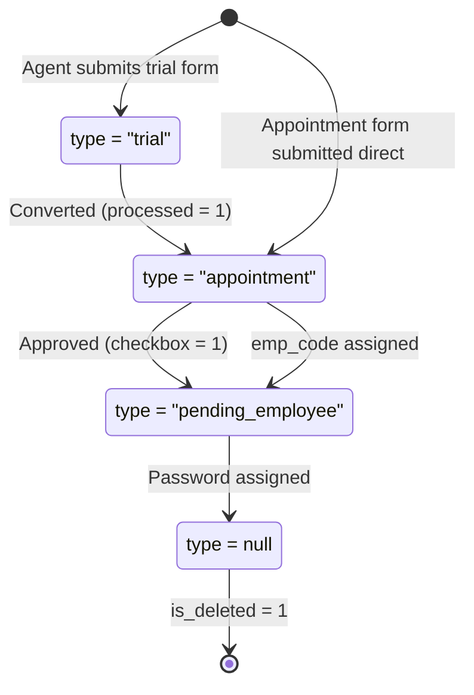

# 07 — Native Android Clone Specification

Rebuild specification for delivering the HRMS as a **native Android app** (Kotlin + Jetpack Compose,
no Capacitor) against the **existing Laravel API and database**, with a new UI, for all three
audiences: admin, employee, agent.

Compiled from `salary-slip-bac` (routes, migrations, controllers, middleware) and
`salary-slip-front` (routes, contexts, page components). Where behaviour is non-obvious, the
controller is the authority.

- **Base URL:** `https://niss.pro/api`
- **Auth:** JWT (`tymon/jwt-auth`), `Authorization: Bearer <token>`
- **Endpoints:** 78
- **Screens:** 22 (admin 14, employee 5, agent 3)
- **Tenants:** 2 companies × 2 units each

---

## Contents

1. [Scope & strategy](#1-scope--strategy)
2. [Auth & session](#2-auth--session)
3. [Roles & permissions](#3-roles--permissions)
4. [Company & unit scoping](#4-company--unit-scoping)
5. [Person lifecycle](#5-person-lifecycle)
6. [Database schema](#6-database-schema)
7. [API reference](#7-api-reference)
8. [Screens by role](#8-screens-by-role)
9. [Android build guide](#9-android-build-guide)
10. [Delivery phases](#10-delivery-phases)
11. [Traps & known defects](#11-traps--known-defects)

---

## 1. Scope & strategy

Every business rule lives server-side. A native client is therefore a **presentation-layer
replacement only** — you are not porting logic, you are re-implementing screens against an API that
already exists and already enforces its own access rules.

| Layer | Today | In the Android build |
|---|---|---|
| Database | MySQL, 24 tables | Untouched |
| Business logic | Laravel controllers | Untouched |
| Auth | `tymon/jwt-auth` | Untouched — consume the same JWT |
| Access control | `RoleMiddleware` + RBAC tables | Untouched — mirror in UI only |
| Client | React 18 + Tailwind | **Rebuild** — Kotlin + Compose |
| Mobile shell | Capacitor WebView | **Drop entirely** |
| Camera | `@capacitor/camera` + `getUserMedia` | **Rebuild** — CameraX |
| PDF / payslips | Client-side jsPDF | **Rebuild** — see §9 |
| Excel import | Client parses, posts rows | Optional — admin desk task |

> **Key consequence.** Because the API enforces role and tenancy server-side, UI permission checks in
> the Android app are a *convenience*, never a security boundary. An employee hitting the salary-slip
> endpoint is already forced to their own `emp_code` in `SalariesSlipController::index`. Build UI
> gates for usability; let the server be the authority.

### Three apps or one?

**Recommendation: one app, three navigation graphs.** The employee and agent surfaces are small
(5 and 3 screens); splitting them triples release work for little gain. Use a single `:app` module
with per-role feature modules so you can split later without a rewrite.

---

## 2. Auth & session

### Login

One endpoint. The identifier field is named `email` but the server decides what it actually is.

```
POST /api/login
{ "email": "<email OR emp_code>", "password": "...", "company_code": "nidhi-impex,silver-star" }

// Server picks the column:
// filter_var($input, FILTER_VALIDATE_EMAIL) ? 'email' : 'emp_code'

// 200 →
{ "status": true, "message": "Login successful",
  "token": "<JWT>", "token_type": "Bearer", "user": { ...full user row... } }
```

Your login field **must accept both** and never validate as email-only.

**Login-time side effects to replicate:**

- `is_deleted == 1` → **403** "Account is deactivated"
- `status == 2` (pending) → silently flipped to `0` on first successful login
- Wrong credentials → **401** "Invalid credentials"

### Session handling

| Concern | Behaviour | Android approach |
|---|---|---|
| Token storage | `sessionStorage` (cleared on tab close) | EncryptedSharedPreferences / DataStore + Keystore |
| Refresh token | **None exists** | On 401, clear session → login |
| Expiry | JWT TTL only, no renewal call | OkHttp `Authenticator` → force logout |
| Session restore | `GET /api/profile` on boot; failure = logged out | Same, via splash |
| Logout | `POST /api/logout` invalidates server-side | Call it, then clear local store regardless |

> **No refresh flow exists.** Whatever TTL the server is configured with is a hard session ceiling.
> If long-lived mobile sessions matter, that is a backend change — plan for it explicitly.

### Forgot password — four steps, one endpoint

Laravel registers `POST /api/new{data}` as a wildcard, so `/new-email`, `/new-email-otp`,
`/new-password` and `/new-emp_code` **all hit the same handler**. The URL suffix is cosmetic;
dispatch happens on a `type` field in the body. Throttled to 15 req/min.

| `type` | Purpose | Body | Effect |
|---|---|---|---|
| `0` | Verify identity | `emp_code, mobile_number, company_code, unit, photo?` | Cross-checks mobile on file; issues 15-min `verification_token`. Rate limited 5/code/hr, 20/IP/hr |
| `1` | Send OTP | `email` | Emails a 4-digit OTP, stores on `users.otp` |
| `2` | Verify OTP | `email, otp` | Compares to stored value. **Does not consume it** |
| `3` | Set password | `email, password` | Writes password, clears `otp`, status 2→0 |

The live web UI uses only 1 → 2 → 3. Type 0 exists for an emp-code identity path the current UI no
longer calls. Client-side password rule: 6+ chars with upper, lower, digit, special.

> **SECURITY DEFECT — do not copy.** Step 3 only checks that `users.otp` is non-null; it never
> re-verifies the submitted OTP, and step 2 doesn't consume or flag anything. Anyone who knows a
> target's email can call type 1 then type 3 and reset that password **without ever seeing the OTP**.
> The OTP also never expires and is stored in plaintext. See §11.

---

## 3. Roles & permissions

Access is decided by **two columns read together**: integer `role` and string `type`.

| `role` | Meaning | Data scope | Resolves to |
|---|---|---|---|
| `0` | Super Admin | Everything, all companies | admin |
| `1` | Admin | Own `company_code` only | admin |
| `2` | Unit Admin | Own `company_code` + `unit` | admin |
| `3` | Employee | Own records only | employee |
| `4` | Agent | Candidates they created | agent |

### Resolution algorithm — mirror exactly

```kotlin
// RoleMiddleware.php (server) and AuthContext.jsx (client) must agree
fun resolveRole(user: User): Role = when {
    user.type == "agent" || user.role == 4 -> Role.AGENT
    user.role in setOf(0, 1, 2)            -> Role.ADMIN
    else                                   -> Role.EMPLOYEE
}
```

**Agent is tested first.** A row with `type = "agent"` is an agent regardless of its integer role.
Wrong order sends agents into the admin graph.

### Per-user page permissions (RBAC)

Super admins can grant/revoke individual pages per user. The implementation is unusual: rather than
shared named roles, each user gets a **private role row** named `User_{id}_Permissions`, and page
grants are `permission_dimensions` rows with `dimension = 'page'`.

```
GET /api/my-permissions          // any authenticated user

// → { "status": true, "data": [ { "key_name": "salary", "value": "read_write" }, ... ] }

// value ∈ { "no_access" | "view_only" | "read_write" }
// role 0 bypasses entirely — treat permissions as null = allow all
// missing key → default ALLOW (permissive, not deny-by-default)
```

**Canonical page keys**

| Admin | Employee | Agent |
|---|---|---|
| `dashboard`<br>`employees`<br>`salary`<br>`appointments`<br>`admin_management`<br>`trial_form`<br>`attendance`<br>`tds`<br>`form16`<br>`reports`<br>`rbac_dashboard`<br>`rbac_users`<br>`rbac_permission_matrix`<br>`rbac_audit_logs` | `employee_dashboard`<br>`employee_payslips`<br>`employee_form16`<br>`employee_profile`<br>`employee_appointment` | `agent_dashboard`<br>`agent_trial_form`<br>`agent_appointment_form` |

> **Permissive by default.** A key absent from the response means *allowed*. The web client does
> `permissions[key] !== "no_access"`. Replicate that polarity or you'll hide navigation from everyone
> the moment RBAC rows are missing.

---

## 4. Company & unit scoping

Nearly every list endpoint is filtered by a two-level tenant key. This is the most likely source of
"why is this list empty" during the build.

| Company | `company_code` | Units | Theme |
|---|---|---|---|
| Nidhi Impex | `nidhi-impex` | `Shreeji`, `Ichapur` | Amber |
| Silver Star Diam Pvt Ltd | `silver-star` | `Daduk`, `Ichapur` | Sky blue |

**Rules that bite:**

- `all-companies` is a **client-side pseudo-scope only**. The server has never heard of it. The web
  client expands it to `company_code=nidhi-impex,silver-star` before sending. Do the same.
- Only **role 0** may pick a company. Roles 1 and 2 have scope forced from their own user row
  server-side — a different `company_code` in the request is ignored.
- **Writes take a single company code**, never a list. Reads accept a comma list.
- `Ichapur` belongs to **both** companies. Unit alone never identifies a tenant — always pair with
  `company_code`.
- The server normalizes loosely (`nidhi`, `nidhiimpex`, `nidhi_impex` all resolve). Don't rely on it;
  send the canonical slug.

Model this as one app-level `CompanyScope(companyId, unit)` exposed from a repository as a single
`StateFlow` that survives navigation.

---

## 5. Person lifecycle

**Candidates, appointments, agents and employees are all rows in the same `users` table**,
distinguished by `type` and `status`. There is no separate candidates table.



| `type` | `status` | Stage | Where it appears |
|---|---|---|---|
| `trial` | — | Trial form only | Trial Form list |
| `appointment` | — | Candidate, no code | Appointments list |
| `pending_employee` | `2` | Awaiting password | Add Employee → Pending |
| `null` | `0` | Active employee | Employees list |
| `null` | `1` | Inactive employee | Employees list (inactive) |
| `agent` | `0` | Agent account | Agents list |

### The filters each list applies

```sql
-- Employees list — GET /api/employee/get
is_deleted = 0 AND role NOT IN (0,1,2)
  AND emp_code IS NOT NULL AND emp_code != ''
  AND (type IS NULL OR type NOT IN ('appointment','agent','pending_employee'))

-- Pending list — GET /api/employee/get?status=2
type = 'pending_employee' AND status = 2

-- Appointments — GET /api/appointment
type = 'appointment'
  OR (type IS NULL/'' AND emp_code IS NULL/'')   -- legacy untyped rows
```

> **Default password.** A newly submitted appointment is created with the hard-coded password
> `12345678` and `role = 3`. Assigning an emp code does **not** change it; only the Pending-Employees
> password step does. Every employee onboarded this way shares one known password until an admin sets
> a real one. Treat the password step as mandatory in your UI.

---

## 6. Database schema

24 tables. You will not need DTOs for all — the RBAC extras (locations, branches, teams, approval
levels) have admin CRUD screens but no bearing on payroll.

### `users` — the central table

~80 columns, because it stores employees, agents, candidates and trial forms in one place.

| Group | Columns |
|---|---|
| Identity & auth | `id, name, email` (unique)`, password, otp, status, role, emp_code, is_deleted, verification_token, verification_token_expires_at, email_verified_at, remember_token` |
| Tenancy | `company_code, unit, branch` |
| Classification | `type, checkbox, print, processed, added_by, trial_form_id, shift_id` |
| Contact | `mobile_number, emp_whatsapp_no, mobile_no_2, address, village, taluka, district, city, state, pin` |
| Personal | `dob, birth_place, gender, cast, marital_status, blood_group, education, photo, members` |
| Employment | `joining_date, resignation_date, department, designation, manager_name, salary, punching_no` |
| Statutory | `aadhar_card_no, pan_card_no, pf_no, esi_no` |
| Banking | `bank_name, bank_account_no, bank_ifsc_code` |
| References | `reference_name, reference_mobile_no` |
| Documents | `adhar_image, pan_image, check_image, account_book, emp_signature` |
| Trial form | `form_no, trial_date, last_company_name, last_company_address, experience, reason_for_leaving, hastak_name, hastak_code, hastak_mobile, contractor, akar, manager_signature, hastak_signature, hr_signature` |

### `salary_slips`

One row per employee per month. **Two generations of columns coexist** — the original
component-level fields and a later flatter set. Different upload templates populate different sets,
so your renderer must tolerate either being empty.

| Group | Columns |
|---|---|
| Keys | `id, month, year, emp_code, company_code, unit` |
| Identity | `emp_name, main_department, department, designation, resignation_date` |
| Days | `book_salary, paid_day, leave, working_days, present_days` |
| Earnings | `basic, da, hra, wa, conv_a, edu_a, owa, ppa, pda, med_a, mob_a, product_incentive, comm, other` |
| Gross | `gross_salary, a_gross, salary` |
| Deductions | `pt, pf, pf_uan, esi, esi_no, tds, lwf, advance` |
| Totals | `total_deduct, total_deduction, net_payable, net_salary` |
| Payment | `account_no, account_name, bank_ifsc, mobile_no` |

### Supporting tables

| Table | Purpose | Notable |
|---|---|---|
| `attendances` | Daily marks | Unique on `(emp_code, company_code, date)`; status ∈ `present`/`absent`/`half_day`/`leave` |
| `shifts` | Shift definitions | `start_time, end_time, grace_minutes`; scoped by company+unit |
| `departments` | Department names | Just `id, name` |
| `document_uploads` | Document vault | Versioned, sha256 checksum, original vs generated name |
| `upload_batches` | Bulk import runs | total/success/failed counts per run |
| `upload_batch_rows` | Per-row outcome | `passed`/`failed` + reason + raw row JSON |
| `audit_logs` | RBAC change trail | action, module, old/new JSON, IP, user agent |
| `roles`, `permissions`, `role_permissions`, `user_roles`, `user_permissions`, `permission_groups` | RBAC core | Per-user private roles, see §3 |
| `permission_dimensions` | Page grants | Unique on `(dimension, role_id, key_name)` |
| `locations`, `branches`, `teams`, `approval_levels` | Org structure | CRUD screens exist; **unused by payroll** |
| `settings` | Key/value config | Grouped by `group` column |

---

## 7. API reference

All paths relative to `https://niss.pro/api`. Responses follow
`{ status: bool, message?: string, data?: … }`. **A falsy `status` is an error even on HTTP 200** —
check both.

Access key: `public` = no token · `any` = any authenticated · `admin` = role 0/1/2 ·
`employee` = role 3 · `agent` = role 4

### Authentication

| Method | Path | Access | Notes |
|---|---|---|---|
| POST | `/login` | public | Email or emp_code; returns JWT |
| POST | `/logout` | any | Invalidates token server-side |
| GET | `/profile` | any | Current user; use for session restore |
| POST | `/profile-update` | any | Self-service fields only; multipart if photo |
| POST | `/change-password` | any | `password, new_password, confirm_password` |
| POST | `/new{data}` | public | 4-step reset, dispatches on `type`. Throttle 15/min |
| GET | `/check-emp-code/{code}` | public | Returns company_code + unit if found |
| POST | `/register` | admin | Creates admin/agent users |
| GET | `/my-permissions` | any | RBAC page grants |

### Employees

| Method | Path | Access | Notes |
|---|---|---|---|
| GET | `/employee/get` | admin | Query: `page, limit, search, status, company_code, unit, no_pagination` |
| GET | `/employee/show/{id}` | admin | Single employee |
| POST | `/employee/store` | admin | Create |
| PUT | `/employee/edit/{id}` | admin | Update — also the password-assign call |
| GET | `/employee/delete/{id}` | admin | **Hard delete. GET, not DELETE** |
| POST | `/employee/import` | admin | Bulk: file upload or JSON rows |
| GET | `/employee/import-columns` | admin | Column map for import UI |
| POST | `/employee/import-account-detail` | admin | Bank details bulk update |
| POST | `/account-master` | admin | Account master spreadsheet |

### Salary

| Method | Path | Access | Notes |
|---|---|---|---|
| GET | `/salary-slip/get` | admin, employee | Employees forcibly scoped to own `emp_code` |
| GET | `/salary-slip/show/{id}` | admin, employee | **404** (not 403) if out of scope |
| POST | `/admin/salary-slip/store` | admin | Multipart upload + column mapping |
| GET | `/admin/salary-slip/import-columns` | admin | Template columns |
| GET | `/admin/salary-slip/delete?id=` | admin | Delete via GET + query param |

### Attendance & shifts

| Method | Path | Access | Notes |
|---|---|---|---|
| GET | `/attendance/grid` | admin | Requires `month, year, company_code` |
| POST | `/attendance/cell` | admin | Upsert one day; **empty status deletes** |
| POST | `/attendance/import` | admin | Bulk month import |
| GET | `/shifts/get` | admin | Scoped by company+unit |
| POST | `/shifts/store` | admin | Create |
| PUT | `/shifts/update/{id}` | admin | Update |
| DELETE | `/shifts/delete/{id}` | admin | Delete |
| POST | `/shifts/assign` | admin | Assign employees to a shift |

### Appointments, trial forms, agents

| Method | Path | Access | Notes |
|---|---|---|---|
| POST | `/appointment` | public | Public job form. Sets password `12345678`, role 3 |
| GET | `/appointment` | public | List of appointments |
| POST | `/appointment/update` | admin, agent | Edit candidate; assigns emp_code, approve via `checkbox` |
| GET | `/appointment/check-emp-code` | public | Conflict pre-check before assigning |
| POST | `/appointment/create-account` | admin | Creates an agent account |
| POST | `/trial-form/store` | admin, agent | Submit trial form |
| GET | `/trial-form/list` | admin, agent | List |
| POST | `/trial-form/update/{id}` | admin, agent | Update (POST, not PUT) |
| DELETE | `/trial-form/delete/{id}` | admin | Admin only |
| GET | `/agent/candidates` | agent | Own candidates (`added_by = me`) |
| GET | `/agents` | admin | List agents |
| PUT | `/agents/{id}` | admin | Update agent |
| DELETE | `/agents/{id}` | admin | Delete agent |

### Dashboards, documents, departments

| Method | Path | Access | Notes |
|---|---|---|---|
| GET | `/admin-dashboard` | admin | Counts + salary aggregates; accepts month/year range |
| GET | `/dashboard` | employee | `total_slips, recent_slips[5], user` |
| GET | `/department/get` | any | Readable by agents too |
| POST | `/department/store` | admin | Create |
| PUT | `/department/update/{id}` | admin | Update |
| DELETE | `/department/delete/{id}` | admin | Delete |
| GET | `/documents` | any | List own documents |
| POST | `/documents` | any | Upload |
| GET | `/documents/types` | any | Document catalogue |
| POST | `/documents/preview-name` | any | Preview generated filename |
| DELETE | `/documents/{id}` | admin | Removes file from disk |
| GET | `/upload-batches/{type}` | admin | type ∈ `salary`\|`employee`\|`account-master` |
| GET | `/upload-batches/{type}/{id}` | admin | Per-row pass/fail report |
| DELETE | `/upload-batches/{type}/{id}` | admin | Delete batch |

### RBAC administration (all `admin`)

| Method | Path | Notes |
|---|---|---|
| GET | `/rbac/dashboard` | RBAC summary counts |
| GET | `/rbac/user-roles` | Paged; `search`, `role` filters |
| GET | `/rbac/audit-logs` | Paged; `module`, `action` filters |
| GET, PUT | `/rbac/settings?group=` | Key/value settings |
| GET | `/rbac/permission-dimensions/{dim}` | `?role_id=`; dim = `page` for page grants |
| POST | `/rbac/permission-dimensions/{dim}` | `role_id, key_name, value` |
| DELETE | `/rbac/permission-dimensions/{dim}/{id}` | Revoke |
| GET | `/rbac/permission-dimensions/{dim}/roles` | Roles for a dimension |
| GET, POST, PUT, DELETE | `/roles/*` | `get, permissions, matrix, show/{id}, store, update/{id}, delete/{id}` |
| GET, POST, PUT, DELETE | `/rbac/{locations\|branches\|teams\|approval-levels}/*` | Uniform CRUD: `get, store, update/{id}, delete/{id}` |

> **Non-REST conventions.** Several destructive operations use `GET`
> (`/employee/delete/{id}`, `/admin/salary-slip/delete?id=`) and several updates use `POST` where
> `PUT` is expected. Don't "correct" these in Retrofit — match the server or the calls 405.

---

## 8. Screens by role

### Admin — 14 screens

| Screen | Route | Purpose |
|---|---|---|
| Dashboard | `/admin` | Headcount, salary totals, month/year range filter, charts |
| Employees | `/admin/employees` | Paged grid, search, status filter, view/edit/delete, bulk import |
| Add Employee | `/admin/employees/add` | Create form + **Pending Employees** tab where codes and passwords are assigned |
| Salary | `/admin/salary` | Month/batch browser, payslip preview, delete slips |
| Salary Upload | `/admin/salary/upload` | Spreadsheet upload, column mapping, validation report |
| Attendance | `/admin/attendance` | Per-employee monthly totals + calendar drill-down |
| Shifts | `/admin/attendance/shift` | Shift CRUD and employee assignment |
| Appointments | `/admin/appointments` | Candidate list, approve/reject, assign emp code, printable form |
| Trial Form | `/admin/trial-form` | Trial submissions; convert to appointment. **Nidhi Impex only** |
| TDS Calculation | `/admin/tds/calculation` | Tax computation per employee per year |
| Form 16 | `/admin/form16` | Generate and export Form 16 |
| Reports | `/admin/reports` | Salary and headcount exports |
| RBAC (4 pages) | `/admin/rbac`, `/users`, `/permission-matrix`, `/audit-logs` | **Super-admin only.** User roles, per-user page grants, audit trail |
| Profile | `/admin/profile` | Own details, photo capture, change password |

### Employee — 5 screens

| Screen | Route | Purpose |
|---|---|---|
| Dashboard | `/employee` | Slip count and five most recent payslips |
| Payslips | `/employee/payslips` | Own slips by month; view and download PDF |
| Form 16 | `/employee/form16` | Own annual tax document |
| Profile | `/employee/profile` | Edit own details, photo, documents, change password |
| Appointment Form | `/employee/appointment` | Own appointment record, read-mostly |

> **Profile completeness gate.** Employees are **locked to the profile screen** until all 19 of these
> are non-empty: `name, email, phone, dob, address, city, district, state, pin, aadhar_card_no,
> pan_card_no, bank_name, bank_ifsc_code, bank_account_no, gender, department, designation,
> joining_date`. Navigation is hidden and every route redirects to the profile. Replicate this or
> freshly onboarded employees see an app they can't use. Note `phone` resolves from
> `mobile_number` / `mobile_no` / `phone`.

### Agent — 3 screens

| Screen | Route | Purpose |
|---|---|---|
| Dashboard | `/agent` | Own candidates via `added_by`; trial forms hidden once processed |
| Trial Form | `/agent/trial-forms` | Submit and edit trial forms. Gated to Nidhi Impex agents |
| Appointment Form | `/agent/appointments` | Full multi-section candidate form with photo and document capture |

The agent surface is the strongest argument for going native: a long form filled in the field, on a
phone, with camera capture — exactly what the WebView build handles worst. It's also small enough to
be the pilot.

---

## 9. Android build guide

### Recommended stack

| Concern | Choice | Why |
|---|---|---|
| Language / UI | Kotlin + Jetpack Compose | Material 3 gives a new visual identity for free |
| Architecture | MVVM + repositories | Maps onto the API-per-feature shape |
| Networking | Retrofit + OkHttp + Moshi/kotlinx | Interceptor injects the Bearer token |
| Async | Coroutines + Flow | `StateFlow` for company scope and session |
| DI | Hilt | Scoping session and scope objects |
| Navigation | Navigation Compose | One graph per role, chosen after login |
| Secure storage | EncryptedSharedPreferences | JWT must not sit in plain prefs |
| Camera | CameraX | Replaces Capacitor camera **and** fixes the HTTPS restriction |
| Images | Coil | Photos, document thumbnails |
| Offline cache | Room (later phase) | Payslips and attendance read well offline |
| PDF | `PdfDocument` or Android print | See below |

### Module layout

```
:app                    // nav host, role graph selection, theme
:core:network           // Retrofit, auth interceptor, envelope unwrapping
:core:auth              // login, session store, role resolution
:core:model             // User, SalarySlip, Attendance, CompanyScope
:core:ui                // design system, shared components
:core:permissions       // my-permissions cache + hasAccess()
:feature:employee       // 5 screens
:feature:agent          // 3 screens
:feature:admin          // 14 screens — split further if it grows
```

### Three things that need real design work

**1 · The envelope.** Every response wraps its payload and can report failure with HTTP 200.
Centralize this once in an interceptor or `Result` mapper rather than checking `status` at 78 call
sites. The payload key is also inconsistent — `data`, `user`, `login`, `employee` all appear. The web
client coalesces with `data?.login || data?.data || data?.user || data`; your deserializer needs the
same tolerance.

**2 · Payslip and Form 16 rendering.** Currently generated **client-side** from raw slip rows — the
layout lives in React components, not on the server. Three options, increasing effort:

1. Request a server-side PDF endpoint (cleanest, needs backend work)
2. Rebuild the layout in Compose and print via `PdfDocument`
3. Render an HTML template in a headless WebView and print that

Option 3 reuses the existing markup most directly with zero backend change.

**3 · Attendance grid.** Response is
`{ employees[], attendance: { emp_code: { "YYYY-MM-DD": status } }, days_in_month }` — a sparse
nested map, not a list. A month × headcount grid is wide; on a phone prefer a per-employee calendar
(which the web app already falls back to) over a scrollable matrix. Cell edits are single upserts,
and **sending an empty status deletes the record**.

### Free wins from going native

Camera works without HTTPS (the WebView build cannot use `getUserMedia` over a plain LAN address);
real file pickers; biometric unlock over the stored JWT; push notifications for payslip-published
events; genuine offline reads. None need backend changes except push.

---

## 10. Delivery phases

Ordered so each phase ships something usable and de-risks the next.

### Phase 1 — Foundation

Login accepting email *or* emp code, secure token storage, session restore via `/profile`,
401 → logout, role resolution, company scope holder, envelope handling, design system.

*Ships: nothing user-facing · Unblocks: everything*

### Phase 2 — Employee app (the MVP)

Dashboard, payslip list and detail, profile with the 19-field completeness gate, change password,
forgot password. Smallest surface, largest audience, exercises the whole foundation.

*5 screens · 6 endpoints · Ships to the most users*

### Phase 3 — Agent app

Candidate list, trial form, and the full appointment form with CameraX photo and document capture.
Where native pays for itself.

*3 screens · 7 endpoints · Validates camera + long forms*

### Phase 4 — Admin core

Dashboard, employee list and detail, appointments with emp-code assignment, pending employees with
password assignment. The daily-driver admin loop, excluding bulk work.

*Covers the full onboarding pipeline end to end*

### Phase 5 — Admin operations

Attendance marking, shifts, salary browsing, payslip PDF export. Attendance is a phone-first task
and deserves a purpose-built UI, not a ported grid.

*Needs the PDF decision from §9 resolved*

### Phase 6 — Long tail

RBAC administration, audit trail, TDS, Form 16, reports, bulk spreadsheet upload. Reasonable to
leave on the web admin permanently — these are desk tasks, not phone tasks.

*Deliberately last · consider never*

### Minimum viable clone

**Phases 1 + 2.** One login screen, four employee screens, six endpoints — serving the largest group
of users in the system. Everything else is additive.

---

## 11. Traps & known defects

Found while reading the source. The first three are security issues in the existing backend that a
new client will inherit — worth fixing before pointing a second app at them.

### DEFECT — password reset bypasses OTP

`setNewPasswordAfterVerification` checks only that `users.otp` is non-null, and OTP verification
never marks or consumes it. Knowing a target's email is enough to reset their password.
**Fix:** require the OTP again on the final step, or mark it verified and consumed. The OTP is also
stored in plaintext with no expiry.

### DEFECT — shared default password

Every appointment-created row gets `12345678`. Because login accepts `emp_code` and codes are
guessable, anyone can sign in as an employee who hasn't changed it. There is no forced change on
first login. **Fix:** per-user random password surfaced to the admin, plus a must-change flag.

### DEFECT — unauthenticated appointment endpoints

`POST /appointment`, `GET /appointment` and `/appointment/check-emp-code` require no token. The write
path is guarded by an allow-list so `role` and `password` can't be injected, but **`GET /appointment`
exposes candidate PII** — names, mobiles, Aadhaar and bank fields — to anyone. Authenticate the read
before shipping.

### Hard deletes

The `User` model has no `SoftDeletes` trait, so `/employee/delete/{id}` permanently removes the row.
An `is_deleted` column exists and is used for deactivation, but the delete endpoint does not use it.
Confirm destructively in your UI and say so plainly.

### Duplicated columns in `salary_slips`

`total_deduct` vs `total_deduction`, `net_payable` vs `net_salary`, `gross_salary` vs `a_gross` vs
`salary`. Different upload templates fill different sets. Coalesce rather than trust one column.

### Other quirks to expect

- `GET /api/employee/get` runs a blanket `UPDATE` on every call, backfilling null units — **a list
  read has write side effects**
- `salary_slips.emp_code` is `integer` while `users.emp_code` is `string(100)` — codes with letters
  won't join
- `Ichapur` belongs to both companies
- The RBAC model is permissive by default
- Several deletes are `GET`
- `GET /api/gautampithadiya` is a leftover debug route that should be removed

### Before you start

- [ ] Get a staging copy of the API — you'll be creating and deleting test employees
- [ ] Confirm the JWT TTL, and decide whether you need a refresh endpoint
- [ ] Decide the payslip PDF strategy early; it shapes phase 5
- [ ] Ask for the three security fixes above as backend work in parallel with phase 1
- [ ] Verify CORS on `niss.pro` — native clients don't send `Origin` the way browsers do
