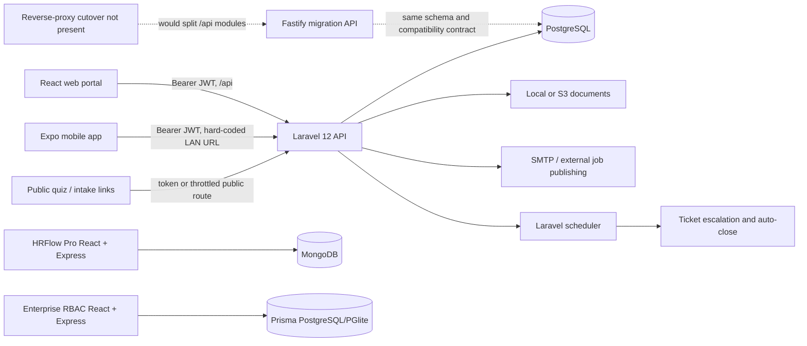

# HRMS Architecture, Pages, Connections, Routes, and Workflows

**Snapshot:** 2026-08-11  
**Repository:** `F:\HRMS oldd`  
**Audit basis:** the current working tree, including uncommitted files and the 2026-08-11 migrations  
**Registered Laravel routes:** 286 (`php artisan route:list --json`)

This is the current source-of-truth architecture map. It supersedes the older overview and route documents in this folder where they disagree with the code. The security-specific findings remain in [AUDIT-2026-08-10.md](./AUDIT-2026-08-10.md).

## 1. Executive view

The product that the root commands actually start is:

1. `salary-slip-front/salary-slip-front` — React 19, Vite 7, React Router 7, PWA/Capacitor-capable web client.
2. `salary-slip-bac` — Laravel 12 API, JWT authentication, PostgreSQL, local/S3 document storage.
3. `hrms-mobile-app` — Expo 51 / React Native 0.74 mobile client calling the same Laravel API.

`salary-slip-node` is an incremental Fastify/Prisma replacement for selected Laravel modules. It preserves Laravel-compatible JWT, password, cache, table, and response behavior, but no checked-in root command or production proxy sends traffic to it yet.

Two other complete-looking systems are present but disconnected from the active runtime:

- `client` + `server`: the separate “HRFlow Pro” React/Express/MongoDB application.
- `enterprise-rbac/frontend` + `enterprise-rbac/backend`: a standalone React/Express/Prisma RBAC console.

The root `package.json` is decisive: `npm run dev` starts Laravel on port 8000 and the nested salary-slip React client. The root README primarily describes HRFlow Pro and is therefore not a reliable runtime guide for this repository state.



## 2. Repository ownership and lifecycle

| Path | Role | Runtime status | Primary entry point |
|---|---|---|---|
| `salary-slip-front/salary-slip-front` | Main browser UI | Active | `src/main.jsx` → `src/App.jsx` |
| `salary-slip-bac` | Main API and business logic | Active | `public/index.php` → `bootstrap/app.php` → `routes/api.php` |
| `hrms-mobile-app` | Native mobile UI | Active but has wiring gaps | `index.js` → `App.js` |
| `salary-slip-node` | Laravel-to-Node migration target | Partial/parity target | `src/server.ts` → `src/app.ts` |
| `client` | HRFlow Pro browser UI | Dormant/disconnected | `src/main.tsx` → `src/App.tsx` |
| `server` | HRFlow Pro API | Dormant/disconnected | `src/index.ts` → `src/app.ts` |
| `enterprise-rbac/frontend` | Standalone RBAC UI | Dormant/disconnected | `src/main.tsx` → `src/App.tsx` |
| `enterprise-rbac/backend` | Standalone RBAC API | Dormant/disconnected | `src/server.ts` → `src/app.ts` |
| `docs` | Design, audit, migration, and operating notes | Mixed age | This file is the current architecture snapshot |

Generated/build material also exists: nested frontend build outputs (including branch-named directories), zip deployment bundles, the Capacitor Android project, and a tracked generated Prisma client. Those are not separate application architectures.

## 3. Active web application

### 3.1 Boot and provider order

`src/main.jsx` sets the build-defined application color, unregisters every existing service worker, clears Cache Storage, and mounts React in `StrictMode`.

The runtime tree is:

```text
BrowserRouter
├── SeoManager
└── ThemeProvider
    └── AuthProvider
        └── CompanyProvider
            └── NotificationProvider
                ├── AppRoutes
                └── Toaster
```

All route pages except Login and the shared layout are lazy-loaded. `AppLayout` supplies sidebar, header, company scope control, notification UI, and the nested route outlet.

There is a configuration contradiction: Vite still installs `vite-plugin-pwa`, while `main.jsx` immediately unregisters service workers and deletes caches. The built app is PWA-configured but the current browser boot intentionally disables its offline/cache runtime.

### 3.2 API request path

Almost every web request converges in `src/utils/api.js`:

```text
page/component
  → domain API object (salaryApi, hrApi, ticketApi, roleApi, ...)
  → apiRequest(path, options)
  → Authorization: <type> <JWT>
  → company_id / unit_id scope where applicable
  → {baseUrl}/api/...
  → Laravel middleware → controller → service/model → PostgreSQL/storage
```

Development URL selection is in `src/utils/url.js`:

- `VITE_API_BASE_URL` wins when supplied.
- localhost/LAN and common Vite ports resolve to the same host on port 8000 under `/api`; localhost is deliberately rewritten to `127.0.0.1`.
- otherwise the browser origin is used.
- production fallback is injected by Vite.

The Vite production URL, application identity, and output directory depend on the current Git branch. The branch name is also used as `outDir`, so deployment behavior is coupled to source-control state.

The main API facade contains these domains:

- auth/profile and first-password recovery;
- dashboard, employee, salary, attendance, shift, department, import batches;
- legacy appointments and trial forms;
- v1 appointments, versioned documents, confidential Aadhaar export;
- authorization snapshot/check, roles, users, policies, access requests, delegations, emergency access, companies, and units;
- HR requisitions, candidates, quizzes, attempts, interviews, offers, assets, performance, exit, onboarding, and reports;
- tickets, hierarchy, SLA/settings/categories, attachments, and notifications.

`onboardingApi.js` and the Permission Matrix feature have their own small facades but still use the same `apiRequest` transport.

### 3.3 Authentication, role, and navigation behavior

The browser stores its session in `sessionStorage` under `auth_user`; it is not a cookie session. Login and session restore obtain the authorization snapshot from `/api/v1/authorization/me`, falling back to `/api/my-permissions` for an older backend. If both fail, the UI fails closed.

Client portal normalization is:

| Source identity | Portal |
|---|---|
| role/type `4` or `agent` | Agent |
| numeric role/type `0`, `1`, or `2` | Admin |
| other authenticated users | Employee |

A role-derived employee can be promoted to the admin portal only when the server route registry explicitly allows `/admin`. Raw role `0` is treated as the super-admin wildcard.

Every protected page checks, in order:

1. authentication;
2. exact portal role;
3. any explicitly declared permission;
4. the server-provided route-to-permission registry via `canRoute(path)`.

A path missing from the server registry is not rejected by the client, but its API still remains a server authorization boundary. A 401 clears the session; sign-out is broadcast to other tabs. Unlike mobile, the web app no longer traps employees on the profile page when profile fields are incomplete.

The company scope provider behaves as follows:

- super admin can select all companies, one company, and a unit;
- master/admin scope is restricted by the user’s assignments;
- ordinary users are forced to their own company/unit;
- persisted selection is cleared when the authenticated identity changes;
- compatible API calls receive the selected `company_id` and `unit_id`.

### 3.4 Complete browser route catalogue

All protected routes additionally pass through `canRoute`. “Explicit guard” below lists only checks declared directly on that route.

#### Public and root routes

| Browser path | Page/behavior | Connection |
|---|---|---|
| `/` | Redirect to role portal or `/login` | Auth context only |
| `/login` | Login and first/forgotten password flow | `/api/login`, `/api/check-emp-code/{code}`, `/api/new-*` |
| `/quiz/:token` | Public candidate assessment | `/api/quiz/{token}` show/start/progress/event/submit |
| `/about-niss` | Public informational page | Static client content |
| `*` | Redirect to `/login` | None |

#### Admin portal routes

| Browser path | Page/behavior | Explicit guard | Main server connection |
|---|---|---|---|
| `/admin` | Admin dashboard | admin portal | `/admin-dashboard`, RBAC settings |
| `/admin/employees` | Employee register/detail/edit/delete/import | admin portal | `/employee/*`, `/department/get`, upload batches |
| `/admin/employees/add` | Create employee | admin portal | `/employee/store`, provisioning lookups |
| `/admin/salary` | Salary-slip register/detail/delete | admin portal | `/salary-slip/*`, `/admin/salary-slip/delete` |
| `/admin/salary/upload` | Salary spreadsheet import | admin portal | `/admin/salary-slip/import-columns`, `/store`, upload batches |
| `/admin/attendance` | Attendance grid and edits | `ui.admin.attendance.view` | `/attendance/grid`, `/cell`, `/import` |
| `/admin/attendance/shift` | Shift CRUD and assignment | `hr.shift.read` | `/shifts/*`, employee lookup |
| `/admin/appointments` | Appointment register/form/document flow | admin portal | legacy `/appointment*` plus v1 appointment/document APIs |
| `/admin/admins` | Settings/admin configuration | admin portal | `/rbac/settings`, role/account data |
| `/admin/trial-form` | Trial forms | admin portal | `/trial-form/*` |
| `/admin/tds/calculation` | TDS calculation workspace | `ui.admin.tds.view` | employee/salary data; client-side report work |
| `/admin/form16` | Admin Form 16 workspace | `ui.admin.form16.view` | employee/salary data; PDF generation |
| `/admin/reports` | General reports | admin portal | salary/employee reporting data |
| `/admin/profile` | Admin profile | admin portal | `/profile`, `/profile-update`, `/change-password` |
| `/admin/tickets` | Staff support queue | `support.ticket.read` | ticket list/show/reply/assign/status/escalate/attachments |
| `/admin/tickets/control-center` | Super-admin support operations | admin portal; action APIs enforce permissions | ticket dashboard/reports/SLA/settings/categories/hierarchy |

#### HR routes inside the admin portal

| Browser path | Page/behavior | Explicit guard | Main server connection |
|---|---|---|---|
| `/admin/hr` | HR dashboard | `hr.dashboard.read` | `/hr/dashboard` |
| `/admin/hr/hiring` | Requisition/candidate/assessment/interview/offer workspace | `hr.requisition.read` | `/hr/requisitions`, candidates, quizzes, attempts, interviews, offers |
| `/admin/hr/interviews` | Redirect to hiring `?tab=interview` | inherited | No direct call |
| `/admin/hr/assets` | Asset lifecycle | `hr.asset.read` | `/hr/assets/*` |
| `/admin/hr/onboarding` | Onboarding workspace | `hr.onboarding.journey.read` | `/hr/onboarding/*` plus preview fallback |
| `/admin/hr/onboarding/journeys` | Redirect to onboarding employees tab | inherited | No direct call |
| `/admin/hr/onboarding/welcome` | Redirect to onboarding overview | inherited | No direct call |
| `/admin/hr/onboarding/documents` | Redirect to documents tab | inherited | No direct call |
| `/admin/hr/onboarding/training` | Redirect to onboarding overview | inherited | No direct call |
| `/admin/hr/onboarding/assets` | Redirect to onboarding overview | inherited | No direct call |
| `/admin/hr/onboarding/checklists` | Redirect to onboarding overview | inherited | No direct call |
| `/admin/hr/onboarding/policies` | Redirect to onboarding overview | inherited | No direct call |
| `/admin/hr/performance` | Cycles, goals, reviews | `hr.performance.read` | `/hr/performance/*` |
| `/admin/hr/reports` | HR report generator | `hr.report.read` | `/hr/reports/generate` |
| `/admin/hr/exit` | Resignation/exit management | `hr.exit.read` | `/hr/exit/*` |
| `/admin/hr/training` | Training quiz management | `hr.training.read` | `/hr/quizzes/*`, attempts/candidate linkage |
| `/admin/hr/settings` | HR settings | `hr.hr_settings.read` | settings/module-backed data |

The hiring page has internal tabs: Requisitions, Candidates, Assessment, Interview, and Offer. The canonical candidate progression is `applied → screening → shortlisted → assessment → interview → selected → offer_sent → offer_accepted`, with `rejected` and `on_hold` as side/terminal states.

The current onboarding page has only Overview, Employees, Documents, and Timeline tabs. Training, asset, checklist, and policy components still exist in source but are not mounted by the workspace.

#### Access Control routes

| Browser path | Page | Explicit guard | Main server connection |
|---|---|---|---|
| `/admin/access-control/users` | Account directory/lifecycle | `admin.user.read` | `/v1/admin/users/*` |
| `/admin/access-control/roles` | Role lifecycle and cloning | `admin.role.read` | `/v1/roles/*` |
| `/admin/access-control/company-units` | Companies, units, legacy adoption | `admin.company.read` | `/v1/admin/companies/*`, `/units/*` |
| `/admin/access-control/permission-matrix` | Permission matrix/editor/simulation/audit | `admin.role.read` | role matrix and `/v1/authorization/*` |
| `/admin/access-control/policies` | Policy draft/publish/rollback | `admin.policy.read` | `/v1/policies/*` |
| `/admin/access-control/access-requests` | Temporary/requested access decisions | `admin.access_request.read` | `/v1/access-requests/*` |
| `/admin/access-control/delegations` | Delegation create/revoke | `admin.delegation.manage` | `/v1/delegations/*` |
| `/admin/access-control/emergency-access` | Emergency grant/revoke | `admin.emergency_access.approve` | `/v1/emergency-access/*` |

#### Employee and agent routes

| Browser path | Page | Portal | Main server connection |
|---|---|---|---|
| `/employee` | Employee dashboard | employee | `/dashboard` |
| `/employee/payslips` | Own payslips/detail/PDF | employee | `/salary-slip/get`, `/show/{id}` |
| `/employee/form16` | Own Form 16 | employee | salary/profile data and client PDF work |
| `/employee/profile` | Profile and password | employee | `/profile`, `/profile-update`, `/change-password` |
| `/employee/appointment` | Read-only printable appointment form | employee | `/profile`; client-side normalization, print, and PDF generation |
| `/employee/tickets/new` | Raise support ticket | employee | `/tickets/store`, attachments |
| `/employee/tickets` | Own support cases | employee | ticket list/show/reply/reopen/attachments |
| `/agent` | Agent dashboard/candidate list | agent | `/agent/candidates` |
| `/agent/trial-forms` | Agent trial forms | agent | `/trial-form/*` |
| `/agent/appointments` | Agent appointment forms/register | agent | legacy `/appointment*` and candidate lookup |

## 4. Laravel API architecture

### 4.1 Request pipeline

```text
HTTP /api request
  → global API middleware + SecurityHeaders
  → per-route throttle (public/sensitive routes)
  → jwt.auth (most application routes)
  → role:... coarse portal check where present
  → module.schema:<module> for optional schemas
  → permission:<code> / role.manager / super.admin
  → controller validation and tenant scoping
  → domain service where the workflow is non-trivial
  → Eloquent model / transaction
  → PostgreSQL and local/S3 storage
  → normalized JSON response
```

Important middleware aliases are `jwt.auth`, `role`, `permission`, `module.schema`, `super.admin`, and `role.manager`. `SecurityHeaders` is appended globally.

`module.schema` protects the optional HR, authorization, tickets, notifications, and hierarchy schemas. It returns an unavailable response instead of allowing a missing deployment migration to become an uncontrolled SQL failure.

### 4.2 Registered route inventory

The 286 current registered routes break down as follows. Counts include every verb registered under the prefix.

| Prefix/family | Count | Main responsibility |
|---|---:|---|
| `/api/hr/*` | 75 | HR dashboard, hiring, quizzes, interviews, offers, assets, performance, reports, exit, onboarding |
| `/api/v1/admin/*` | 30 | User administration and company/unit administration |
| `/api/tickets/*` | 26 | Employee/staff ticket workflow and control-center operations |
| `/api/v1/roles/*` | 14 | Role lifecycle, matrix, cloning, summary, transitions |
| `/api/v1/appointments/*` | 11 | Appointment lifecycle, documents, completion, Aadhaar handling |
| `/api/v1/documents/*` | 11 | Versioned document service |
| `/api/employee/*` | 9 | Employee CRUD and spreadsheet import |
| `/api/v1/policies/*` | 6 | Authorization policy lifecycle |
| `/api/v1/authorization/*` | 6 | Snapshot, checks, simulation, audit, validation |
| `/api/shifts/*` | 5 | Shift CRUD and assignment |
| `/api/reporting-hierarchy/*` | 5 | Manager-chain configuration and validation |
| `/api/quiz/*` | 5 | Public candidate quiz session |
| `/api/notifications/*` | 5 | Own feed, unread count, mark-read, delete |
| `/api/appointment*` | 5 | Legacy appointment create/list/update/check/account creation |
| `/api/v1/access-requests/*` | 5 | Request and approval lifecycle |
| `/api/documents/*` | 5 | Legacy flat document uploads |
| `/api/trial-form/*` | 4 | Trial-form create/list/update/delete |
| `/api/department/*` | 4 | Department operations/lookups |
| `/api/admin/*` | 4 | Salary import/delete and related admin operations |
| `/api/v1/emergency-access/*` | 3 | Emergency grants and revocation |
| `/api/v1/employees/*` | 3 | Employee confidential/Aadhaar operations |
| `/api/attendance/*` | 3 | Grid, cell update, spreadsheet import |
| `/api/agents/*` | 3 | Agent administration |
| `/api/v1/delegations/*` | 3 | Delegation lifecycle |
| `/api/upload-batches/*` | 3 | Import history/detail/delete |
| `/api/rbac/*` | 3 | Settings and legacy user-role view |
| `/api/salary-slip/*` | 2 | Role-scoped salary list/detail |
| single/other API routes | 23 | auth/profile/dashboard/modules/register, public intake/resume/feed, lookups, repair utilities |
| root, health, storage, Sanctum | 5 | framework/root support |

The highest route ownership is `TicketController` (26), legacy `UserController` (25), v1 Admin `UserController` (18), `CompanyUnitController` (13), v1 `DocumentController` (12), and HR `PerformanceController` (12).

### 4.3 Public and authentication routes

Public or deliberately unauthenticated application entry points are:

- `POST /api/login`;
- `POST /api/new{data}` (the `/new-emp_code`, `/new-email`, `/new-email-otp`, and `/new-password` aliases all dispatch by request `type`);
- `GET /api/check-emp-code/{code}`;
- `GET /api/candidates/{id}/resume` and its `/api/v1/...` alias;
- `POST /api/logout` (idempotent even when the token is already unavailable);
- the five `/api/quiz/{64-character-token}` operations;
- `POST /api/candidate-intake/{token}` for the external form/intake integration;
- `GET /api/jobs/indeed-feed.xml`;
- framework root, health, storage, and Sanctum helper routes.

Authenticated identity routes include `/profile`, `/profile-update`, `/change-password`, `/my-permissions`, `/modules`, `/v1/authorization/me`, and `/v1/provisioning/company-options`.

Login accepts email or employee code, rejects deleted/locked/deactivated/resigned accounts, promotes status `2` to active status `0`, emits a login event, and returns a JWT with no-store semantics. Logout revokes/blacklists the token on a best-effort basis.

The first-time/forgotten password flow is:

```text
employee code + company/unit + 10-digit mobile
  → hashed 15-minute verification token
  → request six-digit email OTP (hash, 10-minute expiry, attempt state)
  → verify OTP under row lock, maximum five attempts
  → set password (minimum eight characters)
  → clear verification state and activate status 2 account
```

Some comments and old documents still mention Aadhaar or a four-digit OTP; the executable validators and controller implement mobile identity plus a six-digit OTP.

### 4.4 Authorization engine

The canonical type classes are:

| Type | Meaning |
|---:|---|
| `0` | Super admin |
| `1` | Admin/master |
| `2` | Unit admin |
| `3` | Employee |
| `4` | Agent |

Provisioning derives canonical role assignments from this identity type and company/unit membership. The authorization engine then resolves:

1. active subject and tenant scope;
2. direct user grants;
3. role grants;
4. role inheritance, capped at eight levels;
5. conditions and scope matching;
6. policies;
7. active delegations and emergency grants;
8. explicit-deny precedence and permission ancestors;
9. legacy-role comparison and decision logging.

Super admin bypasses normal permission middleware. If the authorization schema is absent, admin-authorization operations fail unavailable while business routes may use legacy role behavior. Default enforcement is `shadow` except for always-enforced authorization/policy surfaces and any configured prefixes/codes. In shadow mode an authorization denial can still be allowed when the legacy decision allows it; the decision is logged for migration comparison.

### 4.5 Main backend route families and ownership

| Domain | Controllers/services | Storage/models |
|---|---|---|
| Employees/import | legacy `UserController`, `UserProvisioningService`, membership/role services | `users`, companies, units, role assignments, upload batches |
| Salary | `SalariesSlipController`, admin import controller | `salary_slips`, linked primarily by `emp_code` |
| Attendance/shifts | Admin attendance and shift controllers | `attendances`, `shifts`, `users.shift_id`, upload batches |
| Appointments | legacy `UserController`, v1 `AppointmentController`, provisioning service | appointment-shaped rows in `users`, documents, Aadhaar authorizations |
| Documents | legacy `DocumentController`, v1 controller, `DocumentService`, validator/providers | `document_uploads`; versioned `documents`, `document_versions`, audit logs; local/S3 objects |
| HR hiring | requisition, candidate, quiz, attempt, interview, offer controllers | requisitions, candidates, stage history, quizzes/attempts, panels/feedback, offers/revisions |
| HR assets | `AssetController` | assets and allocations |
| HR performance | `PerformanceController` | cycles, goals, reviews |
| Exit | `ExitManagementController` | employee resignations |
| Onboarding | `OnboardingController` | users/candidate documents; only five active API operations |
| Tickets | `TicketController`, `TicketRouter`, `ReportingHierarchy`, `TicketNotifier` | tickets, messages, attachments, categories, SLA, activity, assignment/escalation history |
| Authorization | v1 authorization controllers and services | permissions/groups/dimensions, roles/assignments, policies/versions, decisions, access lifecycle |
| Notifications | `NotificationController` and notification helpers | notifications scoped to the authenticated user |

## 5. Core end-to-end workflows

### 5.1 Employee provisioning

```text
Admin form or employee spreadsheet
  → legacy employee API validation
  → company/unit resolution
  → user row create/update
  → UserProvisioningService
     ├── canonical identity role assignment
     ├── company membership
     └── unit membership
  → optional upload-batch row/result history
  → employee appears in admin register and can claim/set a password
```

The `users` table remains a legacy polymorphic center: it stores admins, unit admins, employees, agents, appointment candidates, and trial-form records. `type`, `role`, `status`, `processed`, `added_by`, and related fields distinguish states. This is the principal source of coupling between account, appointment, trial-form, and employee workflows.

### 5.2 Salary, attendance, and shifts

- Salary imports validate a spreadsheet, create an upload batch and row results, and write salary-slip records. Admin sees tenant-scoped slips; employees see only their own. The principal legacy join is employee code rather than a user foreign key.
- Attendance exposes a month/grid read, a cell upsert, and import. Server permissions and company/unit scoping are authoritative.
- Shift management provides list/create/update/delete and assignment; assignments update employee shift linkage.

### 5.3 Appointment and document completion

The web appointment form stores `appointmentId` and `step=details|documents` in the query string so refresh can resume the workflow.

```text
appointment details
  → POST /api/v1/appointments
  → create appointment-shaped user row in one transaction
  → canonical provisioning
  → upload each document separately with an idempotency key
  → document version reservation
  → local/S3 upload outside DB transaction
  → ACTIVE or UPLOAD_FAILED version
  → appointment completion
```

The required-document list is currently empty, so completion does not enforce a minimum set of uploaded types. Versioned documents use reserve/upload/finalize behavior so an external storage failure leaves a reconcilable `UPLOAD_FAILED` version. Read scope varies by super admin, company admin, unit manager, creating agent, and employee self; delete/restore are narrower.

The legacy flat `document_uploads` API still coexists with the v1 document/version/audit model. Aadhaar print/PDF operations use a separate short-lived authorization flow.

### 5.4 Hiring and public assessment

```text
requisition draft → approval → publish/internal or Indeed feed
  → candidate create/import/intake
  → stage history through screening/assessment/interview/selection
  → quiz attempt token sent to candidate
  → public /quiz/:token start/progress/event/submit
  → interview scheduling, panel feedback, reschedule
  → offer draft/approve/release/respond with revision history
  → accepted candidate can continue into employee/onboarding work
```

Candidate intake has a separate external token endpoint intended for the Apps Script/Google Form integration. Candidate resume downloads currently have public routes; treat that as a security boundary, not an authenticated HR page connection.

### 5.5 Onboarding

The Laravel surface contains only dashboard, journey list, journey detail, document list, and document review. The frontend additionally defines reads for training, assets, checklists, and policies, and a policy-accept action. Missing/schema-unavailable read calls fall back to preview mock data. The policy accept write has no matching route and does not receive the same successful preview behavior.

### 5.6 Tickets, hierarchy, SLA, and notifications

Ticket states are:

```text
open → assigned → in_progress → waiting_employee / pending_approval
  → escalated → resolved → closed
                     └────→ reopened (resolved only, within configured window)
```

Closed is terminal. Visibility is super-admin all, admin own company, unit-admin own company/unit, and ordinary user own cases.

On create, `TicketRouter` snapshots the employee’s current reporting chain (maximum 20, expected to terminate at Super Admin) and assigns the ticket to the first authority. Escalation walks that stored snapshot, skipping inactive authorities, so later org-chart edits do not rewrite the case’s original escalation contract. Reporting-hierarchy writes reject self-management, inactive/ineligible managers, cross-company managers, and cycles.

`tickets:escalate-overdue` runs every fifteen minutes when the Laravel scheduler is running. It escalates unattended cases according to department/priority SLA rules and auto-closes resolved cases after the configured delay. Assignment, escalation, state change, reply, and system action histories are stored separately.

Web and mobile read the same notification table. Mobile “push” is actually a background poll of unread `/notifications` rows approximately every fifteen minutes, followed by a local Expo tray notification; there is no server device-token push-registration flow in this code.

## 6. Mobile application

### 6.1 Navigation architecture

The mobile app has no React Navigation router or URL/deep-link route table. `App.js` keeps one `activeTab` state and switches components directly.

| Role | Mounted tabs |
|---|---|
| Employee | Home, Payslips, Tickets, Profile |
| Agent | Dashboard, Appointment, Trial Form, Profile |
| Admin | Dashboard, Employees, Salary, Forms, Tickets |

Employee profile completion is a hard navigation gate on mobile: an incomplete employee is forced to Profile and other tabs are disabled. That intentionally/accidentally differs from the current web policy, where completion is only a reminder.

Admin forms and ticket detail screens can enter an immersive state that hides the common header and floating tab bar. Detail/create modes inside many screens are local component state, so they are neither deep-linkable nor restorable after process loss.

`AdminMoreScreen` is imported and implements Profile, Attendance, Shifts, Tickets, and Accounts sub-screens, but it is absent from `ADMIN_TABS` and never returned by the admin switch. Consequently Admin Attendance, Attendance Upload, Shifts, Accounts, and the More screen are currently unreachable from `App.js`. `AdminSalaryUploadScreen` is also not mounted by the root navigator.

### 6.2 Mobile API connection

`src/services/api.js` is a single fetch client. It keeps the token in memory and persists the session in AsyncStorage. It calls the Laravel legacy salary/employee/appointment/trial-form endpoints plus v1 authorization and current ticket/notification endpoints.

The API base is hard-coded in both API and notification services:

```text
http://192.168.1.53:8000/api
```

There is no environment, build-channel, or runtime host selection. Any device outside that LAN/address fails before authentication.

Observed mobile wiring breaks:

1. `AdminEmployeesScreen` calls `api.deleteAdminEmployee`, but the service exports `deleteEmployee`.
2. The same screen calls `api.bulkDeleteEmployees`, but the service exports `deleteEmployeesBulk`.
3. `deleteAppointment(id)` sends `DELETE /api/appointment/delete/{id}`, for which Laravel registers no route.
4. The unreachable admin screens make several otherwise valid attendance, shift, account, and import methods inaccessible through normal navigation.

## 7. Data architecture

The active system uses PostgreSQL through Eloquent. Its important relationship clusters are:

```text
Company ──< Unit
   │         └──< user/unit memberships
   └──< user/company memberships
User ──< role assignments >── Role ──< permissions
 │                             └──< role inheritance
 ├── Shift
 ├──< Attendance
 ├──< SalarySlip (legacy emp_code association)
 ├──< Document / DocumentVersion / DocumentAuditLog
 ├──< Ticket / Message / Attachment / histories
 ├──< PerformanceGoal / PerformanceReview
 └──< EmployeeResignation

JobRequisition ──< Candidate ──< CandidateStageHistory
       │               ├──< Interview ──< panelists / feedback
       │               ├──< Offer ──< OfferRevision
       │               ├──< QuizAttempt >── TrainingQuiz
       │               └──< CandidateDocument
       └── department / requester / approver

Asset ──< AssetAllocation >── User
PerformanceCycle ──< Goal / Review
ReportingRelationship ── manager chain used to snapshot Ticket routing
```

The checked-in 2026-08-11 migrations add companies, user-company membership, units/user-unit membership, provisioning policy, catalogue synchronization, reporting relationships, ticket routing histories, and portal-entry permissions. Their presence in source does not prove every deployed database has run them; the module-schema middleware exists specifically to manage that deployment skew.

## 8. Fastify migration backend

`salary-slip-node` is Fastify 5, TypeScript, Prisma 6, and PostgreSQL. It is intentionally compatible with the Laravel database and contracts rather than a new product API.

Application protections include Helmet, closed CORS unless origins are configured, opt-in per-route throttling, 25 MB body limit, multipart limits, proxy trust, bearer/cookie/password/Aadhaar log redaction, and a common Laravel-compatible error shape.

Mounted modules are:

| Module | Implemented Laravel-compatible routes |
|---|---|
| Auth/profile | login, profile, logout, employee-code/password recovery, password change, account registration |
| Employees | import metadata/import/account detail, list/show/create/update/delete/bulk delete, appointment employee-code check |
| Shifts/settings | shift list/CRUD/assign, RBAC settings read/write |
| Authorization | `/v1/authorization/check` and `check-batch` |
| Agents | agent list, appointment-to-account creation, agent candidates, update/delete |
| Trial forms | list/store/update/delete |
| Dashboard | migrated dashboard response |
| Health | `GET /api/health` |

The generated Prisma schema/client mirrors a large portion of the Laravel database, including authorization and newer enterprise tables. Parity tests and fixture scripts exist. However:

- root development commands do not start Fastify;
- the checked AWS deployment guide proxies `/api` to Laravel port 8000;
- no reverse-proxy route ownership/cutover manifest was found.

Therefore Fastify is a partial migration target, not an active second API. Running it beside Laravel without an explicit path router would cause overlapping ownership for the same `/api` paths.

## 9. Disconnected applications

### 9.1 HRFlow Pro (`client` + `server`)

The browser pages are `/login`, `/register`, `/forgot-password`, then protected `/dashboard`, `/employees`, `/employees/:id`, `/departments`, `/attendance`, `/leave`, `/payroll`, `/recruitment`, `/performance`, `/settings`, and `/profile`.

The Express/TypeScript server uses MongoDB/Mongoose, JWT middleware, role middleware, Zod/Express validation, rate limits, Helmet/CORS/compression/cookies, Swagger, static uploads, and error middleware. Under its configured API prefix it mounts:

- auth;
- employees;
- branches;
- departments;
- attendance;
- leaves;
- payroll;
- recruitment;
- performance;
- training;
- appointments;
- reports.

This server contains a broad enterprise-style surface—training programs/courses/sessions/assessments/certificates/budgets, recruitment pipeline/job postings/interviews/offers, performance/OKR/calibration/feedback, appointment slots/rosters, and reporting/export scheduling. It uses its own models (`Employee`, `Leave`, `Payroll`, `Recruitment`, etc.) and does not share the Laravel PostgreSQL runtime. Nothing in the root scripts connects the active salary-slip React app to it.

### 9.2 Standalone Enterprise RBAC

The frontend routes are `/login`, protected dashboard `/`, `/users`, `/users/:id`, `/roles`, `/roles/:id`, `/permissions`, six organization pages (companies, branches, locations, departments, teams, designations), and three audit pages (logs, login history, sessions).

Its Express API mounts `/api/v1/auth`, users, roles, permissions, organization, audit, and dashboard. User/role/permission/organization mutations use resource/action permission middleware; audit supports log/history reads and session revocation. It uses Prisma 7 with PostgreSQL/PGlite development support.

This is architecturally separate from Laravel’s restored Access Control pages. No import, proxy, package script, or API base connects the active React app to this standalone pair.

## 10. Observed wiring gaps and architectural risks

These are source observations, not speculative redesign recommendations.

| Severity | Observation | Effect |
|---|---|---|
| High | Mobile API host is a hard-coded private LAN address | Mobile fails outside one network/host and cannot select environments |
| High | Mobile employee delete/bulk-delete method names do not exist | Those admin actions throw before making a request |
| High | Mobile appointment delete calls an unregistered Laravel route | The action returns 404 even if the screen reaches it |
| High | Node migration has no checked-in cutover/proxy ownership | Fastify code is not serving product traffic; parallel start would collide on paths |
| Medium | `AdminMoreScreen` and several admin screens are not mounted | Shipped mobile capability is unreachable |
| Medium | Onboarding calls four unimplemented read families and one unimplemented write | Reads display preview data; policy acceptance fails |
| Medium | PWA build is configured but boot unregisters service workers/caches | Offline/install/cache expectations do not match runtime |
| Medium | Web and mobile enforce different profile-completion policies | Same account receives different navigation access by client |
| Medium | Legacy flat and v1 versioned documents coexist | Pages must choose the correct lifecycle; migration/reconciliation remains necessary |
| Medium | `users` represents both identities and form/candidate records | Account, appointment, trial-form, and employee changes remain tightly coupled |
| Medium | Salary-to-user association is primarily `emp_code` | Rename/tenant collision correctness depends on surrounding scoping and validation |
| Low | Employee nav module filter compares label `Tickets`, but item label is `My Tickets` | Module unavailability does not remove the employee ticket item |
| Low | App header title map covers only some Access Control pages | Several valid routes display the fallback `Dashboard` title |
| Low | Root README describes the disconnected HRFlow stack | New developers can start or modify the wrong application |
| Drift | Older docs say Access Control was removed, profile completion blocked web navigation, Laravel was v11, and route counts were lower | Those descriptions are obsolete in the current tree |

Security-sensitive architecture boundaries—including public resumes, Aadhaar handling, committed deployment material, CORS, token storage, and document controls—are treated in detail in [AUDIT-2026-08-10.md](./AUDIT-2026-08-10.md).

## 11. Where to make changes

| Change requested | Start here |
|---|---|
| Add/change a browser URL | `salary-slip-front/salary-slip-front/src/App.jsx` |
| Change sidebar visibility | `src/components/layout/useNavItems.js` and server route permission registry |
| Change web auth/session role behavior | `src/context/AuthContext.jsx`, `src/hooks/useAuthorization.js` |
| Change company/unit filtering | `src/context/CompanyContext.jsx`, API query helpers, Laravel scoped queries |
| Add/change a web API call | `src/utils/api.js`; onboarding uses `src/utils/onboardingApi.js` |
| Add/change a Laravel endpoint | `salary-slip-bac/routes/api.php`, then its controller/middleware/service |
| Change permission evaluation | `app/Services/Authorization/*` and authorization middleware/controllers |
| Change account/company/unit provisioning | `app/Services/Provisioning/*`, `app/Services/Admin/*` |
| Change document lifecycle/storage | `app/Services/Documents/*`, v1 `DocumentController`, storage config |
| Change ticket workflow | `TicketController`, `app/Services/Tickets/*`, ticket models, scheduled command |
| Change mobile tabs/navigation | `hrms-mobile-app/App.js` |
| Change mobile network calls | `hrms-mobile-app/src/services/api.js` and `pushNotifications.js` |
| Port another Laravel module to Node | `salary-slip-node/src/modules/*`, then register in `src/app.ts` and define proxy ownership |

Useful verification commands from the repository root:

```powershell
npm run dev
npm run build:client
npm run test:php
cd salary-slip-bac
php artisan route:list
php artisan route:list --json
php artisan migrate:status
cd ..\salary-slip-front\salary-slip-front
npm run test:frontend
npm run lint
cd ..\..\salary-slip-node
npm run typecheck
npm test
npm run parity
```

## 12. Audit limits

This report maps the source tree and the routes Laravel can register in the current local environment. It does not assert that every uncommitted migration is installed in production, that the external SMTP/Indeed/S3 services are reachable, or that a reverse proxy outside this repository has not been configured independently. No runtime files, database rows, deployments, or application code were changed during this architecture pass; only this report was added.
