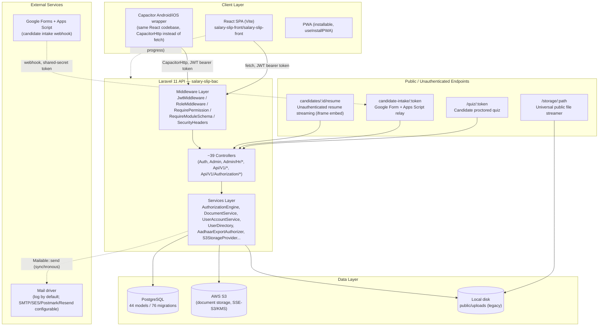

# 2. System Architecture

## 2.1 High-Level Diagram

## 2.2 Frontend

- **Type:** Single-page application, React + `react-router-dom` v7 (`BrowserRouter`, not the newer data-router API).
- **Entry/router:** `src/App.jsx` declares every route in one file (no separate `src/router/` directory). See [Navigation Structure](02-navigation.md) for the full route tree.
- **Code-splitting:** every page except `Login` and `AppLayout` is `React.lazy`-loaded inside one shared `<Suspense>` boundary — a deliberate initial-bundle-size optimization (comment in source cites shrinking a ~2.5MB bundle).
- **Layout shell:** `AppLayout.jsx` renders `EnterpriseNav` (desktop icon rail) or `Sidebar` (mobile drawer) + `Header` + a global `NotificationDrawer`, wrapping `<Outlet/>`. Both nav components read from a single hook, `useNavItems.js` (with `Sidebar.jsx` also carrying its own near-duplicate copy of the same logic — see [Bug & Issue Report](19-bugs-issues.md)).
- **State management:** No global state library. Four React Context providers composed in `App.jsx` (`ThemeProvider` → `AuthProvider` → `CompanyProvider` → `NotificationProvider`), plus local component state everywhere else, plus a small set of custom hooks (`useAuthorization`, `useModuleAvailability`, `useOnboardingResource`, `useInstallPWA`, `useIsMobile`, `useGridHeaderContextMenu`, `usePhotoCapture`). See [Roles & Permissions](05-roles-permissions.md) for `AuthContext`/`useAuthorization` and [Notification System](12-notifications.md) for `NotificationContext`.
- **API access:** a single hand-rolled `fetch` wrapper, `src/utils/api.js` (1,933 lines, the largest source file in the frontend), exporting ~17 API "namespace" objects (`salaryApi`, `rbacApi`, `authorizationApi`, `roleApi`, `adminUserApi`, `documentApi`, `hrApi`, `ticketApi`, etc.). No axios, no default-header interceptor — every call site passes its own bearer token. A global `window` `"auth:unauthorized"` event on any 401 response is the de facto session-expiry interceptor.
- **Multi-tenancy on the client:** `CompanyContext.jsx` tracks the active "company scope" (all companies / one company / one branch), persisted to `localStorage` for Super Admin/Master users, and is merged into every list/read API call as `company_code`/`unit` query parameters.
- **Data grids & documents:** `AgGridReact` for the heaviest tables; client-side PDF generation from rendered DOM nodes (no server-side PDF rendering); `react-to-print` for print flows; `PrintableForm`/`PrintableTrialForm`/`PayslipDocument`/`Form16Document` are dedicated print-layout components.
- **Realtime:** `utils/socket.js` wraps `socket.io-client`, currently the sole consumer being the in-progress `NotificationContext`; its server URL falls back to a **hardcoded LAN IP** if `VITE_SOCKET_URL` is unset (flagged in [Bug & Issue Report](19-bugs-issues.md)).
- **Mobile:** Capacitor wrapper for native Android/iOS, with `apiRequest()` branching to `CapacitorHttp.request()` to avoid webview CORS limitations; a separate PWA install path exists for browser installs.
- **Build-time tenancy:** `vite.config.js` can bake a single-tenant build (`__COMPANY_MODE__` = `"nidhi-impex"` / `"silver-star"` / `"all"`, apparently derived from git branch name) — i.e., the same codebase can be shipped as either a multi-tenant build or a locked single-company build.

## 2.3 Backend

- **Framework:** Laravel 11 (PHP 8.2). No `app/Console/Kernel.php` (Laravel 11 style); command/middleware registration happens in `bootstrap/app.php`.
- **API surface:** ~185 route registrations in `routes/api.php`, all automatically prefixed `/api`; 2 routes in `routes/web.php` (the default Laravel welcome view, and a universal `/storage/{path}` file streamer used for resume/document iframe embedding). See [API Documentation](08-api-reference.md).
- **Controllers:** 41 files (39 real controllers + abstract base + 1 trait), organized as root-level (`AuthController`, `UserController` — 2,137 lines, the largest controller, covering employees/appointments/trial-forms/agents — `TicketController`, `SalariesSlipController`, `DocumentController`, `SettingsController`), `Admin/*` (dashboard, attendance, shifts, upload batches, permission-dimension survivor), `Admin/Hr/*` (the full HR/ATS module, gated behind `module.schema:hr`), and `Api/V1/*` + `Api/V1/Authorization/*` (the newer, versioned surface: documents (S3), appointments, Aadhaar export, and the entire authorization administration API).
- **Services layer:** 29 files under `app/Services/**`, the most significant being:
  - `Authorization/AuthorizationEngine.php` (934 lines) — the ABAC decision engine (see [Roles & Permissions](05-roles-permissions.md)).
  - `Documents/*` — `DocumentService`, `S3StorageProvider`, `LocalStorageProvider`, `FileValidator`, `DocumentAudit`, `DocumentAuthorizer`.
  - `Admin/UserAccountService.php` / `Admin/UserDirectory.php` — the write/read split behind the Access Control > Users admin surface.
  - `Aadhaar/AadhaarExportAuthorizer.php` — one-time-use confidential export token issuance.
- **No job queue in active use:** `jobs`/`job_batches`/`failed_jobs` tables exist (stock Laravel migration) and `QUEUE_CONNECTION=database` is configured, but **no `app/Jobs` classes exist and nothing dispatches a queued job** — all 4 Mailables send synchronously in-request.
- **No scheduler:** no `->withSchedule()` call and no `Schedule::` calls anywhere — all 9 custom Artisan commands (`documents:reconcile`, `documents:migrate-s3`, `aadhaar:audit`, `authz:coverage`, etc.) are manual/ops tools, not cron jobs, despite some (e.g. `documents:reconcile`) reading as though they're meant to run periodically.
- **Database access:** Eloquent ORM throughout; 44 models. Defensive `Model::find($id)` + manual 404 is the dominant pattern in `Admin/Hr/*` and `Api/V1/*` controllers rather than route-model binding or `findOrFail`.

## 2.4 Database

- **Engine:** PostgreSQL only — enforced at the application-service-provider level, not just by config default.
- **Schema evolution:** 76 migrations, tracing a clear historical arc: bootstrap → payroll core (`salary_slips`) → simple RBAC → document system (legacy local → normalized S3-backed) → Aadhaar security hardening (3 migrations) → full ATS/hiring schema (13 tables added in one day) → "Access Control console" org-structure tables added then **dropped** → the Enterprise Authorization Platform (13 more `authorization_*` tables) → user-administration hardening → training/onboarding/quiz system → support ticketing.
- **No multi-tenancy at the schema level:** there is no `companies` or `units` table; tenancy is enforced entirely via string columns (`company_code`, `unit`) and comma-separated/`'all'`-sentinel parsing in application code. This is documented as a deliberate but recognized architectural gap — see [Bug & Issue Report](19-bugs-issues.md).
- **No computed payroll engine:** despite "Salary Slip" branding, there is no `payroll_runs` table or calculation engine — `salary_slips` is a flat table populated entirely by admin import.
- Full table-by-table detail: [Database Documentation](09-database.md).

## 2.5 Authentication

- **Primary:** JWT via `tymon/jwt-auth` (`JwtMiddleware`, alias `jwt.auth`), applied to nearly every protected route. Token TTL defaults to 30 days (`JWT_TTL`).
- **Secondary (inconsistent):** Laravel Sanctum is installed and migrated (`personal_access_tokens` table) but used on exactly **one** route (`GET /user`) — a flagged inconsistency, not a designed dual-auth strategy.
- **Login flow:** `AuthController@login` — email + password, throttled 30/min.
- **Password recovery:** a multi-step "forgot credentials" flow (`AuthController@newData`) gated by employee identity verification (mobile + DOB) before allowing email/password changes.
- **Client-side session:** the SPA restores its session from `sessionStorage` on load, cross-tab logout via `BroadcastChannel`/`storage` events, and a global `"auth:unauthorized"` window event forces sign-out on any 401.
- **No OAuth/SSO/social login** of any kind was found in either codebase.

## 2.6 API Structure

- Versioning: an informal migration from unversioned routes (`/employee/*`, `/attendance/*`, `/appointment`) to a `v1/` prefix for newer surfaces (`v1/roles`, `v1/documents`, `v1/appointments`, `v1/authorization/*`) — both styles coexist; there is no `v2` and no deprecation date on the unversioned routes.
- Permission-string convention: `domain.resource.action` (e.g. `hr.employee.read`, `payroll.payslip.create`, `admin.user.lock`) enforced via the `permission:` middleware — see [Roles & Permissions](05-roles-permissions.md) for the full authorization model.
- Module gating: `module.schema:<name>` middleware makes whole feature groups (`hr`, `tickets`, and nominally `authorization`, though that check is currently a no-op) return a graceful 503 rather than a 500 when their backing tables aren't migrated in a given environment — this is how the same codebase can be deployed incrementally.
- Full endpoint-by-endpoint listing: [API Documentation](08-api-reference.md).

## 2.7 File Storage

Dual-provider, switched by `DOCUMENT_STORAGE_PROVIDER`:
- **Local** (legacy) — `public/uploads/`, served via ordinary Laravel signed URLs with no real expiry enforcement.
- **S3** (production path) — via AWS SDK, always-private objects (no ACLs, bucket expected Bucket-Owner-Enforced), server-side encryption on every write (AES256 or KMS), presigned `GetObject` URLs with configurable TTL (default 300s), multipart upload above a configurable threshold.
- A **normalized document model** (`documents` + `document_versions` + `document_audit_logs`) supersedes a legacy flat `document_uploads` table; a one-time backfill migration moved existing rows across. Both a legacy `DocumentController` and a current `Api/V1/DocumentController` remain live in routes simultaneously (see [Bug & Issue Report](19-bugs-issues.md)).
- **No malware/AV scanning is implemented** — the config flag and `scan_status` column exist, but nothing populates them beyond a default "not scanned" value.

## 2.8 State Management

Covered under [Frontend](#22-frontend) above — no server-side session state beyond the JWT itself; no Redis; sessions/cache/queue all use Laravel's `database` driver.

## 2.9 Services (Backend)

See [2.3 Backend](#23-backend) above and the full service-by-service breakdown available in the working inventory notes referenced throughout [API Documentation](08-api-reference.md) and [Roles & Permissions](05-roles-permissions.md).

## 2.10 Background Jobs

**None exist.** No `app/Jobs` directory, no `app/Notifications` directory, no scheduled tasks. This is a significant architectural fact for a payroll/HR system — see [Performance Audit](18-performance-audit.md) for the implications (e.g., large bulk imports and mail sends run synchronously in the HTTP request/response cycle).

## 2.11 External APIs

Only one confirmed live external integration: a **Google Forms + Apps Script relay** pushing candidate job applications into `PublicCandidateIntakeController` via a shared-secret-token webhook (`candidate-intake/{token}`). No SMS gateway, payment gateway, AI/LLM API, or government e-KYC integration exists anywhere in the codebase (config slots for Slack/Postmark/Resend/SES exist but are unused). Full detail: [Third-Party Integrations](15-integrations.md).

## 2.12 Security Layer

Summarized here; full detail in [Security Audit](16-security-audit.md):
- Global `SecurityHeaders` middleware (CSP, HSTS in production, `X-Frame-Options: DENY`, etc.) on every response.
- Three coexisting authorization mechanisms (numeric role, simple RBAC, ABAC Enterprise Authorization Platform) — see [Roles & Permissions](05-roles-permissions.md).
- A bespoke Aadhaar (Indian national ID) confidentiality subsystem: masking by default, AES-256 field encryption (implemented but not yet fully rolled out to existing data), HMAC-derived S3 folder references, and single-use, short-lived (60s default) export authorization tokens for the rare full-number PDF/print flow.
- Content-based (magic-byte) file upload validation with a blocked-extension list to stop disguised web-shell uploads.
- A `RoleHierarchy` management-tier model that is deliberately **not** a permission check, specifically to prevent the permission system from being used to escalate itself.
