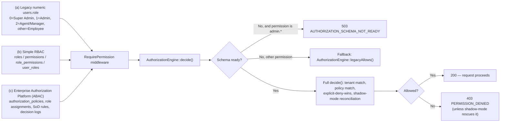

# 6. Role & Permission Matrix

## 6.1 Overview — three coexisting authorization mechanisms

This codebase runs **three distinct access-control mechanisms simultaneously**, layered on top of one another over time. All three remain active in the current code; none has fully replaced its predecessor.

### (a) Legacy numeric `users.role`
An integer column with an informal (not enum-enforced) convention, inferred from many call sites:
| Value | Meaning |
|---|---|
| 0 | Super Admin |
| 1 | Admin |
| 2 | Agent/Manager |
| other (3, etc.) | Employee / candidate / other |

Enforced at the route level by `RoleMiddleware` (`role:admin,agent` etc.), which resolves to one of three buckets (`admin`/`agent`/`employee`) — a resolution rule the backend comment states mirrors the frontend's own `AuthContext.getUserRole()` normalization (i.e. duplicated logic in two codebases, a consistency risk — see [Bug & Issue Report](19-bugs-issues.md)).

### (b) Simple RBAC
Standard many-to-many: `roles` ↔ `permissions` via `role_permissions`, users ↔ roles via `user_roles`, plus a direct `user_permissions` override table (with an `is_denied` flag). Introduced in migration `2026_07_27_102955_create_enterprise_rbac_tables`.

### (c) Enterprise Authorization Platform (ABAC/PBAC)
Added in migration `2026_08_03_000001_create_enterprise_authorization_platform`, extending the same `roles`/`permissions` tables with `code`, `resource`, `action`, `tenant_id`, `is_sensitive`, `status`, etc., plus ~13 new tables:

| Table | Purpose |
|---|---|
| `authorization_role_assignments` | Scoped, time-bound role grants (an assignment can expire) |
| `authorization_role_inheritances` | Parent/child role permission inheritance |
| `authorization_policies` / `authorization_policy_versions` | Versioned ABAC allow/deny rules with conditions, obligations, priority; publish/rollback lifecycle |
| `authorization_relationships` | Relationship graph feeding condition operators (`is_manager`, `is_owner`, etc.) |
| `authorization_access_requests` / `authorization_access_request_approvals` | Self-service, approval-gated access requests |
| `authorization_delegations` | Time-boxed permission hand-off between users |
| `authorization_emergency_grants` | "Break-glass" emergency access (≤24h, incident-reason required) |
| `authorization_sod_rules` | Separation-of-duties conflict rules |
| `authorization_decision_logs` | Full audit trail of every authorization decision, allow or deny |
| `authorization_feature_flags` | Tenant-scoped rollout flags (7 seeded, all enabled by default) |
| `authorization_modules` / `resources` / `actions` / `resource_actions` | Catalog metadata for the (currently unrouted) Permission Matrix builder |
| `authorization_permission_audit_logs` | Catalog-level audit trail |

**Decision flow (`AuthorizationEngine::decide()`):**
1. Actor inactive → deny (`SUBJECT_DISABLED`).
2. Actor is Super Admin → **bypass everything**, always allow (`SUPER_ADMIN_BYPASS`) — but the bypass is still logged, never silent.
3. Tenant match check (resource's tenant vs. actor's `company_code`, comma-list/`all`-aware).
4. Gather permission sources (role/user grants) + matching policies; **explicit-deny-wins** over any allow.
5. A **parallel legacy decision** is always computed too, for shadow-mode comparison.
6. Every decision (allow or deny) is persisted to `authorization_decision_logs`.

**Shadow-mode rescue:** if the new engine denies but shadow mode is enabled and the legacy check would have allowed, the request is still let through (flagged `authorization_shadow_mismatch`) **unless** that specific permission code is on the "enforced" allow-list (`PermissionEnforcementPolicy`). This is a deliberate soft-rollout mechanism for migrating off the legacy model without a hard cutover.

## 6.2 A fourth, separate concept: `RoleHierarchy` (management tiers)

Deliberately **not** a permission check (the code and `RequireSuperAdmin` middleware both document why: the surface that edits the permission system cannot itself be gated by a permission it could grant to itself). A rank-based tier model answering only "who may create/manage which class of role":

| Class | Rank | May manage |
|---|---|---|
| INTERNAL_SUPER_ADMIN | 100 | Admin, Employee, Viewer, Custom |
| ADMIN | 80 | Employee, Viewer, Custom |
| CUSTOM | 30 | (none) |
| EMPLOYEE | 20 | (none) |
| VIEWER | 10 | (none) |

Class is derived from the role's **code**, never its display name (so renaming a role cannot change its authority), with a homoglyph/whitespace normalizer specifically to stop someone registering a lookalike reserved code. Additional guards: nobody may edit their own role tier; a role flagged `is_system`/`is_sensitive` cannot be assigned without super-admin; the target role in an assignment must not be system/protected unless the actor is a super admin.

## 6.3 `PermissionRegistry` — the UI permission tree (not an enforcement layer)

`app/Support/PermissionRegistry.php` (1,125 lines) is a **declarative catalog**, not a second authorization system (its own doc comment says so explicitly). It defines canonical UI-facing nodes (`ui.dashboard`, `ui.employees.master.create`, `ui.salary.batch.execute`, ...) each of which `implies` one or more real, enforced business permission codes (e.g. `ui.employees.master.create` implies `hr.employee.create`). It covers the entire UI surface — Dashboard, Forms, Employees, Salary/Payroll, Attendance/Shift, TDS/Form16, all of HR, Tickets, all of Access Control, Profile — with per-node sensitivity levels (NORMAL/SENSITIVE/PRIVILEGED/CRITICAL) and column-level granularity (e.g. a salary or Aadhaar-reveal column can be individually gated).

This is the registry the (currently unrouted/orphaned) Permission Matrix builder (`RoleMatrixBuilder`, `RoleMatrixWriter`) was designed to expose as an editable grid — see [Bug & Issue Report](19-bugs-issues.md) for its current orphaned state.

## 6.4 Roles present in the system (by evidence in code/migrations)

| Role code | Class (RoleHierarchy) | Notes |
|---|---|---|
| `super_administrator` / `super_admin` | INTERNAL_SUPER_ADMIN | Numeric role 0; bypasses the authorization engine entirely; hidden from normal UI listings unless `SHOW_SUPER_ADMIN=true`; protected from deletion/edit by non-super-admins (`User::booted()` guard) |
| `tenant_administrator` | ADMIN | Numeric role 1; company-scoped administrator |
| (numeric role 2) | — | "Agent/Manager" bucket at the middleware level; distinct from the `agent` frontend role in some checks, `type === 'agent'` in others — see [Bug & Issue Report](19-bugs-issues.md) for this ambiguity |
| `employee` | EMPLOYEE | Numeric role 3/other; self-service only |
| `viewer` | VIEWER | Read-only tier (seeded/backfilled by `role_class` migration; not otherwise observed wired into a specific screen in this pass) |
| Custom roles | CUSTOM | Created via `RoleController@store` / `Api/V1/Authorization/RoleController`; cannot hold a "reserved" code (privilege-escalation guard) |

## 6.5 Accessible pages / allowed actions per role

This table cross-references [Navigation Structure](02-navigation.md) and [API Documentation](08-api-reference.md). "Permission required" is the enforced business-permission code; Super Admin bypasses all of them.

| Area | Admin (tenant_administrator) | Employee | Agent |
|---|---|---|---|
| Own profile | View/edit (`hr.profile.*`, inferred) | View/edit own profile; forced there until 17 required fields are complete | View own profile via Appointment Form |
| Employee master data | Full CRUD (`hr.employee.*`), scoped to own `company_code`/`unit` | No access | No access (submits Appointment Form as "candidate" data instead) |
| Payroll / salary slips | Full CRUD/import (`payroll.payslip.*`) | Read-only, own slips only (`self.payslip.read`) | No access |
| Form 16 / TDS | Read (`payroll.form16.read`, `ui.admin.tds.view`) | Read, own only | No access |
| Attendance | Full CRUD/import (`hr.attendance.*`) | No access (not found in this pass) | No access |
| Shifts | Full CRUD/assign (`hr.shift.*`) | No access | No access |
| Appointment Form | Create/read/update/approve (`hr.appointment.*`) | Create/read own | Create/read own (`hr.appointment.create`/`.read`) |
| Trial Form | Full CRUD (`recruitment.trial_form.*`), Nidhi-Impex-scoped | No access | Create/read (company-scoped) |
| Hiring/ATS (requisitions, candidates, interviews, offers) | Full CRUD/approve/publish (`hr.requisition.*`, `hr.candidate.*`, `hr.interview.*`, `hr.offer.*`) | No access | Limited: views own-submitted candidates only |
| Onboarding | Full (`hr.onboarding.*`) | No access | No access |
| Performance | Full CRUD/review (`hr.performance.*`) | No access (not found in this pass — self-review UI not confirmed) | No access |
| Assets | Full CRUD/allocate/transfer (`hr.asset.*`) | No access | No access |
| Exit Management | Full (`hr.exit.*`) | No access | No access |
| Tickets | Staff queue, assign, status change (`support.ticket.*`); Super Admin sees a full Control Center | Create/read own (`self.ticket.*`) | No access found |
| Documents | Full CRUD, scoped (`document.file.*`) | Own documents only, via appointment/profile flows | Own submitted candidate documents |
| Access Control (Users/Roles/Policies/etc.) | Full, if granted `admin.*` permissions — typically Super Admin only in practice | No access | No access |
| Aadhaar reveal / confidential export | Gated by record access + a separate 60s one-time export token; **not** gated by a distinct "reveal" permission by design (see [Security Audit](16-security-audit.md)) | Can view own full Aadhaar (`me()` attaches it — "you own this identity document") | No access |

**Approval rights:** Job requisition approval (`hr.requisition.approve`), Offer approval/release (`hr.offer.approve`/`.release`), Access Request approval (`admin.access_request.approve`), Emergency Access approval (`admin.emergency_access.approve`) are all distinct, separately grantable permissions — approval is not bundled with general update rights.

**Delete rights:** Consistently a separate permission from update/create everywhere audited (`hr.employee.delete` vs `.update`, `document.file.delete` vs `.update`, etc.) — one exception noted: `OfferController@destroy` is wired to `hr.offer.update` rather than a delete-specific permission in the current route file (see [Bug & Issue Report](19-bugs-issues.md)).

**Export rights:** Excel/CSV export is gated by the same `read` permission as viewing the underlying list in every case found (no separate `.export` permission observed, except `hr.employee.export`/`hr.employee.import` which are distinct from `.read`).

**Settings access:** `admin.configuration.read`/`.update` gates the RBAC settings screen and two dev-utility cache-clear routes; `hr.hr_settings.read` gates HR Settings.

## 6.6 Permission naming convention

Consistently `domain.resource.action`:
- `hr.employee.{read,create,update,delete,import}`
- `payroll.payslip.{read,create,delete}`, `payroll.form16.read`, `payroll.run.{execute,approve}` (the latter two defined but no corresponding "payroll run" feature exists in the product — see [Bug & Issue Report](19-bugs-issues.md))
- `admin.user.{read,create,update,delete,lock,unlock,reset_password,assign_role,assign_permission}`
- `admin.role.{read,create,update,delete}`
- `self.ticket.{read,create}` vs `support.ticket.{read,update,assign}` — the `self.`/`support.` split is load-bearing: `AuthorizationEngine::legacyDecision()`'s fallback allow-list only grants `self.*`, `payroll.payslip.read`, and `hr.profile.*` to a plain employee, so any ticket permission not in that split pattern would be silently denied on a fresh/unmigrated deployment.
- `document.file.{read,upload,update,delete,download,restore}`
- `ui.*` — the `PermissionRegistry` UI-tree layer (see 6.3), which implies one or more of the codes above.

## 6.7 Administrative controls

- **User locking/unlocking, activation/deactivation, password reset, role/permission assignment** — all via `Api\V1\Admin\UserController`, each mutating action requiring an explicit `$reason` string (5–10+ chars for the more sensitive ones) and routed through `UserAccountService::audit()`.
- **Protected-account guard:** `User::booted()` throws on any update/delete of a "protected" account (super admins, or rows flagged `is_protected`) unless the actor is itself a super admin.
- **Hidden accounts:** `is_hidden`/`is_system_account` flags (managed via the `superadmin:hide` Artisan command) let a super-admin account exist without appearing in normal user listings — visibility itself is a diagnostic-only toggle (`SHOW_SUPER_ADMIN`, `SHOW_SYSTEM_ROLE`, both default `false`).
- **Governance tooling:** `authz:coverage` (CI-style gate cross-checking frontend nav routes, the permission registry, and actual middleware for gaps), `authz:sync-catalog` (reconciles the `permissions` table with the registry), `authz:tds-grant-review` (flags a specific over-broad historical grant for manual review).
