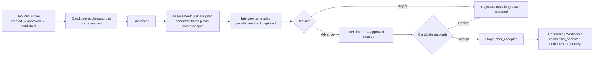

# 8. Complete Workflow Documentation

> Each workflow below is traced from actual route/controller/model behavior. Where a workflow the master template expects (e.g. "Leave Approval") does not exist in this codebase, that is stated explicitly rather than fabricated.

## 8.1 Authentication

```mermaid
flowchart LR
    A[User submits email+password] --> B["POST /login (throttle 30/min)"]
    B --> C{Valid?}
    C -- No --> D[401 error]
    C -- Yes --> E[JWT issued, TTL 30 days]
    E --> F[Frontend stores session in sessionStorage]
    F --> G[AuthContext loads permissions:\nauthorizationApi.me() first,\nfallback rbacApi.getMyPermissions()]
    G --> H[Redirect to role home: /admin, /agent, or /employee]
```

## 8.2 Password Reset ("Forgot Credentials")

1. User selects "Forgot Password" on Login.
2. **Step 1 — Verify Employee**: submits mobile number + DOB. `AuthController@newData` (step 0) verifies identity against stored records.
3. **Step 2 — Verify Email**: confirms/derives the account email.
4. **Step 3 — Set Password**: user sets a new password; OTP entry UI (animated 6-digit dial) gates this step.
5. On success, redirected to Login to sign in with the new password.

*(The exact branching inside `newData()` beyond step 0 was not fully traced line-by-line in the backend research pass — the 3-step shape above is confirmed from the frontend `Login.jsx` step indicator; full server-side step semantics should be verified directly in `AuthController.php` if this workflow needs to be reproduced exactly. A later, deeper read for the Trial Form/Agent module documentation flagged that Step 3 does not appear to re-validate the OTP value submitted earlier — see [Bug & Issue Report](19-bugs-issues.md).)*

## 8.3 Employee Creation

Two independent paths exist:

**Path A — Direct admin creation:**
1. Admin opens Add Employee → Single mode → `AddEditEmployeeModal` (5 sections: Basic, Address, Employment, Identity & Bank, Account Security).
2. Submit → `POST employee/store` → `UserController@store`.
3. Server blocks creating a role-0/1 account unless the actor is already Super Admin (privilege-escalation guard).

**Path B — Appointment → Employee conversion:**
1. Candidate/agent submits an Appointment Form (`v1/appointments` or legacy `/appointment`) — pre-employee record, no login.
2. Admin reviews in Appointments grid, optionally reveals/exports Aadhaar (gated flow, see 8.9).
3. Admin calls `POST /appointment/create-account` → `UserController@createAppointmentAccount` → converts the appointment record into a full login-capable employee account.

**Path C — Bulk import:** Admin uploads an Excel file via `AddEmployeePage` → Bulk mode → `POST employee/import`, tracked in `upload_batches`/`upload_batch_rows` for row-level success/failure auditing.

## 8.4 Hiring Pipeline (ATS)



Candidates may enter directly via the **Google Forms + Apps Script intake webhook** (`candidate-intake/{token}`) rather than being manually sourced by a recruiter. Note: the backend's stage-transition endpoint does not itself enforce this diagram's adjacency — see [HR Hiring module doc](03-modules/hr-hiring.md) for the confirmed finding that stage-ownership discipline is enforced only in the frontend.

## 8.5 Interview Process

1. `InterviewController@store` schedules an interview against a candidate + requisition, with round name, mode (e.g. video/in-person), and panelists.
2. Panelists submit feedback independently (`interview_feedback`, unique per interview+panelist, rating 1–5).
3. `reschedule` updates timing without losing history; an `InterviewScheduledMail` is sent to the candidate on schedule/reschedule.
4. A single decision point (select/hold/reject) advances or ends the candidate's pipeline stage.

## 8.6 Attendance

1. Admin opens the Attendance Grid (`attendance/grid`) for a month/company/unit.
2. Cells are clicked to cycle present → absent → half-day → leave, saved via `POST attendance/cell` (upsert, unique per [emp_code, company_code, date]).
3. Bulk correction available via `POST attendance/import` (Excel), audited the same way as other bulk imports.

**Important caveat confirmed during page-level research:** the only currently-routed Attendance screen (`AttendanceView.jsx`) is **read-only** — the click-to-cycle grid and bulk-upload screens described above (`AttendanceUpload.jsx`, `DailyAttendance.jsx`) exist in the codebase but are **not wired into any route**, meaning this workflow is not actually reachable through the live frontend today despite the backend endpoints being fully implemented. See [Bug & Issue Report](19-bugs-issues.md).

## 8.7 Leave Approval

**Does not exist as a feature in this codebase.** `Attendance::STATUSES` includes a `leave` status value, but there is no leave-request/approval workflow, no `leaves` table, and no leave-balance concept anywhere in the schema or routes. If "Leave Management" is expected by the business, it is not currently implemented — this should be flagged clearly rather than assumed present.

## 8.8 Payroll

1. Admin uploads a company-templated Excel file (`SalaryUploadPage` → `POST admin/salary-slip/store`).
2. Rows become `salary_slips` records (flat, no computation engine — see [System Architecture](01-architecture.md) §2.4); import outcome tracked in `upload_batches`.
3. Employees view their own slips read-only (`GET salary-slip/get`, scoped to `self.payslip.read`).
4. Form 16 is derived from the latest payslip data at generation time, not stored as its own computed record.

## 8.9 Aadhaar Confidential Disclosure

1. By default, disclosure is gated on **ordinary record access alone** — a direct file-level read of `app/Support/AadhaarAccess.php`/`AadhaarDisclosure.php` (done for the Appointments module documentation) found there is **no masked-value fallback anywhere in the reachable UI**; if an actor can access a record at all, the full Aadhaar number is attached (`aadhaar_full`).
2. An owner viewing their **own** profile always sees the full number (`AuthController@me` attaches it — "you own this identity document").
3. A fully-built, separately audited **one-time-token confidential export/print flow** (`POST {surface}/{id}/aadhaar/export-authorization` → `.../confidential-pdf`/`.../confidential-print-payload`, ~60s token) exists on the backend, but was found during page-level research to have **zero live callers in the current frontend** — the app's own code comment states the client-side function was kept "if export ever needs its own gate again." The Appointments page's print/PDF buttons instead simply render/print whatever is already disclosed on-screen.
4. Every export-flow step (when it is used) is audited; a failed audit write blocks the export outright (fail-closed) — but since the export flow currently has no live caller, this control is dormant rather than actively in effect.
5. See [Security Audit](16-security-audit.md) §17.3 for the full, corrected account of this subsystem.

## 8.10 Performance Review

1. HR defines a `performance_cycle` (period, type, status).
2. Goals (KPI/KRA/OKR) are set per employee per cycle.
3. Reviews (self/manager/peer/360) are submitted, one per [cycle, user, reviewer, type] combination; `overall_rating`/`potential_rating`/`competency_ratings` captured.
4. The Performance Matrix dashboard aggregates the most recent cycle's manager reviews with a non-null rating, plus a 9-box grid and PIP (Performance Improvement Plan) sub-workflow.

## 8.11 Notifications

**In-progress, not a finished workflow.** See [Notification System](12-notifications.md) for the full caveat — the client-side plumbing (Socket.IO, drawer, modals) is real but the data source is currently fixture-seeded rather than confirmed to originate from a live backend event for most notification types. Email notifications (a separate system) DO have real trigger points: OTP on the identity-recovery flow, interview-scheduled/rescheduled, offer-released, and assessment-invite — all sent synchronously, in-request, via Laravel Mailables.

## 8.12 Reports

- **HR Reports** (`hr/reports/generate`): 8 predefined types (hiring, interviews, joining, attrition, assets, performance, department, KPI), date-ranged, exported Excel/CSV/PDF client-side.
- **Admin "Reports" page**: confirmed backed by `mockData` in the frontend — **not live** aggregated data; see [Reports & Analytics](11-reports-analytics.md).

## 8.13 Approvals (cross-module)

| Approval | Trigger | Approver permission |
|---|---|---|
| Job Requisition approval | Before `publish` is allowed | `hr.requisition.approve` |
| Offer approval | Before `release` is allowed | `hr.offer.approve` |
| Access Request approval | Self-service request submitted | `admin.access_request.approve` |
| Emergency Access approval | Break-glass request | `admin.emergency_access.approve` |
| Policy publish | Draft → live | `admin.policy.publish` |

## 8.14 Settings

Covered in full in [Settings Documentation](13-settings.md).

## 8.15 Exit Management

1. HR/Admin logs a resignation (`hr/exit` → `EmployeeResignation` record: reason, resignation_date, optional last_working_day).
2. Status progresses submitted → approved → (implementation-specific intermediate states, e.g. notice period) → cleared/exited, or withdrawn.
3. `approved_by`/`approved_at` capture the approval step.

## 8.16 AI Features

**No AI/LLM workflow exists in this codebase.** See [AI Features](14-ai-features.md) for the one UI element (a "mock AI categorization" suggestion in Raise Ticket) that uses the word "AI" without an actual model call.
