# 10. Database Documentation

> Engine: **PostgreSQL only** (enforced in code, not just config). 44 Eloquent models, 76 migrations. Source: `salary-slip-bac/database/migrations/*.php`, `app/Models/*.php`.

## 10.1 Entity groups and relationships

```mermaid
erDiagram
    USERS ||--o{ SALARY_SLIPS : "emp_code (no FK)"
    USERS ||--o{ ATTENDANCES : "marked_by"
    USERS }o--|| SHIFTS : "shift_id"
    USERS ||--o{ DOCUMENTS : "owner"
    USERS ||--o{ USER_ROLES : has
    ROLES ||--o{ USER_ROLES : has
    ROLES ||--o{ ROLE_PERMISSIONS : has
    PERMISSIONS ||--o{ ROLE_PERMISSIONS : has
    PERMISSIONS }o--|| PERMISSION_GROUPS : "group_id"
    JOB_REQUISITIONS ||--o{ CANDIDATES : produces
    CANDIDATES ||--o{ CANDIDATE_STAGE_HISTORY : tracks
    CANDIDATES ||--o{ INTERVIEWS : has
    INTERVIEWS ||--o{ INTERVIEW_PANELISTS : has
    INTERVIEWS ||--o{ INTERVIEW_FEEDBACK : has
    CANDIDATES ||--o{ OFFERS : has
    OFFERS ||--o{ OFFER_REVISIONS : versions
    CANDIDATES ||--o{ CANDIDATE_DOCUMENTS : has
    ASSETS ||--o{ ASSET_ALLOCATIONS : allocated
    USERS ||--o{ ASSET_ALLOCATIONS : "allocated to"
    PERFORMANCE_CYCLES ||--o{ PERFORMANCE_GOALS : has
    PERFORMANCE_CYCLES ||--o{ PERFORMANCE_REVIEWS : has
    USERS ||--o{ EMPLOYEE_RESIGNATIONS : "exits"
    TICKETS ||--o{ TICKET_MESSAGES : has
    TICKETS ||--o{ TICKET_ATTACHMENTS : has
    TICKETS ||--o{ TICKET_ACTIVITY_LOGS : logs
    TICKET_CATEGORIES ||--o{ TICKETS : categorizes
    USERS ||--o{ AADHAAR_EXPORT_AUTHORIZATIONS : "actor/target"
```

*(This diagram omits the ~13 `authorization_*` ABAC tables and upload/document version tables for legibility — they are enumerated in 10.2.)*

## 10.2 Tables (grouped, with purpose and key relationships)

### Core identity & payroll
| Table | Purpose | Key relationships |
|---|---|---|
| `users` | Central identity table for all roles (admin/employee/agent/candidate-in-progress) | self-FK `added_by`; `shift_id` (no declared FK constraint despite the model relation) |
| `salary_slips` | Flat, import-populated payroll line items | tenancy via `emp_code`/`company_code`/`unit` strings, **no FK** to `users` |
| `departments` | Department master list | referenced by `users.department` (string) and `job_requisitions.department_id` (FK) — inconsistent linking style |
| `shifts` | Shift time/grace/break definitions | `users.shift_id` |
| `attendances` | Daily attendance status per employee | unique [emp_code, company_code, date]; `marked_by` → users |
| `upload_batches` / `upload_batch_rows` | Audit trail for every bulk Excel import (salary/employee/account-master/attendance) | `uploaded_by` → users |

### Authorization (three layers — see [Roles & Permissions](05-roles-permissions.md))
| Table | Layer |
|---|---|
| `roles`, `permissions`, `permission_groups`, `role_permissions`, `user_roles`, `user_permissions` | Simple RBAC (extended in-place with ABAC columns) |
| `permission_dimensions` | Per-role UI dimension grants (menu/page/module/action/row/field/location/warehouse/branch) |
| `audit_logs` | Generic action audit trail |
| `authorization_role_assignments`, `authorization_role_inheritances`, `authorization_policies`, `authorization_policy_versions`, `authorization_relationships`, `authorization_access_requests`, `authorization_access_request_approvals`, `authorization_delegations`, `authorization_emergency_grants`, `authorization_sod_rules`, `authorization_decision_logs`, `authorization_feature_flags`, `authorization_modules`, `authorization_resources`, `authorization_actions`, `authorization_resource_actions`, `authorization_permission_audit_logs` | Enterprise Authorization Platform (ABAC) |
| `login_events` | Login attempt audit trail (user_id, email, result, reason, ip, user_agent) |

### Documents
| Table | Purpose |
|---|---|
| `document_uploads` | Legacy flat document table (local storage) |
| `documents` | Current normalized document header (status: ACTIVE/QUARANTINED/REJECTED/ARCHIVED/DELETED) |
| `document_versions` | Per-version file metadata, S3 fields, upload/scan status; unique [document_id, version] and [idempotency_key] |
| `document_audit_logs` | Dedicated document-access audit trail (separate from generic `audit_logs`) |
| `candidate_documents` | Separate, lighter-weight document table specifically for candidate uploads pre-employee |

### Aadhaar (Indian national ID) subsystem
| Table | Purpose |
|---|---|
| `aadhaar_export_authorizations` | One-time-use, short-lived (default 60s) confidential export/print grant; token stored only as SHA-256 hash |

Columns added directly to `users`: `encrypted_aadhaar_number`, `aadhaar_last_four`, `aadhaar_secure_reference` (index, not unique — 9 production records legitimately share 2 numbers), `aadhaar_verification_status`, `aadhaar_extraction_source`, `aadhaar_extracted_at`, `aadhaar_verified_by`/`aadhaar_verified_at`.

### Hiring / Recruitment (ATS)
| Table | Purpose | Notable |
|---|---|---|
| `job_requisitions` | Job openings | SoftDeletes; approve/publish lifecycle |
| `candidates` | Applicant records | SoftDeletes; `skills` JSON; `stage` string; `ats_score` decimal (added most recently, 2026-08-07) |
| `candidate_stage_history` | Append-only stage-change log | no `updated_at` |
| `interviews` | Scheduled interviews | |
| `interview_panelists` | Interview panel membership | unique [interview_id, user_id] |
| `interview_feedback` | Panelist feedback per interview | unique [interview_id, panelist_id]; rating 1–5 |
| `offers` | Offer lifecycle | `salary_breakup` JSON; versioned |
| `offer_revisions` | Offer version snapshots | `$timestamps = false`, created_at only |
| `training_quizzes` | Quiz bank | `questions` JSON (includes answer key, stripped before serving to candidates) |
| `quiz_attempts` | Candidate quiz attempts | `access_token` unique(64) is the candidate's only credential; proctoring fields (`violation_count`, `proctor_events` JSON) |

### Asset Management
| Table | Purpose |
|---|---|
| `assets` | Asset inventory (asset_tag unique, serial_number unique); SoftDeletes |
| `asset_allocations` | Allocation history per asset/user |

### Performance Management
| Table | Purpose |
|---|---|
| `performance_cycles` | Appraisal cycle definitions |
| `performance_goals` | KPI/KRA/OKR goals per user per cycle |
| `performance_reviews` | Self/manager/peer/360 reviews; unique [cycle_id, user_id, reviewer_id, review_type] |

### Exit Management
| Table | Purpose |
|---|---|
| `employee_resignations` | Resignation/exit record (status: submitted → approved → ... ) — the model backing this is named `EmployeeResignation`, though the feature is branded "Exit Management" throughout the UI/controller names |

### Support Ticketing
| Table | Purpose |
|---|---|
| `ticket_categories` | 13 seeded categories (Attendance, Salary, Leave, HR, IT Support, Payroll, Form 16, Appointment, Employee Documents, Software/Hardware/Network Issue, Other) |
| `ticket_number_counters` | Locked-row counter avoiding race conditions in human-readable ticket numbering |
| `tickets` | Main ticket record; company/unit/department captured **at creation time**, not joined live |
| `ticket_messages` | Thread messages; `is_internal` flag hides staff-only notes from the raising employee |
| `ticket_attachments` | File attachments per ticket/message |
| `ticket_activity_logs` | Append-only (`UPDATED_AT=null` by explicit business rule: "ticket history can never be deleted") |

### Settings
| Table | Purpose |
|---|---|
| `settings` | Generic key/value/group store (used for RBAC settings; `SettingsController` merges stored rows over code defaults) |

## 10.3 Cross-cutting schema observations

- **No `companies` or `units` table exists at all.** Multi-tenancy is enforced entirely through plain string columns (`company_code`, `unit`) parsed ad hoc across the codebase (`Ticket::scopeVisibleTo`, `ScopeMatcher`, `AuthorizedUserQuery`, several controllers independently) — a comma-separated list or the literal `'all'`/`'all-companies'` sentinel stands in for "no company restriction." See [Bug & Issue Report](19-bugs-issues.md).
- **No `payroll_runs` or computation-engine tables** — payroll is a flat imported table, not a calculated one, despite the product's origin as a "Salary Slip" system.
- **Two coexisting permission schemas at the table level**, confirmed by migration history: the original simple RBAC tables (migration #25) and ~13 additional `authorization_*` tables layering ABAC on top of the same `roles`/`permissions` tables (migration #56/#59).
- **Aadhaar handling evolved across three migrations**: add encrypted/derived columns → relax a uniqueness constraint that blocked legitimate duplicate numbers → add the one-time export-authorization table. Per in-code comments, the encryption path was implemented but never fully back-applied to existing production rows (plaintext values still present for pre-existing records; a dedicated Artisan command, `documents:backfill-aadhaar`, exists to remediate this incrementally).
- **Two notable data-remediation migrations exist as historical incident markers**: removal of two hardcoded legacy super-admin accounts with a shared password, and nulling of user photo/document columns that had leaked PHP temp-file paths from a prior mass-assignment bug.
- **Tenancy-adjacent tables were added then dropped in the same initiative**: `locations`, `branches`, `teams`, `approval_levels` were created for the (now-removed) Access Control console, then explicitly dropped in a later migration once confirmed nothing else depended on them — while the core `roles`/`permissions`/`audit_logs` tables were deliberately kept because other live features still read them.
- **Defensive, idempotent migrations are a recurring pattern**: several permission-seeding migrations wrap their logic in try/catch and `Schema::hasTable` checks so they no-op safely if the authorization tables don't exist yet in a given environment — consistent with the same "module not ready" graceful-degradation pattern used at the middleware layer.
- **Indexing:** a dedicated migration (`add_user_query_performance_indexes`) added 5 composite indexes on `users` (`[type,company_code]`, `[type,status]`, `[company_code,unit]`, `[role,company_code]`, `[is_deleted,role]`) — evidence of a deliberate, retrofit performance-tuning pass rather than indexes designed in from the start.

Full migration-by-migration chronology (all 76 files) is preserved in the working research notes behind this report and can be re-derived directly from `database/migrations/*.php` if a literal DDL export is needed for a formal registration filing.
