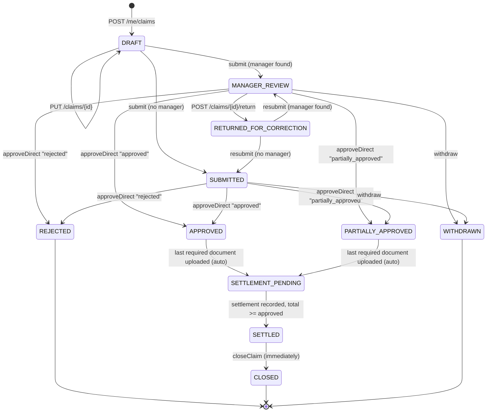
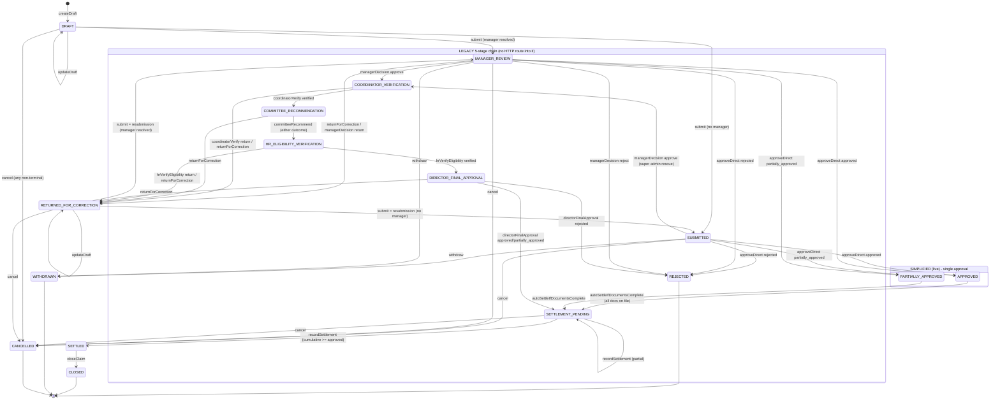

# HRMS Mediclaim Module — Complete Backend Report

| | |
|---|---|
| **Backend** | `salary-slip-bac/` — Laravel, PHP 8.2 |
| **Basis** | Working tree read on 2026-09-21, **including uncommitted edits made by another developer during this work** (`routes/mediclaim.php`, `ClaimWorkflowService`, `MediclaimClaim`, `MediclaimClaimNumber`, `ClaimController`, `ClaimDocumentController`, `Admin/ClaimController`) |
| **Method** | Source reading only. The app was **not** run and the PHPUnit suite was **not** executed. Every rule below cites the code it comes from; anything unverifiable is listed as an open question. |
| **Base URL** | `/api/v1/mediclaim` (79 routes) |
| **Purpose** | Build-ready specification so a new application module can reproduce this module |
| **Companion** | `MEDICLAIM_FRONTEND_REPORT.md` |

## How this document is organised

**Parts 1–9 (this section, written from a direct re-read of the code) are the authority.** The Appendices (A–D) are the deep per-route/per-table reference produced by parallel code readers; they were generated from a slightly earlier state of the tree, so where an appendix disagrees with Parts 1–9, **Parts 1–9 win** (Part 8 lists every known difference).

| Part | Answers |
|---|---|
| 1 Module overview | What is this system, who uses it, what tables/services exist |
| 2 **Claim stages** | Every status, every transition, who can do it, both workflows, returns/withdraw/cancel, discharge & ongoing treatment, visibility, timeline events, notifications |
| 3 **Amounts & deduction** | Exactly how claimed / approved / disallowed / settled amounts are computed, how the ₹3,00,000 floater is deducted, financial-year reset, worked examples, edge cases |
| 4 **Hospitals** | Data model, all hospital & contact routes, network membership, how claims use hospitals |
| 5 **Documents** | Requirement checklist, upload rules, approve/deny, storage, security, how documents gate settlement |
| 6 Master route list | All 79 routes with permissions and throttles |
| 7 Claim number format | The new company/branch numbering |
| 8 What changed since the first report | Three new routes, new claim-number scheme, corrections |
| 9 Defects & risks | Verified problems to fix or consciously reproduce |
| Appendix A | Foundation: middleware, envelope, DB schema, models, permissions, seeds |
| Appendix B | Services, notifications, mail, scheduled jobs |
| Appendix C | Route reference — self-service, manager, claim workflow, reviews |
| Appendix D | Route reference — all admin/HR routes |

---

# Part 1 — Module overview

Employee medical-insurance administration for a company group (seeded companies: `nidhi-impex`, `silver-star`).

- **Policy** (per company) → **policy versions** (numbered, `draft`/`active`/`archived`, with a free-form JSON `rules` object and effective dates).
- **Enrollment** — one row per employee per policy version. Created automatically once the employee clears the joining waiting period (`resolveOrCreateEnrollment`) or manually by HR. The enrollment is the unit the **family floater** is tracked against.
- **Members** — the employee and covered family (spouse, children, parents), with age rules; changes go through change requests.
- **Cards** — an ID card per member with a QR token; a public endpoint verifies a card.
- **Intimations** — advance notice of planned/emergency hospitalisation.
- **Claims** — the hub: draft → submit → approve/reject → documents → settlement → closed.
- **Hospitals** — a directory; a policy version has a *network* (`mediclaim_policy_hospitals`).
- **Documents** — HR-configurable required-document checklist; files stored through the shared `DocumentService`.
- **Rule book** — multilingual rule book with items, acknowledged during onboarding.
- **Reviewer assignments** — company-wide role holders (coordinator, committee, hr_verification, director, settlement).
- **Reports & audit** — dashboards, CSV export, admin activity log.
- **Automation** — 3 daily commands (07:30, 08:00, 08:15): expiry reminders, overdue-review escalation, missing-document reminders.

Core services: `ClaimWorkflowService` (the state machine), `PolicyEligibilityService` (floater, eligibility, waiting period), `MediclaimMemberService`, `MediclaimCardService`, `MediclaimClaimFormPdfService`, `MediclaimNotifier`.

Every claim state change runs inside `DB::transaction` with a row lock (`lockForUpdate`), re-checks the current status **after** locking (a raced/illegal transition → HTTP 422), and writes a timeline event (`mediclaim_claim_events`) in the same transaction; notifications are dispatched **after commit**.

---

# Part 2 — Claim stages (complete)

## 2.1 Status catalogue

Sixteen values (plain string column, constants on `MediclaimClaim`):

| Status | Meaning | Terminal? |
|---|---|---|
| `DRAFT` | Employee is still editing; invisible to admin lists by default | no |
| `SUBMITTED` | Submitted but **no manager could be resolved** (or the initial state before approval in the live flow when no manager) | no |
| `MANAGER_REVIEW` | Submitted and a manager was resolved (`assigned_manager_id` set) | no |
| `COORDINATOR_VERIFICATION` | *Legacy 5-stage chain* | no |
| `COMMITTEE_RECOMMENDATION` | *Legacy* | no |
| `HR_ELIGIBILITY_VERIFICATION` | *Legacy* | no |
| `DIRECTOR_FINAL_APPROVAL` | *Legacy* | no |
| `APPROVED` | **Live flow:** approved in full, awaiting required documents | no (resting state) |
| `PARTIALLY_APPROVED` | **Live flow:** approved for less than claimed, awaiting documents | no (resting state) |
| `REJECTED` | Rejected; approved amount 0 | yes |
| `SETTLEMENT_PENDING` | Approved and documents complete, awaiting/receiving payment record | no |
| `SETTLED` | Settled amount ≥ approved amount | transient (immediately closed by both settlement paths) |
| `CLOSED` | Fully finished | yes |
| `RETURNED_FOR_CORRECTION` | Sent back to the employee | no |
| `WITHDRAWN` | Employee withdrew before approval | yes |
| `CANCELLED` | Administratively cancelled (**no route calls this**) | yes |

`TREATMENT_TYPES`: `opd`, `hospitalization`, `surgery`, `emergency`, `tests_only`. Expense categories: `CONSULTATION_FEES`, `HOSPITAL_CHARGES`, `MEDICINES`, `DIAGNOSTIC_TESTS`, `SURGERY_PROCEDURE`, `OTHER_EXPENSES`.

## 2.2 Two workflows — which one is live

The code contains two review models. **Only the simplified single-approval model is reachable over HTTP.**

`ReviewQueueController::STAGE_METHODS` (source of truth for `POST /reviews/{claim}/decision`):

| Claim status at decision time | Service method invoked |
|---|---|
| `SUBMITTED` | `approveDirect` |
| `MANAGER_REVIEW` | `approveDirect` |
| `COORDINATOR_VERIFICATION` | `coordinatorVerify` |
| `COMMITTEE_RECOMMENDATION` | `committeeRecommend` |
| `HR_ELIGIBILITY_VERIFICATION` | `hrVerifyEligibility` |
| `DIRECTOR_FINAL_APPROVAL` | `directorFinalApproval` |
| `SETTLEMENT_PENDING` | `recordSettlement` (then `closeClaim`) |
| anything else (e.g. `APPROVED`) | 422 "not currently awaiting a review decision" |

Because `submit()` only ever sets `SUBMITTED` or `MANAGER_REVIEW`, and both go to `approveDirect`, **no claim can ever enter `COORDINATOR_VERIFICATION` … `DIRECTOR_FINAL_APPROVAL` through the API today.** `managerDecision`, `reassignReviewer` and `cancel` have no controller route. Those methods remain in the service (and in the existing tests) as the "legacy" chain. Recommendation for the new build: implement the live flow; make the multi-stage chain an optional, configuration-driven extension (Section 2.6 documents it fully in case you want it).

## 2.3 Live workflow



### Stage-by-stage transition table (live flow)

| # | Action | Route | Who may do it | From → To | Guards (in order) | What is written |
|---|---|---|---|---|---|---|
| 1 | **Create draft** | `POST /me/claims` | Employee with `self.mediclaim.claim.create` | ∅ → `DRAFT` | `assertEligible` — the 3-month joining waiting period (403 `MEDICLAIM_NOT_YET_ELIGIBLE`) | claim row, `current_revision=1`, `total_claimed_amount=0`, employee & patient **snapshots**, expense lines, event `CLAIM_DRAFT_CREATED` |
| 2 | **Edit draft** | `PUT /claims/{id}` | Owner, `self.mediclaim.claim.update` | `DRAFT`/`RETURNED_FOR_CORRECTION` (unchanged) | status ∈ {DRAFT, RETURNED}; owner (403 `WRONG_CLAIM_OWNER`) | only `EDITABLE_FIELDS` are accepted (workflow-controlled fields cannot be written); expenses replaced wholesale; snapshots refreshed; event `CLAIM_DRAFT_UPDATED` |
| 3 | **Submit** | `POST /claims/{id}/submit` (30/min) | Owner, `self.mediclaim.claim.submit` | `DRAFT`/`RETURNED` → `MANAGER_REVIEW` **or** `SUBMITTED` | idempotency-key replay returns the existing claim; status ∈ {DRAFT, RETURNED}; owner | see 2.3.1 |
| 4 | **Approve / partially approve / reject** | `POST /reviews/{id}/decision` (30/min) | Holder of `mediclaim.claim.approve` (or a super admin) via `decidableBy` scope | `SUBMITTED`/`MANAGER_REVIEW` → `APPROVED` / `PARTIALLY_APPROVED` / `REJECTED` | status ∈ {SUBMITTED, MANAGER_REVIEW}; remarks ≥ 5 chars unless plain `approved`; amount rules (Part 3); floater check | `mediclaim_claim_decisions` row (`stage='APPROVAL'`, `fields.approved_amount`), `total_approved_amount`, `total_disallowed_amount`, event `CLAIM_APPROVED` / `CLAIM_PARTIALLY_APPROVED` / `CLAIM_REJECTED`. **No manager assignment or confidentiality acknowledgement is required.** No employee notification is sent (Part 9 #4). |
| 5 | **Return for correction** | `POST /claims/{id}/return` | Reviewer via `decidableBy` | `MANAGER_REVIEW` → `RETURNED_FOR_CORRECTION` | remarks 5–4000 chars; claim must be `decidableBy` the actor (else 404); **claim must be at `MANAGER_REVIEW`** — a claim at `SUBMITTED` returns 422 "Unknown review stage" because `returnForCorrection` only knows the five stage statuses (Part 9 #6) | decision row (`decision='returned'`), assignment completed, event `MANAGER_REVIEW_RETURNED`, employee notified (returned mail) |
| 6 | **Withdraw** | `POST /claims/{id}/withdraw` | Owner, `self.mediclaim.claim.withdraw` | `SUBMITTED`/`MANAGER_REVIEW` → `WITHDRAWN` | only before approval; owner | active assignments → `SUPERSEDED`, `withdrawn_at`, event `CLAIM_WITHDRAWN` |
| 7 | **Upload document** | `POST /claims/{id}/documents` | Owner/visible, `self.mediclaim.document.upload` or `mediclaim.claim_document.upload` | — | discharge date must exist (Part 5) | on success calls `autoSettleIfDocumentsComplete` |
| 8 | **Auto-advance to settlement** | (side effect of #7) | system, acting as the uploader | `APPROVED`/`PARTIALLY_APPROVED` → `SETTLEMENT_PENDING` | `total_approved_amount > 0` **and** no required document missing | event `AUTO_ADVANCED_TO_SETTLEMENT_PENDING` |
| 9 | **Auto-settle** | (same call, second transaction) | system | `SETTLEMENT_PENDING` → `SETTLED` → `CLOSED` | re-checks documents; creates a settlement of the **full approved amount**, mode `auto_settlement`, no reference | `mediclaim_settlements` row #1, `settled_at`, `closed_at`, events `SETTLEMENT_RECORDED`, `CLAIM_CLOSED`; employee notified (settled mail) |
| 10 | **Manual settlement** | `POST /settlements` or `POST /reviews/{id}/decision` with `decision=final_approve` | `mediclaim.settlement.create` / settlement reviewer | `SETTLEMENT_PENDING` → `SETTLED` (→ `CLOSED` via the review route only) | required documents complete; amount > 0 | settlement row with next `sequence_no`; see Part 3.6 |

> **Note on #8/#9 — who is recorded:** `autoSettleIfDocumentsComplete($claim, $actor)` is called with the *uploader* as actor. When the employee uploads the last document, `recorded_by` on the auto-settlement and the `updated_by` on the claim are the **employee's** user id. Rebuilders may prefer a system actor.

#### 2.3.1 What `submit()` does (in exact order)

1. Lock the claim; owner check; replay check (`submission_idempotency_key` equal and status already past DRAFT → return the existing claim untouched).
2. Status must be `DRAFT` or `RETURNED_FOR_CORRECTION`.
3. If resubmitting, capture `prior_state` (`claim` + `expenses` arrays).
4. **Recompute `total_claimed_amount`** = `SUM(expenses.claimed_amount)`. The client total is never trusted.
5. **`documents_due_at`** = (`discharge_at` ?? `admission_at` ?? now) **+ 7 days**.
6. **Policy version resolution** as-of date = `admission_at` ?? linked intimation's `expected_admission_date` ?? now: `resolveOrCreateEnrollment`, then `resolvePolicyVersionForDate` → `policy_version_id`; `enrollment_id` = the enrollment for (employee, that version).
7. **Manager snapshot:** `ReportingHierarchy::managerFor(employee, now)` → `assigned_manager_id` (null if none).
8. **Claim number** allocated on first submission only (Part 7).
9. Declaration: if `declaration_accepted` and not yet timestamped → stamp `declaration_accepted_at`, IP, user-agent.
10. Status = `MANAGER_REVIEW` if a manager was found else `SUBMITTED`; `submitted_at` set once (never overwritten on resubmission).
11. Resubmission only: insert `mediclaim_claim_revisions` row, `current_revision += 1`, active assignments → `SUPERSEDED`.
12. If a manager was found: insert an `ACTIVE` `MANAGER_REVIEW` assignment.
13. If an `intimation_id` is set and unlinked, link it (`linked_claim_id`, status `linked`).
14. Event `CLAIM_SUBMITTED`/`CLAIM_RESUBMITTED`; extra event `NO_MANAGER_ASSIGNED` when no manager.

**What `submit()` does not check** (verified: no code path enforces these): that expenses exist; that documents exist; that the hospital is in the network; that an intimation exists for a planned treatment; that the patient/member is within the age rules; that the amount fits the floater. See Part 9.

### 2.3.2 Discharge and ongoing treatment (live flow)

A claim may be submitted while treatment is still ongoing (`is_ongoing_treatment = true`). Documents cannot be uploaded until a discharge date exists (Part 5), so two follow-up calls exist. Both are legal on any status **except** `DRAFT`, `REJECTED`, `SETTLED`, `CLOSED`, `WITHDRAWN`, `CANCELLED` (`FINISHED_STATUSES`) — deliberately including `APPROVED`/`PARTIALLY_APPROVED`, so a claim approved "in principle" mid-treatment can still be finalised.

| Route | Effect |
|---|---|
| `POST /claims/{id}/discharge` `{discharge_at}` | Sets `discharge_at`, `is_ongoing_treatment=false`, `documents_due_at = discharge_at + 7 days`. Discharge date may not be earlier (by day) than admission. Event `CLAIM_DISCHARGE_RECORDED`. |
| `POST /claims/{id}/finalize-treatment` `{discharge_at, expenses[≥1]}` | Same discharge handling **and appends** the expense lines (does not replace), recomputes `total_claimed_amount`, and — **if the claim is already `APPROVED`/`PARTIALLY_APPROVED` and the latest `APPROVAL` decision was plain `approved`** — sets `total_approved_amount = total_claimed_amount`, `total_disallowed_amount = 0`, status `APPROVED` (Part 3.5). A `partially_approved` cap is never raised. Event `TREATMENT_FINALIZED`. |

### 2.3.3 Withdraw / return / resubmit loop

`RETURNED_FOR_CORRECTION` claims can be edited (`PUT`), then `submit` again. A resubmission **always restarts at the first review stage** (never resumes where it was returned), because corrected data invalidates earlier sign-offs. `current_revision` increases and the previous state is kept in `mediclaim_claim_revisions`.

## 2.4 Who can see and act on a claim

| Scope | Rule (source: `MediclaimClaim`) |
|---|---|
| `visibleTo($actor)` — used by `GET/PUT claims/{id}`, submit, withdraw, discharge, documents, timeline | super admin: all · else: claims where `employee_user_id = actor` **OR** `assigned_manager_id = actor` **OR** `awaitingReviewBy(actor)`. There is **no** company-wide branch — so HR holding only `mediclaim.claim.read` gets **404** on a claim they do not own/manage/review; HR uses the admin list (`GET /claims`) instead. Non-visible claims return 404, not 403 (concealment). |
| `awaitingReviewBy($actor)` | super admin: statuses SUBMITTED, MANAGER_REVIEW, APPROVED, PARTIALLY_APPROVED + the 5 stage statuses · else: if actor has `mediclaim.claim.approve` → statuses SUBMITTED, MANAGER_REVIEW, APPROVED, PARTIALLY_APPROVED (**across all companies** — no company condition) · **plus**, for each legacy stage status, claims where the actor has an `ACTIVE` claim assignment for that stage **or** an `active` company-wide `mediclaim_reviewer_assignments` row for the stage's role (`coordinator`, `committee`, `hr_verification`, `director`, and `settlement` for `SETTLEMENT_PENDING`) within its `active_from`/`active_to` window. |
| `decidableBy($actor)` | `(status = MANAGER_REVIEW AND assigned_manager_id = actor) OR awaitingReviewBy(actor)` — gate for `reviews/{id}/decision` and `claims/{id}/return` |
| Admin list `GET /claims` | company-scoped (`ScopesCompany`); drafts hidden unless `status` filter given (Part 8) |

Note: `GET /reviews/pending` therefore lists `APPROVED`/`PARTIALLY_APPROVED` claims for approvers, but `POST /reviews/{id}/decision` on those returns 422 — they are only waiting for documents.

## 2.5 Timeline events (`mediclaim_claim_events.event_type`)

`CLAIM_DRAFT_CREATED`, `CLAIM_DRAFT_UPDATED`, `CLAIM_SUBMITTED`, `CLAIM_RESUBMITTED`, `NO_MANAGER_ASSIGNED`, `CLAIM_DISCHARGE_RECORDED`, `TREATMENT_FINALIZED`, `EXPENSES_UPDATED`, `CONFIDENTIALITY_ACKNOWLEDGED`, `CLAIM_APPROVED`, `CLAIM_PARTIALLY_APPROVED`, `CLAIM_REJECTED` (live flow); `MANAGER_APPROVE`, `MANAGER_REJECT`, `COORDINATOR_VERIFIED`, `COMMITTEE_RECOMMENDED`, `COMMITTEE_NOT_RECOMMENDED`, `HR_ELIGIBILITY_VERIFIED`, `DIRECTOR_APPROVED`, `DIRECTOR_PARTIALLY_APPROVED`, `DIRECTOR_REJECTED` (legacy); `<STAGE>_RETURNED` (e.g. `MANAGER_REVIEW_RETURNED`); `AUTO_ADVANCED_TO_SETTLEMENT_PENDING`, `SETTLEMENT_RECORDED`, `CLAIM_CLOSED`, `CLAIM_WITHDRAWN`, `CLAIM_CANCELLED`, `REVIEWER_REASSIGNED`.

Each row stores from/to status, actor, description and optional before/after JSON, and a `notified_at` used as an atomic once-only guard for notifications.

**Notifications actually sent per event** (`MediclaimNotifier::claimTransitioned`): submit/resubmit → claim-submitted mail + manager-assigned; manager/coordinator/committee/HR/director decisions (legacy) → mapped notifiers; `SETTLEMENT_RECORDED` → settled; `*_RETURNED` → returned-for-correction. **Not mapped (nothing is sent):** `CLAIM_APPROVED`, `CLAIM_PARTIALLY_APPROVED`, `CLAIM_REJECTED` (the live decisions), `CLAIM_WITHDRAWN`, `CLAIM_CLOSED`, `CLAIM_CANCELLED`, `REVIEWER_REASSIGNED`, `EXPENSES_UPDATED`, draft events. Full mail/notification catalogue: Appendix B.

## 2.6 Legacy five-stage chain (documented for completeness)

`MANAGER_REVIEW → COORDINATOR_VERIFICATION → COMMITTEE_RECOMMENDATION → HR_ELIGIBILITY_VERIFICATION → DIRECTOR_FINAL_APPROVAL → SETTLEMENT_PENDING → SETTLED → CLOSED`.

| Stage | Method | Decisions | Guards | Next status |
|---|---|---|---|---|
| Manager | `managerDecision` | `approve`, `reject`, `return` | claim at `MANAGER_REVIEW`; actor is `assigned_manager_id` (403 `WRONG_ASSIGNED_REVIEWER`); **confidentiality acknowledgement** on the manager assignment (409 `CONFIDENTIALITY_ACK_REQUIRED`); remarks for reject/return; super admin bypasses and can rescue a `SUBMITTED` claim with no manager | approve → `COORDINATOR_VERIFICATION`; reject → `REJECTED`; return → `RETURNED_FOR_CORRECTION` |
| Coordinator | `coordinatorVerify` | `verified`, `return` | status guard; return needs remarks | `COMMITTEE_RECOMMENDATION` |
| Committee | `committeeRecommend` | `recommended`, `not_recommended` | `not_recommended` needs remarks; **both** outcomes advance (a design judgement recorded in the source) | `HR_ELIGIBILITY_VERIFICATION` |
| HR eligibility | `hrVerifyEligibility` | `verified`, `return` | status guard | `DIRECTOR_FINAL_APPROVAL` |
| Director | `directorFinalApproval` | `approved`, `partially_approved`, `rejected` | remarks unless plain approved; **same amount + floater rules as `approveDirect`** | approve/partial → **`SETTLEMENT_PENDING`** (never rests at APPROVED); reject → `REJECTED`; a final claim-form PDF is generated after commit (best-effort) |
| Settlement | `recordSettlement` | amount/mode/reference | documents complete | `SETTLED` → `CLOSED` |

Other legacy-only methods: `acknowledgeConfidentiality` (`POST /claims/{id}/confidentiality-ack`, **is** routed, needs `mediclaim.claim.manager.decide`), `reassignReviewer` (no route), `cancel` (no route). Stage assignments for the four non-manager stages are created lazily at the moment of decision; visibility for those stages comes from the company-wide reviewer-assignment table.

---

# Part 3 — Amounts and how they are deducted

## 3.1 The most important fact

**Nothing in this module deducts money from salary, payroll or any bank balance.** A search of the Mediclaim services, controllers, models and support classes finds no payroll/salary/payslip linkage. "Deduction" means two bookkeeping things:

1. **From the claim** — the reviewer decides how much of the claimed amount is *approved*; the rest is *disallowed*.
2. **From the coverage balance** — every approved rupee is **deducted from the employee's ₹3,00,000 family floater** for that financial year.

**Settlement** is only a *record* that payment was made outside the system (mode + reference number). No payment is executed by this software.

## 3.2 Amount fields on a claim

| Field | Set by | Rule |
|---|---|---|
| `mediclaim_claim_expenses.claimed_amount` | employee (per line, `numeric ≥ 0`) | categories fixed (Part 2.1) |
| `total_claimed_amount` | server: `SUM(expense lines)` | recomputed on every draft save, on `submit`, on `finalize-treatment`, on `update-expenses`. The client cannot send it. |
| `total_approved_amount` | reviewer decision (`approved_amount`) | `NULL` until decided; `0` when rejected |
| `total_disallowed_amount` | server | `max(0, total_claimed − total_approved)` |
| `mediclaim_settlements.settled_amount` | settlement record | many rows per claim possible (`sequence_no`) |
| `mediclaim_floater_overrides.override_amount` | reviewer, optional | authorises exceeding the floater; stored with reason, approver, claim |

There is **no** co-pay, deductible, room-rent cap, disease/procedure sub-limit, per-line approval, GST, or network-vs-non-network differential anywhere in the code. The reviewer types one approved figure for the whole claim.

## 3.3 Decision arithmetic (`approveDirect`; `directorFinalApproval` is identical)

Inputs: `decision ∈ {approved, partially_approved, rejected}`, `approved_amount` (accepted as `approved_amount` or `approvedAmount`), `remarks`, optional `floater_override {override_amount, reason}`.

```text
claimed = total_claimed_amount

if decision != 'approved':  remarks must be >= 5 characters (trimmed)

if decision == 'rejected':                       approved = 0
elif decision == 'approved' and (approved is empty or <= 0) and claimed > 0:
                                                 approved = claimed        # "approve in full" default
if approved < 0:                                 error  approved_amount: cannot be negative
if approved > claimed:                           error  approved_amount: cannot exceed total claimed

if decision in (approved, partially_approved) and approved > 0:
    if claim has enrollment_id AND policy_version_id:
        assertWithinFloater(enrollment, version, approved, override, submitted_at)   # 3.4
    if override supplied: save override (claim_id, enrollment_id, approved_by, approved_at)

total_approved_amount   = approved
total_disallowed_amount = max(0, claimed - approved)
status = REJECTED | PARTIALLY_APPROVED | APPROVED      # legacy director: SETTLEMENT_PENDING
```

Facts worth knowing (all verified in source):

- A decision of plain **`approved` with an amount lower than claimed is accepted** — the status becomes `APPROVED` and the difference becomes disallowed. Only `partially_approved` is *meant* for that, but nothing enforces the distinction. It matters because of 3.5 (later top-ups treat `approved` as "approved in principle").
- `partially_approved` with amount `0` (or omitted) is accepted and produces `PARTIALLY_APPROVED` with approved `0` — such a claim can **never auto-settle** (auto-settle needs approved > 0).
- A claim submitted with **zero expenses** has claimed `0`; approving it yields approved `0` and it also never auto-settles.
- The floater check is skipped when the claim has no `enrollment_id` or `policy_version_id`.
- Validation of `approved_amount` at the HTTP layer is only `numeric, min:0`; the business rules above run inside the service.

## 3.4 The floater — how the balance is deducted

### Configuration
`floater_limit_amount` lives in the policy version's JSON `rules`. Seeded value: **300000** (₹3,00,000) for both companies' version 1. Nothing hard-codes the number — a new policy version with another limit takes effect for treatment dates it covers.

### Balance formula (`PolicyEligibilityService::floaterUsage`)

```text
FY window  = 1 April 00:00  →  31 March 23:59:59   containing the date supplied
limit      = rules.floater_limit_amount
used       = SUM(total_approved_amount)
             over claims WHERE enrollment_id = <this enrollment>
                          AND total_approved_amount IS NOT NULL
                          AND submitted_at BETWEEN FY start AND FY end
remaining  = max(0, limit - used)
```

- **Per enrollment, not per person:** all covered family members share the balance because the sum is over the employee's enrollment ("family floater").
- **Financial year is anchored to `submitted_at`**, not to the decision date or treatment date. A claim submitted on 28 March and decided on 3 April still consumes the *old* year's balance. Drafts (no `submitted_at`) never count.
- **No stored balance and no reset job.** The balance "resets on 1 April" purely because the summation window moves.
- The claim being decided has `total_approved_amount = NULL` at check time, so it is not double-counted.
- Rejected claims contribute `0`. Statuses do not matter — only "has an approved amount".

### The check (`assertWithinFloater`)
```text
if override is supplied            → allowed (no comparison of amounts at all)
if used + approved > limit         → 422  approved_amount:
    "Approving X would exceed the family floater limit of L for FY <start> to <end>
     (already used U, R remaining). An authorized floater override is required."
```
It is evaluated **at decision time only**. Submission does not reserve or check anything, so several pending claims can each look fine individually.

### Override
`floater_override.override_amount` (≥ 0.01) and `reason` (≥ 5 chars) on the decision payload create a `MediclaimFloaterOverride`. Its presence bypasses the check entirely — the override amount is stored for audit but **never compared** with the excess. There is no separate endpoint; it exists only inline on the decision.

### What the employee sees
`GET /me/coverage` returns `floater: {limit, used, remaining, financialYearStart, financialYearEnd}` computed for **the current date's** financial year.

## 3.5 Changes to amounts after approval (live flow)

Two employee routes can change money **after** a decision. Both recalculate `total_claimed_amount` and then apply the same "approved in principle" rule:

> If status is `APPROVED` or `PARTIALLY_APPROVED` **and** the latest `stage='APPROVAL'` decision has `decision = 'approved'`, then `total_approved_amount := total_claimed_amount` and `total_disallowed_amount := 0`.

| Route | Effect |
|---|---|
| `POST /claims/{id}/finalize-treatment` | discharge + **append** expenses; rule above; forces status `APPROVED` |
| `POST /claims/{id}/update-expenses` 🆕 | **replace** all expenses; rule above; status unchanged |

Consequences (verified, and important for a rebuild):
- **The floater is not re-checked** when these routes raise the approved amount. A claim approved for ₹1,00,000 and later topped up to ₹4,00,000 can push the employee past ₹3,00,000 with no override and no error.
- If the latest decision was a plain `approved` with a *lower typed amount*, the top-up silently raises approved to the full claimed total (see 3.3).
- A `partially_approved` cap is never raised.
- `update-expenses` is blocked only for `REJECTED`, `WITHDRAWN`, `CANCELLED`; it is allowed on `SETTLED` and `CLOSED` claims, where it changes `total_claimed_amount` but not `total_approved_amount` or the settlements, producing an inconsistent record (Part 9 #9).

## 3.6 Settlement arithmetic

```text
recordSettlement(claim, amount > 0, mode, reference?):
    claim.status must be SETTLEMENT_PENDING            else 422 "not awaiting settlement"
    required documents must all be on file             else 422 "documents outstanding: <types>"
    sequence_no   = max(sequence_no) + 1
    insert settlement {settled_amount=amount, settlement_date=today, mode, reference, recorded_by}
    total_settled = SUM(settlements.settled_amount)
    if approved > 0 and total_settled >= approved:  status = SETTLED, settled_at = now
```

- **Partial payments** are supported: several settlements accumulate; the claim stays `SETTLEMENT_PENDING` until the sum reaches the approved total.
- **Over-payment is not blocked** (no `amount ≤ remaining` check).
- `SETTLED` is never left as a resting state: the review route (`final_approve`) and the auto path both immediately call `closeClaim` → `CLOSED`. `POST /settlements` (admin) does **not** close the claim, so a claim settled that way rests at `SETTLED` until something else closes it (nothing does).
- **Auto-settlement** (the normal live path): when the last required document lands, one settlement equal to the **whole approved amount** is written with mode `auto_settlement`, then the claim is closed. So in the live flow a claim normally goes `APPROVED` → `CLOSED` without a human recording payment.
- `mode` is a free string and `reference` optional: via the review route `final_approve` they are limited to 40 / 100 characters; via `POST /settlements` to 60 / 255. `POST /settlements` requires `claim_id`, `amount ≥ 0.01`, `mode`, and returns **201** with the updated claim.
- `PARTIALLY_APPROVED`, `APPROVED`, `SETTLEMENT_PENDING` all count toward the floater from the moment of approval — settlement does not change floater usage.

## 3.7 Worked examples

Assume floater 3,00,000; FY 2026-27 (1 Apr 2026 – 31 Mar 2027); employee has used nothing.

**Example 1 — partial approval**
Expenses: Hospital charges 90,000 + Medicines 20,000 + Diagnostic tests 10,000 → `claimed = 1,20,000`.
Reviewer: `partially_approved`, approved 1,00,000, remarks "Room rent above entitlement".
→ `approved = 1,00,000`, `disallowed = 20,000`, status `PARTIALLY_APPROVED`. Floater: used 1,00,000, remaining **2,00,000**.

**Example 2 — exceeds the floater**
Same employee, second claim claimed 2,50,000, reviewer chooses `approved` (full).
Check: 1,00,000 + 2,50,000 = 3,50,000 > 3,00,000 → **422** "… (already used 100000.00, 200000.00 remaining). An authorized floater override is required."
Options: approve up to 2,00,000 (`partially_approved`) → used 3,00,000, remaining 0; or resubmit the decision with `floater_override {override_amount: 50000, reason: "Management exception"}` → accepted, used becomes 3,50,000, remaining `max(0, …) = 0`.

**Example 3 — full approval defaulting**
Claimed 45,000; reviewer sends `decision=approved` with no amount → `approved = 45,000`, `disallowed = 0`, status `APPROVED`. `missing_document_types` now drives the employee's upload prompts.

**Example 4 — year boundary**
Claim submitted 30 Mar 2027 (FY 2026-27), approved 2 Apr 2027. The floater check uses the claim's `submitted_at`, so it is charged to **FY 2026-27**, and it is *not* counted in FY 2027-28's balance on 1 April.

**Example 5 — ongoing treatment top-up**
Claim submitted with an initial 60,000 estimate while hospitalised; approved `approved` 60,000. After discharge the employee calls `finalize-treatment` with lines totalling 1,10,000 → `claimed = 1,10,000`; latest decision was `approved`, so `approved := 1,10,000`, disallowed 0, status `APPROVED`; upload window = discharge + 7 days. When the last document arrives the claim auto-settles for **1,10,000** (no floater re-check).

**Example 6 — rejection**
Reviewer `rejected` with remarks → `approved = 0`, `disallowed = claimed`, status `REJECTED`, zero floater impact.

## 3.8 Eligibility and other rules that surround the money

| Rule | Where enforced | Value |
|---|---|---|
| Joining waiting period | `assertEligible` at **draft creation**, intimation creation, member-change requests; also gates auto-enrollment | `eligibility_waiting_period_months` = 3 (from `users.joining_date`) → 403 `MEDICLAIM_NOT_YET_ELIGIBLE` |
| Max covered children | `validateMemberEligibility` | `max_covered_children` = 2 |
| Child max age | same | `child_max_age_years` = 18 |
| Parent max age | same | `parent_max_age_years` = 55 |
| Intimation required for planned treatment | **defined but never enforced** | `intimation_required_for_planned` = true (emergencies exempt) |
| Network hospital | `isNetworkHospital` **defined but never called** | `mediclaim_policy_hospitals` |
| Member eligibility on a claim | **not checked** at draft/submit; only at member add/change time and in reports | — |
| Documents due | `documents_due_at` = discharge (else admission, else submit) + 7 days | drives the reminder job |

---

# Part 4 — Hospitals

## 4.1 Data model

`mediclaim_hospitals` (per **company** — the same hospital is a separate row per company)

| Column | Type | Notes |
|---|---|---|
| `id` | bigint PK | |
| `company_code` | string, required | scoping key |
| `name` | string | max 255 in API |
| `address` | text nullable | ≤ 1000 |
| `city`, `state` | string nullable | ≤ 120 |
| `pincode` | string nullable | ≤ 20 |
| `latitude` / `longitude` | decimal(…,7) nullable | −90…90 / −180…180 |
| `google_maps_url` | string nullable | valid URL ≤ 2048 |
| `specialties` | JSON array of strings (each ≤ 100) | cast to array |
| `is_cashless` | boolean default false | |
| `active_from` / `active_to` | date nullable | `active_to ≥ active_from` |
| `status` | `active` \| `inactive` (default `active`) | |
| `created_by`, `updated_by` | FK users, null on delete | |
| timestamps | | index `(company_code, status)` |

`mediclaim_hospital_contacts` — "concern persons": `hospital_id` FK, `name`, `designation`, `phone`, `email`, `availability`, `escalation_priority` (int 0–100), `is_active`, `photo` (storage path).
`mediclaim_policy_hospitals` — **network membership**: `policy_version_id` FK cascade, `hospital_id` FK cascade, unique `(policy_version_id, hospital_id)`.

Hospitals are **never deleted**: "delete" flips `status='inactive'` so historical claims still resolve their hospital. Seeded (per company): *Surat Diamond Hospital* and *Kiran Hospital*, Surat, Gujarat.

## 4.2 Hospital routes

All under `jwt.auth` + `module.schema:mediclaim` + `mediclaim.normalize_case`; company scope applied with `ScopesCompany::applyCompanyScope`; all writes are audit-logged via `MediclaimActivityLogSupport`.

### `GET /hospitals` — list
Permission `mediclaim.hospital.read`. Query: `status` (comma list, e.g. `active,inactive`), `search` (matches `name` or `city`, LIKE), company scope. **Not paginated** — returns the full array ordered by `name`, each with `contacts`. Response: `{success:true, data:[Hospital…]}`.

### `POST /hospitals` — create (throttle 20/min)
Permission `mediclaim.hospital.create`. Body — `company_code` (required string ≤ 60), `name` (required ≤ 255), and optional `address, city, state, pincode, latitude, longitude, google_maps_url, specialties[], specialties.*, is_cashless, active_from, active_to, status`. Creates with `status` default `active`, `created_by/updated_by`. Logs `HOSPITAL_CREATED`. **201** with the hospital. Note: `company_code` is not verified against the actor's permitted companies.

### `PUT /hospitals/{hospital}` — update
Permission `mediclaim.hospital.update`. Same rules, all `sometimes`. 404 `Hospital not found.` when outside the actor's company scope. Logs `HOSPITAL_UPDATED` with before/after. Returns the hospital with `contacts`.

### `DELETE /hospitals/{hospital}` — deactivate
Permission `mediclaim.hospital.delete`. Sets `status='inactive'` and `active_to = active_to ?? today`. Logs `HOSPITAL_DEACTIVATED`. Response `{id, status}`. **There is no "hospital in use" guard** (open claims may still reference it).

### `POST /hospitals/{hospital}/contacts` — add contact (throttle 20/min)
Permission `mediclaim.hospital.update`. **multipart/form-data** allowed. Fields: `name` (required ≤ 150), `phone` (required ≤ 30), `designation` ≤ 150, `email` (email ≤ 255), `availability` ≤ 150, `escalation_priority` (int 0–100), `is_active` (bool), `photo` (image; `jpeg,jpg,png,webp`; **max 5120 KB**). Photo is stored on the `public` disk under `mediclaim-hospital-contacts/`. **201**, returns the **hospital** with all contacts. Logs `HOSPITAL_CONTACT_CREATED`.

### `POST /hospitals/{hospital}/contacts/{contact}` — update contact (throttle 20/min)
POST (not PUT) so a replacement photo can ride along as multipart. Same rules as create but all `sometimes`. A new photo deletes the old file. 404 `Hospital not found.` / `Hospital contact not found.`. Logs `HOSPITAL_CONTACT_UPDATED`.

### `DELETE /hospitals/{hospital}/contacts/{contact}` — remove contact
Permission `mediclaim.hospital.delete`. **Hard delete** (nothing references a contact) and removes the stored photo. Logs `HOSPITAL_CONTACT_DELETED`.

Errors common to all: `401 AUTHENTICATION_REQUIRED`, `403 PERMISSION_DENIED`, `404` (scoped-out/missing), `422` validation in Laravel's default format `{message, errors:{field:[msgs]}}` (**not** wrapped in the `success/error` envelope), `503 MODULE_SCHEMA_NOT_READY`.

## 4.3 How hospitals are used elsewhere

| Where | Behaviour |
|---|---|
| **Claim** | `hospital_id` (must exist in `mediclaim_hospitals`), `is_network_hospital` (boolean **supplied by the client**, not computed), `non_network_hospital_name` (≤ 255), `non_network_reason` (≤ 1000). The backend never validates that a "network" flag is true, that the hospital is active, or that it belongs to the claim's company. |
| **Intimation** | also carries `hospital_id`. |
| **`GET /me/coverage`** | returns `hospitals` = `policyVersion.hospitals` (the network for the employee's version). This is the employee's *network list*. |
| **Employee hospital picker** | frontend calls `GET /hospitals` (needs `mediclaim.hospital.read`, which plain employees may lack — see Part 9 #12) |
| **`isNetworkHospital()`** | implemented, **never called** |
| **Reports** | hospital-wise claim breakdown |

**Gap — network membership has no API.** Nothing in the codebase inserts into `mediclaim_policy_hospitals` (the seeder explicitly leaves it for "a later phase"). Until an endpoint or admin tool exists, the network list in `/me/coverage` is empty. A rebuild must add `PUT /policies/{policy}/versions/{version}/hospitals` (or similar).

---

# Part 5 — Documents

## 5.1 Two layers

1. **Requirement checklist** (`mediclaim_document_requirements`) — which document *types* a claim needs. HR-configurable.
2. **Uploaded documents** — real `Document`/`DocumentVersion` rows created by the shared `DocumentService`, attached to a claim through the polymorphic table `mediclaim_document_links` (`document_id`, `linkable_type = App\Models\Mediclaim\MediclaimClaim`, `linkable_id`, `document_role`, `created_by`). Storage is the shared documents subsystem (S3-compatible `StorageProvider`), not a mediclaim-specific disk.

## 5.2 Requirement table & seeded defaults

Columns: `document_type` (unique, `^[A-Z0-9_]+$`, ≤ 100), `label` (≤ 150), `is_required` (bool), `conditional_rule` (`null` | `hospitalized_or_surgery` | `medico_legal`), `max_file_size_kb` (default 5120), `sort_order`, `is_active`.

Eight defaults, self-seeded on first access if the table is empty (`ensureDefaultsSeeded`, `insertOrIgnore`):

| # | `document_type` | Label | Required | Conditional rule |
|---|---|---|---|---|
| 1 | `MEDICLAIM_CLAIM_FORM` | Duly Filled Claim Form | yes | — |
| 2 | `PRESCRIPTION` | Doctor Prescription | yes | — |
| 3 | `MEDICAL_REPORT` | Medical Reports | yes | — |
| 4 | `HOSPITAL_BILL` | Hospital Main Bill & Break-up | yes | — |
| 5 | `MEDICINE_BILL` | Medicine Bills | yes | — |
| 6 | `DISCHARGE_SUMMARY` | Discharge Summary | no | required when `treatment_type ∈ {hospitalization, surgery}` (**not** `emergency`) |
| 7 | `FIR_MLC` | FIR / MLC | no | required when `is_medico_legal_case` is true |
| 8 | `OTHER` | Any Other Supporting Documents | no | — |

**Required-for-a-claim rule** (`isRequiredFor`): if `conditional_rule` is set, it decides (the `is_required` flag is ignored); otherwise `is_required`. Only `is_active` rows count.

## 5.3 Requirement routes

| Route | Permission | Behaviour |
|---|---|---|
| `GET /document-requirements` | `mediclaim.document_requirement.read` **or** `self.mediclaim.document.upload` **or** `self.mediclaim.claim.read` | Active rows ordered `sort_order, id`. `?includeInactive=1` / `include_inactive=1` includes retired rows. Self-seeds defaults. Read by both the admin Settings screen and the employee checklist — the OR-permission exists so ordinary employees can read it. Returns `503 MODULE_SCHEMA_NOT_READY` (module `mediclaim_document_requirements`) when the table is absent. |
| `POST /document-requirements` (20/min) | `mediclaim.document_requirement.create` | Body `document_type` (required, unique, uppercase slug), `label` (required), `is_required` (default true), `conditional_rule`, `max_file_size_kb` (int 64–51200, default 5120), `sort_order` (default max+1), `is_active` (default true). **201**. Audit `DOCUMENT_REQUIREMENT_CREATED`. |
| `PUT /document-requirements/{requirement}` (30/min) | `…update` | Any field, `document_type` unique ignoring itself. `DOCUMENT_REQUIREMENT_UPDATED`. |
| `DELETE /document-requirements/{requirement}` (20/min) | `…delete` | **Soft retire**: `is_active=false`; row kept for historical claims/PDFs. `DOCUMENT_REQUIREMENT_RETIRED`. |

Important: `document_type` must also exist in the global `DocumentType` catalogue to be uploadable — the 8 above do (`MEDICLAIM_CLAIM_FORM`, `HOSPITAL_BILL`, `DISCHARGE_SUMMARY`, `PRESCRIPTION`, `MEDICAL_REPORT`, `MEDICINE_BILL`, `FIR_MLC`, `OTHER`; plus `MEDICAL_CERTIFICATE`, `INSURANCE_CARD`, `RULE_BOOK` in the Medical category). A custom requirement `document_type` that is not in `DocumentType` can be *created* but uploads of it fail with 422 "Unknown document type."

## 5.4 Claim document routes

### `GET /claims/{claim}/documents`
Permission any of `self.mediclaim.document.download`, `mediclaim.claim_document.download`. Claim must be `visibleTo` the actor (else 404). **Blocked with 422 `discharge_at: "Discharge date is mandatory before uploading documents."` when `is_ongoing_treatment` is true or `discharge_at` is empty** (this gate also applies to *listing*). Returns links newest-first:

```json
{ "linkId": 12, "documentId": 88, "documentType": "HOSPITAL_BILL", "documentLabel": "Hospital Bill",
  "documentRole": "HOSPITAL_BILL", "version": 1, "status": "ACTIVE",
  "currentVersion": { "versionId": 91, "version": 1, "fileName": "…", "originalFileName": "bill.pdf",
                      "mimeType": "application/pdf", "fileSize": 182344,
                      "uploadStatus": "ACTIVE", "scanStatus": "NOT_SCANNED", "uploadedAt": "2026-09-21T10:15:00+05:30" },
  "actions": { "view": true, "download": true, "replace": true, "delete": false, "restore": false } }
```

### `POST /claims/{claim}/documents` (30/min)
Permission any of `self.mediclaim.document.upload`, `mediclaim.claim_document.upload`. **multipart/form-data**: `file` (required), `document_type` (required, must be in `DocumentType`), `document_role` (optional ≤ 60, defaults to the type). Optional header `Idempotency-Key` for safe retries. Steps:

1. Claim `visibleTo`; discharge gate as above.
2. **Max size** = the requirement row's `max_file_size_kb` for that type, else 5120 KB → `file: max:<KB>`.
3. `DocumentService::upload(file, owner = claim's employee, type, actor, idempotencyKey, scopeKey = "mediclaim_claim_document:<claimId>")` — the scope key makes the same type on two claims separate documents while re-upload on the same claim **creates a new version**.
4. `FileValidator` (bytes decide, browser hints ignored): rejects empty files; **global cap `documents.max_file_size` = 10 MB (env `DOCUMENT_MAX_FILE_SIZE_BYTES`)** — this applies *in addition to* the per-type limit, so an HR-configured limit above 10 MB is ineffective unless the env is raised; **allowed MIME types** for these types are the `default` list `application/pdf`, `image/jpeg`, `image/png`, `image/webp`; magic-byte signature must match; blocked extensions (php, exe, js, html, svg, sh, …) anywhere in the filename are rejected.
5. Version stored; `scan_status = NOT_SCANNED` unless `DOCUMENT_MALWARE_SCAN_ENABLED` (then `PENDING`, and the file is unservable until clean).
6. Insert `mediclaim_document_links`.
7. **Call `autoSettleIfDocumentsComplete`** (may advance and close the claim — Part 2.3).
8. **201** with the presented link (shape above). `DocumentException` → `{success:false,error:{code,message}}` with its own status (e.g. `TYPE_INVALID`, `PENDING_SCAN` 409, `IDEMPOTENCY_CONFLICT` 409, `UPLOAD_FAILED` 500).

### `POST /claims/{claim}/documents/{document}/approve` 🆕 and `…/deny` 🆕
Permission (any of): `mediclaim.claim.approve`, `mediclaim.claim.hr_verification.decide`, `mediclaim.claim.coordinator.decide`, `mediclaim.claim.committee.decide`, `mediclaim.claim.director.decide`, `mediclaim.claim.manager.decide`, `mediclaim.claim.read`. No throttle. Path: `{claim}` and `{document}` numeric; `{document}` is the **document id** (not the link id).
Processing: claim `visibleTo` (404 otherwise) → link must exist for this claim+document (404 "Document not found on this claim.") → `Document.status = APPROVED` / `DENIED`, `updated_by` → audit `CLAIM_DOCUMENT_APPROVED` / `CLAIM_DOCUMENT_DENIED`. Response `{message, document:<presented link>}`.
**Effect on the workflow: none.** `missingTypesFor()` counts a document as "on file" if a link exists, regardless of status — so a *denied* document still satisfies the checklist and still triggers auto-settlement (Part 9 #10). There is no reason field, no notification and no way to flip back other than calling the opposite route.

## 5.5 How documents gate money

`MediclaimDocumentRequirement::missingTypesFor($claim)` = `resolveRequiredTypesFor($claim) − {document_type of every linked document}`.
- Used by `recordSettlement` (blocks manual settlement), `autoSettleIfDocumentsComplete` (triggers auto-settlement), `MyClaimController::index` (adds `missing_document_types` per claim, empty until `documents_due_at` is set) and the reminder job.
- If the requirements table does not exist or is empty of active rows → nothing is required (returns `[]`), so a not-yet-migrated deployment settles without documents.
- **Reminder job** `mediclaim:remind-missing-documents` (daily 08:15): for every claim whose status is not `DRAFT`, `WITHDRAWN`, `CANCELLED`, `REJECTED` or `CLOSED` and whose `documents_due_at` is **not null** (it does not wait for the due date to pass) and that still has a missing required type, it calls `MediclaimNotifier::missingDocuments` (dedupe-guarded per day). `--dry-run` lists what would be sent.

## 5.6 Authorization of the files themselves

`DocumentAuthorizer` has a dedicated branch (`canViewViaMediclaimClaim`) so the generic document view/download endpoints use the *same* rule as the claim: access follows the `mediclaim_document_links` row to the claim and then to `MediclaimClaim` visibility (owner, assigned manager with acknowledgement, or `awaitingReviewBy`). Employees are additionally granted `document.file.read`/`document.file.download` by migration `…000038`.

Other Mediclaim documents in the same subsystem: member **ID-card PDFs** (`mediclaim_cards.document_id`, generated by `MediclaimCardService`), the **final claim-form PDF** (`final_form_document_id`, generated only on the legacy director approval), and the rule-book PDF.

---

# Part 6 — Master route list (79)

Base path for every row: `/api/v1/mediclaim`. **All routes except #1 require `jwt.auth`, `module.schema:mediclaim` and `mediclaim.normalize_case`.** Permission cells: a single `permission:` entry with several codes means **ANY** of them; several `permission:` entries mean **ALL**. Super admins bypass permission checks. 🆕 = added after the first report.

### Public

| # | Method | Path (after `/api/v1/mediclaim`) | Controller@method | Permission middleware | Throttle/min |
|---|---|---|---|---|---|
| 1 | GET | `/cards/verify/{token}` | CardVerificationController@show | — (public) | 20 |

### Self-service (me/*)

| # | Method | Path (after `/api/v1/mediclaim`) | Controller@method | Permission middleware | Throttle/min |
|---|---|---|---|---|---|
| 2 | GET | `/me/coverage` | MyCoverageController@show | any of: `self.mediclaim.coverage.read` | — |
| 3 | POST | `/me/rule-book-acknowledge` | MyCoverageController@acknowledgeRuleBook | any of: `self.mediclaim.onboarding.update` | 20 |
| 4 | POST | `/me/onboarding-complete` | MyCoverageController@completeOnboarding | any of: `self.mediclaim.onboarding.update` | 20 |
| 5 | GET | `/me/members` | MyMembersController@index | any of: `self.mediclaim.member.read` | — |
| 6 | GET | `/me/member-change-requests` | MemberChangeRequestController@index | any of: `self.mediclaim.member_change_request.read` | — |
| 7 | POST | `/me/member-change-requests` | MemberChangeRequestController@store | any of: `self.mediclaim.member_change_request.create` | 20 |
| 8 | GET | `/me/cards` | MyCardController@index | any of: `self.mediclaim.card.read` | — |
| 9 | GET | `/me/intimations` | IntimationController@index | any of: `self.mediclaim.intimation.read` | — |
| 10 | POST | `/me/intimations` | IntimationController@store | any of: `self.mediclaim.intimation.create` | 20 |
| 11 | GET | `/me/claims` | MyClaimController@index | any of: `self.mediclaim.claim.read` | — |
| 12 | POST | `/me/claims` | MyClaimController@store | any of: `self.mediclaim.claim.create` | 30 |

### Manager (team/*)

| # | Method | Path (after `/api/v1/mediclaim`) | Controller@method | Permission middleware | Throttle/min |
|---|---|---|---|---|---|
| 13 | GET | `/team/claims` | TeamClaimController@index | any of: `mediclaim.team_claim.read` | — |
| 14 | GET | `/team/pending-approvals` | TeamClaimController@pending | any of: `mediclaim.claim.manager.decide` | — |

### Admin — claims list/delete

| # | Method | Path (after `/api/v1/mediclaim`) | Controller@method | Permission middleware | Throttle/min |
|---|---|---|---|---|---|
| 15 | GET | `/claims` | Admin/ClaimController@index | any of: `mediclaim.claim.read` | — |
| 16 | DELETE | `/claims/{claim}` | Admin/ClaimController@destroy | any of: `mediclaim.claim.delete` | — |

### Shared claim workflow (claims/{claim}/...)

| # | Method | Path (after `/api/v1/mediclaim`) | Controller@method | Permission middleware | Throttle/min |
|---|---|---|---|---|---|
| 17 | GET | `/claims/{claim}` | ClaimController@show | any of: `self.mediclaim.claim.read`, `mediclaim.claim.read`, `mediclaim.claim.approve`, `mediclaim.claim.manager.decide`, `mediclaim.claim.coordinator.decide`, `mediclaim.claim.committee.decide`, `mediclaim.claim.hr_verification.decide`, `mediclaim.claim.director.decide`, `mediclaim.audit.read` | — |
| 18 | PUT | `/claims/{claim}` | ClaimController@update | any of: `self.mediclaim.claim.update` | — |
| 19 | POST | `/claims/{claim}/submit` | ClaimController@submit | any of: `self.mediclaim.claim.submit` | 30 |
| 20 | POST | `/claims/{claim}/withdraw` | ClaimController@withdraw | any of: `self.mediclaim.claim.withdraw` | — |
| 21 | POST | `/claims/{claim}/discharge` | ClaimController@discharge | any of: `self.mediclaim.claim.update` | — |
| 22 | POST | `/claims/{claim}/finalize-treatment` | ClaimController@finalizeTreatment | any of: `self.mediclaim.claim.update` | — |
| 23 | POST | `/claims/{claim}/update-expenses` 🆕 | ClaimController@updateExpenses | any of: `self.mediclaim.claim.update` | — |
| 24 | POST | `/claims/{claim}/confidentiality-ack` | ClaimController@confidentialityAck | any of: `mediclaim.claim.manager.decide` | — |
| 25 | POST | `/claims/{claim}/return` | ClaimReviewController@return | any of: `mediclaim.claim.manager.decide`, `mediclaim.claim.coordinator.decide`, `mediclaim.claim.committee.decide`, `mediclaim.claim.hr_verification.decide`, `mediclaim.claim.director.decide` | — |
| 26 | GET | `/claims/{claim}/documents` | ClaimDocumentController@index | any of: `self.mediclaim.document.download`, `mediclaim.claim_document.download` | — |
| 27 | POST | `/claims/{claim}/documents` | ClaimDocumentController@store | any of: `self.mediclaim.document.upload`, `mediclaim.claim_document.upload` | 30 |
| 28 | POST | `/claims/{claim}/documents/{document}/approve` 🆕 | ClaimDocumentController@approve | any of: `mediclaim.claim.approve`, `mediclaim.claim.hr_verification.decide`, `mediclaim.claim.coordinator.decide`, `mediclaim.claim.committee.decide`, `mediclaim.claim.director.decide`, `mediclaim.claim.manager.decide`, `mediclaim.claim.read` | — |
| 29 | POST | `/claims/{claim}/documents/{document}/deny` 🆕 | ClaimDocumentController@deny | any of: `mediclaim.claim.approve`, `mediclaim.claim.hr_verification.decide`, `mediclaim.claim.coordinator.decide`, `mediclaim.claim.committee.decide`, `mediclaim.claim.director.decide`, `mediclaim.claim.manager.decide`, `mediclaim.claim.read` | — |
| 30 | GET | `/claims/{claim}/timeline` | ClaimController@timeline | any of: `self.mediclaim.claim.read`, `mediclaim.audit.read` | — |
| 31 | GET | `/claims/{claim}/decisions` | ClaimController@decisions | any of: `self.mediclaim.claim.read`, `mediclaim.audit.read` | — |

### Review queue

| # | Method | Path (after `/api/v1/mediclaim`) | Controller@method | Permission middleware | Throttle/min |
|---|---|---|---|---|---|
| 32 | GET | `/reviews/pending` | ReviewQueueController@index | any of: `mediclaim.claim.approve`, `mediclaim.claim.manager.decide`, `mediclaim.claim.coordinator.decide`, `mediclaim.claim.committee.decide`, `mediclaim.claim.hr_verification.decide`, `mediclaim.claim.director.decide`, `mediclaim.settlement.create` | — |
| 33 | POST | `/reviews/{claim}/decision` | ReviewQueueController@decide | any of: `mediclaim.claim.approve`, `mediclaim.claim.manager.decide`, `mediclaim.claim.coordinator.decide`, `mediclaim.claim.committee.decide`, `mediclaim.claim.hr_verification.decide`, `mediclaim.claim.director.decide`, `mediclaim.settlement.create` | 30 |

### Admin — intimations

| # | Method | Path (after `/api/v1/mediclaim`) | Controller@method | Permission middleware | Throttle/min |
|---|---|---|---|---|---|
| 34 | GET | `/intimations` | Admin/IntimationController@index | any of: `mediclaim.intimation.read` | — |
| 35 | POST | `/intimations/{intimation}/close` | Admin/IntimationController@close | any of: `mediclaim.intimation.close` | 30 |

### Admin — member change requests

| # | Method | Path (after `/api/v1/mediclaim`) | Controller@method | Permission middleware | Throttle/min |
|---|---|---|---|---|---|
| 36 | GET | `/member-change-requests` | Admin/MemberChangeRequestController@index | any of: `mediclaim.member_change_request.read` | — |
| 37 | POST | `/member-change-requests/{changeRequest}/decision` | Admin/MemberChangeRequestController@decide | any of: `mediclaim.member_change_request.decide` | 30 |

### Admin — policies

| # | Method | Path (after `/api/v1/mediclaim`) | Controller@method | Permission middleware | Throttle/min |
|---|---|---|---|---|---|
| 38 | GET | `/policies` | Admin/PolicyController@index | any of: `mediclaim.policy.read` | — |
| 39 | POST | `/policies` | Admin/PolicyController@store | any of: `mediclaim.policy.create` | 20 |
| 40 | PUT | `/policies/{policy}` | Admin/PolicyController@update | any of: `mediclaim.policy.update` | — |
| 41 | POST | `/policies/{policy}/versions` | Admin/PolicyController@storeVersion | any of: `mediclaim.policy.create` | 20 |
| 42 | POST | `/policies/{policy}/versions/{version}/publish` | Admin/PolicyController@publishVersion | any of: `mediclaim.policy.publish` | — |

### Admin — employees

| # | Method | Path (after `/api/v1/mediclaim`) | Controller@method | Permission middleware | Throttle/min |
|---|---|---|---|---|---|
| 43 | GET | `/admin/employees` | Admin/EmployeeController@index | any of: `mediclaim.enrollment.read` | — |
| 44 | POST | `/admin/employees/bulk-issue-cards` | Admin/EmployeeController@bulkIssue | any of: `mediclaim.enrollment.create` | 5 |
| 45 | GET | `/admin/employees/{employee}` | Admin/EmployeeController@show | any of: `mediclaim.enrollment.read` | — |

### Admin — enrollments

| # | Method | Path (after `/api/v1/mediclaim`) | Controller@method | Permission middleware | Throttle/min |
|---|---|---|---|---|---|
| 46 | GET | `/enrollments` | Admin/EnrollmentController@index | any of: `mediclaim.enrollment.read` | — |
| 47 | POST | `/enrollments` | Admin/EnrollmentController@store | any of: `mediclaim.enrollment.create` | 30 |
| 48 | PUT | `/enrollments/{enrollment}` | Admin/EnrollmentController@update | any of: `mediclaim.enrollment.update` | — |

### Admin — hospitals & contacts

| # | Method | Path (after `/api/v1/mediclaim`) | Controller@method | Permission middleware | Throttle/min |
|---|---|---|---|---|---|
| 49 | GET | `/hospitals` | Admin/HospitalController@index | any of: `mediclaim.hospital.read` | — |
| 50 | POST | `/hospitals` | Admin/HospitalController@store | any of: `mediclaim.hospital.create` | 20 |
| 51 | PUT | `/hospitals/{hospital}` | Admin/HospitalController@update | any of: `mediclaim.hospital.update` | — |
| 52 | DELETE | `/hospitals/{hospital}` | Admin/HospitalController@destroy | any of: `mediclaim.hospital.delete` | — |
| 53 | POST | `/hospitals/{hospital}/contacts` | Admin/HospitalContactController@store | any of: `mediclaim.hospital.update` | 20 |
| 54 | POST | `/hospitals/{hospital}/contacts/{contact}` | Admin/HospitalContactController@update | any of: `mediclaim.hospital.update` | 20 |
| 55 | DELETE | `/hospitals/{hospital}/contacts/{contact}` | Admin/HospitalContactController@destroy | any of: `mediclaim.hospital.delete` | — |

### Admin — document requirements

| # | Method | Path (after `/api/v1/mediclaim`) | Controller@method | Permission middleware | Throttle/min |
|---|---|---|---|---|---|
| 56 | GET | `/document-requirements` | Admin/DocumentRequirementController@index | any of: `mediclaim.document_requirement.read`, `self.mediclaim.document.upload`, `self.mediclaim.claim.read` | — |
| 57 | POST | `/document-requirements` | Admin/DocumentRequirementController@store | any of: `mediclaim.document_requirement.create` | 20 |
| 58 | PUT | `/document-requirements/{requirement}` | Admin/DocumentRequirementController@update | any of: `mediclaim.document_requirement.update` | 30 |
| 59 | DELETE | `/document-requirements/{requirement}` | Admin/DocumentRequirementController@destroy | any of: `mediclaim.document_requirement.delete` | 20 |

### Admin — rule books & languages

| # | Method | Path (after `/api/v1/mediclaim`) | Controller@method | Permission middleware | Throttle/min |
|---|---|---|---|---|---|
| 60 | GET | `/rule-book-languages` | Admin/RuleBookLanguageController@index | any of: `mediclaim.rule_book.read` | — |
| 61 | POST | `/rule-book-languages` | Admin/RuleBookLanguageController@store | any of: `mediclaim.rule_book.create` | 20 |
| 62 | PUT | `/rule-book-languages/{language}` | Admin/RuleBookLanguageController@update | any of: `mediclaim.rule_book.update` | 30 |
| 63 | DELETE | `/rule-book-languages/{language}` | Admin/RuleBookLanguageController@destroy | any of: `mediclaim.rule_book.delete` | 20 |
| 64 | GET | `/rule-books` | Admin/RuleBookController@index | any of: `mediclaim.rule_book.read` | — |
| 65 | POST | `/rule-books` | Admin/RuleBookController@store | any of: `mediclaim.rule_book.create` | 20 |
| 66 | PUT | `/rule-books/{ruleBook}` | Admin/RuleBookController@update | any of: `mediclaim.rule_book.update` | 30 |
| 67 | POST | `/rule-books/{ruleBook}/publish` | Admin/RuleBookController@publish | any of: `mediclaim.rule_book.publish` | — |
| 68 | POST | `/rule-books/{ruleBook}/items` | Admin/RuleBookController@addItem | any of: `mediclaim.rule_book.update` | 60 |
| 69 | PUT | `/rule-books/{ruleBook}/items/{item}` | Admin/RuleBookController@updateItem | any of: `mediclaim.rule_book.update` | 60 |
| 70 | DELETE | `/rule-books/{ruleBook}/items/{item}` | Admin/RuleBookController@deleteItem | any of: `mediclaim.rule_book.update` | 60 |
| 71 | PUT | `/rule-books/{ruleBook}/items-reorder` | Admin/RuleBookController@reorderItems | any of: `mediclaim.rule_book.update` | 30 |

### Admin — reviewer assignments

| # | Method | Path (after `/api/v1/mediclaim`) | Controller@method | Permission middleware | Throttle/min |
|---|---|---|---|---|---|
| 72 | GET | `/reviewer-assignments` | Admin/ReviewerAssignmentController@index | any of: `mediclaim.reviewer_assignment.read` | — |
| 73 | POST | `/reviewer-assignments` | Admin/ReviewerAssignmentController@store | any of: `mediclaim.reviewer_assignment.assign` | 30 |
| 74 | PUT | `/reviewer-assignments/{assignment}` | Admin/ReviewerAssignmentController@update | any of: `mediclaim.reviewer_assignment.assign` | — |

### Admin — settlements

| # | Method | Path (after `/api/v1/mediclaim`) | Controller@method | Permission middleware | Throttle/min |
|---|---|---|---|---|---|
| 75 | GET | `/settlements` | Admin/SettlementController@index | any of: `mediclaim.settlement.read` | — |
| 76 | POST | `/settlements` | Admin/SettlementController@store | any of: `mediclaim.settlement.create` | 20 |

### Admin — reports

| # | Method | Path (after `/api/v1/mediclaim`) | Controller@method | Permission middleware | Throttle/min |
|---|---|---|---|---|---|
| 77 | GET | `/reports` | Admin/ReportController@index | any of: `mediclaim.report.read` | — |
| 78 | GET | `/reports/export` | Admin/ReportController@export | any of: `mediclaim.report.read` **AND** any of: `mediclaim.report.export` | 10 |

### Admin — audit

| # | Method | Path (after `/api/v1/mediclaim`) | Controller@method | Permission middleware | Throttle/min |
|---|---|---|---|---|---|
| 79 | GET | `/audit` | Admin/AuditController@index | any of: `mediclaim.audit.read` | — |

Route-level request/response detail for every row above is in Appendices C and D (self-service/claims and admin) — each route has its validation rules, processing steps, JSON examples and error codes. Parts 3 and 5 above hold the amount and document rules that those routes rely on.

---

# Part 7 — Claim number format (current code)

Allocated **once**, at first submission (`MediclaimClaimNumber::next($company, $employee)`), never changed on resubmission.

```text
{PREFIX}-{EMP_CODE}-{YYYY-MM-DD}          e.g.  NS-1042-2026-09-21
```

| Company (contains) | Branch/unit (contains) | Prefix |
|---|---|---|
| `nidhi` | `shreeji` | `NS` |
| `nidhi` | `ichapur` or `ichhapore` | `NI` |
| `silver` | `daduk` or `dhaduk` | `SD` |
| `silver` | `ichapur` or `ichhapore` | `SI` |
| `nidhi` (other branch) | — | `ND` if branch contains daduk/dhaduk, else `NS` |
| `silver` (other branch) | — | `SS` if branch contains shreeji, else `SD` |
| anything else | — | first letter of company + first letter of branch (`M`/`C` when blank) |

- `EMP_CODE` = the employee's `emp_code`, else their user id (fallback `0001`). Branch = `users.unit` else `users.branch`. Company/branch matching is case-insensitive substring matching.
- Date = the **submission date** (`now()`), format strictly `YYYY-MM-DD`.
- **Uniqueness:** if the number already exists, a counter suffix is appended: `…-2`, `…-3`. This is a read-then-loop (`exists()` check) with **no lock**, so two simultaneous submissions by the same employee on the same day could still collide and one would hit the unique index (500). The old locked-counter approach is only used as a fallback when no employee is supplied.
- **Legacy format** (`MC-{COMPANY}-{YEAR}-{000001}`, counter table `mediclaim_claim_number_counters`) still exists for callers that pass no employee, and older data may hold it.
- ⚠ **Read-side rewrite:** `MediclaimClaim::getClaimNumberAttribute` (new, uncommitted) converts any stored number that does not start with `NS-`, `NI-`, `SD-` or `SI-` into the new format **when the attribute is read** and **writes the result back to the database** if no other row has that value (it swallows all exceptions). It rebuilds the number from the employee's *current* unit/emp_code and the claim's `submitted_at` date. Consequences: a `GET` can mutate data; `ND-`/`SS-`/fallback-prefixed numbers never match the `NS|NI|SD|SI` test, so they trigger an extra `UPDATE` (writing the same value back) on every read; and changing an employee's branch later can change how old numbers are regenerated. A rebuild should generate the number once and store it, with no accessor-side persistence.

---

# Part 8 — What changed since the first report

The working tree changed **while this documentation was being produced** (another developer's uncommitted edits). The appendices below were generated before some of these edits and are annotated here.

| Change | Detail | Where documented |
|---|---|---|
| **3 new routes** (76 → **79**) | `POST /claims/{claim}/update-expenses`; `POST /claims/{claim}/documents/{document}/approve`; `POST /claims/{claim}/documents/{document}/deny` | Part 3.5 and Part 5.4 (full detail) |
| **New claim-number scheme** | `NS/NI/SD/SI-{EMP_CODE}-{YYYY-MM-DD}` replaces `MC-{COMPANY}-{YEAR}-{seq}`; `next()` gains employee/date/branch parameters; new `resolvePrefix()` and a persisting accessor | Part 7. **Appendix A §7 and Appendix B still describe the `MC-…-000145` format and the locked counter as the main mechanism — Part 7 overrides them.** |
| `ClaimWorkflowService::updateExpenses` | new public method | Part 3.5 |
| Employee snapshot | `buildEmployeeSnapshot` now also stores `unit` and `branch` (needed for numbering) | Part 7 |
| `Admin\ClaimController@index` | drafts hidden **unless** a `status` filter is given (previously always hidden); new `financial_year` / `year` filter (start year `>2000`, matches `submitted_at` in the FY, or `created_at` for never-submitted claims) | Appendix D (already described the working-tree version) |
| Corrected statement | The first assembled report said the `permissions` rows were only seeded for `rule_book.delete` in one place; in fact migration `2026_09_15_000028` seeds 47 codes (Appendix A §5) | Appendix D text patched |

Route detail for the three new routes:

**`POST /claims/{claim}/update-expenses`** — Permission `self.mediclaim.claim.update` (single), no throttle. Body: `expenses` (required array, min 1), `expenses.*.category` (required string ≤ 60 — *not* restricted to the six categories, unlike draft save which uses `Rule::in(CATEGORIES)`), `expenses.*.description` (≤ 500), `expenses.*.claimed_amount` (required numeric ≥ 0), `expenses.*.expense_date` (date). Claim must be `visibleTo` the actor (404) and owned by them (403 `WRONG_CLAIM_OWNER`). Refused for `REJECTED`/`WITHDRAWN`/`CANCELLED` (422 `status`). Replaces all expense lines, recomputes the claimed total, applies the approved-in-principle rule (Part 3.5), event `EXPENSES_UPDATED`. Returns **200** with the full claim (`{success:true,data:<claim>}`).

**`POST /claims/{claim}/documents/{document}/approve|deny`** — see Part 5.4.

---

# Part 9 — Defects and risks (verified against the code)

Numbered for reference. **Severity** is my judgement: 🔴 wrong money/data or security, 🟠 broken behaviour, 🟡 rough edge.

| # | Sev | Finding | Evidence |
|---|---|---|---|
| 1 | 🔴 | **Floater is not re-checked when the approved amount is raised** by `finalize-treatment` / `update-expenses` (Part 3.5). An employee can exceed ₹3,00,000 with no override. | `ClaimWorkflowService` `finalizeTreatment`/`updateExpenses` set `total_approved_amount = total_claimed_amount` without `assertWithinFloater` |
| 2 | 🔴 | **Plain `approved` with a lower typed amount** is accepted (status `APPROVED`); a later expense top-up silently raises approval to the full claimed total. | `approveDirect` has no `approved == claimed` check for `approved` |
| 3 | 🔴 | **`update-expenses` is allowed on `SETTLED`/`CLOSED` claims** and changes the claimed total while approved/settled figures stay unchanged. | blocked list = REJECTED/WITHDRAWN/CANCELLED only |
| 4 | 🟠 | **No approve/reject notification** in the live flow. | `MediclaimNotifier` map lacks `CLAIM_APPROVED/PARTIALLY_APPROVED/REJECTED` |
| 5 | 🟠 | **Denied document still counts** as on file; approve/deny has no workflow effect, no reason, no notification. | `missingTypesFor` ignores `Document.status` |
| 6 | 🟠 | **A claim at `SUBMITTED` (no manager resolved) cannot be returned** (422 "Unknown review stage"). | `returnForCorrection` stage map only has the five legacy stages |
| 7 | 🟠 | **Floater check only at decision time; no reservation; no lock on the enrollment.** Two claims approved concurrently can both pass. | `assertWithinFloater` reads `SUM` without locking the enrollment row |
| 8 | 🟠 | **Submit enforces nothing about completeness** (no expenses, no network check, no intimation for planned treatment, no member-age check, no floater). `isNetworkHospital`, `intimationRequired`, `validateMemberEligibility` (for claims) are never called. | grep of call sites |
| 9 | 🟠 | **Manual settlement (`POST /settlements`) leaves the claim at `SETTLED`** (never `CLOSED`); over-payment is not blocked; two different max lengths for mode/reference between the two settlement entry points. | `SettlementController@store` vs `ReviewQueueController@decide` |
| 10 | 🟠 | **Document upload requires a discharge date even for OPD / tests-only claims**, and even *listing* documents is blocked until then. | `ClaimDocumentController@index/store` gate |
| 11 | 🟠 | **HR-configured max file size above 10 MB is ineffective** (global `FileValidator` cap). | `documents.max_file_size` default 10 MB |
| 12 | 🟠 | **Employees may lack `mediclaim.hospital.read` / `rule_book.read`** so the hospital picker / rule book can 403 (only local/testing migration `…000031` grants everything; in shadow authorization mode the legacy fallback may hide this). | routes + seed migrations (Appendix A §5) |
| 13 | 🟠 | **Network hospitals cannot be maintained** — no endpoint writes `mediclaim_policy_hospitals`. | grep |
| 14 | 🟠 | **Report query params broken by case normalisation** (`reportType`, `includeSensitive`, `overdueDays`, `withinDays`); frontend Export CSV calls the wrong route and expects `data.url`; `DELETE /reviewer-assignments/{id}` has no backend route. | Appendix D, verified |
| 15 | 🟠 | **Auto-settlement records the uploader (often the employee) as the settler.** | `autoSettleIfDocumentsComplete($model, $actor)` |
| 16 | 🟡 | **Claim number accessor mutates the DB on read** and can collide (no lock) — Part 7. | `getClaimNumberAttribute`, `next()` loop |
| 17 | 🟡 | **Hospital "delete" has no in-use guard; `company_code` on create isn't checked against the actor's companies; `is_network_hospital` is client-supplied.** | `HospitalController`, `ValidatesClaimPayload` |
| 18 | 🟡 | `GET /reviews/pending` lists `APPROVED`/`PARTIALLY_APPROVED` claims that then 422 on decision. | `awaitingReviewBy` vs `STAGE_METHODS` |
| 19 | 🟡 | `ScopesCompany` filters `unit`, a column mediclaim tables lack (500 for role-2 actors / `?unit=`). | Appendix A/D |
| 20 | 🟡 | `nature_of_illness` validated to 1000 chars but column is `varchar(255)`. | Appendix A §3 |
| 21 | 🟡 | `mediclaim.rule_book.delete` is granted to **every active role in every environment** and a language delete cascades rule books/items/acknowledgements. | migration `…000035` |
| 22 | 🟡 | `permission:` shadow mode can let legacy roles through routes with no DB grant; effective mode depends on `AUTHZ_*` env vars I could not see. | Appendix A §1.6, §5.3 |
| 23 | 🟡 | `numeric throttle:N,1` counters are shared per user across routes (framework behaviour). | Appendix A |
| 24 | ℹ️ | Project memory: `php artisan migrate` run from this workspace does not reach the real database; confirm all Mediclaim migrations exist on the server at .53. | memory note |

---


---

# Appendix A — Foundation, Data Model, Permissions

> **Appendix note.** Generated from a code read taken *before* the latest uncommitted edits by another developer. Where this appendix disagrees with Parts 1–9 (claim-number format, route count 76 vs 79, the three new routes, `updateExpenses`), **Parts 1–9 are correct** — see Part 8.

## B1 — Foundation, Data Model & Permissions

Source: Laravel 12 / PHP 8.2+ backend at `salary-slip-bac` (working tree as of 2026-09-21; `Api/V1/Mediclaim/Admin/ClaimController.php` has uncommitted edits, everything below reflects the working tree). Auth = `tymon/jwt-auth` 2.x, default DB driver `pgsql` (`config/database.php`, `phpunit.xml` also uses pgsql `niss_hrms_test`).
All paths below are relative to `salary-slip-bac/` unless absolute. Nothing in this file was modified in the codebase.

---

## 1. Module wiring

### 1.1 Route loading and final URL prefix

| Item | Fact |
|---|---|
| Route file | `routes/mediclaim.php` (369 lines, every Mediclaim route lives here) |
| How it is loaded | Last executable line of `routes/api.php` (line 1681): `require __DIR__.'/mediclaim.php';` — placed at top level, after the closing `});` of the last group. |
| Framework prefix | `bootstrap/app.php` registers `api: routes/api.php` via `->withRouting(...)`, so Laravel's default `api` middleware group and `/api` URL prefix wrap it. |
| Group prefix | `Route::middleware('jwt.auth')->prefix('v1/mediclaim')->middleware([...])->group(...)` |
| **Final URL** | `/api/v1/mediclaim/...` (confirmed by every feature test, e.g. `getJson("/api/v1/mediclaim/claims/{$id}")`). |
| Public route (outside group) | `GET /api/v1/mediclaim/cards/verify/{token}` -> `CardVerificationController@show`, `throttle:20,1` only. No `jwt.auth`, no `module.schema`, no `permission`, no case normalisation. Response gets `Cache-Control: no-store`. |
| Health | `/up` (framework). |

### 1.2 Full middleware stack for the authenticated group (execution order)

1. Global (bootstrap/app.php): `HandleCors` (prepended), `SecurityHeaders` (appended, adds security headers to every response), Laravel `api` group with `throttleApi()` -> named limiter `api` (see 1.7).
2. `jwt.auth` -> `App\Http\Middleware\JwtMiddleware`
3. `module.schema:mediclaim` -> `App\Http\Middleware\RequireModuleSchema`
4. `mediclaim.normalize_case` -> `App\Http\Middleware\NormalizeMediclaimInputCase`
5. Per route: optional `throttle:N,1`, then `permission:<codes>` -> `App\Http\Middleware\RequirePermission`

Aliases are registered in `bootstrap/app.php`: `jwt.auth`, `role`, `permission`, `module.schema`, `super.admin`, `role.manager`, `frontend.url`, `mediclaim.normalize_case`.

### 1.3 `jwt.auth` — `JwtMiddleware`

- `JWTAuth::parseToken()->authenticate()`: token read from the `Authorization: Bearer` header (library default), user loaded from `users` by the JWT `sub` claim (`User::getJWTIdentifier()` = primary key; `getJWTCustomClaims()` returns `[]`, so no company/role claim is in the token). Guard `api` uses driver `jwt`, provider `users` (`config/auth.php`).
- Failures (note: this shape is **not** the module envelope; it uses `status`, not `success`):

| Condition | HTTP | Body |
|---|---|---|
| `TokenInvalidException` | 401 | `{"status":false,"message":"Token is Invalid"}` |
| `TokenExpiredException` | 401 | `{"status":false,"message":"Token is Expired"}` |
| anything else (missing token etc.) | 401 | `{"status":false,"message":"Authorization Token not found"}` |
| user has `password_changed_at` and token `iat` < that timestamp | 401 | `{"status":false,"message":"Token is Invalid"}` |

- Config: `JWT_TTL` default 43200 min (30 days), `refresh_ttl` 86400 min, HS256, `blacklist_enabled` true, `lock_subject` true.
- **How user/employee/company is resolved:** there is no separate "employee" or "company" object. The authenticated principal is a `users` row (`auth('api')->user()`), used everywhere as the employee. Company comes from `users.company_code` (a comma-separated list for multi-company staff; sentinels `all` / `all-companies` mean unrestricted). Other user attributes the module relies on: `role` (int: 0 super admin, 1 company admin, 2 unit manager, 4 agent, other = employee), `is_super_admin` flag, `status` ('0' or 'ACTIVE' = active), `is_deleted`, `unit`, `type` (`agent`), `joining_date` (waiting-period rule), `emp_code`. `User::isSuperAdmin()` = `role == 0 || is_super_admin`.
- Controllers get the actor via `auth('api')->user()`; `ResolvesPrimaryCompanyCode::primaryCompanyCode()` takes the first CSV token of `company_code`.

### 1.4 `module.schema:mediclaim` — `RequireModuleSchema`

- Behaviour: `RequireModuleSchema::ready('mediclaim')` = every table in the list below exists (checked with `SchemaSupport::hasTable()`, i.e. `Schema::hasTable`, memoised per process). Unknown module names are treated as ready.
- Not ready -> HTTP **503**:
```json
{"success":false,"error":{"code":"MODULE_SCHEMA_NOT_READY","message":"This module is being set up and is not available yet.","module":"mediclaim"}}
```
  (For modules in `ADMINISTRATIVE_MODULES = ['hr','organization','authorization']` a non-privileged caller gets 403 `PERMISSION_DENIED` instead; `mediclaim` is not in that list, so every authenticated caller sees the 503.)
- Runs **before** `permission:` deliberately (availability is not a fact about the caller).
- Tables required (28): `mediclaim_claim_number_counters, mediclaim_intimation_number_counters, mediclaim_policies, mediclaim_policy_versions, mediclaim_hospitals, mediclaim_hospital_contacts, mediclaim_policy_hospitals, mediclaim_rule_book_languages, mediclaim_rule_books, mediclaim_rule_book_items, mediclaim_rule_book_acknowledgements, mediclaim_enrollments, mediclaim_members, mediclaim_member_change_requests, mediclaim_cards, mediclaim_intimations, mediclaim_claims, mediclaim_claim_expenses, mediclaim_claim_revisions, mediclaim_document_links, mediclaim_claim_assignments, mediclaim_claim_decisions, mediclaim_claim_events, mediclaim_settlements, mediclaim_reviewer_assignments, mediclaim_floater_overrides, mediclaim_notification_dedupe, mediclaim_admin_activity_logs`.
- **Not in the list:** `mediclaim_document_requirements` (29th mediclaim table). Code that touches it guards with `Schema::hasTable()` itself (`MediclaimDocumentRequirement`, `ClaimDocumentController`, `Admin\DocumentRequirementController` returns its own 503 `MODULE_SCHEMA_NOT_READY` with `"module":"mediclaim_document_requirements"`). The class comment says "26 tables" — stale; 28 are listed.
- Only tables are checked, not columns (later ALTER migrations, e.g. `documents_due_at`, `google_maps_url`, are not verified).

### 1.5 `mediclaim.normalize_case` — `NormalizeMediclaimInputCase`

Rewrites **request keys** from camelCase to snake_case (`Illuminate\Support\Str::snake`) recursively, before the controller runs:

- Query string: if `$request->query->count() > 0`, `$request->query->replace(normalize(query->all()))` — for **every** HTTP method.
- Body: if the request `isJson()` or method is POST/PUT/PATCH: `$request->replace(normalize($request->all()))`; if JSON also `$request->json()->replace(normalized)`.
- `normalize()` recurses into arrays; for **associative arrays** every key is `Str::snake`d; for **list arrays** (`array_is_list`) keys are left alone but values are recursed. Values are never changed. Already-snake keys are unchanged, so mixed casing works.
- Consequences to reproduce: `perPage` -> `per_page`, `reportType` -> `report_type`, `businessReason` -> `business_reason` (note `RequirePermission` reads `businessReason` — it runs AFTER this middleware, so it sees `business_reason`; the audit `business_reason` therefore is always null for Mediclaim routes — minor bug), `emergencyOnly` -> `emergency_only`. Keys inside JSON-valued payloads (e.g. `expenses[].claimedAmount`, `proposed_values.fullName`, policy `rules` keys) are snake-cased too, so stored JSON documents get snake_case keys regardless of what the client sent. `X` acronyms behave like `Str::snake` (e.g. `PAN` -> `p_a_n`).
- Not applied to the public card-verify route.

### 1.6 `permission:` — `RequirePermission`

Signature: `permission:codeA,codeB,...` (comma list = **OR**: first code that the engine allows lets the request through). To require **AND**, the routes stack separate middleware entries (only `reports/export` does: `permission:mediclaim.report.read` then `permission:mediclaim.report.export`).

Algorithm (`handle`):
1. `auth('api')->user()` null -> **401** `{"success":false,"error":{"code":"AUTHENTICATION_REQUIRED","message":"Authentication required."}}`.
2. `$actor->isSuperAdmin()` -> bypass entirely (sets request attribute `authorization_super_admin`). No engine call, no audit.
3. Builds `$resource` = `resource_type` (route name or path), `id` (`route('id')`/`userId`/`appointmentId`), `company_code` (`route('company')` ?? input `company_code` ?? query `company_code`), `branch_id`, `department`.
4. **Schema-not-ready fallback** (`schemaReady()`: tables `authorization_feature_flags`, `authorization_role_assignments`, `authorization_policies` and columns `permissions.code/is_active`, `roles.code/status`, `role_permissions.effect`, `user_permissions.valid_until` all exist; memoised statically). If not ready: any listed non-`admin.` code that `AuthorizationEngine::legacyAllows()` allows -> pass (attribute `authorization_compatibility_mode`); else any `admin.*` code -> **503** `AUTHORIZATION_SCHEMA_NOT_READY` ("Authorization services are being upgraded. Please retry shortly."); else **403** PERMISSION_DENIED.
5. Otherwise for each code in order: `AuthorizationEngine::decide($actor, $code, $resource, ['action'=>['changed_fields'=>array_keys(request except password/token/access_token)], 'business_reason'=>...])`. `allowed` -> pass (attribute `authorization_decision`). Each decision is written to `authorization_decision_logs` (audit defaults on).
6. **Shadow fallback**: if all codes denied, for each denied decision whose `legacyDecision['allowed']` is true, and the code is NOT enforced (`PermissionEnforcementPolicy::isEnforced` — enforced only if code starts with `admin.authorization.`/`admin.policy.`, or is in `AUTHZ_ENFORCED_PERMISSIONS`, or starts with a prefix in `AUTHZ_ENFORCED_PREFIXES`, or `AUTHZ_MODE=enforced`; default mode `shadow`, default enforced sets empty), and feature flag `authorization_shadow_mode` (per-tenant, default **true**, 60s cache) is on -> log `authorization.shadow_would_deny` and **let the request through**.
7. Otherwise **403**:
```json
{"success":false,"error":{"code":"PERMISSION_DENIED","message":"You are not permitted to perform this action."}}
```

Engine details that matter for a rebuild (`AuthorizationEngine::decide`):
- Inactive actor (`is_deleted` or status not in `'0','ACTIVE'`) -> deny `SUBJECT_DISABLED`.
- Super admin -> allow `SUPER_ADMIN_BYPASS`.
- Tenant check: actor `company_code` (CSV; `all`/`all-companies` = null/global) vs resource `company_code` (from request `company_code` input/query) — mismatch -> deny `TENANT_ACCESS_DENIED`. A non-global user therefore gets 403 when they pass `?company_code=<other company>`.
- Then role/user grants (`role_permissions.effect` ALLOW/DENY, `user_permissions`, `authorization_policies`), any explicit DENY wins (`EXPLICIT_DENY`), else allow (`EXPLICIT_ALLOW`), else `PERMISSION_NOT_ASSIGNED`. A grant is void when a registry ancestor is not held (`PARENT_DENIED`) — only for codes that exist in `PermissionRegistry` (the `mediclaim.*` business codes are NOT registry nodes, so no ancestor check; only `ui.tds.mediclaim*` / `ui.portals.employee_mediclaim` are).
- **Legacy decision** (`legacyDecision`, drives the shadow fallback): role 0 -> allow; legacy role derived by `legacyRole()`: `agent` (type=agent or role 4), `admin` (role 0/1/2), else `employee`. `admin` -> allows ANY code; `agent` -> prefixes `recruitment.`, `hr.appointment.`, `document.`; `employee` -> prefixes `self.`, `payroll.payslip.read`, `hr.profile.` (plus department heads for `hr.employee.`/`v1.manager.`). Then the tenant check applies again.
  - Net effect under default SHADOW mode: **any company admin/unit manager (roles 1,2) passes every `mediclaim.*` route, and any plain employee passes every `self.mediclaim.*` route, even with no DB grant**, unless enforcement env vars are set. `mediclaim.*` (non-`self.`) codes are denied for plain employees and for role-4 agents unless explicitly granted.

### 1.7 Throttling

| Layer | Definition |
|---|---|
| Global | `$middleware->throttleApi()` -> named limiter `api` (`AppServiceProvider`): `Limit::perMinute(env('API_RATE_LIMIT', 10000))->by(user id or IP)`. |
| Per route | `throttle:N,1` (N requests / 1 minute). Values used: 5 (`admin/employees/bulk-issue-cards`), 10 (`reports/export`), 20 (many create/POST admin endpoints, `me/*` writes, card verify), 30 (submit, documents upload, decisions, settlements-like), 60 (rule book item add/update/delete). |
| Key quirk (verified in `vendor/.../ThrottleRequests.php`) | For the numeric form `throttle:N,M` the cache key is only `sha1(user id)` (or `domain|ip` when unauthenticated) — **not** route- or limit-specific. All numerically-throttled routes therefore share one counter per user per window (each request through any of them adds a hit; each middleware compares against its own N). Reproduce with named limiters/route-specific keys if per-route limits are intended. |
| 429 body | Laravel default `{"message":"Too Many Attempts."}` plus `Retry-After`, `X-RateLimit-*` headers (not the module envelope). |

### 1.8 `ModuleAvailabilityController` (Mediclaim parts)

Route: `GET /api/modules` (line 218 of `routes/api.php`), middleware `throttle:60,1` + `permission:self.profile.read`. Not under `/v1/mediclaim`.

Response:
```json
{"success":true,"data":{"modules":{"hr":bool,"tickets":bool,"notifications":bool,"hierarchy":bool,"organization":bool,"mediclaim":bool},"mediclaim_ready":bool}}
```
- `modules[m]` = `RequireModuleSchema::ready(m)` for every module in `MODULES`.
- For `mediclaim`, `ready` is further AND-ed with `mediclaimRolloutReady()` and the folded value is written back into both `modules.mediclaim` and `mediclaim_ready` (the frontend nav reads only `modules[name] !== false`):
  1. At least one `mediclaim_rule_books` row with `status = 'published'` (any company, any language).
  2. Among `mediclaim_reviewer_assignments` rows with `status='active' AND is_backup=false AND active_from <= today AND (active_to IS NULL OR active_to >= today) AND role IN ('coordinator','committee','hr_verification','director')` (NB: `active_from` NULL rows do NOT match `<=`), there exists **one company_code** that has all four roles. `settlement` is deliberately excluded from the gate.
- Also referenced by a docblock in `Admin\ReviewerAssignmentController`.

---

## 2. Response envelope & error model

### 2.1 Building blocks (`app/Http/Controllers/Api/V1/Mediclaim/Concerns/`)

**`RespondsWithEnvelope`** (used by every Mediclaim controller):
- `ok($data, int $status = 200)` -> `response()->json(['success'=>true,'data'=>$data], $status)`. Creates use `201`.
- `guarded(callable $run)` -> `try { return $run(); } catch (ProvisioningException $e) { return json({'success':false,'error':{'code':$e->errorCode,'message':$e->getMessage()}}, $e->status); }`. `MediclaimException` extends `ProvisioningException`, so it is rendered here.
- `missing($message = 'Not found.')` -> `404 {"success":false,"error":{"code":"NOT_FOUND","message":"<message>"}}`.
- `ValidationException` is intentionally NOT caught (Laravel default 422 renderer).

**`ResolvesPrimaryCompanyCode`**: `primaryCompanyCode(User $user): string` = first comma-separated token of `users.company_code` (trimmed), falling back to the raw string if the first token is empty. Exact clone of the private `ClaimWorkflowService::primaryCompanyCode()`.

**`ScopesCompanyOrAllCompanies`** (composes `App\Http\Controllers\Admin\Hr\Concerns\ScopesCompany`):
- `ScopesCompany::applyCompanyScope($query, $request)`: `$requested = CompanyMembership::parse($request->company_code)` (drops `all`/`all-companies`). Global actor (`role` in [0,1] or `company_code` CSV contains `all`/`all-companies`): filter by requested codes only if any given. Otherwise `effective = requested ∩ authorized` (or authorized if none requested); empty -> `whereRaw('1 = 0')`; else `whereCompanyCodeMatches` (matches `company_code` exactly or as a CSV member using `LIKE ... ESCAPE '!'` with `code,%`, `%,code`, `%,code,%`). Role-2 actors with a `unit` are additionally restricted to `unit = actor.unit` (only meaningful on tables with a `unit` column — the Mediclaim tables have none, so this would error if applied to them; not exercised because Mediclaim tables use `company_code` only). `?unit=` request param also adds `where('unit', ...)`.
- `applyCompanyOrAllCompaniesScope($query, $request)`: for global actors identical to above; for others wraps `(applyCompanyScope OR company_code='all-companies' OR company_code='all')` so rows HR created while "Both Companies" was selected stay visible.
- Also inherited: `companyCodeWithinActorScope(?string)`, `hasGlobalCompanyScope($user)`, `defaultCompanyContext($request)`.

**`ValidatesClaimPayload::claimRules()`** (used by `MyClaimController@store` and `ClaimController@update`; mirror of `ClaimWorkflowService::EDITABLE_FIELDS`). All keys are `sometimes`:

| Field | Rules |
|---|---|
| member_id | nullable, integer, exists:mediclaim_members,id |
| hospital_id | nullable, integer, exists:mediclaim_hospitals,id |
| intimation_id | nullable, integer, exists:mediclaim_intimations,id |
| nature_of_illness | nullable, string, max:1000 (**column is varchar(255)** — see Open questions) |
| first_symptom_date | nullable, date |
| initial_symptoms | nullable, array; `initial_symptoms.*` string max:100 |
| first_consultation_date | nullable, date |
| treating_doctor_name | nullable, string, max:255 |
| is_medico_legal_case | boolean |
| reported_to_police | boolean |
| police_station_details | nullable, string, max:1000 |
| treatment_type | nullable, in:`opd,hospitalization,surgery,emergency,tests_only` |
| is_network_hospital | boolean |
| non_network_hospital_name | nullable, string, max:255 |
| non_network_reason | nullable, string, max:1000 |
| admission_at | nullable, date |
| discharge_at | nullable, date, after_or_equal:admission_at |
| is_ongoing_treatment | boolean |
| treatment_description | nullable, string, max:4000 |
| declaration_accepted | boolean |
| declaration_version | nullable, string, max:40 |
| company_code | nullable, string, max:60 |
| expenses | array (replaces all expense rows wholesale via `syncExpenses()`) |
| expenses.*.category | required_with:expenses, in:`CONSULTATION_FEES,HOSPITAL_CHARGES,MEDICINES,DIAGNOSTIC_TESTS,SURGERY_PROCEDURE,OTHER_EXPENSES` |
| expenses.*.description | nullable, string, max:500 |
| expenses.*.claimed_amount | required_with:expenses, numeric, min:0 |
| expenses.*.expense_date | nullable, date |

Deliberately NOT accepted: `total_claimed_amount`, `total_approved_amount`, `total_disallowed_amount`, `status`, `claim_number`, `assigned_manager_id`, `enrollment_id`, `policy_version_id`, `employee_snapshot`/`patient_snapshot` (totals are recomputed server-side from expense rows on submit).

### 2.2 `MediclaimException`

`App\Services\Mediclaim\MediclaimException extends App\Services\Provisioning\ProvisioningException` (`RuntimeException` with public readonly `errorCode`, `status` (default 422), message). Factories: `forbidden($code,$msg)` -> 403, `conflict($code,$msg)` -> 409.

| errorCode | HTTP | Thrown when (source) |
|---|---|---|
| `WRONG_CLAIM_OWNER` | 403 | actor is not `employee_user_id` on edit (`updateDraft`), submit, discharge, finalizeTreatment, withdraw — messages "You may only edit/submit/update/withdraw your own claim." (`ClaimWorkflowService` lines ~143, 200, 360, 426, 1223) |
| `WRONG_ASSIGNED_REVIEWER` | 403 | actor is not the assigned reviewer/manager for the claim ("This claim is not assigned to you." / "...for manager review.") — `ClaimWorkflowService` ~506, 512, 564, 570, 1397 |
| `CONFIDENTIALITY_ACK_REQUIRED` | 409 | manager decides without prior confidentiality acknowledgement ("You must acknowledge the confidentiality notice before deciding this claim.") ~575 |
| `MEDICLAIM_NOT_YET_ELIGIBLE` | 403 | `PolicyEligibilityService::assertEligible()` — employee still inside the waiting period ("Mediclaim becomes available N day(s) from now, on YYYY-MM-DD (3 months after your joining date)."); called from `me/claims` POST, `me/intimations` POST, `me/member-change-requests` POST |

Rendering: **there is no global handler** in `bootstrap/app.php` for `ProvisioningException`/`MediclaimException`. Only `RespondsWithEnvelope::guarded()` renders them, so a controller that calls a throwing service outside `guarded()` would surface a generic 500. Controllers that use `guarded()`: `ClaimController` (update, submit, withdraw, discharge, finalizeTreatment, confidentialityAck), `ClaimReviewController`, `IntimationController`, `MemberChangeRequestController`, `MyClaimController`, `ReviewQueueController`, `Admin\MemberChangeRequestController`, `Admin\SettlementController`. `ClaimDocumentController` separately catches `DocumentException` (see 8).

### 2.3 Global exception handling (`bootstrap/app.php`)

Only customisation: `$exceptions->shouldRenderJsonWhen(fn(Request $r, Throwable $e) => $r->is('api/*') || $r->is('api') || $r->expectsJson())` — every `/api` error renders as JSON. No custom `render()` mappings. So Laravel defaults apply to everything not handled explicitly.

### 2.4 Exact JSON shapes

**Success (single/list-without-paging)**
```json
{"success": true, "data": <object|array>}
```
HTTP 200, or 201 for creates.

**Paginated (default — `$this->ok($query->paginate(...))`)** — Laravel `LengthAwarePaginator` serialised inside `data`:
```json
{"success":true,"data":{"current_page":1,"data":[ ... ],"first_page_url":"https://host/api/v1/mediclaim/...?page=1","from":1,"last_page":3,"last_page_url":"...?page=3","links":[{"url":null,"label":"&laquo; Previous","active":false},{"url":"...?page=1","label":"1","active":true},{"url":"...","label":"Next &raquo;","active":false}],"next_page_url":"...?page=2","path":"https://host/api/v1/mediclaim/...","per_page":25,"prev_page_url":null,"to":25,"total":61}}
```
`per_page` query param: default 25, capped at 100 (`min((int)per_page,100)`; no lower clamp) on most lists; `admin` `AuditController` defaults 50, cap 200. `page` standard.

**Paginated variant — `Admin\IntimationController@index`** (hand-built, no links/urls):
```json
{"success":true,"data":{"data":[...],"total":n,"current_page":1,"per_page":25,"statusCounts":{"all":n,"recorded":n,"linked":n,"closed":n}}}
```
**Report variant — `Admin\ReportController@index`**: `{"success":true,"data":{"reportType":"...","columns":[...],"rows":[...],"meta":{"count":n,"generatedAt":"ISO8601"}}}`. `reports/export` streams `text/csv; charset=UTF-8` (cells passed through `CsvSanitizer`).

**Validation error (422, Laravel default, NOT enveloped)** — includes both `$request->validate()` failures and `ValidationException::withMessages()` thrown by services (illegal transition, remarks too short, discharge date required, etc.; 64 `withMessages` sites in Mediclaim controllers/services). Field names are snake_case:
```json
{"message":"The member id field must be an integer. (and 1 more error)","errors":{"member_id":["The member id field must be an integer."],"expenses.0.claimed_amount":["..."]}}
```
**Domain error (403/409/…)**
```json
{"success":false,"error":{"code":"WRONG_ASSIGNED_REVIEWER","message":"This claim is not assigned to you."}}
```
**403 permission**
```json
{"success":false,"error":{"code":"PERMISSION_DENIED","message":"You are not permitted to perform this action."}}
```
Other 403 codes: `FORBIDDEN` (`ReportController`, `includeSensitive` requested without `mediclaim.report.reveal`: "You are not permitted to view sensitive medical detail in Mediclaim reports."); `ACCESS_DENIED` for document-level denial (see 8).
**404**
```json
{"success":false,"error":{"code":"NOT_FOUND","message":"Claim not found."}}
```
Used both for nonexistent and for out-of-scope ids (404 concealment; messages vary: "Claim not found.", "Intimation not found.", "This card could not be verified." on the public verify route). An unknown URL gives Laravel's default `{"message":"..."}` 404, and an unscoped `findOrFail` would give `{"message":"No query results for model [...]."}`.
**Other:** 401 (jwt) `{"status":false,"message":"..."}` (1.3) or `AUTHENTICATION_REQUIRED` envelope; 503 `MODULE_SCHEMA_NOT_READY` (1.4) and `AUTHORIZATION_SCHEMA_NOT_READY` (1.6); 422 `INVALID_REPORT_TYPE` envelope from `ReportController` (`Unknown reportType.` / `reportType must be one of: ...`); 429 default; 409 for `DOCUMENT_*` conflicts.

---

## 3. Database schema (final effective, after all ALTERs)

Conventions: all Mediclaim FKs to `users` are `foreignId` (unsigned bigint). `id` = auto-increment bigint PK. `timestamps` = nullable `created_at`,`updated_at`. `json` columns use Laravel `json` (Postgres `json`, not `jsonb`). All status/enum columns are plain `varchar(255)` with **no DB CHECK constraint** (values enforced in app). Every migration is guarded by `Schema::hasTable/hasColumn` (idempotent). Ordering matters: `documents` (2026_07_29_000004) must exist before `mediclaim_claims`.
FK delete rules abbreviated: CASCADE = `cascadeOnDelete`, SETNULL = `nullOnDelete`.

### 3.1 Counter tables

**mediclaim_claim_number_counters** (000001) and **mediclaim_intimation_number_counters** (000002) — identical shape:
| Column | Type | Null | Default |
|---|---|---|---|
| id | bigint PK | no | |
| period_key | varchar(255) | no | |
| current_value | unsigned int | no | 0 |
| created_at / updated_at | timestamp | yes | |
Unique: `period_key` (`{COMPANY_UPPER}:{YEAR}`, e.g. `NIDHI-IMPEX:2026`).

### 3.2 Policy & hospital network

**mediclaim_policies** (000003): id; `company_code` varchar not null; `policy_code` varchar not null **unique**; `name` varchar not null; `insurer_name` varchar null; `status` varchar not null default `'draft'` (draft/active/inactive/archived); `description` text null; `created_by`,`updated_by` -> users SETNULL null; timestamps. Index `mc_policies_company_status_idx (company_code,status)`.

**mediclaim_policy_versions** (000004): id; `policy_id` -> mediclaim_policies CASCADE; `version_number` unsigned int; `status` varchar default `'draft'` (draft/active/expired/archived); `rules` json NOT NULL; `effective_from`,`effective_to` date null; `published_at` timestamp null; `published_by`,`created_by` -> users SETNULL null; timestamps. Unique `mc_policy_versions_policy_version_unique (policy_id,version_number)`; index `mc_policy_versions_effective_idx (policy_id,effective_from,effective_to)`.

**mediclaim_hospitals** (000005 + 000039 + 000040): id; `company_code` varchar not null; `name` varchar not null; `address` text null; `city`,`state`,`pincode` varchar null; **`latitude` decimal(10,7) null; `longitude` decimal(10,7) null; `google_maps_url` text null** (added later, positioned after pincode/longitude); `specialties` json null; `is_cashless` boolean default false; `active_from`,`active_to` date null; `status` varchar default `'active'` (active/inactive); `created_by`,`updated_by` -> users SETNULL; timestamps. Index `mc_hospitals_company_status_idx (company_code,status)`. (Hospitals are never deleted in the model docblock — "status flip" — although a `DELETE hospitals/{id}` route and `HOSPITAL_DEACTIVATED` log exist; treat DELETE as deactivate.)

**mediclaim_hospital_contacts** (000006 + 000039): id; `hospital_id` -> hospitals CASCADE; **`name` varchar null** (added); `designation` varchar **null** (originally NOT NULL, relaxed by `->change()` in 000039); `phone` varchar not null; `email` varchar null; **`photo` varchar null** (added; a stored path); `availability` varchar null; `escalation_priority` unsigned smallint default 0; `is_active` boolean default true; timestamps. Index `mc_hospital_contacts_hospital_active_idx (hospital_id,is_active)`.

**mediclaim_policy_hospitals** (000007): id; `policy_version_id` -> policy_versions CASCADE; `hospital_id` -> hospitals CASCADE; timestamps. Unique `mc_policy_hospitals_unique (policy_version_id,hospital_id)`.

### 3.3 Rule books

**mediclaim_rule_book_languages** (000032): id; `company_code` varchar null; `name` varchar(60) not null; `native_name` varchar(60) null; `created_by`,`updated_by` -> users SETNULL; timestamps. Unique `mc_rule_book_languages_company_name_unique (company_code,name)` (NULL company codes are distinct in Postgres unique indexes).

**mediclaim_rule_books** (000008 + 000033): id; `company_code` varchar null; `version_label` varchar null; **`language_id` bigint null -> mediclaim_rule_book_languages CASCADE** (added after version_label); `status` varchar default `'draft'` (draft/published/archived); `effective_from`,`effective_to` date null; `published_at` timestamp null; `published_by`,`created_by` -> users SETNULL; timestamps. Indexes: `mc_rule_books_status_effective_idx (status,effective_from)`, `mc_rule_books_company_lang_status_idx (company_code,language_id,status)`. (No PDF column: rule books are text items now.)

**mediclaim_rule_book_items** (000034): id; `rule_book_id` -> rule_books CASCADE; `rule_text` text not null; `sort_order` unsigned int default 0; `created_by`,`updated_by` -> users SETNULL; timestamps. Index `mc_rule_book_items_book_sort_idx (rule_book_id,sort_order)`.

**mediclaim_rule_book_acknowledgements** (000009): id; `rule_book_id` -> rule_books CASCADE; `user_id` -> users CASCADE; `acknowledged_at` timestamp null; `ip_address` varchar null; `user_agent` varchar(512) null; timestamps. Unique `mc_rule_book_acks_unique (rule_book_id,user_id)`.

### 3.4 Enrollment, members, cards

**mediclaim_enrollments** (000010 + 000036): id; `policy_version_id` -> policy_versions CASCADE; `employee_user_id` -> users CASCADE; `company_code` varchar not null; `status` varchar default `'active'` (active/inactive/suspended/terminated); **`rule_book_acknowledged_at` timestamp null; `onboarding_completed_at` timestamp null** (added after status; the migration back-filled both to `created_at` for every pre-existing row, so only newer enrollments start "ungated"); `enrolled_at`,`terminated_at` date null; timestamps. Unique `mc_enrollments_policy_employee_unique (policy_version_id,employee_user_id)`; indexes `mc_enrollments_company_status_idx (company_code,status)`, `(employee_user_id)`.

**mediclaim_members** (000011): id; `enrollment_id` -> enrollments CASCADE; `employee_user_id` -> users CASCADE; `full_name` varchar not null; `relationship_type` varchar not null (self/spouse/child/parent); `date_of_birth` date null; `gender` varchar null; `status` varchar default `'active'` (active/inactive/removed); `effective_from`,`effective_to` date null; `created_by`,`updated_by` -> users SETNULL; timestamps. Indexes `mc_members_employee_rel_status_idx (employee_user_id,relationship_type,status)`, `mc_members_enrollment_status_idx (enrollment_id,status)`.

**mediclaim_member_change_requests** (000012): id; `employee_user_id` -> users CASCADE; `enrollment_id` -> enrollments CASCADE; `member_id` -> members SETNULL null; `request_type` varchar (add/update/remove); `proposed_values` json not null; `previous_values` json null; `status` varchar default `'pending'` (pending/approved/rejected/cancelled); `decided_by` -> users SETNULL null; `decided_at` timestamp null; `decision_remarks` text null; `effective_from` date null; timestamps. Indexes `mc_member_change_requests_employee_status_idx (employee_user_id,status)`, `mc_member_change_requests_enrollment_status_idx (enrollment_id,status)`.

**mediclaim_cards** (000013 + 000029): id; `member_id` -> members CASCADE; `enrollment_id` -> enrollments CASCADE; `card_number` varchar null; **`document_id` bigint null -> documents SETNULL** (added after card_number); `qr_token_hash` varchar(64) null **unique** (SHA-256 of the QR token; plaintext token never stored; revoke nulls it); `status` varchar default `'active'` (active/revoked/superseded/expired); `valid_from`,`valid_to` date null; `superseded_by_card_id` -> mediclaim_cards (self) SETNULL null; `issued_at`,`revoked_at` timestamp null; `revoked_by` -> users SETNULL null; timestamps. Index `mc_cards_member_status_idx (member_id,status)`.

### 3.5 Intimations

**mediclaim_intimations** (000014 + 000017 + 2026_09_16_000001): id; `employee_user_id` -> users CASCADE; `member_id` -> members SETNULL null; `hospital_id` -> hospitals SETNULL null; **`linked_claim_id` -> mediclaim_claims SETNULL null, indexed** (added by 000017, positioned after hospital_id); **`is_non_network_hospital` boolean default false; `non_network_hospital_name` varchar null; `non_network_reason` text null** (added 09_16_000001); `company_code` varchar null; `reference_number` varchar not null **unique** (`MCI-...`); `treating_doctor` varchar null; `planned_treatment` text null; `estimated_amount` decimal(12,2) null; `employee_remarks` text null; **`office_remarks` text null** (added); `is_emergency` boolean default false; `emergency_explanation` text null; `notified_at` dateTime null; `notified_by` -> users SETNULL null; **`reviewed_by` -> users SETNULL null; `reviewed_at` dateTime null** (added); `expected_admission_date` date null; `status` varchar default `'recorded'` (recorded/linked/closed); timestamps. Index `(employee_user_id)`.

### 3.6 Claims

**mediclaim_claims** (000015 + 09_16_000004): 
| Column | Type | Null | Default / FK |
|---|---|---|---|
| id | bigint PK | | |
| claim_number | varchar | yes | **unique** (NULL until first submit) |
| company_code | varchar | no | |
| employee_user_id | bigint | no | -> users CASCADE |
| member_id | bigint | yes | -> mediclaim_members SETNULL |
| enrollment_id | bigint | yes | -> mediclaim_enrollments SETNULL |
| policy_version_id | bigint | yes | -> mediclaim_policy_versions SETNULL |
| hospital_id | bigint | yes | -> mediclaim_hospitals SETNULL |
| assigned_manager_id | bigint | yes | -> users SETNULL (point-in-time snapshot at submit) |
| intimation_id | bigint | yes | -> mediclaim_intimations SETNULL |
| status | varchar | no | `'DRAFT'` (16 values, see 4) |
| current_revision | unsigned int | no | 1 |
| employee_snapshot / patient_snapshot | json | yes | |
| nature_of_illness | varchar(255) | yes | |
| first_symptom_date | date | yes | |
| initial_symptoms | json | yes | array of strings |
| first_consultation_date | date | yes | |
| treating_doctor_name | varchar | yes | |
| is_medico_legal_case | boolean | no | false |
| reported_to_police | boolean | yes | |
| police_station_details | text | yes | |
| treatment_type | varchar | yes | opd/hospitalization/surgery/emergency/tests_only |
| is_network_hospital | boolean | no | true |
| non_network_hospital_name | varchar | yes | |
| non_network_reason | text | yes | |
| admission_at | dateTime | yes | |
| discharge_at | dateTime | yes | |
| **documents_due_at** | dateTime | yes | added 09_16_000004, after discharge_at; set at submit to discharge_at/admission_at + 7 days (fallback submit instant) |
| is_ongoing_treatment | boolean | no | false |
| treatment_description | text | yes | |
| total_claimed_amount | decimal(12,2) | no | 0 |
| total_approved_amount | decimal(12,2) | yes | |
| total_disallowed_amount | decimal(12,2) | yes | |
| declaration_accepted | boolean | no | false |
| declaration_version | varchar | yes | |
| declaration_accepted_at | timestamp | yes | |
| declaration_ip | varchar | yes | |
| declaration_user_agent | text | yes | |
| final_form_document_id | bigint | yes | -> documents SETNULL (generated Section A-K PDF) |
| submission_idempotency_key | varchar | yes | **unique** |
| submitted_at, withdrawn_at, cancelled_at, settled_at, closed_at | timestamp | yes | |
| created_by, updated_by | bigint | yes | -> users SETNULL |
| created_at, updated_at | timestamp | yes | |
Indexes: `mc_claims_company_status_idx (company_code,status)`, `mc_claims_manager_status_idx (assigned_manager_id,status)`, plus the two uniques. (`claims.employee_user_id` has no explicit index beyond the FK.)

**mediclaim_claim_expenses** (000016): id; `claim_id` -> claims CASCADE; `category` varchar (app-validated to the six UPPERCASE codes — the migration comment listing lowercase `consultation, medicine, ...` is stale); `description` varchar null; `claimed_amount` decimal(12,2) not null; `approved_amount`, `disallowed_amount` decimal(12,2) null; `disallowed_reason` text null; `expense_date` date null; timestamps. Index `(claim_id)`.

**mediclaim_claim_revisions** (000018): id; `claim_id` CASCADE; `revision_number` unsigned int; `prior_state` json not null; `reason` text null; `created_by` -> users SETNULL; timestamps. Unique `mc_claim_revisions_unique (claim_id,revision_number)`. Append-only.

**mediclaim_claim_assignments** (000020): id; `claim_id` CASCADE; `stage` varchar (MANAGER_REVIEW / COORDINATOR_VERIFICATION / COMMITTEE_RECOMMENDATION / HR_ELIGIBILITY_VERIFICATION / DIRECTOR_FINAL_APPROVAL); `assigned_to` -> users CASCADE not null; `status` varchar default `'ACTIVE'` (ACTIVE/SUPERSEDED/COMPLETED); `confidentiality_ack_at` timestamp null; `confidentiality_ack_ip` varchar null; `confidentiality_ack_user_agent` varchar(512) null; `assigned_by` -> users SETNULL null; `reassigned_reason` text null; `superseded_by_assignment_id` -> self SETNULL null; timestamps. Indexes `mc_claim_assignments_claim_stage_status_idx (claim_id,stage,status)`, `mc_claim_assignments_assignee_status_idx (assigned_to,status)`.

**mediclaim_claim_decisions** (000021): id; `claim_id` CASCADE; `stage` varchar; `decided_by` -> users SETNULL null; `decision` varchar (approved/rejected/returned/verified/recommended/not_recommended/partially_approved); `remarks` text null; `fields` json null (per-stage free-form, e.g. `approved_amount`); `decided_at` timestamp null; timestamps. Index `mc_claim_decisions_claim_stage_idx (claim_id,stage)`. Append-only.

**mediclaim_claim_events** (000022): id; `claim_id` CASCADE; `event_type` varchar not null; `from_status`,`to_status` varchar null; `actor_id` -> users SETNULL null; `actor_role` varchar null; `before_values`,`after_values` json null; `description` text null; `ip_address` varchar(45) null; `user_agent` text null; `notified_at` timestamp null (idempotency anchor for notifications); timestamps. Index `mc_claim_events_claim_created_idx (claim_id,created_at)`. Append-only.

**mediclaim_settlements** (000023): id; `claim_id` CASCADE; `sequence_no` unsigned int; `settled_amount` decimal(12,2); `settlement_date` date null; `settlement_mode`,`reference_number` varchar null; `remarks` text null; `recorded_by` -> users SETNULL null; timestamps. Unique `mc_settlements_claim_sequence_unique (claim_id,sequence_no)`.

**mediclaim_floater_overrides** (000025): id; `enrollment_id` CASCADE; `claim_id` -> claims SETNULL null; `override_amount` decimal(12,2) not null; `reason` text not null; `approved_by` -> users SETNULL null; `approved_at` timestamp null; timestamps. Index `(enrollment_id)`.

**mediclaim_reviewer_assignments** (000024): id; `company_code` varchar not null; `policy_id` -> policies SETNULL null; `role` varchar (coordinator/committee/hr_verification/director/settlement); `user_id` -> users CASCADE not null; `is_backup` boolean default false; `active_from`,`active_to` date null; `status` varchar default `'active'` (active/inactive); timestamps. Indexes `mc_reviewer_assignments_company_role_backup_idx (company_code,role,is_backup)`, `(user_id)`.

### 3.7 Documents link, requirements, audit, dedupe

**mediclaim_document_links** (000019): id; `document_id` -> **documents** CASCADE; `linkable_type` varchar not null; `linkable_id` unsigned bigint not null; `document_role` varchar null; `created_by` -> users SETNULL; timestamps. Indexes `mc_document_links_linkable_idx (linkable_type,linkable_id)`, `(document_id)`. **No morph map is registered anywhere** (`grep morphMap` empty) so `linkable_type` holds the full class name, e.g. `App\Models\Mediclaim\MediclaimClaim`; `DocumentAuthorizer` and `ClaimDocumentController` query on exactly that string.

**mediclaim_document_requirements** (2026_09_16_000003): id; `document_type` varchar not null **unique**; `label` varchar not null; `is_required` boolean default true; `conditional_rule` varchar null (`hospitalized_or_surgery` | `medico_legal` | null); `max_file_size_kb` unsigned int default 5120; `sort_order` unsigned int default 0; `is_active` boolean default true; timestamps. Seeded in the migration (only when empty) with 8 rows (see 6.2); the model also self-heals (`ensureDefaultsSeeded()`) because migrations may not reach the live DB.

**mediclaim_notification_dedupe** (000026): id; `dedupe_key` varchar not null **unique**; `notification_type` varchar null; `sent_at` timestamp null; timestamps. Written with `insertOrIgnore` and an affected-rows check (see 7.5). Keys: `missing_documents:{claimId}:{Y-m-d}`, `overdue_review:{claimId}:{stage}:{Y-m-d}`, `policy_expiring:{policyVersionId}:{Y-m-d}`, `card_expiring:{cardId}:{Y-m-d}`, `member_eligibility_expiring:{memberId}:{Y-m-d}`.

**mediclaim_admin_activity_logs** (000027): id; `company_code` varchar null; `subject_type` varchar not null (short tag like `mediclaim_hospital`, not a class name); `subject_id` unsigned bigint null; `activity_type` varchar not null (e.g. `HOSPITAL_CREATED`); `actor_id` -> users SETNULL null; `before_values`,`after_values` json null; `description` text null; `ip_address` varchar null; `user_agent` varchar(512) null; timestamps. Indexes `mc_admin_activity_logs_subject_idx (subject_type,subject_id)`, `mc_admin_activity_logs_activity_created_idx (activity_type,created_at)`.
Activity types in use: `HOSPITAL_CREATED/UPDATED/DEACTIVATED`, `HOSPITAL_CONTACT_CREATED/UPDATED/DELETED`, `POLICY_CREATED/UPDATED`, `POLICY_VERSION_CREATED/PUBLISHED`, `ENROLLMENT_CREATED/UPDATED`, `RULE_BOOK_CREATED/UPDATED/PUBLISHED`, `RULE_BOOK_ITEM_ADDED/UPDATED/DELETED`, `RULE_BOOK_LANGUAGE_CREATED/UPDATED/DELETED`, `REVIEWER_ASSIGNMENT_CREATED/UPDATED`, `DOCUMENT_REQUIREMENT_CREATED/UPDATED/RETIRED`, `CLAIM_DELETED`, `CARD_VERIFY_ATTEMPT` (logged by the public verify route with `actor_id` null and `after_values = {hit, token_hash_prefix}`), plus card/report/intimation-close entries.
Claim event types (`mediclaim_claim_events.event_type`), from `ClaimWorkflowService`: `CLAIM_DRAFT_CREATED`, `CLAIM_DRAFT_UPDATED`, `CLAIM_SUBMITTED`, `CLAIM_RESUBMITTED`, `CLAIM_DISCHARGE_RECORDED`, `TREATMENT_FINALIZED`, `CLAIM_WITHDRAWN`, `CLAIM_CANCELLED`, `CLAIM_CLOSED`, `NO_MANAGER_ASSIGNED`, `MANAGER_ASSIGNMENT_RESCUED`, `CONFIDENTIALITY_ACKNOWLEDGED`, `MANAGER_*`, `COORDINATOR_VERIFIED`, `COMMITTEE_*`, `HR_ELIGIBILITY_VERIFIED`, `DIRECTOR_*`, `*_RETURNED`, `REVIEWER_REASSIGNED`, `SETTLEMENT_RECORDED`, `AUTO_ADVANCED_TO_SETTLEMENT_PENDING` (workflow slice documents the exact set).

### 3.8 Non-Mediclaim tables the module depends on

- `users` (FK target everywhere; see 1.3 for attributes used).
- **`documents`** (2026_07_29_000004 + 2026_09_15_000030): id; `organization_code` varchar null; `owner_type` varchar default `'employee'`; `owner_id` unsigned bigint null; `owner_ref` varchar null; `user_id` -> users SETNULL null; `document_type` varchar not null; **`scope_key` varchar(191) null** (added by 000030, after document_type); `current_version` unsigned int default 0; `status` varchar default `'ACTIVE'`; `description` text null; `is_deleted` boolean default false; `deleted_at` timestamp null; `deleted_by`,`created_by`,`updated_by` -> users SETNULL null; timestamps. Indexes: organization_code; (owner_type,owner_id); (owner_ref,document_type); document_type; status; is_deleted; (user_id,document_type); **(document_type,user_id,scope_key)** (000030). NB: no DB unique on (document_type,user_id,scope_key); uniqueness is by app lock in `DocumentService::reserveVersion()`.
- **`document_versions`**: id; `document_id` -> documents CASCADE; `version` unsigned int; `original_file_name`, `generated_file_name` varchar; `bucket_name` null; `s3_object_key` varchar(1024); `folder_path` varchar(1024) null; `file_extension` varchar(20); `file_size` unsigned bigint; `mime_type`; `checksum_algorithm` varchar(20) default `'sha256'`; `checksum` varchar(64) null; `etag`,`s3_version_id`,`storage_class`,`encryption_type`,`kms_key_id` null; `upload_status` default `'PENDING_UPLOAD'`; `scan_status` default `'NOT_SCANNED'`; `uploaded_by` -> users SETNULL; `uploaded_at` timestamp null; `idempotency_key` varchar null **unique**; timestamps. Unique `(document_id,version)`; indexes upload_status, scan_status, uploaded_at, uploaded_by, checksum. CHECK constraints `chk_document_version_positive (version>0)`, `chk_document_size_non_negative (file_size>=0)` only on pgsql/mysql.
- **`document_audit_logs`**: id; `document_id`,`document_version_id` SETNULL null; `organization_code`; `actor_user_id` SETNULL; `action` varchar; `permission`,`permission_result` (GRANTED|DENIED); `ip_address`; `user_agent` varchar(512); `request_id`,`correlation_id`; `metadata` json; timestamps.
- `document_uploads` (2026_07_29_000003): legacy flat table back-filled into documents; not used by Mediclaim.
- RBAC tables `permissions`, `permission_groups`, `roles` (`id,name unique,type enum System/Custom,is_active,+ later code/status columns`), `role_permissions` (`role_id,permission_id,effect,obligations,inherit_to_children,valid_from...`), `user_roles`, `user_permissions`, `authorization_*` (see 5).

### 3.9 Engine caveats

- Production/test DB is PostgreSQL. `2026_09_15_000033` runs raw `DROP INDEX IF EXISTS mc_rule_books_company_lang_status_idx` (valid on Postgres/SQLite, **invalid on MySQL** which needs `ON table`). `000039` uses `->change()` (native in Laravel 12; no doctrine needed). `MediclaimClaim::scopeAwaitingReviewBy` uses raw `CURRENT_DATE` (pg/sqlite/mysql compatible). `AuthorizationEngine::legacyDecision` uses `CAST(manager_id AS text)` (pg-specific; outside this module).
- `lockForUpdate()` in the number allocators is a no-op on SQLite, so counter atomicity is only guaranteed on Postgres/MySQL. `insertOrIgnore` maps to `ON CONFLICT DO NOTHING` (pg) / `INSERT OR IGNORE` (sqlite) / `INSERT IGNORE` (mysql).
- The documents migration branches on driver only for the CHECK constraints (pgsql/mysql).
- 000036 back-fills with `DB::raw('created_at')` (portable).
- Environment note (from project memory, not code): `php artisan migrate` from this workspace may hit a local decoy DB, not the live one; the model self-heal `ensureDefaultsSeeded()` exists for exactly that reason. Migrations must be run on the real server by the owner.

---

## 4. Eloquent models (`app/Models/Mediclaim/*`)

None of the models sets `$table`, `$guarded`, `$timestamps` or boot hooks except where noted; table names are the Laravel plural of the class (`MediclaimClaim` -> `mediclaim_claims`) and `MediclaimRuleBookItem` / `MediclaimRuleBookLanguage` set `$table` explicitly. No `SoftDeletes` anywhere. All use `$fillable` (mass-assignment allow-list) and `casts()` methods. **No global scopes and no `boot()` hooks** in any Mediclaim model. Relations are listed as `name (type -> Model, fk)`.

| Model | Fillable (all columns except id/timestamps unless noted) | Casts | Relations | Constants |
|---|---|---|---|---|
| MediclaimPolicy | company_code, policy_code, name, insurer_name, status, description, created_by, updated_by | — | versions hasMany PolicyVersion(policy_id); reviewerAssignments hasMany(policy_id); createdBy/updatedBy belongsTo User | STATUSES draft,active,inactive,archived |
| MediclaimPolicyVersion | policy_id, version_number, status, rules, effective_from, effective_to, published_at, published_by, created_by | rules array; effective_from/to date; published_at datetime | policy belongsTo; hospitals belongsToMany Hospital via mediclaim_policy_hospitals(policy_version_id,hospital_id) withTimestamps; enrollments hasMany(policy_version_id); claims hasMany(policy_version_id); publishedBy/createdBy | STATUSES draft,active,expired,archived |
| MediclaimHospital | company_code,name,address,city,state,pincode,latitude,longitude,google_maps_url,specialties,is_cashless,active_from,active_to,status,created_by,updated_by | specialties array; is_cashless bool; latitude/longitude decimal:7; active_from/to date | contacts hasMany(hospital_id); policyVersions belongsToMany; claims hasMany; intimations hasMany; createdBy/updatedBy | STATUSES active,inactive |
| MediclaimHospitalContact | hospital_id,name,designation,phone,email,photo,availability,escalation_priority,is_active | is_active bool | hospital belongsTo | — |
| MediclaimRuleBookLanguage | company_code,name,native_name,created_by,updated_by | — | ruleBooks hasMany(language_id); createdBy/updatedBy | — |
| MediclaimRuleBook | company_code,language_id,version_label,status,effective_from,effective_to,published_at,published_by,created_by | dates as expected; published_at datetime | documentLinks morphMany(linkable); language belongsTo; items hasMany RuleBookItem(rule_book_id) **ordered by sort_order**; acknowledgedBy belongsToMany User via mediclaim_rule_book_acknowledgements(rule_book_id,user_id) withPivot(acknowledged_at,ip_address,user_agent)+timestamps; publishedBy; createdBy | STATUSES draft,published,archived |
| MediclaimRuleBookItem | rule_book_id,rule_text,sort_order,created_by,updated_by | sort_order integer | ruleBook; createdBy; updatedBy | — |
| MediclaimEnrollment | policy_version_id,employee_user_id,company_code,status,enrolled_at,terminated_at,rule_book_acknowledged_at,onboarding_completed_at | enrolled_at/terminated_at date; the two onboarding cols datetime | policyVersion; employee belongsTo User(employee_user_id); members hasMany(enrollment_id); changeRequests hasMany; claims hasMany; floaterOverrides hasMany | STATUSES active,inactive,suspended,terminated |
| MediclaimMember | enrollment_id,employee_user_id,full_name,relationship_type,date_of_birth,gender,status,effective_from,effective_to,created_by,updated_by | dates | enrollment; employee; cards hasMany(member_id); claims hasMany; intimations hasMany; changeRequests hasMany; createdBy/updatedBy | STATUSES active,inactive,removed; RELATIONSHIP_TYPES self,spouse,child,parent |
| MediclaimMemberChangeRequest | employee_user_id,enrollment_id,member_id,request_type,proposed_values,previous_values,status,decided_by,decided_at,decision_remarks,effective_from | proposed/previous array; decided_at datetime; effective_from date | employee; enrollment; member; decidedBy | REQUEST_TYPES add,update,remove; STATUSES pending,approved,rejected,cancelled |
| MediclaimCard | member_id,enrollment_id,card_number,document_id,qr_token_hash,status,valid_from,valid_to,superseded_by_card_id,issued_at,revoked_at,revoked_by | valid_* date; issued/revoked datetime | member; enrollment; document belongsTo App\Models\Document; supersededByCard belongsTo self; replacedCard hasOne self(superseded_by_card_id); revokedBy | STATUSES active,revoked,superseded,expired |
| MediclaimIntimation | employee_user_id,member_id,hospital_id,is_non_network_hospital,non_network_hospital_name,non_network_reason,company_code,reference_number,treating_doctor,planned_treatment,estimated_amount,employee_remarks,office_remarks,is_emergency,emergency_explanation,notified_at,notified_by,reviewed_by,reviewed_at,expected_admission_date,status,linked_claim_id | estimated_amount decimal:2; is_emergency/is_non_network_hospital bool; notified_at/reviewed_at datetime; expected_admission_date date | notifiedBy; reviewedBy; employee; member; hospital; linkedClaim belongsTo Claim(linked_claim_id) | STATUSES recorded,linked,closed |
| MediclaimClaim | see 4.1 | see 4.1 | see 4.1 | see 4.1 |
| MediclaimClaimExpense | claim_id,category,description,claimed_amount,approved_amount,disallowed_amount,disallowed_reason,expense_date | amounts decimal:2; expense_date date | claim | CATEGORIES CONSULTATION_FEES,HOSPITAL_CHARGES,MEDICINES,DIAGNOSTIC_TESTS,SURGERY_PROCEDURE,OTHER_EXPENSES; CATEGORY_LABELS 'Consultation Fees','Hospital Charges','Medicines','Diagnostic Tests','Surgery / Procedure','Other Expenses' |
| MediclaimClaimRevision | claim_id,revision_number,prior_state,reason,created_by | prior_state array | claim; createdBy | — |
| MediclaimClaimAssignment | claim_id,stage,assigned_to,status,confidentiality_ack_at,confidentiality_ack_ip,confidentiality_ack_user_agent,assigned_by,reassigned_reason,superseded_by_assignment_id | confidentiality_ack_at datetime | claim; assignee (User via assigned_to); assignedBy; supersededByAssignment self | STAGE_* / STAGES (5 review stages); STATUSES ACTIVE,SUPERSEDED,COMPLETED |
| MediclaimClaimDecision | claim_id,stage,decided_by,decision,remarks,fields,decided_at | fields array; decided_at datetime | claim; decidedBy | STAGES (5); DECISIONS approved,rejected,returned,verified,recommended,not_recommended,partially_approved |
| MediclaimClaimEvent | claim_id,event_type,from_status,to_status,actor_id,actor_role,before_values,after_values,description,ip_address,user_agent,notified_at | before/after array; notified_at datetime | claim; actor | — |
| MediclaimSettlement | claim_id,sequence_no,settled_amount,settlement_date,settlement_mode,reference_number,remarks,recorded_by | settled_amount decimal:2; settlement_date date | claim; recordedBy | — |
| MediclaimFloaterOverride | enrollment_id,claim_id,override_amount,reason,approved_by,approved_at | override_amount decimal:2; approved_at datetime | enrollment; claim; approvedBy | — |
| MediclaimReviewerAssignment | company_code,policy_id,role,user_id,is_backup,active_from,active_to,status | is_backup bool; active_* date | policy; user | ROLES coordinator,committee,hr_verification,director,settlement; STATUSES active,inactive |
| MediclaimDocumentLink | document_id,linkable_type,linkable_id,document_role,created_by | — | document belongsTo Document; linkable morphTo; createdBy | — |
| MediclaimDocumentRequirement | document_type,label,is_required,conditional_rule,max_file_size_kb,sort_order,is_active | bools; ints | — | CONDITIONAL_RULES hospitalized_or_surgery, medico_legal; static helpers below |
| MediclaimAdminActivityLog | company_code,subject_type,subject_id,activity_type,actor_id,before_values,after_values,description,ip_address,user_agent | before/after array | subject morphTo (subject_type holds a short tag, so this relation cannot actually resolve); actor | — |

**MediclaimDocumentRequirement helpers**
- `isRequiredFor(?string $treatmentType, bool $isMedicoLegal)`: `hospitalized_or_surgery` -> `treatmentType in [hospitalization, surgery]`; `medico_legal` -> `$isMedicoLegal`; otherwise `(bool) is_required`.
- `ensureDefaultsSeeded()`: if table exists and is empty, `insertOrIgnore` the 8 defaults (`max_file_size_kb=5120, is_active=true`).
- `resolveRequiredTypesFor(MediclaimClaim)`: `[]` if table missing; else `is_active=true` rows filtered by `isRequiredFor(claim.treatment_type, claim.is_medico_legal_case)` -> list of `document_type`.
- `missingTypesFor(MediclaimClaim)`: required types minus the `document.document_type` of every `MediclaimDocumentLink` where `linkable_type = MediclaimClaim::class AND linkable_id = claim.id`.

### 4.1 `MediclaimClaim`

- **Status constants** (`STATUS_*`, all UPPERCASE strings, 16 values, `STATUSES`): `DRAFT, SUBMITTED, MANAGER_REVIEW, COORDINATOR_VERIFICATION, COMMITTEE_RECOMMENDATION, HR_ELIGIBILITY_VERIFICATION, DIRECTOR_FINAL_APPROVAL, APPROVED, PARTIALLY_APPROVED, REJECTED, SETTLEMENT_PENDING, SETTLED, CLOSED, RETURNED_FOR_CORRECTION, WITHDRAWN, CANCELLED`.
- `TREATMENT_TYPES` = `opd, hospitalization, surgery, emergency, tests_only`; `TREATMENT_TYPES_REQUIRING_DISCHARGE_SUMMARY` = `hospitalization, surgery`.
- `STAGE_REVIEWER_ROLES` (status => reviewer-assignment role): `COORDINATOR_VERIFICATION=>coordinator, COMMITTEE_RECOMMENDATION=>committee, HR_ELIGIBILITY_VERIFICATION=>hr_verification, DIRECTOR_FINAL_APPROVAL=>director, SETTLEMENT_PENDING=>settlement`. `MANAGER_REVIEW` is intentionally absent (uses `assigned_manager_id`).
- **Fillable**: claim_number, company_code, employee_user_id, member_id, enrollment_id, policy_version_id, hospital_id, assigned_manager_id, intimation_id, status, current_revision, employee_snapshot, patient_snapshot, nature_of_illness, first_symptom_date, initial_symptoms, first_consultation_date, treating_doctor_name, is_medico_legal_case, reported_to_police, police_station_details, treatment_type, is_network_hospital, non_network_hospital_name, non_network_reason, admission_at, discharge_at, documents_due_at, is_ongoing_treatment, treatment_description, total_claimed_amount, total_approved_amount, total_disallowed_amount, declaration_accepted, declaration_version, declaration_accepted_at, declaration_ip, declaration_user_agent, final_form_document_id, submission_idempotency_key, submitted_at, withdrawn_at, cancelled_at, settled_at, closed_at, created_by, updated_by.
- **Casts**: employee_snapshot/patient_snapshot/initial_symptoms `array`; first_symptom_date/first_consultation_date `date`; is_medico_legal_case/reported_to_police/is_network_hospital/is_ongoing_treatment/declaration_accepted `boolean`; admission_at/discharge_at/documents_due_at/declaration_accepted_at/submitted_at/withdrawn_at/cancelled_at/settled_at/closed_at `datetime`; total_claimed_amount/total_approved_amount/total_disallowed_amount `decimal:2`.
- **`$appends`**: `approved_amount, approvedAmount, totalApprovedAmount, totalClaimedAmount` (camelCase duplicates for the React client).
- **Accessors** (note: they also override the raw attributes of the same name when read through the model / serialised):
  - `getApprovedAmountAttribute()` (`approved_amount`, `approvedAmount`, and — because Eloquent maps `total_approved_amount` to `getTotalApprovedAmountAttribute()` which delegates to it — `total_approved_amount` and `totalApprovedAmount`): float. Logic: if raw `total_approved_amount > 0` return it. Else if status in `APPROVED, PARTIALLY_APPROVED, SETTLEMENT_PENDING, SETTLED, CLOSED`: (a) if the `decisions` relation is loaded, the most recent (by `decided_at`) decision whose `fields.approved_amount` is non-empty -> that value; (b) raw total if > 0; (c) if status is not PARTIALLY_APPROVED and `total_claimed_amount > 0` -> the claimed total (i.e. "approved in full"); else raw (null stays null).
  - `getTotalClaimedAmountAttribute()` (`total_claimed_amount`, `totalClaimedAmount`): raw as float, or null.
- Relations: employee (User via employee_user_id), member, enrollment, policyVersion, hospital, assignedManager (User), intimation (belongsTo, forward link via `intimation_id`), finalFormDocument (App\Models\Document), expenses, revisions, assignments, decisions, events, settlements (hasMany, `claim_id`), documentLinks (`morphMany` MediclaimDocumentLink `linkable`), intimations (hasMany via `linked_claim_id`, reverse link), floaterOverrides, createdBy, updatedBy.

### 4.2 `MediclaimClaim::scopeVisibleTo(Builder $query, ?User $actor)` — precise rules

Invoked as `MediclaimClaim::visibleTo($actor)` (static via Eloquent scope proxy). Used by `ClaimController` (show/update/submit/withdraw/discharge/finalize/timeline/decisions/confidentiality-ack), `ClaimDocumentController` (index, store). Non-matching ids return the 404 `NOT_FOUND` envelope (concealment).

1. `$actor` null -> `whereRaw('1 = 0')` (nothing).
2. `$actor->isSuperAdmin()` (role 0 or `is_super_admin`) -> unrestricted (no filter).
3. Otherwise `WHERE ( employee_user_id = actor.id OR assigned_manager_id = actor.id OR <awaitingReviewBy(actor)> )`.
   - `assigned_manager_id = actor.id` matches at **any status** (a manager keeps visibility after their stage).
   - There is **no company-wide admin/HR branch** and **no `mediclaim.claim.read`-based branch** — an HR user holding `mediclaim.claim.read` passes the route's permission check and can list via `GET /claims` (company-scoped), but `GET /claims/{id}` will 404 unless they are also owner, assigned manager, or an awaiting-reviewer for that claim (Open question 5).

**`scopeAwaitingReviewBy(Builder, User $actor)`** (also used directly by `ReviewQueueController@index` and by `DocumentAuthorizer`):
- Super admin: `status IN (SUBMITTED, MANAGER_REVIEW, APPROVED, PARTIALLY_APPROVED, COORDINATOR_VERIFICATION, COMMITTEE_RECOMMENDATION, HR_ELIGIBILITY_VERIFICATION, DIRECTOR_FINAL_APPROVAL, SETTLEMENT_PENDING)`. (SUBMITTED = claims with no resolvable manager; APPROVED/PARTIALLY_APPROVED = simplified-workflow "awaiting documents" state.)
- Everyone else: `WHERE (` OR-ed branches `)`:
  a. **Approver branch**: only if `AuthorizationEngine::decide($actor, 'mediclaim.claim.approve')->allowed` (audited engine call; note: no request-level scope, no super-admin shortcut needed) -> `status IN (SUBMITTED, MANAGER_REVIEW, APPROVED, PARTIALLY_APPROVED)` for **all companies** (no company filter!).
  b. For each `(status, role)` in `STAGE_REVIEWER_ROLES`: `status = <status> AND ( EXISTS assignment: mediclaim_claim_assignments row of this claim with stage = <status> AND status='ACTIVE' AND assigned_to = actor.id  OR  EXISTS reviewer assignment: mediclaim_reviewer_assignments with company_code = claim.company_code AND user_id = actor.id AND role = <role> AND status = 'active' AND (active_from IS NULL OR active_from <= CURRENT_DATE) AND (active_to IS NULL OR active_to >= CURRENT_DATE) )`. `is_backup` is NOT considered (backup and primary rows are equally effective; tests pin this: "gap_a_backup_can_decide_even_while_the_primary_is_simultaneously_fully_active"). `policy_id` on the assignment is ignored.
  c. MANAGER_REVIEW is only matched here via branch (a); the assigned manager for that stage is handled by `visibleTo`/`decidableBy` through `assigned_manager_id`.

**`scopeDecidableBy(Builder, User $actor)`**: `WHERE (status = 'MANAGER_REVIEW' AND assigned_manager_id = actor.id) OR <awaitingReviewBy(actor)>`. Used by `ReviewQueueController` (`index` lists with it; `decide`) and `ClaimReviewController@return`. Note: does **not** short-circuit for super admin except through `awaitingReviewBy`'s super-admin status list.

**Document visibility** (`DocumentAuthorizer::canViewViaMediclaimClaim`, section 8): owner employee always; assigned manager only if a `MANAGER_REVIEW` assignment for them has `confidentiality_ack_at NOT NULL`; else `awaitingReviewBy`.

---

## 5. Permissions

### 5.1 Mechanics

- Business codes are rows in `permissions` (`name`=`code`, `code`, `resource` = code minus last segment, `action`, `level` READ|WRITE, `group_id`, `description` = `ucwords(code with . and _ as spaces)`, `is_sensitive`, `is_active`). Grants are `role_permissions(role_id, permission_id, effect='ALLOW', inherit_to_children=true)`.
- `PermissionRegistry` (registry of UI/page nodes) has **only three Mediclaim nodes**; the `mediclaim.*` business codes are **not** registry nodes:

| Registry node | Type | Route | Sensitivity | `implies` (business codes it projects onto) |
|---|---|---|---|---|
| `ui.tds.mediclaim` (parent `ui.tds`, order 30, scope COMPANY) | PAGE | `/admin/tds/mediclaim` | SENSITIVE | `ui.admin.mediclaim.view`, `mediclaim.claim.read`, `mediclaim.policy.read`, `mediclaim.enrollment.read` |
| `ui.tds.mediclaim.card_generate` (parent `ui.tds.mediclaim`, order 10) | ACTION | — | SENSITIVE | `mediclaim.card.create` |
| `ui.tds.mediclaim.reviewer_assignment` (parent `ui.tds.mediclaim`, order 20) | FEATURE | — | — | `mediclaim.reviewer_assignment.read` |
| `ui.portals.employee_mediclaim` (parent `ui.portals`, order 25, label "My Mediclaim") | PAGE | `/employee/tds/mediclaim` | SENSITIVE | `self.mediclaim.coverage.read` |

  `implies` semantics: a UI node is derived-granted to a role that holds **all** of its implied codes (`PermissionCatalogSync`); frontend route/nav gating reads the `ui.*` nodes.
- The seed migration 000028 calls `PermissionCatalogSync::sync()` first (projects registry nodes into `permissions`) and ends with `AuthorizationCache::invalidate()`.
- `permission_groups` row named **"Mediclaim"** is looked up (`group_id`) but nothing in the repo creates it -> `group_id` is NULL unless created by hand (Open question 1).
- Every `permission:` list below is OR unless noted.

### 5.2 Permission catalogue

Level/sensitivity in brackets = `(level, is_sensitive)` from the seed. "Default roles" = grants created by seeds/migrations in this repo; see 5.3 for what actually happens at runtime.

| Code | Meaning | Seeded in | (level, sens) | Default role grants (seed-derived) | Routes / usage |
|---|---|---|---|---|---|
| `self.mediclaim.coverage.read` | Employee reads own coverage/floater/eligibility | 000028 | READ, yes | none by seed (legacy employee prefix `self.` rescues in shadow mode); local/testing: all roles (000031) | GET `me/coverage` |
| `self.mediclaim.onboarding.update` | Acknowledge rule book / complete onboarding gate | 000037 | WRITE, yes | **all active roles, any env** (000037) | POST `me/rule-book-acknowledge`, POST `me/onboarding-complete` |
| `self.mediclaim.member.read` | Read own covered members | 000028 | READ, yes | as above | GET `me/members` |
| `self.mediclaim.member_change_request.create` | Raise add/update/remove member request | 000028 | WRITE, yes | as above | POST `me/member-change-requests` |
| `self.mediclaim.member_change_request.read` | List own change requests | 000028 | READ, yes | as above | GET `me/member-change-requests` |
| `self.mediclaim.card.read` | List own cards | 000028 | READ, yes | as above | GET `me/cards` |
| `self.mediclaim.card.download` | Download own card | 000028 | READ, yes | as above | **no route uses it** |
| `self.mediclaim.intimation.create` | Notify office of planned/emergency treatment | 000028 | WRITE, yes | as above | POST `me/intimations` |
| `self.mediclaim.intimation.read` | List own intimations | 000028 | READ, yes | as above | GET `me/intimations` |
| `self.mediclaim.claim.create` | Create claim draft | 000028 | WRITE, yes | as above | POST `me/claims` |
| `self.mediclaim.claim.read` | Read own claims | 000028 | READ, yes | as above | GET `me/claims`; OR-member on `claims/{claim}` GET, `claims/{claim}/timeline`, `claims/{claim}/decisions`, `document-requirements` GET |
| `self.mediclaim.claim.update` | Edit draft / discharge / finalize treatment | 000028 | WRITE, yes | as above | PUT `claims/{claim}`, POST `claims/{claim}/discharge`, POST `claims/{claim}/finalize-treatment` |
| `self.mediclaim.claim.submit` | Submit claim | 000028 | WRITE, yes | as above | POST `claims/{claim}/submit` |
| `self.mediclaim.claim.withdraw` | Withdraw claim | 000028 | WRITE, yes | as above | POST `claims/{claim}/withdraw` |
| `self.mediclaim.document.upload` | Upload own claim documents | 000028 | WRITE, yes | as above | POST `claims/{claim}/documents` (OR); GET `document-requirements` (OR) |
| `self.mediclaim.document.download` | List/download own claim documents | 000028 | READ, yes | as above | GET `claims/{claim}/documents` (OR) |
| `mediclaim.team_claim.read` | Manager: claims of reporting subtree | 000028 | READ, yes | as above | GET `team/claims` |
| `mediclaim.claim.manager.decide` | Manager stage decision, confidentiality ack | 000028 | WRITE, yes | as above | GET `team/pending-approvals`; POST `claims/{claim}/confidentiality-ack`; OR-member: `claims/{claim}` GET, `claims/{claim}/return`, `reviews/pending`, `reviews/{claim}/decision` |
| `mediclaim.claim.coordinator.decide` | Coordinator verification | 000028 | WRITE, yes | as above | OR-member: `claims/{claim}` GET, `return`, `reviews/pending`, `reviews/{claim}/decision` |
| `mediclaim.claim.committee.decide` | Committee recommendation | 000028 | WRITE, yes | as above | same set |
| `mediclaim.claim.hr_verification.decide` | HR eligibility verification | 000028 | WRITE, yes | as above | same set |
| `mediclaim.claim.director.decide` | Director final approval | 000028 | WRITE, yes | as above | same set |
| `mediclaim.claim.approve` | Simplified one-step approve/reject of any submitted claim; also grants read-visibility in `scopeAwaitingReviewBy` (all companies) | 2026_09_18_000001 | WRITE, yes | **none** (not in 000031's sweep since created later; only super admin) | OR-member: `claims/{claim}` GET, `reviews/pending`, `reviews/{claim}/decision`; used in-model by `scopeAwaitingReviewBy` |
| `mediclaim.claim.reassign` | Reassign stage reviewer | 000028 | WRITE, yes | as 000028 | **no route** (service `reassignReviewer` exists, unrouted) |
| `mediclaim.claim.read` | Company-scoped admin read of claim list | 000028 | READ, yes | as above; implied by `ui.tds.mediclaim` | GET `claims`; OR-member on `claims/{claim}` GET |
| `mediclaim.claim.delete` | **Hard delete** of a claim (super-admin cleanup) | 2026_09_17_000001 | WRITE, yes | **none** ("nothing grants it to any role; in practice only the super-admin bypass") | DELETE `claims/{claim}` |
| `mediclaim.claim_document.upload` | Staff upload of claim docs | 000028 | WRITE, yes | as above | POST `claims/{claim}/documents` (OR) |
| `mediclaim.claim_document.download` | Staff list/download claim docs | 000028 | READ, yes | as above | GET `claims/{claim}/documents` (OR) |
| `mediclaim.member_change_request.read` | HR reads all change requests | 000028 | READ, yes | as above | GET `member-change-requests` |
| `mediclaim.member_change_request.decide` | HR approves/rejects change request | 000028 | WRITE, yes | as above | POST `member-change-requests/{id}/decision` |
| `mediclaim.intimation.read` | Admin list of intimations | 2026_09_16_000002 | READ, yes | **none by seed** (000031's sweep predates it; only creation) | GET `intimations` |
| `mediclaim.intimation.close` | Admin close/reopen intimation | 2026_09_16_000002 | WRITE, yes | none by seed | POST `intimations/{id}/close` |
| `mediclaim.policy.read` | Read policies | 000028 | READ, no | as above; implied by `ui.tds.mediclaim` | GET `policies` |
| `mediclaim.policy.create` | Create policy / draft version | 000028 | WRITE, no | as above | POST `policies`, POST `policies/{p}/versions` |
| `mediclaim.policy.update` | Update policy | 000028 | WRITE, no | as above | PUT `policies/{p}` |
| `mediclaim.policy.publish` | Publish a version | 000028 | WRITE, no | as above | POST `policies/{p}/versions/{v}/publish` |
| `mediclaim.enrollment.read` | Read enrollments / company employee status | 000028 | READ, yes | as above; implied by `ui.tds.mediclaim` | GET `enrollments`, GET `admin/employees`, GET `admin/employees/{id}` |
| `mediclaim.enrollment.create` | Create enrollment, bulk-issue cards | 000028 | WRITE, yes | as above | POST `enrollments`, POST `admin/employees/bulk-issue-cards` |
| `mediclaim.enrollment.update` | Update enrollment | 000028 | WRITE, yes | as above | PUT `enrollments/{id}` |
| `mediclaim.card.create` | Generate card | 000028 | WRITE, yes | as above; implied by `ui.tds.mediclaim.card_generate` | **no direct route** (frontend `can()` only) |
| `mediclaim.card.update` | Update/regenerate card | 000028 | WRITE, yes | as above | **no route** |
| `mediclaim.card.download` | Staff card download | 000028 | READ, yes | as above | **no route** |
| `mediclaim.hospital.read` | Read hospital directory (employees also read via this) | 000028 | READ, no | as above | GET `hospitals` |
| `mediclaim.hospital.create` | Create hospital | 000028 | WRITE, no | as above | POST `hospitals` |
| `mediclaim.hospital.update` | Update hospital / manage contacts | 000028 | WRITE, no | as above | PUT `hospitals/{id}`, POST `hospitals/{h}/contacts`, POST `hospitals/{h}/contacts/{c}` |
| `mediclaim.hospital.delete` | Deactivate hospital / delete contact | 000028 | WRITE, no | as above | DELETE `hospitals/{id}`, DELETE `hospitals/{h}/contacts/{c}` |
| `mediclaim.document_requirement.read` | Read HR document checklist config | 2026_09_16_000005 | READ, no | **none by seed** | GET `document-requirements` (OR with `self.mediclaim.document.upload`, `self.mediclaim.claim.read` so plain employees pass) |
| `mediclaim.document_requirement.create` / `.update` / `.delete` | Manage checklist rows | 2026_09_16_000005 | WRITE, no | none by seed | POST / PUT `{id}` / DELETE `{id}` on `document-requirements` |
| `mediclaim.rule_book.read` | Read rule books & languages | 000028 | READ, no | as above; | GET `rule-books`, GET `rule-book-languages` |
| `mediclaim.rule_book.create` | Create rule book / language | 000028 | WRITE, no | as above | POST `rule-books`, POST `rule-book-languages` |
| `mediclaim.rule_book.update` | Edit rule book / items / language | 000028 | WRITE, no | as above | PUT `rule-books/{id}`, items POST/PUT/DELETE, `items-reorder`, PUT `rule-book-languages/{id}` |
| `mediclaim.rule_book.publish` | Publish rule book | 000028 | WRITE, no | as above | POST `rule-books/{id}/publish` |
| `mediclaim.rule_book.delete` | Delete language (cascades its rule books) | 000035 | WRITE, no | **all active roles, any env** (000035) | DELETE `rule-book-languages/{id}` |
| `mediclaim.reviewer_assignment.read` | Read reviewer assignments | 000028 | READ, no | as above; implied by `ui.tds.mediclaim.reviewer_assignment` | GET `reviewer-assignments` |
| `mediclaim.reviewer_assignment.assign` | Create/update assignments | 000028 | WRITE, no | as above | POST, PUT `reviewer-assignments` |
| `mediclaim.settlement.read` | Read settlements | 000028 | READ, yes | as above | GET `settlements` |
| `mediclaim.settlement.create` | Record settlement (also a reviewer-stage code) | 000028 | WRITE, yes | as above | POST `settlements`; OR-member of `reviews/pending`, `reviews/{claim}/decision` |
| `mediclaim.report.read` | View reports | 000028 | READ, yes | as above | GET `reports`; and (AND) GET `reports/export` |
| `mediclaim.report.export` | CSV export | 000028 | WRITE, yes | as above | GET `reports/export` (AND with read) |
| `mediclaim.report.reveal` | Include sensitive medical detail in reports | 000028 | WRITE, yes | as above | checked in-controller via `AuthorizationEngine::decide(..., ['audit'=>false])` (super admin shortcut) when `?includeSensitive=1` |
| `mediclaim.audit.read` | Read audit trail | 000028 | READ, yes | as above | GET `audit`; OR-member: `claims/{claim}` GET, `timeline`, `decisions` |

Non-`mediclaim` codes the module depends on: `self.profile.read` (GET `/api/modules`), `document.file.read` / `document.file.download` (generic `POST /api/v1/documents/{id}/view-url` and `/download-url`, needed for opening card PDFs and claim attachments), `ui.admin.mediclaim.view` (legacy UI route guard, not an API gate), `ui.portals.employee_mediclaim`.

**Route-only combinations.** OR lists: claim detail read = `self.mediclaim.claim.read, mediclaim.claim.read, mediclaim.claim.approve, mediclaim.claim.manager.decide, mediclaim.claim.coordinator.decide, mediclaim.claim.committee.decide, mediclaim.claim.hr_verification.decide, mediclaim.claim.director.decide, mediclaim.audit.read`; `return` = the five `*.decide` codes; `reviews/pending` and `reviews/{claim}/decision` = `approve` + five `*.decide` + `settlement.create`; timeline/decisions = `self.mediclaim.claim.read, mediclaim.audit.read`; claim documents GET = `self.mediclaim.document.download, mediclaim.claim_document.download`, POST = `self.mediclaim.document.upload, mediclaim.claim_document.upload`.

### 5.3 Seed migrations and the default-grant story

| Migration | What it does |
|---|---|
| `2026_09_15_000028_seed_mediclaim_permissions` | Runs `PermissionCatalogSync::sync()`; inserts 53 codes (15 `self.mediclaim.*` + 38 staff/admin `mediclaim.*` codes; those marked "000028" above) if absent; **grants nothing**; invalidates authz cache. Skipped entirely if `permissions`/`role_permissions` tables are missing. |
| `..._000031_grant_mediclaim_permissions_to_all_roles_for_local_testing` | **Only when `app()->environment(['local','testing'])`**: for every `roles.is_active = true` role, inserts ALLOW for every permission where `code LIKE 'mediclaim.%' OR 'self.mediclaim.%' OR 'ui.tds.mediclaim%' OR 'ui.portals.employee_mediclaim%'` (never overwrites an existing row incl. DENY). No-op in production. |
| `..._000035_seed_mediclaim_rule_book_delete_permission` | Inserts `mediclaim.rule_book.delete` and grants it to **every active role with no environment guard** (also runs in production). |
| `..._000037_seed_mediclaim_onboarding_permission` | Inserts `self.mediclaim.onboarding.update` and grants it to **every active role, no environment guard**. |
| `..._000038_grant_document_view_permission_to_employee_role` | Grants `document.file.read` + `document.file.download` to the role with `code='employee'` (fixes employees being unable to open own card/claim documents; per-document access is still enforced by `DocumentAuthorizer`). |
| `2026_09_16_000002` | Inserts `mediclaim.intimation.read`, `mediclaim.intimation.close`; no grants. |
| `2026_09_16_000005` | Inserts four `mediclaim.document_requirement.*` codes; no grants. |
| `2026_09_17_000001` | Inserts `mediclaim.claim.delete` (sensitive, hard delete); no grants. |
| `2026_09_18_000001` | Inserts `mediclaim.claim.approve` (sensitive); no grants. |
| `Database\Seeders\EmployeeSelfServicePermissionSeeder` | Grants to roles with code `emp` or `employee`: `self.ticket.read`, `self.ticket.create` and the page nodes `ui.portals, ui.portals.employee, employee_dashboard, employee_payslips, employee_form16, employee_tickets, employee_tickets.create, employee_profile, employee_appointment, **employee_mediclaim**, employee_security`. Grants only if no row exists (never reverses an explicit DENY). Called from `RbacSeeder`. **It does NOT grant any `self.mediclaim.*` business code**, only the page node. |
| `RbacSeeder` | Its static code list contains no Mediclaim codes; the employee role gets codes with prefix `self.`/`ui.employee.` **from its own list only**, so `self.mediclaim.*` are not granted by the seeder even though they match the prefix. `tenant_administrator` (`Admin`) gets all seeder-listed codes except authz-admin ones, again not Mediclaim. |

**Risks to carry into the rebuild**
1. 000031 is a "blunt local-testing shortcut": it makes every role (including plain Employee) hold every `mediclaim.*` admin/reviewer/approve-type code that existed at that time (`policy.*`, `enrollment.*`, `hospital.*`, `rule_book.*`, `reviewer_assignment.assign`, `settlement.create`, `report.reveal`, all five `*.decide`, `claim.reassign`, ...). If a dev/staging DB that ran it in `local`/`testing` mode is ever promoted, every user is effectively an approver/admin. Codes added after it (`claim.approve`, `claim.delete`, `intimation.*`, `document_requirement.*`) are NOT in that sweep.
2. 000035/000037 grant two codes to **all** roles in **all** environments (low risk: rule-book language delete is granted to everyone, i.e. any employee can delete a language and cascade-delete its rule books — a real exposure; onboarding-update is harmless).
3. Under the default SHADOW authorization mode, the legacy fallback lets roles 1/2 through every `mediclaim.*` route and any employee through every `self.mediclaim.*` route irrespective of DB grants (see 1.6). The 000031 docblock claims the opposite ("shadow does NOT rescue"); the current code (`legacyDecision`) does rescue `self.*` for the employee legacy role and everything for legacy admin. Actual behaviour depends on env (`AUTHZ_MODE`, `AUTHZ_ENFORCED_PREFIXES`, feature flag `authorization_shadow_mode`), which cannot be read from code.
4. `mediclaim.claim.approve` holders can see (and decide) every SUBMITTED/MANAGER_REVIEW/APPROVED/PARTIALLY_APPROVED claim of **all companies** (branch (a) has no company condition), including for the document viewer via `DocumentAuthorizer`.

---

## 6. Seed data

### 6.1 `DatabaseSeeder` wiring
`run()`: creates/updates the super admin `admin@niss.pro` (`emp_code` 1000000002, `role` 0, `company_code` `nidhi-impex`, `status` 0; password from `SEED_SUPER_ADMIN_PASSWORD`, required in production else random) -> `RbacSeeder` -> `HrTalentRbacSeeder` -> **`MediclaimPolicySeeder`** -> attaches the RBAC "Super Admin" role. `WithoutModelEvents` is used. `RbacSeeder` also calls `EmployeeSelfServicePermissionSeeder`.

### 6.2 `MediclaimPolicySeeder`
Skips silently unless tables `mediclaim_policies`, `mediclaim_policy_versions`, `mediclaim_hospitals` exist. Fully idempotent (`firstOrCreate`).

- **Policies** (keyed on `policy_code`):
  | company_code | policy_code | name |
  |---|---|---|
  | `nidhi-impex` | `NIDHI-IMPEX-MEDICLAIM` | Nidhi Impex Group Mediclaim Policy |
  | `silver-star` | `SILVER-STAR-MEDICLAIM` | Silver Star Group Mediclaim Policy |
  Created with `status='active'`.
- **Policy version 1** per policy (`firstOrCreate` on `policy_id + version_number=1`): `status='active'`, `effective_from=today()`, `published_at=now()`; `published_by` not set. **`rules` is overwritten on every run** (`$version->update(['rules' => INITIAL_RULES])`; only version_number 1 is touched):
  ```json
  {"floater_limit_amount":300000,"max_covered_children":2,"child_max_age_years":18,"parent_max_age_years":55,"intimation_required_for_planned":true,"eligibility_waiting_period_months":3}
  ```
  These are the single source for the ₹3,00,000 family floater cap, child-count/age limits, and the 3-full-months-after-`joining_date` waiting period read by `PolicyEligibilityService`.
- **Hospitals** per company (`firstOrCreate` on `company_code + name`; defaults `is_cashless=false`, `status='active'`): `Surat Diamond Hospital` (Surat, Gujarat) and `Kiran Hospital` (Surat, Gujarat), for both companies.
- **Deliberately not seeded**: hospital contacts, rule books/languages/items (HR creates them; `/api/modules` stays false until a rule book is published AND all four reviewer roles are staffed), policy-hospital network links, reviewer assignments.
- Document requirements are seeded by migration `2026_09_16_000003` (and self-healed by the model) when the table is empty: `MEDICLAIM_CLAIM_FORM` "Duly Filled Claim Form" (required, sort 1); `PRESCRIPTION` "Doctor Prescription" (req, 2); `MEDICAL_REPORT` "Medical Reports" (req, 3); `HOSPITAL_BILL` "Hospital Main Bill & Break-up" (req, 4); `MEDICINE_BILL` "Medicine Bills" (req, 5); `DISCHARGE_SUMMARY` "Discharge Summary" (optional, rule `hospitalized_or_surgery`, 6); `FIR_MLC` "FIR / MLC" (optional, rule `medico_legal`, 7); `OTHER` "Any Other Supporting Documents" (optional, 8). All `max_file_size_kb=5120`, `is_active=true`.

---

## 7. Support classes (`app/Support/`)

### 7.1 `MediclaimClaimNumber::next(string $companyCode, ?int $year = null): string`
- Format: `MC-{COMPANY_CODE_UPPERCASED}-{YYYY}-{6-digit zero padded sequence}`; e.g. `MC-NIDHI-IMPEX-2026-000145` (company `nidhi-impex`), `MC-SILVER-STAR-2026-000001`.
- Company = `strtoupper($companyCode)` (hyphens kept, no slug clean-up); year = `(int) date('Y')` (calendar year, NOT the Indian financial year) unless supplied. Sequence resets per company per calendar year; more than 999999 widens naturally (`str_pad` does not truncate).
- Counter key `period_key = "{COMPANY}:{year}"` in `mediclaim_claim_number_counters`.
- **Allocation/concurrency (must run inside a transaction):** (1) `insertOrIgnore` a row `(period_key, current_value=0)` so the unique index settles the first-row race; (2) `SELECT ... FOR UPDATE` on that row (`lockForUpdate`); (3) `next = current_value + 1`; (4) `UPDATE current_value = next`; (5) format string. The lock is held until the caller's transaction commits, so a failing transaction does not burn a number. Explicitly avoids `max(claim_number)+1`.
- Called once, from `ClaimWorkflowService::submit()` (line ~258, on `$locked->claim_number`, i.e. **at first submission, not at draft creation**; resubmission after return does not reallocate — test-pinned).

### 7.2 `MediclaimIntimationNumber::next(string $companyCode, ?int $year = null): string`
Identical algorithm with prefix `MCI` and table `mediclaim_intimation_number_counters`. Format `MCI-{COMPANY}-{YYYY}-{000145}`, e.g. `MCI-NIDHI-IMPEX-2026-000145`. Called from `IntimationController@store` inside a transaction with company = `primaryCompanyCode($actor)`.

### 7.3 `MediclaimFinancialYear` (Indian FY, 1 Apr – 31 Mar)
- `start(Carbon $asOf)`: Apr 1 00:00 of the FY containing `$asOf` (month >= 4 ? year : year-1).
- `end(Carbon $asOf)`: Mar 31 23:59:59 (`start + 1 year - 1 day`, endOfDay).
- `boundsForStartYear(int $y)`: `[Apr 1 y 00:00, Mar 31 y+1 end of day]`.
- `label(Carbon)`: `"2026-27"` style (`Y` of start + `-` + `y` of start+1).
- Used by `PolicyEligibilityService::floaterUsage()` (floater renews on this boundary) and `MyClaimController@index` `financial_year` filter.

### 7.4 `MediclaimClaimEventLog::record(MediclaimClaim $claim, string $eventType, ?string $from, ?string $to, ?User $actor, ?string $description = null, ?array $before = null, ?array $after = null, ?string $actorRole = null): MediclaimClaimEvent`
Append-only insert into `mediclaim_claim_events` (`claim_id`, `event_type`, `from_status`, `to_status`, `actor_id`, `actor_role`, `before_values`, `after_values`, `description`, `ip_address`, `user_agent`; `notified_at` null). IP = first token of `X-Forwarded-For`, else `X-Real-IP`, else `$request->ip()`; UA from request. No `Schema::hasTable` guard (table is a `module.schema` requirement). Returns the row so the notifier can atomically claim it. `ClaimWorkflowService::logTransition()` wraps it and registers `DB::afterCommit(MediclaimNotifier::claimTransitioned(..., $event->id))`.

### 7.5 `MediclaimActivityLogSupport::log(?User $actor, string $activityType, string $subjectType, ?int $subjectId, ?array $before = null, ?array $after = null, ?string $description = null, ?string $companyCode = null): void`
Writes `mediclaim_admin_activity_logs` (same IP resolution as above). **No-op if the table is missing** (used by public card-verify and admin screens that may precede full schema). `subject_type` is a short snake tag (`mediclaim_hospital`, `mediclaim_rule_book`, ...), not a class name.

### 7.6 Notification idempotency (`MediclaimNotifier`, uses `mediclaim_claim_events.notified_at` and `mediclaim_notification_dedupe`)
- Event-anchored: proceed only when `UPDATE mediclaim_claim_events SET notified_at = now() WHERE id = ? AND notified_at IS NULL` affects exactly one row.
- Cron-style: `dedupeOnce($key, $type)` = `insertOrIgnore` into `mediclaim_notification_dedupe` (`dedupe_key` unique) and proceed only if one row was inserted. Keys per day as in 3.7. `MediclaimNotifier::MODULE = 'Mediclaim'`.
- Console commands (scheduled in `routes/console.php`): `mediclaim:send-expiry-reminders`, `mediclaim:escalate-overdue-reviews`, `mediclaim:remind-missing-documents`.

### 7.7 `CsvSanitizer` (shared; Mediclaim use = `Admin\ReportController::export()`)
- `sanitizeCell(?string $v): string`: cast to string; if the first char is one of `= + - @ TAB CR` prefix with a single quote `'`. `sanitizeRow(array)` maps every value (null -> `''`, else string) through it, keys untouched. Applied to **every** cell of the CSV (headers and values as the controller passes them), not only "free text" columns.

### 7.8 `DocumentType` (Mediclaim parts)
Catalogue `App\Support\DocumentType::CATEGORIES`; category **Medical** holds the Mediclaim slugs (slug => label): `MEDICAL_CERTIFICATE` Medical Certificate, `INSURANCE_CARD` Insurance Card, `MEDICLAIM_CLAIM_FORM` Mediclaim Claim Form, `HOSPITAL_BILL` Hospital Bill, `DISCHARGE_SUMMARY` Discharge Summary, `PRESCRIPTION` Doctor Prescription, `MEDICAL_REPORT` Medical Report, `MEDICINE_BILL` Medicine Bill, `FIR_MLC` FIR / MLC Report, `RULE_BOOK` Mediclaim Rule Book. `OTHER` (category Others) is also used as a requirement. `DocumentType::isValid($slug)` gates claim-document upload ("Unknown document type."). Slugs are stable identifiers (in file names/paths). `normalise()` maps free text to a slug or `OTHER`.

---

## 8. Documents integration

### 8.1 Data flow
Claim/card/rule-book documents are ordinary rows in `documents` / `document_versions` (generic `App\Services\Documents\DocumentService`), joined to Mediclaim records through the polymorphic table `mediclaim_document_links` (`linkable_type` = full class name, `linkable_id`, `document_role`). Dedicated tables per module are deliberately avoided so the generic viewer (`POST /api/v1/documents/{id}/view-url`, `/download-url`, gated by `document.file.read` / `document.file.download`) works unchanged.

### 8.2 Upload path (`Api/V1/Mediclaim/ClaimDocumentController`)
- `GET claims/{claim}/documents`, `POST claims/{claim}/documents` — claim resolved via `MediclaimClaim::visibleTo($actor)`; 404 envelope otherwise.
- Both methods first require `discharge_at` set and `is_ongoing_treatment` false, else 422 `ValidationException` `discharge_at: "Discharge date is mandatory before uploading documents."`.
- POST validation: `file` required|file|max:`{maxKb}` where maxKb = `mediclaim_document_requirements.max_file_size_kb` for that `document_type` (if table exists and a row matches) else **5120 KB**; `document_type` required string (must pass `DocumentType::isValid`, else 422 `document_type: "Unknown document type."`); `document_role` sometimes|nullable|string|max:60. Header `Idempotency-Key` (optional) is forwarded.
- Owner of the stored `Document` = the claim's employee (`$model->employee ?: $actor`); `uploaded_by/created_by` = actor.
- Call: `DocumentService::make()->upload($file, $owner, $documentType, $actor->id, $idempotencyKey, scopeKey: "mediclaim_claim_document:{claimId}")`.
- Then creates `MediclaimDocumentLink{document_id, linkable_type=MediclaimClaim::class, linkable_id=claim.id, document_role = document_role ?? document_type, created_by = actor.id}` and calls `ClaimWorkflowService::autoSettleIfDocumentsComplete()`. Response 201 with `presentLink()`: `{linkId, documentId, documentType, documentLabel, documentRole, version, status, currentVersion:{versionId, version, fileName, originalFileName, mimeType, fileSize, uploadStatus, scanStatus, uploadedAt}, actions:{view,download,replace,delete,restore}}`.
- `DocumentException` is caught and rendered `{"success":false,"error":{"code":<DOCUMENT_* code>,"message":...}}` with the exception's HTTP status (403 access denied, 404, 409 idempotency/pending scan, 410 already deleted, 422 type/size/empty/corrupt/mime, 500/502/503/504 storage).
- Generated documents use `Services/Mediclaim/Support/GeneratedPdfUploader` and the same service with scope keys `mediclaim_claim_form:{claimId}` (Section A-K PDF, document type `MEDICLAIM_CLAIM_FORM`, referenced from `claims.final_form_document_id`) and `mediclaim_card:{memberId}` (`INSURANCE_CARD`, `mediclaim_cards.document_id`).

### 8.3 `DocumentService` (Mediclaim-relevant behaviour)
- `upload(UploadedFile, User $owner, string $documentType, ?int $actorId, ?string $idempotencyKey, ?string $description, ?string $scopeKey)`. Idempotency-Key replay returns the existing ACTIVE version, else 409 `IDEMPOTENCY_CONFLICT`.
- **scope_key** (migration 000030): when non-null, the logical `Document` is looked up by `(document_type, user_id, scope_key)` (locked `FOR UPDATE`), giving one independent Document per (owner, type, scope) — e.g. one HOSPITAL_BILL per claim. Null keeps the legacy identity `(document_type, user_id | owner_ref)`. The scope key is also inserted as an extra segment in the object key.
- New versions of the same Document are numbered `max(version)+1`; storage happens outside the DB transaction; failure leaves an `UPLOAD_FAILED` version; success sets `upload_status=ACTIVE`, `scan_status` = `PENDING` if `documents.malware_scan_enabled` else `NOT_SCANNED`.
- **Storage location**: `config('documents.provider')` (`DOCUMENT_STORAGE_PROVIDER`, default `local`) -> `LocalStorageProvider` writes to `storage/app/private/uploads/{objectKey}` (never the web root), or `S3StorageProvider`. Object key = `ObjectKeyBuilder::appointmentKey(ownerRef, ownerId, documentType, generatedName, scopeKey)` = `{ownerRef}/{ownerId}/{DOCUMENT_TYPE}/[{scopeKey}/]{generatedFileName}`, where `ownerRef` = Aadhaar number (or HMAC if `DOCUMENT_MASK_AADHAAR`), else `aadhaar_secure_reference`, else `DocumentFileName::entityId(emp_code, id)`; `generatedName = DocumentFileName::build(type, version, extension)`.
- **Allowed types/size** (`config/documents.php`, `FileValidator`, content-sniffed): max size `DOCUMENT_MAX_FILE_SIZE_BYTES` default **10 MB** (global ceiling) — the Mediclaim per-type limit (default 5120 KB) is applied earlier by request validation; MIME allow-list default for all Mediclaim types (none has its own entry) = `application/pdf, image/jpeg, image/png, image/webp`; magic-byte signature must match the sniffed MIME; blocked extensions anywhere in the file name (double-extension safe) include php/phtml/phar/exe/dll/bat/cmd/sh/jar/js/mjs/html/htm/svg/xhtml etc.; empty file rejected (`DOCUMENT_FILE_EMPTY`).
- URL issuance: `viewUrl`/`downloadUrl` TTL `DOCUMENT_VIEW_URL_TTL_SECONDS` / `DOCUMENT_DOWNLOAD_URL_TTL_SECONDS` default 300 s; refuses deleted (410), quarantined/infected (403), pending scan (409), non-ACTIVE upload (409). Each issuance is audited to `document_audit_logs`.
- Delete: soft delete by default (`DOCUMENT_ARCHIVE_MODE=SOFT_DELETE`; `ARCHIVE` copies under `archive/` prefix).

### 8.4 `DocumentAuthorizer` (Mediclaim branch)
`canView()` order: super admin (role 0) -> document `user_id` == actor -> **`canViewViaMediclaimClaim`** -> `canAccessOwner(actor, document.owner)` (role 1 same-tenant; role 2 same tenant AND same `unit`; agent = records they added; employee = self only).
`canViewViaMediclaimClaim` (guarded by `Schema::hasTable('mediclaim_document_links')`): find link where `document_id` = doc AND `linkable_type = MediclaimClaim::class`; load claim; then
1. actor is the claim's employee -> allow;
2. actor is `assigned_manager_id` -> allow **only if** a `mediclaim_claim_assignments` row exists with `claim_id`, `stage='MANAGER_REVIEW'`, `assigned_to=actor`, `confidentiality_ack_at NOT NULL` (medical evidence stays hidden until the ack is recorded, while the claim itself is visible without it);
3. otherwise allow iff the claim is in `MediclaimClaim::awaitingReviewBy($actor)`.
`canReplace` intentionally excludes the reviewer branch (owner/self/company-scope rules only). `canDelete` = admin (role 0/1) or unit manager (role 2) who can also view; `canRestore` = admin who can view; `canPermanentlyDelete` = super admin. Denial throws `DocumentException::accessDenied()` (403 `ACCESS_DENIED`, message "You do not have permission to perform this action.") after writing a DENIED audit row. `actionsFor()` returns `{view, download, replace, delete, restore}` booleans.
Note the admin/HR (role 1) view path goes through `canAccessOwner` (same tenant as document owner), not through Mediclaim permission codes.

### 8.5 Card verification
`GET cards/verify/{token}` hashes the token (SHA-256) against `mediclaim_cards.qr_token_hash`; misses and revoked tokens return the identical generic `NOT_FOUND` 404 (test-pinned "byte identical"); hits return only whitelisted fields; each attempt is logged (`CARD_VERIFY_ATTEMPT`, token hash prefix only).

---

## 9. Tests inventory (`tests/Feature/Mediclaim/*`, PHPUnit, `RefreshDatabase`, pgsql)

Tests act via `actingAsUser`, `grant($user, [codes])` (DB role grants), and the `/api/v1/mediclaim` URLs. Test names below are the executable spec. **Caveat**: most workflow tests exercise the original five-stage flow (manager -> coordinator -> committee -> HR -> director -> settlement); the later "simplified" `mediclaim.claim.approve` one-step flow has no dedicated test here, so these files may partly pin superseded behaviour (not executed by me).

| File (tests) | Business rules pinned |
|---|---|
| `MediclaimAuditCompletenessTest` (4) | Submit writes a `CLAIM_SUBMITTED` event; a manager decision writes a `MANAGER_APPROVE` event; the confidentiality acknowledgement is audited; a document download is audited. |
| `MediclaimCardLifecycleTest` (4) | Card stores only the SHA-256 hash; plaintext token exists only in the generate response; revoking nulls `qr_token_hash` so the token stops verifying; regeneration creates a new row and supersedes (does not delete) the old one. |
| `MediclaimCardQrPrivacyTest` (3) | Valid verify response contains only whitelisted fields; unknown token -> generic 404; a revoked token response is byte-identical to an unknown token. |
| `MediclaimClaimAccessTest` (4) | Employee reads own claim; a colleague's claim and another company's claim both 404 with `error.code = NOT_FOUND` (never 403); nonexistent id 404s identically. |
| `MediclaimClaimNumberAllocationTest` (4) | 20 sequential allocations are unique and ordered; numbering scoped per company; scoped per year; one counter row per `period_key`. |
| `MediclaimClaimRaceConditionsTest` (4) | Rapid allocations differ and increase; resubmission after correction does not allocate a new number; same idempotency key returns the original claim; a double submit over HTTP with the `Idempotency-Key` header is a no-op. |
| `MediclaimClaimWorkflowTransitionsTest` (12) | Legal transitions: DRAFT->MANAGER_REVIEW (submit), manager->COORDINATOR_VERIFICATION, coordinator->COMMITTEE_RECOMMENDATION, committee->HR_ELIGIBILITY_VERIFICATION, HR->DIRECTOR_FINAL_APPROVAL, director->SETTLEMENT_PENDING, full settlement->SETTLED, close SETTLED->CLOSED. Illegal: coordinator verifying a DRAFT, resubmitting a settled claim, manager deciding twice, director before HR verification. |
| `MediclaimConfidentialityAckTest` (2) | Manager cannot decide before acknowledging (409 `CONFIDENTIALITY_ACK_REQUIRED`); one acknowledgement unlocks deciding and a second ack call is harmless. |
| `MediclaimDocumentAuthorizationTest` (4) | Employee can view own claim document, not another's; PENDING_SCAN and INFECTED versions cannot be served even to the owner. |
| `MediclaimDocumentRequirementsTest` (2) | Documents a known gap: hospitalization without discharge summary and medico-legal without FIR/MLC still submit successfully (requirements are not blocking at submit; enforced at settlement). |
| `MediclaimExpenseCalculationTest` (4) | Client total ignored at create (server sums expense rows); submit recomputes total overwriting tampered value; approved amount cannot exceed claimed total; partial approval sets only claim-level totals (per-line approved amounts/reasons not set — documented gap). |
| `MediclaimFloaterCalculationTest` (2) | Cumulative approved claims cannot exceed the floater limit without an override; an authorised override permits exceeding it and is audited. |
| `MediclaimHospitalNetworkTest` (3) | Network hospital claim needs no extra justification; non-network without reason is accepted (documented missing server-side requirement); deactivating a hospital does not break historical claims. |
| `MediclaimIntimationTest` (5) | Planned treatment with no prior intimation still submits unflagged (gap); emergency intimation without explanation rejected; with explanation accepted and gets a reference number; non-emergency needs no explanation; reference numbers sequential and unique. |
| `MediclaimManagerSubtreeTest` (6) | Manager sees direct reports' and nested (BFS) reports' claims via `team/claims`; a reporting-cycle terminates; `assigned_manager_id` snapshot survives later reporting-line changes; reassignment requires a reason; reassignment supersedes the old assignment, updates the snapshot and is audited. |
| `MediclaimMemberEligibilityTest` (4) | Third active child rejected (max 2); child eligible through age 18, ineligible from the 19th birthday; parent covered through 55 inclusive, excluded at 56; second active spouse rejected (spouse uniqueness is the overlap guard). |
| `MediclaimNotificationIdempotencyTest` (4) | Replaying the same claim-event id does not duplicate notifications; the atomic `notified_at` claim succeeds once; cron-style dedupe key blocks a re-run; `insertOrIgnore` on an existing key affects 0 rows. |
| `MediclaimPolicyVersioningTest` (2) | A claim resolves the policy version effective on the treatment date (not today); publishing a later version does not change an already-decided claim's pinned version. |
| `MediclaimReturnCorrectionResubmissionTest` (3) | Returning for correction requires remarks; resubmission creates a revision row and keeps original expenses; earlier decisions remain readable via `claims/{id}/decisions`. |
| `MediclaimReviewerAssignmentTest` (4) | Primary reviewer sees/decides pending claim; a reviewer outside active date range cannot, an in-range backup can; deactivated reviewer cannot, active backup can; a backup can decide even while the primary is fully active (no primary-precedence rule). |
| `MediclaimRuleBookVersioningTest` (4) | `status=published` filter excludes drafts; with no status filter all statuses return (client convention, not backend restriction); acknowledgement stores IP and timestamp; archived version remains readable by HR. |
| `MediclaimSettlementTest` (4) | Full settlement -> SETTLED; partial keeps SETTLEMENT_PENDING; close only from SETTLED; settled claim can be closed. |

No tests exist for: middleware behaviour (`module.schema`, `normalize_case`, permission OR/AND), the simplified approve flow, document-requirement CRUD, hospital contacts, reports/CSV, `/api/modules` rollout gating, enrollment bulk issue, `DocumentAuthorizer` manager-ack narrowing.

---

## Open questions

1. **`permission_groups` "Mediclaim" group**: seed migrations look it up by name but no code creates it, so `permissions.group_id` is likely NULL for these codes. Confirm whether the group is created by hand/other seeder on the live DB.
2. **Effective authorization mode in production** (`AUTHZ_MODE`, `AUTHZ_ENFORCED_PREFIXES`, `authorization_shadow_mode` flag): decides whether legacy roles 1/2 and plain employees bypass missing DB grants. The 000031 docblock and the current `legacyDecision` code disagree. Not determinable from the repo.
3. **Test currency**: tests target the 5-stage workflow; `mediclaim.claim.approve` simplified flow, `documents_due_at`, `finalize-treatment`, document requirements have no matching tests. I did not run the suite, so which tests still pass is unknown.
4. **`nature_of_illness` length mismatch**: validator allows 1000 chars but the column is `varchar(255)` (`string`); a >255-char value would fail at insert on Postgres (500). Confirm intended limit before rebuilding.
5. **HR/admin single-claim read**: `GET claims/{claim}` is admitted for `mediclaim.claim.read`/`mediclaim.audit.read` holders but `visibleTo` has no company-wide branch, so those users 404 on claims they are not owner/manager/reviewer for. Verify whether HR is supposed to open claims through another endpoint or whether this is a defect.
6. **Numeric `throttle:N,1` counter sharing** across routes is a framework quirk (verified in vendor code); unclear whether the original intent was per-route limits.
7. **Global error mapping**: `MediclaimException`/`ProvisioningException` is handled only inside `guarded()`. Confirm no endpoint calls a throwing service outside `guarded()` (e.g. via `ClaimDocumentController` -> `autoSettleIfDocumentsComplete`), which would surface as a 500 instead of the domain envelope.
8. **`RequirePermission` and `businessReason`**: it reads `$request->input('businessReason')` but `mediclaim.normalize_case` has already renamed it to `business_reason`, so audit `business_reason` is always null on Mediclaim routes. Likely unintentional.
9. **Unrouted permission codes / services**: `self.mediclaim.card.download`, `mediclaim.card.create/update/download`, `mediclaim.claim.reassign` have seeds but no `permission:` route (`reassignReviewer()` exists in the service with no HTTP route; card generation happens via other paths). Confirm whether a route is missing or these are frontend-only checks.
10. **`MediclaimAdminActivityLog::subject()` morphTo**: `subject_type` stores short tags (e.g. `mediclaim_hospital`), not class names, and no morph map exists, so the relation cannot resolve; used only as raw data.
11. **`linkable_type` FQCN storage**: no morph map is registered, so the DB holds `App\Models\Mediclaim\MediclaimClaim`. A rebuild with different namespaces must migrate these strings or keep an equivalent mapping.
12. **`mediclaim.rule_book.delete` granted to all roles in all environments (000035)** and language delete cascades rule books; confirm this is acceptable.
13. **Live DB state**: per project memory, `php artisan migrate` in this workspace may not reach the real database; whether all 40+ Mediclaim migrations (and the `scope_key` column on `documents`) are present on the live server cannot be verified from code.
14. **`awaitingReviewBy` approver branch has no company filter** (all companies) and calls the audited `AuthorizationEngine::decide` on every query build (writes a decision-log row per call). Confirm multi-tenant intent and performance impact.
15. **`ScopesCompany` role-2 `unit` filter** adds `where('unit', ...)`; Mediclaim tables have no `unit` column, so any Mediclaim query scoped for a role-2 actor with a `unit` value would error (unverified in practice; role-2 users may never hit those endpoints).


---

# Appendix B — Services, Notifications, Mail, Scheduled Jobs

> **Appendix note.** Generated from a code read taken *before* the latest uncommitted edits by another developer. Where this appendix disagrees with Parts 1–9 (claim-number format, route count 76 vs 79, the three new routes, `updateExpenses`), **Parts 1–9 are correct** — see Part 8.

## B2 — Business Logic, Workflow & Notifications

Scope: `app/Services/Mediclaim/*`, `app/Support/Mediclaim*.php`, `app/Mail/Mediclaim/*`, `resources/views/{mediclaim,emails/mediclaim}/*`, `app/Console/Commands/Mediclaim*.php`, `routes/console.php`, `database/seeders/MediclaimPolicySeeder.php`. Read-only analysis of the Laravel backend at `salary-slip-bac`. Paths below are relative to `salary-slip-bac/`. Where a rule is only visible from a caller (controller / route / model scope), that is stated explicitly and cited.

Abbreviations: `CWS` = `app/Services/Mediclaim/ClaimWorkflowService.php`; `PES` = `PolicyEligibilityService.php`; `MN` = `app/Support/MediclaimNotifier.php`; `RQC` = `app/Http/Controllers/Api/V1/Mediclaim/ReviewQueueController.php`; `MC` = `app/Models/Mediclaim/MediclaimClaim.php`.

---

## 0. Executive summary of what the code REALLY does (read this first)

1. **Two workflow variants exist in code, but only the "simplified" one is reachable over HTTP.**
   - *Simplified (live)*: employee submits -> one approver decides directly (`approveDirect`) -> claim rests at `APPROVED`/`PARTIALLY_APPROVED` ("approved, awaiting documents") -> employee uploads required documents -> when the last required doc lands, the claim auto-advances `SETTLEMENT_PENDING -> SETTLED -> CLOSED` (`autoSettleIfDocumentsComplete`).
   - *Legacy 5-stage chain* (Manager -> Coordinator -> Committee -> HR eligibility -> Director -> Settlement): all service methods still exist, but `managerDecision()`, `reassignReviewer()` and `cancel()` have **no HTTP route and no controller caller** (grep: only tests call them). `ReviewQueueController::STAGE_METHODS` maps `SUBMITTED` and `MANAGER_REVIEW` both to `approveDirect` (RQC:42-43). So a fresh claim can never enter `COORDINATOR_VERIFICATION` and beyond through the API; those stages only matter for pre-existing rows or direct service calls.
2. **The variant is not a config flag.** It is selected purely by the dispatch table `STAGE_METHODS` in `ReviewQueueController` (RQC:32-56) plus which routes exist (`routes/mediclaim.php`). To rebuild "the current product" implement the simplified flow; implement the legacy chain only if you need to support historical rows.
3. **There is NO adjudication arithmetic.** No co-pay, no room-rent caps, no per-member limits, no sub-limits, no per-line approved/disallowed computation. The only money rules are: `total_claimed_amount = SUM(expense.claimed_amount)`; `approved_amount <= claimed_total`; `disallowed = max(0, claimed - approved)`; and a per-enrollment, per-financial-year family floater cap checked only at approval time (see s.2.4 / s.3).
4. **Notification coverage gap in the live flow:** `approveDirect()` writes events `CLAIM_APPROVED / CLAIM_PARTIALLY_APPROVED / CLAIM_REJECTED`, and `MN::dispatchClaimTransition()` has **no mapping for them** (MN:150-213). Result: in the simplified workflow the employee gets **no** in-app notification and **no** "decision" e-mail when their claim is approved/partially approved/rejected. `MediclaimClaimDecidedMail` is only reachable from the legacy events (`MANAGER_REJECT`, `DIRECTOR_*`). Also unmapped: `CLAIM_DISCHARGE_RECORDED`, `TREATMENT_FINALIZED`, `AUTO_ADVANCED_TO_SETTLEMENT_PENDING`, `CLAIM_WITHDRAWN`, `CLAIM_CANCELLED`, `REVIEWER_REASSIGNED`, `CLAIM_CLOSED`. A rebuild should decide whether to fix this.
5. **Final claim-form PDF (`MediclaimClaimFormPdfService`) is only generated from the legacy `directorFinalApproval()`** (CWS:901-908). In the simplified flow it is never generated, yet `MEDICLAIM_CLAIM_FORM` is a *required* upload type (default requirement row) — so the employee must upload the completed form themselves.
6. **Card lifecycle is thinner than the docblocks suggest:** only the employee's own `self` member card is auto-issued (`ensureSelfCoverageIssued`); `MediclaimCardService::regenerateIfStale()` and `revoke()` have **zero callers**; nothing ever sets card `status = 'expired'`; family-member cards are never issued by any code path found.
7. **Money is stored as `decimal:2`, computed with PHP floats, no rounding step** anywhere in the workflow; only the PDF formatter rounds to whole rupees.

---

## 1. Claim lifecycle state machine

### 1.1 Status values (exact strings) — `MC::STATUSES` (MC:21-70)

`DRAFT`, `SUBMITTED`, `MANAGER_REVIEW`, `COORDINATOR_VERIFICATION`, `COMMITTEE_RECOMMENDATION`, `HR_ELIGIBILITY_VERIFICATION`, `DIRECTOR_FINAL_APPROVAL`, `APPROVED`, `PARTIALLY_APPROVED`, `REJECTED`, `SETTLEMENT_PENDING`, `SETTLED`, `CLOSED`, `RETURNED_FOR_CORRECTION`, `WITHDRAWN`, `CANCELLED` (16, plain string column).

Status groupings used by guards:
- `TERMINAL_STATUSES` (cancel refuses): APPROVED, PARTIALLY_APPROVED, REJECTED, SETTLED, CLOSED, WITHDRAWN, CANCELLED (CWS:55-63).
- `FINISHED_STATUSES` (recordDischarge/finalizeTreatment refuse, plus DRAFT): REJECTED, SETTLED, CLOSED, WITHDRAWN, CANCELLED (CWS:77-83). Deliberately excludes APPROVED/PARTIALLY_APPROVED so ongoing-treatment claims approved in principle can still be finalized.
- `MC::STAGE_REVIEWER_ROLES` status -> reviewer role: COORDINATOR_VERIFICATION=`coordinator`, COMMITTEE_RECOMMENDATION=`committee`, HR_ELIGIBILITY_VERIFICATION=`hr_verification`, DIRECTOR_FINAL_APPROVAL=`director`, SETTLEMENT_PENDING=`settlement` (MC:106-118). MANAGER_REVIEW is never resolved via reviewer assignments (uses `assigned_manager_id` snapshot).
- Assignment stages (`MediclaimClaimAssignment::STAGES`): MANAGER_REVIEW, COORDINATOR_VERIFICATION, COMMITTEE_RECOMMENDATION, HR_ELIGIBILITY_VERIFICATION, DIRECTOR_FINAL_APPROVAL. Assignment statuses: `ACTIVE`, `SUPERSEDED`, `COMPLETED`.
- Decision row `decision` values used: `approved`, `rejected`, `verified`, `recommended`, `not_recommended`, `partially_approved`, `returned` (stage strings = assignment stage constants, or literal `APPROVAL` for the simplified single approval, CWS:1000).

### 1.2 Diagram


(`cancel` is legal from any status not in `TERMINAL_STATUSES` — i.e. DRAFT, SUBMITTED, MANAGER_REVIEW, COORDINATOR_VERIFICATION, COMMITTEE_RECOMMENDATION, HR_ELIGIBILITY_VERIFICATION, DIRECTOR_FINAL_APPROVAL, SETTLEMENT_PENDING, RETURNED_FOR_CORRECTION; abbreviated above.)

### 1.3 Transition table

All transitions run inside `DB::transaction()` with `MediclaimClaim::lockForUpdate()->findOrFail()` and re-check the source status *after* locking; wrong status => `ValidationException` (HTTP 422, field `status`). "Event" = a `mediclaim_claim_events` row written via `logTransition()` inside the transaction; the notifier is invoked in `DB::afterCommit` (CWS:1580-1595).

| # | From -> To | Public method | Route / who may trigger | Guards (beyond status) | Side effects (writes, events) | Error codes |
|---|---|---|---|---|---|---|
| T0 | (new) -> `DRAFT` | `createDraft` (CWS:104) | `POST /me/claims`, perm `self.mediclaim.claim.create`, throttle 30/min. Controller first calls `PES::assertEligible` (MyClaimController:91) | Waiting period (3 months from `users.joining_date`, policy rule) | Fills only `EDITABLE_FIELDS` (CWS:89-96); `claim.company_code` = payload or first of user's comma list; `current_revision=1`; `total_claimed_amount=0`; `employee_snapshot`, `patient_snapshot`; optional wholesale `syncExpenses`. Event `CLAIM_DRAFT_CREATED` (null -> DRAFT). | 403 `MEDICLAIM_NOT_YET_ELIGIBLE` (MediclaimException) |
| T1 | `DRAFT`/`RETURNED_FOR_CORRECTION` -> same | `updateDraft` (CWS:133) | `PUT /claims/{id}`, perm `self.mediclaim.claim.update`; `visibleTo` scope (404 concealment) | Owner only | Refills editable fields, recomputes both snapshots every save, replaces expense rows (`syncExpenses`, recomputes total). Event `CLAIM_DRAFT_UPDATED`. | 422 status; 403 `WRONG_CLAIM_OWNER` |
| T2 | `DRAFT`/`RETURNED_FOR_CORRECTION` -> `MANAGER_REVIEW` (manager found) or `SUBMITTED` (none) | `submit` (CWS:194) | `POST /claims/{id}/submit`, perm `self.mediclaim.claim.submit`, throttle 30/min; optional `Idempotency-Key` header or `idempotencyKey` body | Owner only. NO waiting-period / member-eligibility / intimation / floater check at submit | See s.2.2. Events `CLAIM_SUBMITTED` or `CLAIM_RESUBMITTED`; plus `NO_MANAGER_ASSIGNED` when no manager. | 403 `WRONG_CLAIM_OWNER`; 422 status |
| T3 | `SUBMITTED`/`MANAGER_REVIEW` -> `APPROVED` / `PARTIALLY_APPROVED` / `REJECTED` | `approveDirect` (CWS:937) | `POST /reviews/{claim}/decision` (RQC:79). Route perm: any of `mediclaim.claim.approve, .manager.decide, .coordinator.decide, .committee.decide, .hr_verification.decide, .director.decide, mediclaim.settlement.create`; row gate `MC::scopeDecidableBy` (assigned manager at MANAGER_REVIEW; holder of `mediclaim.claim.approve` at SUBMITTED/MANAGER_REVIEW/APPROVED/PARTIALLY_APPROVED; super admin; reviewer-role holders for their stage). The service itself does **not** check actor identity. | `decision` in `approved|partially_approved|rejected`; remarks >=5 chars unless plain `approved`; approved amount rules s.2.4; floater cap unless override | `MediclaimClaimDecision` (stage literal `APPROVAL`, `fields.approved_amount`); `total_approved_amount`, `total_disallowed_amount`; optional `MediclaimFloaterOverride` persisted. Event `CLAIM_APPROVED` / `CLAIM_PARTIALLY_APPROVED` / `CLAIM_REJECTED`. **No assignment rows touched; no notification mapped.** | 422 (`decision`, `status`, `remarks`, `approved_amount`) |
| T4 | `APPROVED`/`PARTIALLY_APPROVED` -> `SETTLEMENT_PENDING` -> `SETTLED` -> `CLOSED` | `autoSettleIfDocumentsComplete` (CWS:1146) -> `recordSettlement` -> `closeClaim` | Called after every claim-document upload in `ClaimDocumentController::store` (actor = uploader) | Silent no-op (returns null) unless status is APPROVED/PARTIALLY_APPROVED, `total_approved_amount>0` and `missingDocumentTypes()==[]` | First tx: status -> SETTLEMENT_PENDING, event `AUTO_ADVANCED_TO_SETTLEMENT_PENDING`. Then `recordSettlement($approved,'auto_settlement')` (event `SETTLEMENT_RECORDED`, sets `settled_at`) and `closeClaim` (event `CLAIM_CLOSED`, `closed_at`). | as T7/T8 |
| T5 | `COORDINATOR_VERIFICATION` -> `COMMITTEE_RECOMMENDATION` | `coordinatorVerify(...,'verified')` (CWS:628) | `POST /reviews/{claim}/decision` decision=`verified` (legacy) | status only | Assignment for stage completed (created lazily if absent); decision `verified` with `fields.verified_claim_and_documents=true`; event `COORDINATOR_VERIFIED` | 422 |
| T5r | `COORDINATOR_VERIFICATION` -> `RETURNED_FOR_CORRECTION` | `coordinatorVerify(...,'return')` | same | remarks >=5 | via `transitionToReturned` | 422 |
| T6 | `COMMITTEE_RECOMMENDATION` -> `HR_ELIGIBILITY_VERIFICATION` | `committeeRecommend` (CWS:689) `recommended|not_recommended` | decision endpoint (legacy) | remarks >=5 when `not_recommended` | Both outcomes advance (judgment call, CWS:672-687). Decision row; events `COMMITTEE_RECOMMENDED` / `COMMITTEE_NOT_RECOMMENDED`. No "return" branch here (use `/claims/{id}/return`). | 422 |
| T7 | `HR_ELIGIBILITY_VERIFICATION` -> `DIRECTOR_FINAL_APPROVAL` | `hrVerifyEligibility(...,'verified')` (CWS:734) | decision endpoint (legacy) | status only | decision `verified`, `fields={eligibility_verified:true, policy_applicability_verified:true}`; event `HR_ELIGIBILITY_VERIFIED` | 422 |
| T7r | `HR_ELIGIBILITY_VERIFICATION` -> `RETURNED_FOR_CORRECTION` | `hrVerifyEligibility(...,'return')` | same | remarks >=5 | `transitionToReturned` | 422 |
| T8 | `DIRECTOR_FINAL_APPROVAL` -> `SETTLEMENT_PENDING` (approved/partially_approved) or `REJECTED` | `directorFinalApproval` (CWS:806) | decision endpoint (legacy), same approved-amount/override payload as T3 | remarks >=5 unless `approved`; amount rules s.2.4; floater cap (uses claim's `submitted_at` FY) | decision `stage=DIRECTOR_FINAL_APPROVAL`; status goes straight to SETTLEMENT_PENDING (never rests at APPROVED). Events `DIRECTOR_APPROVED` / `DIRECTOR_PARTIALLY_APPROVED` / `DIRECTOR_REJECTED`. `DB::afterCommit` best-effort final-form PDF (s.6). | 422 |
| T9 | `SETTLEMENT_PENDING` -> `SETTLEMENT_PENDING` (partial) or `SETTLED` | `recordSettlement` (CWS:1069) | `POST /reviews/{claim}/decision` with `decision=final_approve`,`amount`,`mode`,`reference?` (needs `settlement` reviewer role or super admin; RQC:140-159) **or** `POST /settlements` perm `mediclaim.settlement.create` (company-scoped, no per-claim reviewer check; SettlementController:44) | `amount > 0`; **all required documents uploaded** | `MediclaimSettlement` row (`sequence_no = max+1`, `settlement_date = today`, `settlement_mode`, `reference_number`, `recorded_by`); status -> SETTLED + `settled_at` only if `approved>0 && cumulative >= approved`; event `SETTLEMENT_RECORDED` (description `"Settlement #N of X.XX recorded via MODE."`). The decide() endpoint additionally calls `closeClaim` when SETTLED. Over-settlement is not blocked. | 422 (`amount`, `status`, `documents` = "required documents outstanding: ...") |
| T10 | `SETTLED` -> `CLOSED` | `closeClaim` (CWS:1194) | Only from `decide()` (RQC:157-159) and `autoSettle`; no dedicated route | status | `closed_at`; event `CLAIM_CLOSED` | 422 |
| T11 | any review status -> `RETURNED_FOR_CORRECTION` | `returnForCorrection($claim,$actor,$fromStage,$remarks)` (CWS:1036) | `POST /claims/{id}/return`, perm any of `mediclaim.claim.manager/coordinator/committee/hr_verification/director.decide`; row gate `decidableBy`; stage inferred from `$claim->status` (never client supplied). Note the perm list does **not** include `mediclaim.claim.approve`. | `fromStage` must equal current status (re-checked under lock); only MANAGER_REVIEW..DIRECTOR_FINAL_APPROVAL stages are mapped — a claim at `SUBMITTED` gets 422 `from_stage: Unknown review stage.`; remarks >=5 | `transitionToReturned` (CWS:1338): completes stage assignment (creating if missing), decision `returned`, status RETURNED_FOR_CORRECTION, event `<STAGE>_RETURNED` (e.g. `MANAGER_REVIEW_RETURNED`). | 422 (`from_stage`, `status`, `remarks`) |
| T12 | `SUBMITTED`/`MANAGER_REVIEW` -> `WITHDRAWN` | `withdraw` (CWS:1217) | `POST /claims/{id}/withdraw`, perm `self.mediclaim.claim.withdraw` | Owner; only before any approval | Active assignments -> `SUPERSEDED`; `withdrawn_at`; event `CLAIM_WITHDRAWN` | 403 `WRONG_CLAIM_OWNER`; 422 |
| T13 | any non-terminal -> `CANCELLED` | `cancel` (CWS:1246) | **No route** | not in TERMINAL_STATUSES; remarks >=5 | Active assignments -> SUPERSEDED; `cancelled_at`; event `CLAIM_CANCELLED` | 422 |
| T14 | (no status change) reassign | `reassignReviewer` (CWS:1275) | **No route** | stage in `STAGES`; reason >=5 | New ACTIVE assignment; old set SUPERSEDED + `superseded_by_assignment_id`; if MANAGER_REVIEW also updates `claim.assigned_manager_id`; event `REVIEWER_REASSIGNED` (before/after JSON). Does not verify `$newUserId` exists/eligible. | 422 |
| T15 | `MANAGER_REVIEW` (or `SUBMITTED` for super admin) -> `COORDINATOR_VERIFICATION` / `REJECTED` / `RETURNED_FOR_CORRECTION` | `managerDecision` (CWS:538) `approve|reject|return` | **No route** (legacy; test-only) | see s.2.7 | Assignment COMPLETED, decision row `approved`/`rejected`; events `MANAGER_APPROVE`, `MANAGER_REJECT`, `MANAGER_REVIEW_RETURNED` | 403 `WRONG_ASSIGNED_REVIEWER`; 409 `CONFIDENTIALITY_ACK_REQUIRED`; 422 |
| — | non-status | `recordDischarge` (CWS:354), `finalizeTreatment` (CWS:420), `acknowledgeConfidentiality` (CWS:493) | see s.2 | | | |

**Error-code inventory (`MediclaimException` extends `ProvisioningException`; envelope `{success:false,error:{code,message}}` rendered by `RespondsWithEnvelope::guarded`):**

| Code | HTTP | Where thrown |
|---|---|---|
| `WRONG_CLAIM_OWNER` | 403 | updateDraft, submit, recordDischarge, finalizeTreatment, withdraw (CWS:143,200,360,426,1223) |
| `WRONG_ASSIGNED_REVIEWER` | 403 | acknowledgeConfidentiality, managerDecision, resolveOrCreateManagerAssignment (CWS:506,512,564,570,1397) |
| `CONFIDENTIALITY_ACK_REQUIRED` | 409 | managerDecision (CWS:575) |
| `MEDICLAIM_NOT_YET_ELIGIBLE` | 403 | `PES::assertEligible` (PES:293) |
| (no code; plain Laravel 422) | 422 | every "illegal transition", remarks-too-short, amount, documents-outstanding, member-change rule failures — `ValidationException::withMessages([...])` renders as `{message, errors:{field:[..]}}`, NOT in the envelope |
| `NOT_FOUND` | 404 | controller `missing()` for out-of-scope claim (404 concealment) |

### 1.4 Variant selection

- No feature flag or setting. Selection = (a) `RQC::STAGE_METHODS` maps `SUBMITTED` and `MANAGER_REVIEW` -> `approveDirect` (RQC:42-43); `managerDecision` is not in the map and has no route. (b) `submit()` still sets `MANAGER_REVIEW` + creates a `MANAGER_REVIEW` assignment for the resolved manager (CWS:273,296-304) purely as a snapshot; the assignment is not used by `approveDirect`.
- Who decides in the simplified flow: anyone who passes `scopeDecidableBy`: (i) super admin (sees SUBMITTED, MANAGER_REVIEW, APPROVED, PARTIALLY_APPROVED + all legacy stages, MC:416-435); (ii) any user for whom `AuthorizationEngine::decide($actor,'mediclaim.claim.approve')->allowed` (MC:457) — sees SUBMITTED/MANAGER_REVIEW/APPROVED/PARTIALLY_APPROVED company-wide (note: no company filter in that branch); (iii) the snapshotted `assigned_manager_id` when status is MANAGER_REVIEW (MC:516-517) — an assigned manager holding `mediclaim.claim.manager.decide` can therefore also call `approveDirect` and **bypass the confidentiality-ack** (approveDirect skips it by design, CWS:918-923). Status APPROVED/PARTIALLY_APPROVED are visible in the queue but `STAGE_METHODS` has no entry => 422 "This claim is not currently awaiting a review decision." (RQC:90-92).
- Legacy stage queues use company-wide `mediclaim_reviewer_assignments` (role per stage, active window, `status='active'`) or an explicit ACTIVE per-claim assignment (MC:466-491).

---

## 2. `ClaimWorkflowService` — every public method

Constructor: `PolicyEligibilityService $eligibility`, `App\Services\Tickets\ReportingHierarchy $reportingHierarchy` (CWS:98-101). Every state-changing method: `DB::transaction` + `lockForUpdate()` on the claim; every state change also calls `logTransition()`.

Shared helpers:
- `assertRemarks($remarks,$field='remarks',$min=5)` — `trim` then `mb_strlen < 5` => 422 `"The {field} must be a substantive explanation of at least 5 characters."` (CWS:1524-1533).
- `logTransition()` (CWS:1580): `MediclaimClaimEventLog::record()` (in-tx) then `DB::afterCommit(MediclaimNotifier::claimTransitioned(..., $event->id))`. Event row: `claim_id,event_type,from_status,to_status,actor_id,actor_role(null),before_values,after_values,description,ip_address (X-Forwarded-For first hop, else X-Real-IP, else request ip),user_agent` (`app/Support/MediclaimClaimEventLog.php`).
- `freshClaim()` returns `$claim->fresh([employee, member, enrollment, policyVersion, hospital, assignedManager, intimation, expenses, assignments.assignee, decisions.decidedBy, settlements])`.
- `buildEmployeeSnapshot` = `{name, emp_code, department, designation, company_code, mobile_number, email}`; `buildPatientSnapshot(memberId)` = `{name(full_name), relationship_type, date_of_birth (Y-m-d), gender}` or null (CWS:1480-1515). Recomputed on every draft save (createDraft/updateDraft) — **not frozen at submit**.
- `primaryCompanyCode()` = first token of comma-separated `users.company_code` (CWS:1517).

### 2.1 `createDraft(User $employee, array $data): MediclaimClaim` (CWS:104)
1. tx. `fill(filterClaimData($data))` — `array_intersect_key` with `EDITABLE_FIELDS`: `member_id, hospital_id, intimation_id, nature_of_illness, first_symptom_date, initial_symptoms, first_consultation_date, treating_doctor_name, is_medico_legal_case, reported_to_police, police_station_details, treatment_type, is_network_hospital, non_network_hospital_name, non_network_reason, admission_at, discharge_at, is_ongoing_treatment, treatment_description, declaration_accepted, declaration_version`.
2. Sets `employee_user_id`, `company_code` (`$data['company_code'] ?? primary`), `status=DRAFT`, `current_revision=1`, `total_claimed_amount=0`, both snapshots, `created_by`/`updated_by`.
3. If `$data['expenses']` is an array -> `syncExpenses` (delete all, recreate rows `{category, description, claimed_amount(default 0), expense_date}`, recompute `total_claimed_amount = SUM(claimed_amount)`, save).
4. Event `CLAIM_DRAFT_CREATED`. No claim number yet (allocated at first submit). Payload validation lives in `ValidatesClaimPayload` (expense categories `CONSULTATION_FEES, HOSPITAL_CHARGES, MEDICINES, DIAGNOSTIC_TESTS, SURGERY_PROCEDURE, OTHER_EXPENSES`; `discharge_at after_or_equal:admission_at`; `treatment_type` in `opd, hospitalization, surgery, emergency, tests_only`).

### 2.2 `submit(MediclaimClaim $claim, User $employee, ?string $idempotencyKey): MediclaimClaim` (CWS:194)
Algorithm (all in one tx after `lockForUpdate`):
1. Owner check (`WRONG_CLAIM_OWNER`).
2. **Idempotent replay**: if key supplied AND `claim.submission_idempotency_key === key` AND `status !== DRAFT` -> return existing claim unchanged (no-op). *Quirk*: a RETURNED_FOR_CORRECTION claim resubmitted with the *same* key as its first submission is also treated as a replay (status != DRAFT) and silently does nothing.
3. Status must be `DRAFT` or `RETURNED_FOR_CORRECTION` else 422. `isResubmission = (status === RETURNED_FOR_CORRECTION)`.
4. If resubmission capture `priorState = {claim: toArray(), expenses: expenses->toArray()}` **before** changes.
5. **(a) Total**: `total_claimed_amount = (float) SUM(expenses.claimed_amount)` (server-recomputed; never client-supplied).
6. **Document deadline**: `documents_due_at = (discharge_at ?? admission_at ?? now()) + 7 days` (CWS:231-232).
7. **(b) Policy resolution**: `asOfDate = admission_at ?? intimation.expected_admission_date ?? now()`; `PES::resolveOrCreateEnrollment($employee,$asOf)` (lazy-creates enrollment if eligible); `policy_version_id = PES::resolvePolicyVersionForDate(...)?->id` (may be null); `enrollment_id` set (if not already) to the employee's enrollment row for that version.
8. **(c) Manager snapshot**: `ReportingHierarchy::managerFor($employee, now())` -> `assigned_manager_id` (see s.7).
9. **(d) Claim number** only if null: `MediclaimClaimNumber::next(company_code)` -> `MC-{COMPANY_UPPER}-{YYYY}-{000000}` (s.11).
10. If `$idempotencyKey` given, store it in `submission_idempotency_key`.
11. If `declaration_accepted` and `declaration_accepted_at` is null -> stamp `declaration_accepted_at=now()`, `declaration_ip`, `declaration_user_agent` from current request.
12. **(f) Status**: no manager -> `SUBMITTED`; else `MANAGER_REVIEW`. `submitted_at = submitted_at ?? now()` (kept on resubmission). Save.
13. **(e) Resubmission only**: insert `MediclaimClaimRevision{claim_id, revision_number = current_revision (old), prior_state, reason 'Resubmitted after correction.', created_by}`; then `current_revision += 1`; all ACTIVE assignments -> `SUPERSEDED`. (Full review restarts at MANAGER_REVIEW; upstream sign-offs are invalidated.)
14. If a manager exists: insert `MediclaimClaimAssignment{stage MANAGER_REVIEW, assigned_to manager, status ACTIVE, assigned_by employee}`.
15. **Intimation linking**: if `intimation_id` set -> `UPDATE mediclaim_intimations SET linked_claim_id=claim.id, status='linked' WHERE id=? AND linked_claim_id IS NULL` (first claim wins).
16. Event `CLAIM_SUBMITTED` / `CLAIM_RESUBMITTED` (description "Claim submitted for manager review." or "Submitted; no manager could be resolved."); if no manager an extra event `NO_MANAGER_ASSIGNED` (from=to=SUBMITTED).
- Not checked here: waiting period, member active/age eligibility, network hospital, intimation required, required documents, floater. (The waiting period is enforced only on draft *creation* in the controller.)

### 2.3 `updateDraft(MediclaimClaim,User,array)` — see T1. Legal only DRAFT/RETURNED; owner only; snapshots recomputed; expenses replaced wholesale if `expenses` key present.

### 2.4 Amount / expense rules (complete list — there is nothing more)

| Rule | Formula / behaviour | Cite |
|---|---|---|
| Claimed total | `total_claimed_amount = SUM(mediclaim_claim_expenses.claimed_amount)` recomputed at `syncExpenses`, `submit`, `finalizeTreatment`. Float arithmetic, DB column `decimal:2`; no rounding step. | CWS:1465,225,451 |
| Approved amount (approveDirect & director) | `rejected` -> forced `0.0`. `approved` with `approved_amount <= 0` (or omitted -> controller passes 0) and `claimed>0` -> **defaults to claimed_total** (full approval). `partially_approved` uses supplied value as-is (a value of 0 is accepted; equal to claimed is accepted; no check that it is < claimed). | CWS:829-835, 960-966 |
| Bounds | `< 0` -> 422 `approved_amount: "cannot be negative"`; `> claimed_total` -> 422 `"cannot exceed the total claimed amount"`. | CWS:837-843 |
| Disallowed | `total_disallowed_amount = max(0.0, claimed - approved)` | CWS:885,1010 |
| Per-expense adjudication | **None.** `mediclaim_claim_expenses.approved_amount/disallowed_amount/disallowed_reason` columns exist and are printed in the PDF/report but no service writes them (grep). | MediclaimClaimExpense; ClaimFormPdfService:198-207 |
| Co-pay, room-rent cap, per-member limit, sub-limits, waiting-period exclusions per disease | **Not implemented anywhere.** Only rule keys in `policy_versions.rules` that are read: `floater_limit_amount`, `max_covered_children`, `child_max_age_years`, `parent_max_age_years`, `intimation_required_for_planned` (never consumed by any caller), `eligibility_waiting_period_months`. | PES |
| Floater | Checked only when `decision in {approved, partially_approved}` AND `approved > 0` AND claim has `enrollment_id` AND `policy_version_id` (else skipped silently). `PES::assertWithinFloater(enrollment, policyVersion, approved, override, asOf = claim.submitted_at ?? now())`. See s.3.4. | CWS:845-869, 976-996 |
| Override | If a `MediclaimFloaterOverride` object is passed, `assertWithinFloater` returns immediately (the `override_amount` is **not** compared to anything — any override with a >=5-char reason lifts the cap completely). Persisted with `claim_id`, `enrollment_id`, `approved_by=actor`, `approved_at=now()`. Override payload accepted inline on the decision request: `floater_override.override_amount (>=0.01)`, `floater_override.reason (>=5 chars)`; ignored unless `override_amount` non-empty. | PES:200-204; RQC:99-101,176-195 |
| Floater re-check on finalizeTreatment auto-bump | **Not re-checked.** | CWS:453-464 |
| Currency | Rupees, `decimal:2`. `sprintf('%.2f')` in settlement event text. `IndianCurrencyFormatter` (PDF only) rounds to whole rupees `(int) round($x)` and groups Indian-style `₹3,00,000`; null/'' -> `N/A`. | Support/IndianCurrencyFormatter.php:14-37 |
| Approved-amount display fallback | `MC::getApprovedAmountAttribute`: if raw `total_approved_amount>0` use it; else for statuses APPROVED/PARTIALLY_APPROVED/SETTLEMENT_PENDING/SETTLED/CLOSED fall back to latest decision `fields.approved_amount`, then (non-PARTIAL) `total_claimed_amount`. Appended attributes `approved_amount, approvedAmount, totalApprovedAmount, totalClaimedAmount`. | MC:170-218 |

### 2.5 `recordDischarge(MediclaimClaim,User $employee,Carbon $dischargeAt)` (CWS:354)
Owner only. Blocked on `DRAFT` + `FINISHED_STATUSES` (422 "Discharge can only be recorded on a submitted, in-progress claim."). `discharge_at` date (start of day) must be >= `admission_at` date (422 `discharge_at`). Sets `discharge_at`, `is_ongoing_treatment=false`, **`documents_due_at = dischargeAt + 7 days`**. Event `CLAIM_DISCHARGE_RECORDED` (status unchanged; no notification mapping). Route: `POST /claims/{id}/discharge` (`discharge_at` required date), perm `self.mediclaim.claim.update`.

### 2.6 `finalizeTreatment(MediclaimClaim,User $employee,Carbon $dischargeAt,array $newExpenses)` (CWS:420) — ongoing-treatment follow-up
Same guards/deadline as recordDischarge (in a single tx, not nested). Then **appends** each expense row (`category, description, claimed_amount default 0, expense_date`) — never deletes existing — and recomputes `total_claimed_amount = SUM(all rows)`. **Reconciliation**: only if status is `APPROVED` or `PARTIALLY_APPROVED`: look up latest `decisions` row with `stage='APPROVAL'` ordered by `decided_at`; if its `decision === 'approved'` (full approval) then `total_approved_amount = total_claimed_amount`, `total_disallowed_amount = 0`, `status = APPROVED` (a `partially_approved` cap is never raised). Event `TREATMENT_FINALIZED`. Route `POST /claims/{id}/finalize-treatment`, validation: `discharge_at` date; `expenses` array min 1; each `category` string max 60 (NOT restricted to the 6-category enum here), `claimed_amount` numeric min 0.01, `expense_date` nullable date, `description` max 500. The claim then waits for documents; the next document upload triggers auto-settlement of the reconciled amount.

Document upload gate (controller-level): `ClaimDocumentController::index/store` reject with 422 `discharge_at: "Discharge date is mandatory before uploading documents."` when `is_ongoing_treatment` is true or `discharge_at` is null.

### 2.7 `acknowledgeConfidentiality(MediclaimClaim,User $manager)` (CWS:493) and `managerDecision` (CWS:538) — legacy manager stage
- `acknowledgeConfidentiality` (route `POST /claims/{id}/confidentiality-ack`, perm `mediclaim.claim.manager.decide`): non-super-admin must equal `claim.assigned_manager_id` else 403 `WRONG_ASSIGNED_REVIEWER`; resolves/creates the ACTIVE MANAGER_REVIEW assignment (`resolveOrCreateManagerAssignment`), stamps `confidentiality_ack_at`, `_ip`, `_user_agent`; event `CONFIDENTIALITY_ACKNOWLEDGED` written via `MediclaimClaimEventLog::record` directly (no notifier). Repeatable (overwrites the ack).
- `resolveOrCreateManagerAssignment` (CWS:1383): returns the ACTIVE MANAGER_REVIEW assignment (row-locked); if none: only legal when claim is `SUBMITTED` and actor is super admin -> creates one assigned to the actor, sets `claim.assigned_manager_id = actor`, event `MANAGER_ASSIGNMENT_RESCUED`; else 403 `WRONG_ASSIGNED_REVIEWER`. This is the "no-manager rescue" path.
- `managerDecision($claim,$manager,'approve|reject|return',$remarks)`: unknown decision 422; legal from `MANAGER_REVIEW`, or `SUBMITTED` when actor is super admin (rescue); non-super-admin must be `assigned_manager_id` AND assignment `assigned_to`; if assignment ack is null: non-super-admin -> 409 `CONFIDENTIALITY_ACK_REQUIRED`, super admin -> ack auto-recorded. `return` -> `transitionToReturned` (remarks >=5); `reject` needs remarks >=5; `approve` -> `COORDINATOR_VERIFICATION`. Marks assignment COMPLETED; decision row (`approved`/`rejected`); event `MANAGER_APPROVE` / `MANAGER_REJECT`.
- Document access rule tied to ack: `DocumentAuthorizer::canViewViaMediclaimClaim` lets the assigned manager view claim documents only after `confidentiality_ack_at` is set (`app/Services/Documents/DocumentAuthorizer.php:130-164`).

### 2.8 `coordinatorVerify`, `committeeRecommend`, `hrVerifyEligibility`, `directorFinalApproval` — legacy stages
Detailed in T5-T8. Common pattern: unknown decision 422 (`decision`); status must equal the stage's status (422 `status`); `recordStageAssignmentCompletion` finds ACTIVE assignment for the stage (locked) or **creates one lazily assigned to the deciding actor**, then sets COMPLETED; writes a `MediclaimClaimDecision{claim_id, stage, decided_by, decision, remarks, fields, decided_at=now()}`; sets status; `updated_by`; event. None verify actor identity — authorization is the controller's `decidableBy` scope. `directorFinalApproval` additionally registers `DB::afterCommit` PDF generation (s.6). `directorFinalApproval`'s floater check uses `claim.submitted_at` as FY anchor (CWS:849-859) whereas `approveDirect` does the same (CWS:980-986) — both anchored to submission, not decision date.

### 2.9 `approveDirect(...)` — see T3 and s.2.4. Specifics:
Signature `(MediclaimClaim $claim, User $actor, string $decision, float $approvedAmount, ?string $remarks=null, ?MediclaimFloaterOverride $override=null)`. Legal from `SUBMITTED`, `MANAGER_REVIEW`. Decision row `stage='APPROVAL'`, `fields={approved_amount}`. Status map: `rejected -> REJECTED`, `partially_approved -> PARTIALLY_APPROVED`, else `APPROVED`. No assignment bookkeeping, so a leftover ACTIVE `MANAGER_REVIEW` assignment stays ACTIVE. Rejected claims: `documents_due_at` remains set but `mediclaim:remind-missing-documents` excludes REJECTED.

### 2.10 `returnForCorrection`, `withdraw`, `cancel`, `reassignReviewer`, `recordSettlement`, `autoSettleIfDocumentsComplete`, `closeClaim` — see T4, T9-T14.
`recordSettlement` document gate: `MediclaimDocumentRequirement::missingTypesFor($claim)` (s.2.11). `recordSettlement` computes `totalSettled = SUM(settlements.settled_amount)` including the new row and compares `>= total_approved_amount` (float). Partial settlement leaves SETTLEMENT_PENDING and `updated_by` changed only.

### 2.11 Document requirement rules (used by settlement, reminders, UI) — `MediclaimDocumentRequirement`
- Required set for a claim = active rows where: `conditional_rule='hospitalized_or_surgery'` -> `treatment_type in {hospitalization, surgery}`; `conditional_rule='medico_legal'` -> `is_medico_legal_case`; else `is_required`.
- Default rows (self-healing seed if table empty, `insertOrIgnore`, `max_file_size_kb=5120`): `MEDICLAIM_CLAIM_FORM` "Duly Filled Claim Form" (required), `PRESCRIPTION` (required), `MEDICAL_REPORT` (required), `HOSPITAL_BILL` (required), `MEDICINE_BILL` (required), `DISCHARGE_SUMMARY` (conditional hospitalized_or_surgery), `FIR_MLC` (conditional medico_legal), `OTHER` (optional). MediclaimDocumentRequirement.php:27-36.
- Missing = required minus distinct `document.document_type` of `mediclaim_document_links` for the claim (polymorphic `linkable_type = MediclaimClaim`). Any uploaded version of a type counts, regardless of status/scan result. Empty required list (or table missing) => nothing missing.
- Upload path: `ClaimDocumentController::store` — `DocumentService::upload(file, owner=claim employee, type, actorId, idempotencyKey, scopeKey="mediclaim_claim_document:{claimId}")`, then a `MediclaimDocumentLink{document_role = given or document_type}`, then `autoSettleIfDocumentsComplete`. Max size = per-type `max_file_size_kb` else 5120 KB. `DocumentType::isValid` must pass.

### 2.12 Race handling summary
| Concern | Mechanism |
|---|---|
| Concurrent transitions on one claim | `SELECT ... FOR UPDATE` on claim row at top of every public method, status re-check after lock (CWS passim) |
| Duplicate submit (double click / retry) | `submission_idempotency_key` replay short-circuit (CWS:203-207) + status re-check |
| Unique claim number | counter row `mediclaim_claim_number_counters(period_key)`, `insertOrIgnore` then `lockForUpdate` and increment, inside submit's tx (`MediclaimClaimNumber::next`) |
| Assignment updates | ACTIVE assignment rows `lockForUpdate()` before completing (CWS:1385-1390,1426-1431) |
| Notification double-fire | atomic `UPDATE mediclaim_claim_events SET notified_at=now() WHERE id=? AND notified_at IS NULL` must affect 1 row (MN:658-666) |
| Cron double-fire | `insertOrIgnore` into `mediclaim_notification_dedupe` (unique `dedupe_key`) (MN:674-687) |
| Auto-settle chain | Each step its own tx (advance; recordSettlement; closeClaim) so partial failure leaves a valid intermediate status (`SETTLEMENT_PENDING` / `SETTLED`) |
| Post-commit side effects | `DB::afterCommit` for notifier and final-form PDF; both wrapped in try/catch + `report()` |

### 2.13 Revisions
`mediclaim_claim_revisions` rows only created on resubmission after return (T2 step 13): `{claim_id, revision_number (= old current_revision), prior_state JSON {claim, expenses}, reason 'Resubmitted after correction.', created_by}`; append-only. `current_revision` starts 1, +1 per resubmission. `claim_number` and `submitted_at` are preserved across resubmissions; `documents_due_at`, `assigned_manager_id`, policy/enrollment are recomputed on every submit.

---

## 3. `PolicyEligibilityService`

Everything numeric comes from `MediclaimPolicyVersion.rules` JSON; date-sensitive methods take an explicit `Carbon` (PES class docblock).

### 3.1 Rule keys and seeded defaults (`database/seeders/MediclaimPolicySeeder.php:33-43`)
| Key | Seed value | Meaning |
|---|---|---|
| `floater_limit_amount` | 300000 (₹3,00,000) | Family floater per enrollment per financial year |
| `max_covered_children` | 2 | Max simultaneously active child members per employee |
| `child_max_age_years` | 18 | Child ineligible once whole-completed age `> 18` |
| `parent_max_age_years` | 55 | Parent ineligible once whole-completed age `> 55` |
| `intimation_required_for_planned` | true | Read by `intimationRequired()` — **no caller** enforces it |
| `eligibility_waiting_period_months` | 3 | Joining-date waiting period |
Seeder: 2 policies (`nidhi-impex` -> `NIDHI-IMPEX-MEDICLAIM`, `silver-star` -> `SILVER-STAR-MEDICLAIM`), each with version 1, `status='active'`, `effective_from=today()`, `published_at=now()`; `rules` is refreshed on every run for version 1 only; 2 hospitals per company (`Surat Diamond Hospital`, `Kiran Hospital`, Surat/Gujarat). No hospital-contact, rule-book or network-membership rows are seeded.

### 3.2 Methods
- `resolvePolicyVersionForDate(User,Carbon)` (PES:42): enrollments of the employee with `enrolled_at <= date`, (`terminated_at` null or `>= date`), whose version has `effective_from <= date` and (`effective_to` null or `>= date`); sorted by version's `version_number` desc; returns first version (or null). Note: does **not** filter enrollment `status` or version `status`.
- `eligibleMembers(Enrollment,Carbon)` (PES:66): members `status='active'`, `effective_from <= date`, (`effective_to` null or `>= date`), then filtered by `validateMemberEligibility(...)['ok']` (if version null, no filter).
- `validateMemberEligibility(Member,Version,Carbon treatmentDate)` (PES:86) returns `{ok, reasons[]}`:
  - `status !== 'active'` -> "not currently active"
  - `effective_from` > treatment date -> "not yet covered"; `effective_to` < treatment date -> "coverage had already ended"
  - `ageYears = floor(diffInYears(dob, treatmentDate))` (whole completed years; null if no DOB, then age rules skipped)
  - relationship `child`: `ageYears > child_max_age_years` -> ineligible; and if `max_covered_children` set: `countActiveChildren(employee, date) > max` -> ineligible (this count includes the member being validated when already persisted)
  - relationship `parent`: `ageYears > parent_max_age_years` -> ineligible
  - `self`, `spouse`: no age rule.
- `countActiveChildren(employeeId, asOf, ?excludingMemberId)` (PES:140): count of `MediclaimMember` (across all enrollments of that employee) with `relationship_type='child'`, `status='active'`, `effective_from <= date`, `effective_to` null/`>=` date.
- `floaterUsage(Enrollment,Version,?Carbon asOf=now)` (PES:170): FY window = Indian FY containing `asOf`: start = Apr 1 00:00 of (year if month >= 4 else year-1), end = Mar 31 23:59:59 (`MediclaimFinancialYear`, `app/Support/MediclaimFinancialYear.php`). `limit = (float) rules.floater_limit_amount` (0 if missing); `used = SUM(total_approved_amount)` over claims with **same `enrollment_id`**, `total_approved_amount IS NOT NULL`, and `submitted_at BETWEEN fyStart AND fyEnd`; `remaining = max(0, limit - used)`. Returns `{limit, used, remaining, financialYearStart, financialYearEnd}`. FY reset is implicit (window moves), no stored balance. Claim FY anchored to `submitted_at`, not decision date.
- `assertWithinFloater(Enrollment,Version,float $additional,?Override,?Carbon $asOf)` (PES:200): override present -> pass. Else if `used + additional > limit` -> 422 `approved_amount`: "Approving X would exceed the family floater limit of L for FY start to end (already used U, R remaining). An authorized floater override is required." Note comparison excludes the claim itself only because its `total_approved_amount` is still NULL when checked.
- `isNetworkHospital(Version,?hospitalId)` (PES:224): `versions.hospitals()` (pivot `mediclaim_policy_hospitals`) contains id; null id -> false. **No caller** in app code.
- `intimationRequired(Version, bool $isEmergency)` (PES:240): emergency -> false; else `rules.intimation_required_for_planned` (default false). **No caller**; the intimation endpoint records intimations but nothing blocks a claim lacking one.
- `waitingPeriodStatus(User,?Carbon asOf)` (PES:259): joining date = `users.joining_date`; `months = rules.eligibility_waiting_period_months` from the company's **active** policy version (below); if no joining date or months <= 0 -> eligible. Else `eligibleFrom = joining + months months` (`addMonths`), eligible iff `asOf >= eligibleFrom`; `days_remaining = diffInDays(startOfDay)` when not eligible. Returns `{eligible, eligible_from, days_remaining, joining_date, waiting_period_months}`.
- `assertEligible(User,?asOf)` (PES:289): not eligible -> 403 `MEDICLAIM_NOT_YET_ELIGIBLE` "Mediclaim becomes available N day(s) from now, on DATE (3 months after your joining date)." (the "3 months" text is hardcoded in the message). Called from: create draft, add intimation, member change request submit. **Not** called on submit/update/withdraw/documents/decisions.
- `resolveOrCreateEnrollment(User,?Carbon asOf)` (PES:316): returns latest (`id` desc) enrollment with `status='active'` for the employee (any version) if it exists; else if waiting period cleared and company has an active version -> `firstOrCreate({policy_version_id, employee_user_id}, {company_code: primary, status:'active', enrolled_at: eligible_from ?? asOf date})`; else null. So every employee is auto-enrolled lazily (no HR enrollment step needed) — first touch = view coverage, add family member, submit claim, or bulk-issue.
- `activePolicyVersionForCompany(companyCode,asOf)` (private, PES:352): first token of `company_code`; version where `policy.company_code = code`, `status='active'`, `effective_from <= date`, (`effective_to` null or `>= date`), highest `version_number`.

### 3.3 Versioning / publishing effects (`Admin\PolicyController`)
- `store`: creates policy (status default `draft`) + version 1 (`draft`, rules from request, `effective_from` default today). `storeVersion`: next `version_number = max+1`, `draft`. `publishVersion`: refuses `archived`; sets `status='active'`, `published_at`, `published_by`. **Publishing does not archive/expire older versions, does not set the previous `effective_to`, and does not migrate existing enrollments** — they stay on their original `policy_version_id`. New employees (first enrollment) get the newest active effective version. A claim is evaluated against the version resolved for its admission date (`resolvePolicyVersionForDate`) but the floater cap is read from the claim's stored `policy_version_id`, and usage is summed per `enrollment_id` — so an employee with enrollments on two versions has two independent floaters in the same FY.
- The expiry reminder command only looks at versions with `status='active'` and `effective_to` exactly 30/15/7 days away.

### 3.4 Where each eligibility rule is actually enforced (vs. merely defined)
| Rule | Enforced at |
|---|---|
| Waiting period | create draft / intimation / member change request (controllers) |
| Max 2 children, child<=18, parent<=55, spouse uniqueness | `MediclaimMemberService::decideChangeRequest` only (s.4) |
| Floater cap | approval decisions only (`approveDirect`, `directorFinalApproval`) |
| Member active at treatment date, network hospital, intimation required | **not enforced** on claim submit (methods exist but unused) |

---

## 4. `MediclaimMemberService` & member change requests

Change request statuses: `pending`, `approved`, `rejected`, `cancelled`; types `add`, `update`, `remove` (`MediclaimMemberChangeRequest`). Members: relationship `self, spouse, child, parent`; status `active, inactive, removed`.

**Employee flow = auto-approve (`submitAndAutoApply`, MMS:47):** `POST /me/member-change-requests` (perm `self.mediclaim.member_change_request.create`, throttle 20/min) -> controller normalizes camel/snake and lowercases enums, requires `proposedValues.name` and `relationshipType in {spouse, child, parent}` for add/update (not `self`), requires `memberId` for update/remove, folds free-text `reason` into `proposed_values.employee_reason`; `assertEligible`; then `submitChangeRequest` -> `decideChangeRequest($request,$employee,'approve', 'Self-service: submitted and applied automatically...')` -> `ensureSelfCoverageIssued($employee)`. `decided_by` = the employee. No HR wait. The HR endpoints (`GET /member-change-requests`, `POST /member-change-requests/{id}/decision`, perms `mediclaim.member_change_request.read/decide`) still exist for pending rows (approve/reject with `remarks`).

`submitChangeRequest` (MMS:145): `request_type` must be add/update/remove (422); enrollment = `enrollment_id` (must belong to employee, `findOrFail` -> 404) or `resolveOrCreateEnrollment` (null -> 422 `enrollment_id`); update/remove require `member_id` (422) which must belong to that enrollment (`findOrFail`); creates row `{employee_user_id, enrollment_id, member_id, request_type, proposed_values, status:'pending', effective_from: given or today}`.

`decideChangeRequest($request,$actor,'approve|reject',$remarks)` (MMS:195) — tx + row lock; non-pending -> 422; reject requires remarks >=5 chars (sets rejected/decided_by/decided_at/decision_remarks and returns). Approve:
- **remove**: lock member; `previous_values = {status, effective_to}`; member `status='removed'`, `effective_to = effective_from`, `updated_by`. Cards of the removed member are **not** revoked (no code does it).
- **add/update**: `update` locks member and saves `previous_values = {full_name, relationship_type, date_of_birth, gender, status, effective_from, effective_to}`; `add` builds a new member `{enrollment_id, employee_user_id, status:'active', effective_from = effective date}`. Then fills only `full_name, relationship_type, date_of_birth, gender` from `proposed_values`; forces `status='active'` (an update reactivates); if `proposed_values.effective_from` present it overrides member `effective_from`.
- Rules (raise 422): (1) **one active spouse**: if resulting relationship is `spouse` and another active spouse exists in the enrollment (excluding self on update) -> `relationship_type` error; (2) **max children on add**: `existingChildren = countActiveChildren(employee, effectiveFrom)`; if `>= rules.max_covered_children` (default PHP_INT_MAX if unset) -> "This policy covers at most N children; the employee already has M active."; (3) full `validateMemberEligibility(member, version, effectiveFrom)` (child/parent age, children count, active window) -> 422 `proposed_values` with the reasons array. Ages evaluated at the *effective date*.
- Marks request `approved`, stores `member_id`, `decided_by/at`, `decision_remarks`.

`ensureSelfCoverageIssued(User)` (MMS:89) returns one of `not_eligible | already_issued | issued | card_failed`: `resolveOrCreateEnrollment` (null -> `not_eligible`); ensures a `self` member row exists `{full_name = user.name, relationship self, date_of_birth = user.dob, gender = user.gender, status active, effective_from = enrollment.enrolled_at or today, created_by}`; if an ACTIVE card exists for the self member -> `already_issued`; else `MediclaimCardService::generate` (failure -> logged as `SELF_CARD_AUTO_GENERATION_FAILED` in `mediclaim_admin_activity_logs`, swallowed, returns `card_failed`). Called from: opening `GET /me/coverage`, saving a family change, and admin `POST /admin/employees/bulk-issue-cards` (perm `mediclaim.enrollment.create`, throttle 5/min; summary `{processed, issued, alreadyIssued, notEligible, failed}`).

Onboarding gate (controller-level state on enrollment): `POST /me/rule-book-acknowledge` sets `rule_book_acknowledged_at`; `POST /me/onboarding-complete` requires the former (422 `rule_book`) and sets `onboarding_completed_at`.

---

## 5. `MediclaimCardService` & card verification

- **Card number**: `MCC-{member.id}-{6 random uppercase alphanumerics}` (`sprintf('MCC-%d-%s', id, strtoupper(Str::random(6)))`, MCS:333) — not sequential; uniqueness relies on randomness (no collision retry; unique index presumed).
- **QR / verification token**: `Str::random(48)` plaintext; only `hash('sha256', token)` stored in `qr_token_hash` (unique nullable). Plaintext is returned once from `generate()` (`{card, token}`) and printed inside the PDF as a URL `{config('services.frontend_url')}/mediclaim/verify/{urlencode(token)}` (text, not a QR image — no QR library installed; the PDF prints "Verify online:" + URL, or a fallback message if `FRONTEND_URL` unset). `MyCardController` strips `qr_token_hash` from responses.
- **generate(Member,User $actor,?Carbon validFrom,?Carbon validTo)** (MCS:53), tx: create card `{member_id, enrollment_id, card_number, qr_token_hash, status:'active', valid_from = (validFrom ?? now) date, valid_to = validTo date or null, issued_at=now}`; render PDF (`renderAndAttachCardPdf`); set `document_id`. PDF failure is **not** swallowed here (rolls back the card); `ensureSelfCoverageIssued` catches it one level up.
- **PDF** (`resources/views/mediclaim/card.blade.php`, dompdf `a6` landscape, 148x105mm): header = company name (`companies.name` looked up by policy `company_code`, else the code) + "Policy No: XXXX-<last4 of policy_code>" + title "Employee Mediclaim Insurance Card"; left column: employee name (+ emp_code), covered member (name — Relationship ucfirst), "Member ID" = masked card number, "Valid From – Valid To" (`d-M-Y`; missing valid_to prints "Until active"), Family Floater Limit (`IndianCurrencyFormatter` of `rules.floater_limit_amount`); right column: approved (network) hospitals list `name, city` (fallback text if none), "Coordinator / Office Contact" (first active `MediclaimHospitalContact` among the version's hospitals ordered by `escalation_priority` asc: designation default "Mediclaim Coordinator" + phone), verification URL box; footer emergency instructions (mentions informing the coordinator within 24 hours for non-network admission; no guarantee of cashless). Masking: `'XXXX-' . last 4 chars` (`maskTail`, MCS:320).
- **Storage**: `GeneratedPdfUploader::upload(pdfBytes, "mediclaim-card-{card_number}.pdf", owner = employee, type 'INSURANCE_CARD', actorId, scopeKey "mediclaim_card:{memberId}")` -> `DocumentService::upload` (temp file -> `UploadedFile` in test mode -> deleted in `finally`). Regenerating the same member's card versions the same Document; different members get separate Documents. Then a `MediclaimDocumentLink{linkable_type MediclaimCard, document_role 'INSURANCE_CARD'}`.
- **regenerateIfStale(Member,User)** (MCS:88): locks current active card, calls `generate`, marks old `status='superseded'` with `superseded_by_card_id`. **No caller in the codebase.**
- **revoke(Card,User)** (MCS:114): locked; if already revoked returns; else `status='revoked'`, `qr_token_hash = NULL`, `revoked_at`, `revoked_by`. **No caller / no route.**
- **Statuses**: `active, revoked, superseded, expired` — nothing ever writes `expired`; auto-issued cards have `valid_to = NULL`, so the card-expiry reminders never match in practice.
- **Public verify** — `GET /api/v1/mediclaim/cards/verify/{token}`: outside `jwt.auth`, `throttle:20,1`, controller sets `Cache-Control: no-store`. `verifyByToken` hashes the token, requires `status='active'` (does NOT check `valid_to` or member/enrollment status beyond existence). Unknown token, revoked/superseded token, or missing member/enrollment all return the same 404 `{success:false,error:{code:'NOT_FOUND',message:'This card could not be verified.'}}`. Success payload whitelist: `valid:true, member_name, member_number_masked (XXXX-last4 of card_number), policy_number_masked (XXXX-last4 of policy_code), company (company name or code), insurer_name, valid_from, valid_to, approved_hospitals [{name, city}], emergency_contact {designation, phone} | null`. Never returned: DOB, diagnosis, claims, documents, address, payment data, employee code, unmasked numbers. Every attempt logged to `mediclaim_admin_activity_logs` as `CARD_VERIFY_ATTEMPT` with `{hit, token_hash_prefix = first 12 hex chars of sha256}` and no actor.

---

## 6. `MediclaimClaimFormPdfService` (final claim-form PDF)

- **Trigger**: only `ClaimWorkflowService::directorFinalApproval()` `DB::afterCommit` (CWS:900-908), for approved/partially_approved/rejected director decisions; wrapped in try/catch + `report()`. Never runs in the simplified flow. dompdf (`barryvdh/laravel-dompdf ^3.1`) is now in `composer.json` and `vendor/` (older docblocks claiming it is missing are stale).
- **Output**: A4 portrait PDF `mediclaim.claim-form` ("Employee Mediclaim Claim Form — Final record — Sections A through K"), header shows claim number, status, submitted date-time, company.
- **Sections**: A Employee Details (name, code, designation, company, email — from *live* employee record, not the snapshot); B Patient (member name, relationship ucfirst, DOB `d-M-Y`, gender); C Nature of illness / history (illness, first symptom date, initial symptoms list, first consultation date, treating doctor, medico-legal yes/no, reported to police / station details ("N/A" when not medico-legal)); D Treatment (type label `OPD (Out-Patient) / Hospitalization / Surgery / Emergency / Tests Only`, network hospital yes/no, hospital `name, city` or `"<name> - non-network (reason: ...)"`, admission/discharge `d-M-Y H:i`, ongoing yes/no, description); E Expenses table (category label, description, date, claimed/approved/disallowed via `IndianCurrencyFormatter`, reason; footer totals from `claim.total_*`); F Supporting documents table (label = `document_label` or role, status, version, uploaded-at from current version); G Declaration (two English statements verbatim in `DECLARATION_STATEMENTS_EN`: "I hereby declare that the information furnished above is true and correct to the best of my knowledge." / "I understand that false or misleading information may result in rejection of the claim."; plus accepted yes/no, version, accepted-at, IP); decision blocks (latest decision per stage): Manager Review (Endorsement), Section H Coordinator Verification, Section I Committee Recommendation, Section J HR Eligibility Verification, Section K Director Final Approval, each with decision label (`ucwords(str_replace('_',' '))`), extra fields (verified flags / approved amount), remarks, decided by, decided at, or "Not yet recorded."; footer "System-generated ... produced <now>".
- **Storage**: `GeneratedPdfUploader::upload(bytes, "mediclaim-claim-form-{claim_number|id}.pdf", owner = claim employee (or actor), type 'MEDICLAIM_CLAIM_FORM', actorId, scopeKey "mediclaim_claim_form:{claimId}")`; `MediclaimDocumentLink{linkable_type MediclaimClaim, document_role 'MEDICLAIM_CLAIM_FORM'}`; `claim.final_form_document_id` set. Because it links with the same `document_type` as the required "Duly Filled Claim Form", generating it also satisfies that requirement in the legacy flow.
- No transaction/lock of its own.

---

## 7. `ReportingSubtreeResolver` and manager resolution

- **Upward (submit-time snapshot)** — `ReportingHierarchy::managerFor(User,?asOf)` (`app/Services/Tickets/ReportingHierarchy.php:30`): first `ReportingRelationship` with `status=active`, `relationship_type=primary`, `effective_from <= asOf` and (`effective_to` null or `>= asOf`) for the employee; the manager must be eligible: `!is_deleted`, `status in ('0','ACTIVE')`, `role in (0,1,2)`. Otherwise null (=> claim rests at `SUBMITTED`, event `NO_MANAGER_ASSIGNED`). Snapshot in `claim.assigned_manager_id`; never re-resolved.
- **Downward** — `ReportingSubtreeResolver::subtreeUserIds(int $managerId, ?Carbon $asOf)`: BFS level by level, one query per level (`whereIn manager_user_id, frontier` over active/primary/in-force relationships, plucking `employee_user_id`), `$seen` map for cycle protection, hard depth cap `MAX_DEPTH = 20`; returns nearest-first flat list of descendant ids. `isInSubtree(manager, employee)` = `in_array`. Used only for `GET /team/claims` (perm `mediclaim.team_claim.read`; claims of all descendants, optional `status` csv filter) — never to authorize a decision. `GET /team/pending-approvals` (perm `mediclaim.claim.manager.decide`) instead lists `status=MANAGER_REVIEW AND assigned_manager_id = actor` (super admin sees all).

---

## 8. `MediclaimNotifier` (`app/Support/MediclaimNotifier.php`, 842 lines)

**Channels**: in-app `notifications` table rows (always) + e-mail (only 4 employee-facing mailables, synchronous `Mail::to()->send()` — the mailables use `Queueable` but do not implement `ShouldQueue`). **No SMS, no push.** Every public method is wrapped in `guard()` (try/catch -> `report($e)`), so a notification failure never affects the workflow/cron. In-app rows are written before mail; mail is per-recipient try/catch and skipped when `email` is blank.

**In-app row shape** (`write()`, MN:787): bulk `Notification::insert` of `{user_id, module:'Mediclaim', priority, title, description, triggered_by (actor name or null), action_label, action_url, related_type, related_id, read_at:null, created_at, updated_at}`; `action_url` = `/admin/tds/mediclaim` if recipient `role in (0,1,2)` else `/employee/tds/mediclaim`; recipients de-duplicated by id.

**Recipient resolvers**
- Employee = `claim.employee`.
- `assignedManager(claim)` = loaded relation or `User::find(assigned_manager_id)`.
- `stageReviewers(companyCode, role)` (MN:704): `mediclaim_reviewer_assignments` where `company_code`, `role`, `status='active'`, `active_from` null or `<= today`, `active_to` null or `>= today` (primary **and** backup alike; `policy_id` ignored); users `is_deleted=0`. Roles: `coordinator, committee, hr_verification, director, settlement`.
- `adminStaffFor(companyCode)` (MN:758): users `role in (0,1)` not deleted; role 0 always; role 1 only if their comma-separated `company_code` contains `all`, `all-companies`, or the company.
- `excludingActor` drops the acting user from recipients.

**Entry point** `claimTransitioned($claim,$eventType,$from,$to,$actor,$eventId)`: atomic `notified_at` claim (`claimEventOnce`), then `dispatchClaimTransition` map:

| Event type(s) (from CWS) | Method fired | Notes |
|---|---|---|
| `CLAIM_SUBMITTED`, `CLAIM_RESUBMITTED` | `claimSubmitted()`; then `managerAssigned()` if `to == MANAGER_REVIEW && assigned_manager_id` | |
| `MANAGER_APPROVE` / `MANAGER_REJECT` | `managerDecided('approve'|'reject')` | legacy only |
| `COORDINATOR_VERIFIED` | `coordinatorVerified()` | legacy |
| `COMMITTEE_RECOMMENDED` / `COMMITTEE_NOT_RECOMMENDED` | `committeeRecommended()` | legacy |
| `HR_ELIGIBILITY_VERIFIED` | `hrVerified()` | legacy |
| `DIRECTOR_APPROVED / _PARTIALLY_APPROVED / _REJECTED` | `directorDecided(decision)` | legacy |
| `SETTLEMENT_RECORDED` | `settled()` | fires in both flows |
| any `*_RETURNED` | `returnedForCorrection($claim,$from,$actor)` | both flows |
| everything else (`CLAIM_DRAFT_*`, `CLAIM_APPROVED/PARTIALLY_APPROVED/REJECTED`, `CLAIM_WITHDRAWN`, `CLAIM_CANCELLED`, `CLAIM_CLOSED`, `CLAIM_DISCHARGE_RECORDED`, `TREATMENT_FINALIZED`, `AUTO_ADVANCED_TO_SETTLEMENT_PENDING`, `REVIEWER_REASSIGNED`, `NO_MANAGER_ASSIGNED`, `MANAGER_ASSIGNMENT_RESCUED`) | none (event still marked `notified_at`) | `CONFIDENTIALITY_ACKNOWLEDGED`, `NO_MANAGER_ASSIGNED`, `MANAGER_ASSIGNMENT_RESCUED` bypass `logTransition` (never reach the notifier at all) |

**Every notification method**

| Method | Trigger | Recipients | In-app title / description / priority / action_label | Mail | Dedupe |
|---|---|---|---|---|---|
| `officeIntimationRecorded(intimation, ?actor)` | `POST /me/intimations` after commit (IntimationController:132) | `stageReviewers(company,'coordinator')`; if empty -> `adminStaffFor(company)`; minus actor | "Office intimation recorded: {reference_number}" / emergency: "An emergency treatment intimation has been recorded and needs review." else "A new treatment intimation has been recorded." / `Urgent` if `is_emergency` else `Normal` / "View Intimation"; related `mediclaim_intimation` | none | none (single-shot) |
| `claimSubmitted(claim,?actor)` | CLAIM_SUBMITTED / CLAIM_RESUBMITTED | employee | "Your Mediclaim claim {no} has been submitted" / "Your claim has been submitted and is now under review." / Normal / "View Claim" | `MediclaimClaimSubmittedMail` | event `notified_at` |
| `managerAssigned(claim,?actor)` | after claimSubmitted when a manager was assigned | assigned manager (minus actor) | "A Mediclaim claim awaits your review: {no}" / "A claim has been assigned to you for manager review." / Normal / "Review Claim" | none | event |
| `returnedForCorrection(claim,$from,?actor)` | any `*_RETURNED` | employee (minus actor; returns early if empty) | "Your Mediclaim claim {no} needs correction" / "Your claim has been returned and needs your attention before it can continue." / **Urgent** / "Update Claim" | `MediclaimClaimReturnedMail` | event |
| `managerDecided(claim,'approve|reject',?actor)` | MANAGER_APPROVE / REJECT (legacy) | employee; on approve also coordinator queue via `notifyStageQueueGrew` | employee: "Your Mediclaim claim {no} was approved|rejected by your manager" / approve: "Your manager has approved your claim; it now moves to the next review stage." reject: "Your manager has rejected your claim." / Normal (approve) or Urgent (reject) / "View Claim". Coordinator: "A Mediclaim claim awaits coordinator verification: {no}" / "A claim has cleared manager review and awaits coordinator verification." / Normal / "Review Claim" | `MediclaimClaimDecidedMail(outcome='rejected')` on reject only | event |
| `coordinatorVerified` | COORDINATOR_VERIFIED | `committee` reviewers | "A Mediclaim claim awaits committee recommendation: {no}" / "A claim has cleared coordinator verification and awaits committee recommendation." | none | event |
| `committeeRecommended` | COMMITTEE_* | `hr_verification` reviewers | "A Mediclaim claim awaits HR eligibility verification: {no}" / "The committee has recorded its recommendation; the claim now awaits HR eligibility verification." | none | event |
| `hrVerified` | HR_ELIGIBILITY_VERIFIED | `director` reviewers | "A Mediclaim claim awaits director final approval: {no}" / "HR eligibility has been verified; the claim now awaits director final approval." | none | event |
| `directorDecided(claim,decision)` | DIRECTOR_* | employee; if approved/partially_approved also `settlement` reviewers | employee: "Your Mediclaim claim {no} was approved|partially approved|rejected" / "The director has recorded a final decision on your claim: {label}." / Normal (Urgent if rejected) / "View Claim". Settlement: "A Mediclaim claim awaits settlement: {no}" / "The claim has been approved and now awaits settlement." | `MediclaimClaimDecidedMail(outcome=decision)` | event |
| `settled(claim,?actor)` | SETTLEMENT_RECORDED | employee | "A settlement has been recorded for your Mediclaim claim {no}" / fully settled (`claim.status === SETTLED`): "Your claim has been fully settled." else "A settlement payment has been recorded for your claim." / Normal / "View Claim" | `MediclaimClaimSettledMail(fullySettled)` | event |
| `missingDocuments(claim,$types,?actor)` | cron `mediclaim:remind-missing-documents` | employee | overdue (`now > documents_due_at`): "Overdue: documents still missing for your Mediclaim claim {no}" / "The 1-week window to upload your required documents has passed. Upload them as soon as possible."; else "Documents needed for your Mediclaim claim {no}" / "One or more required documents are still missing on your claim." / **Urgent** / "Upload Documents"; type names deliberately never disclosed | none | `missing_documents:{claimId}:{Y-m-d}` (type `missing_documents`) — new key each day = daily reminder |
| `overdueReview(claim,$stage,$daysOverdue)` | cron `mediclaim:escalate-overdue-reviews` | MANAGER_REVIEW -> assigned manager; other stages -> `stageReviewers(company, STAGE_REVIEWER_ROLES[stage])` | "A Mediclaim claim is overdue for review: {no}" / "This claim has been awaiting a decision for {N} day(s)." / Urgent / "Review Claim"; `triggered_by` null | none | `overdue_review:{claimId}:{stage}:{Y-m-d}` |
| `policyExpiring(version,$days)` | cron expiry | `adminStaffFor(policy.company_code)` | "A Mediclaim policy is expiring in {N} day(s)" / "A Mediclaim policy version is approaching its effective end date and may need renewal." / Normal / "Review Policy"; related `mediclaim_policy_version` | none | `policy_expiring:{versionId}:{Y-m-d}` |
| `cardExpiring(card,$days)` | cron expiry | member's employee (`member.employee_user_id`) | "Your Mediclaim card is expiring in {N} day(s)" / "A Mediclaim card on your coverage is approaching its expiry date." / Normal / "View Card"; related `mediclaim_card` | none | `card_expiring:{cardId}:{Y-m-d}` |
| `memberEligibilityExpiring(member,$reason,?date)` | cron expiry | member's employee | "A covered member's eligibility is expiring soon" / `$reason` (generic age text) / Normal / "View Family Members"; related `mediclaim_member` | none | `member_eligibility_expiring:{memberId}:{Y-m-d}` |

Dedupe table `mediclaim_notification_dedupe {dedupe_key unique, notification_type, sent_at, created_at, updated_at}` written with `insertOrIgnore`; proceed only if 1 row inserted. Note the dedupe row is inserted *before* recipient resolution, so a day where recipients were empty still consumes that day's key.

---

## 9. Mailables and Blade templates

All four extend `Illuminate\Mail\Mailable`, are sent synchronously by `MN::sendMail` to `user.email`. Common design: HTML table layout, 560px card, header band "NISS HRMS · Mediclaim · <label>", greeting "Hello, {employeeName}", info box (Claim number + Status/Decision), closing line, footer "This email was sent by NISS HRMS / © {year} NISS". Generic phrasing only — never diagnosis, hospital or document names, amounts, reviewer remarks (in-app only).

| Mailable / view | Subject | Variables | Sent when | Body notes |
|---|---|---|---|---|
| `MediclaimClaimSubmittedMail` / `emails.mediclaim.claim-submitted` | `Mediclaim claim {claimNumber} submitted` | `employeeName, claimNumber` | claim (re)submitted (`claimSubmitted`) | cyan theme; "Your Mediclaim claim has been submitted and is now under review."; Status: "Under review" |
| `MediclaimClaimReturnedMail` / `claim-returned` | `Mediclaim claim {claimNumber} needs correction` | `employeeName, claimNumber` | any stage returns the claim | amber theme; "Status: Returned for correction"; "sign in ... review the reviewer's remarks and resubmit" |
| `MediclaimClaimDecidedMail` / `claim-decided` | `Mediclaim claim {claimNumber} — decision recorded` | ctor `employeeName, claimNumber, outcome`; view gets `outcomeLabel` (`approved`/`partially approved`/`rejected`) and `isRejected` | legacy: manager reject, director approved/partially/rejected. **Not sent by the simplified flow.** | red theme if rejected else cyan; row "Decision: {outcomeLabel}" |
| `MediclaimClaimSettledMail` / `claim-settled` | `Settlement recorded for Mediclaim claim {claimNumber}` | `employeeName, claimNumber, fullySettled` | `SETTLEMENT_RECORDED` (each partial/full settlement incl. auto) | green theme; text differs by `fullySettled`; Status "Settled" / "Settlement recorded"; no amounts |

PDF templates: `resources/views/mediclaim/card.blade.php` (s.5), `claim-form.blade.php` (s.6) — dompdf-friendly (table layout, no flex/grid), all strings precomputed in the service.

---

## 10. Scheduled commands (`routes/console.php:37-64`)

All three: `withoutOverlapping()->runInBackground()`, `--dry-run` option (prints "would remind ..." lines, writes nothing), return `SUCCESS`, print a one-line count. All rely on the notifier's per-day dedupe so re-runs are safe.

| Signature | Schedule | Logic |
|---|---|---|
| `mediclaim:send-expiry-reminders` | daily 07:30 | **Policies**: for `d in [30,15,7]`, versions with `status='active'` and `DATE(effective_to) = today + d` -> `policyExpiring(version,d)` (admin staff of policy's company). **Cards**: for `d in [30,15,7]`, cards `status='active'` with `DATE(valid_to) = today + d` -> `cardExpiring(card,d)`. **Members**: all `active` members with `relationship_type in (child,parent)` and a DOB; rules from `member.enrollment.policyVersion`; `maxAge = child_max_age_years` or `parent_max_age_years` (skip if unset); `ageOutDate = DOB + maxAge years`; if `today <= ageOutDate <= today + 30 days` -> `memberEligibilityExpiring(member, reason)` where reason = "A covered child's|parent's eligibility ends in {N} day(s) under the policy's maximum covered age." (N = `today->diffInDays(ageOutDate)`). Consts `POLICY_WINDOWS=[30,15,7]`, `CARD_WINDOWS=[30,15,7]`, `MEMBER_ELIGIBILITY_WINDOW_DAYS=30`. *Inconsistency*: the reminder treats DOB+maxAge years (the `maxAge`-th birthday) as the age-out date, whereas `validateMemberEligibility` only makes a member ineligible once `floor(age) > maxAge` (i.e. the `maxAge+1`-th birthday) — reminders fire ~1 year before actual ineligibility. |
| `mediclaim:escalate-overdue-reviews` | daily 08:00 | For each stage status with threshold days: MANAGER_REVIEW 3, COORDINATOR_VERIFICATION 3, COMMITTEE_RECOMMENDATION 5, HR_ELIGIBILITY_VERIFICATION 3, DIRECTOR_FINAL_APPROVAL 5 (`STAGE_THRESHOLDS`): claims at that status with `updated_at < now - N days` -> `overdueReview(claim, status, floor(diffInDays(updated_at, now)))`. Uses `updated_at` as "time in stage" proxy (any save resets it). **Does not cover SUBMITTED, APPROVED/PARTIALLY_APPROVED (awaiting docs) or SETTLEMENT_PENDING** — in the simplified flow, where claims wait at SUBMITTED/MANAGER_REVIEW for the fixed approver, only MANAGER_REVIEW ones are nudged, and the nudge goes to the *assigned manager*, not the approver. |
| `mediclaim:remind-missing-documents` | daily 08:15 | Claims with `status NOT IN (DRAFT, WITHDRAWN, CANCELLED, REJECTED, CLOSED)` and `documents_due_at IS NOT NULL`, for which `MediclaimDocumentRequirement::missingTypesFor(claim)` is non-empty -> `missingDocuments(claim, missing)`. Reminds **daily indefinitely** (no cap), wording switches to "Overdue" once `now > documents_due_at`. |

---

## 11. Business-rules cheat-sheet (numbers, limits, formats)

| Rule | Value | Where |
|---|---|---|
| Minimum remarks / reason length | 5 trimmed chars (`mb_strlen`) — claim decisions, cancel, reassign reason | CWS:1524; also member-change reject remark MMS:209; floater override reason RQC:184; return endpoint `min:5,max:4000` ClaimReviewController |
| Document upload window | 7 days after discharge (else admission, else submit instant) | CWS:231-232, 374, 440 |
| Waiting period | 3 months from `joining_date` (policy rule `eligibility_waiting_period_months`; message text hardcodes "3 months") | PES:264,276,296; seeder:43 |
| Floater | ₹3,00,000 per enrollment per Indian FY (Apr 1–Mar 31), anchored to `submitted_at` | seeder:35; PES:170-190; MediclaimFinancialYear.php |
| Max covered children | 2 | seeder:36 |
| Child max age | 18 (ineligible when whole years > 18) | seeder:37; PES:115 |
| Parent max age | 55 (ineligible when whole years > 55) | seeder:38; PES:130 |
| One active spouse per enrollment | hard rule | MMS:261-272 |
| Claim number | `MC-{COMPANY_UPPER}-{YYYY}-{6-digit zero-padded counter}`; counter per `COMPANY:YYYY`; year = server `date('Y')` at submit | MediclaimClaimNumber.php:26-28,63 |
| Intimation number | `MCI-{COMPANY_UPPER}-{YYYY}-{6-digit}`; counter table `mediclaim_intimation_number_counters` | MediclaimIntimationNumber.php |
| Card number | `MCC-{memberId}-{6 random A-Z0-9}` | MCS:333 |
| QR token | 48 random chars, sha256 stored | MCS:56-62 |
| Mask format | `XXXX-` + last 4 chars | MCS:328 |
| Card PDF paper | A6 landscape; claim-form PDF A4 portrait | MCS:292; ClaimFormPdfService:97 |
| Public verify throttle | 20 req/min | routes/mediclaim.php (`throttle:20,1`) |
| Route throttles | submit 30/min; create claim 30/min; docs upload 30/min; decision 30/min; intimation 20/min; member change 20/min; bulk issue 5/min; rule-book ack 20/min; report export 10/min | routes/mediclaim.php |
| Default doc max size | 5120 KB (per-type override in `mediclaim_document_requirements.max_file_size_kb`) | MediclaimDocumentRequirement.php:77; ClaimDocumentController |
| Overdue thresholds (days) | Manager 3, Coordinator 3, Committee 5, HR 3, Director 5 | MediclaimEscalateOverdueReviews.php:47-53 |
| Expiry reminder days | policy 30/15/7; card 30/15/7; member age-out horizon 30 | MediclaimSendExpiryReminders.php:38-43 |
| Schedule times | 07:30 expiry; 08:00 overdue; 08:15 missing-docs | routes/console.php:41,50,60 |
| Org-tree depth cap | 20 | ReportingSubtreeResolver.php:32; ReportingHierarchy.php:27 |
| Pagination | default 25, max 100 per page | controllers |
| Decision `remarks` max length | 4000; `reference` max 100 (decide) / 255 (settlements); `mode` max 40 (decide) / 60 (settlements) | RQC:96,107; SettlementController:47-49 |
| Expense fields | category enum of 6; description max 500; `claimed_amount` min 0 (draft) / min 0.01 (finalize) | ValidatesClaimPayload; ClaimController::finalizeTreatment |
| Settlement mode literal for auto-settle | `auto_settlement` | CWS:1184 |
| Assignment lifecycle values | ACTIVE / SUPERSEDED / COMPLETED | MediclaimClaimAssignment.php:35 |
| Intimation statuses | `recorded` -> `linked` (on claim submit) / `closed` | MediclaimIntimation.php:15; CWS:311 |
| Reviewer roles | coordinator, committee, hr_verification, director, settlement | MediclaimReviewerAssignment.php:22 |
| Policy version statuses | draft, active, expired, archived | MediclaimPolicyVersion.php:18 |
| Notification priorities | `Normal`, `Urgent` | MN passim |
| Admin staff roles for notifications | `users.role` 0 (super admin), 1 (admin); staff URL for roles 0/1/2 | MN:758-779, 826-829 |

---

## 12. Open questions / observations for the rebuild team

1. **Which workflow is the target?** The code supports both; only the single-approval one is reachable. Confirm with the business before rebuilding the 5-stage chain, confidentiality-ack, reviewer reassignment and cancel (all currently un-routed).
2. **Missing decision notifications in the live flow** (approveDirect events unmapped in `MN::dispatchClaimTransition`); likely an oversight. Same for withdraw/cancel/discharge/finalize/auto-settle events.
3. **`intimation_required_for_planned`, `isNetworkHospital`, member active/age validation at claim time** are implemented but never invoked from claim submission — the rules exist only as data/helpers. Decide whether to enforce.
4. **Floater override amount is not enforced** (`override_amount` is stored but the cap is simply skipped). `finalizeTreatment` can raise `total_approved_amount` after approval without re-checking the floater. Floater usage is per `enrollment_id` (per policy version), not per employee.
5. **`partially_approved` with amount 0 or == claimed** is accepted; a partial with `0` leaves the claim stuck at PARTIALLY_APPROVED (auto-settle requires approved > 0).
6. **Idempotency-key quirk** on resubmission with an identical key (silent no-op) — confirm the frontend generates a fresh key per submit attempt.
7. **Age-out reminder off-by-one-year vs. eligibility rule** (s.10) — confirm intended definition of "max age" (child "up to 18" vs "under 18").
8. **Card lifecycle**: `revoke`/`regenerateIfStale` unused; family-member cards never issued; `expired` never set; `valid_to` null for auto-issued cards so expiry reminders and verify-time expiry checks are effectively dead. Verify endpoint ignores `valid_to`.
9. **Removing a member does not revoke that member's cards**; claims are not blocked for removed/ineligible members.
10. **Policy publish semantics**: no auto-archive/expire of the previous version; multiple active versions can coexist; existing enrollments never migrate.
11. **`MEDICLAIM_CLAIM_FORM` required document vs. auto-generated PDF**: only generated in the legacy director path; in the simplified flow the employee must upload it.
12. **Stale docblocks**: several comments say dompdf is not installed (it now is), that `employee_snapshot` is never populated (it is populated in createDraft/updateDraft, but the PDF still reads the live employee record), and the card PDF prints the verification URL rather than a QR image (no QR library).
13. **`approveDirect` performs no actor-identity check**; safety relies on the controller's `decidableBy` scope. The `mediclaim.claim.approve` branch of that scope has no company filter (approver sees SUBMITTED/MANAGER_REVIEW claims of all companies) — confirm whether cross-company visibility is intended.
14. **`/claims/{id}/return` permission list omits `mediclaim.claim.approve`** and cannot return a claim at `SUBMITTED` (only MANAGER_REVIEW+ stages are mapped) — so the fixed approver in the simplified flow has no "return for correction" action except via a `.decide` permission on a MANAGER_REVIEW claim.
15. **Overdue escalation uses `updated_at`** as stage-entry time and only covers legacy stages + MANAGER_REVIEW; nothing nudges the approver for SUBMITTED claims, nor chases SETTLEMENT_PENDING/awaiting-documents beyond the daily missing-docs reminder.
16. **Timezone/`now()`**: claim-number year, FY boundaries, dedupe keys (`now()->toDateString()`), and cron day comparisons all use the app timezone; verify `config('app.timezone')` (not read here).
17. Tables/columns referenced but whose DDL was not part of this slice (owned by other report parts): `mediclaim_claim_events.notified_at`, `mediclaim_notification_dedupe`, `mediclaim_claim_number_counters`, `mediclaim_intimation_number_counters`, `mediclaim_document_links`, `mediclaim_admin_activity_logs`.


---

# Appendix C — Route Reference: Self-service, Manager, Claim Workflow, Reviews

> **Appendix note.** Generated from a code read taken *before* the latest uncommitted edits by another developer. Where this appendix disagrees with Parts 1–9 (claim-number format, route count 76 vs 79, the three new routes, `updateExpenses`), **Parts 1–9 are correct** — see Part 8.

## B3 — Routes: Self-service, Manager, Shared Claim Workflow, Reviews, Public

Scope: 28 routes served by `CardVerificationController`, `MyCoverageController`, `MyMembersController`, `MemberChangeRequestController` (employee side), `MyCardController`, `IntimationController` (employee side), `MyClaimController`, `TeamClaimController`, `ClaimController` (shared), `ClaimReviewController`, `ClaimDocumentController`, `ReviewQueueController`. Admin\* controllers are documented elsewhere.

All paths were read from `routes/mediclaim.php` (required at the bottom of `routes/api.php` line 1681, top level, so the framework `api` prefix applies). Controllers live in `app/Http/Controllers/Api/V1/Mediclaim/`; services in `app/Services/Mediclaim/`; support helpers in `app/Support/`. Frontend client: `salary-slip-front/salary-slip-front/src/features/mediclaim/services/mediclaimApi.js` (BASE = `/v1/mediclaim`, prefixed with `/api` by `apiRequest`).

---

## 0. Global conventions (apply to every route below unless overridden)

### 0.1 True URL prefix
`/api/v1/mediclaim/...` — `bootstrap/app.php` `withRouting(api: routes/api.php)` adds `/api`; `routes/mediclaim.php` adds `v1/mediclaim`. Route names are not set (no `->name()`), so `RequirePermission`'s `resource_type` falls back to `$request->path()`.

### 0.2 Middleware stack (order of execution)
Global: `HandleCors` (prepended) ... `SecurityHeaders` (appended) ... `throttleApi()` baseline limiter `api` = `API_RATE_LIMIT` env (default 10000/min) keyed by user id else IP.
Authenticated group (`routes/mediclaim.php` L63): `jwt.auth` -> `module.schema:mediclaim` -> `mediclaim.normalize_case` -> route-level `throttle:N,1` (where listed) -> route-level `permission:...`.

* `jwt.auth` (`JwtMiddleware`): `Authorization: Bearer <JWT>`. Failure responses are NOT the standard envelope: HTTP 401 `{"status":false,"message":"Token is Invalid" | "Token is Expired" | "Authorization Token not found"}`. Also 401 "Token is Invalid" if token `iat` predates `users.password_changed_at`.
* `module.schema:mediclaim` (`RequireModuleSchema`): if any of the 28 `mediclaim_*` tables in its MODULES list is missing -> HTTP 503 `{"success":false,"error":{"code":"MODULE_SCHEMA_NOT_READY","message":"This module is being set up and is not available yet.","module":"mediclaim"}}`. (`mediclaim_document_requirements` is deliberately NOT in that list.) The public verify route is outside this group.
* `mediclaim.normalize_case` (`NormalizeMediclaimInputCase`): recursively converts every camelCase ASSOCIATIVE key to snake_case (`Str::snake`) in BOTH the query string (all methods) and the body (JSON, or any POST/PUT/PATCH). List indices untouched; values untouched. So `perPage`->`per_page`, `financialYear`->`financial_year`, `dischargeAt`->`discharge_at`, `proposedValues.dateOfBirth`->`proposed_values.date_of_birth`, `documentType`->`document_type`, `approvedAmount`->`approved_amount`, `idempotencyKey`->`idempotency_key`. Consequence: controller code that reads camelCase first (`$request->input('requestType') ?? ...`) always falls to the snake_case branch; snake_case is the canonical wire format for a rebuild (camelCase accepted only because of this middleware).
* `throttle:N,1`: N requests/minute keyed by authenticated user id (IP if none); exceeding -> HTTP 429 Laravel default JSON `{"message":"Too Many Attempts."}` (+ `Retry-After`, `X-RateLimit-*` headers).
* `permission:a,b,c` (`RequirePermission`): a **comma list is ANY-of** (first allowed wins). Multiple `permission:` middleware entries would be AND (used only in Admin routes, not in this slice). Behaviors: no user -> 401 `AUTHENTICATION_REQUIRED`; **super admin** (`role == 0` or `is_super_admin`) bypasses entirely; if the authorization tables are not migrated, falls back to legacy `legacyAllows()` per code; otherwise `AuthorizationEngine::decide()` per code. If every code is denied but the legacy decision would have allowed AND the code is not "enforced" AND feature flag `authorization_shadow_mode` is on (default on), the request is let through (logged `authorization.shadow_would_deny`). Final denial: HTTP 403 `{"success":false,"error":{"code":"PERMISSION_DENIED","message":"You are not permitted to perform this action."}}`. Permission catalogue seeded by migration `2026_09_15_000028_seed_mediclaim_permissions` (+ `..._000031_grant_mediclaim_permissions_to_all_roles_for_local_testing`, `_000037` onboarding, `2026_09_18_000001` approve).

### 0.3 Response envelopes
* Success: `{"success": true, "data": <payload>}` (HTTP 200 unless stated; 201 for creates).
* Domain errors thrown as `MediclaimException`/`ProvisioningException` (rendered by `RespondsWithEnvelope::guarded()`): `{"success":false,"error":{"code":"<CODE>","message":"..."}}` with the exception's status (403 or 409 in this slice).
* 404-concealment: `{"success":false,"error":{"code":"NOT_FOUND","message":"<msg>"}}` HTTP 404.
* Laravel validation (`$request->validate()` or `ValidationException::withMessages()`; NOT wrapped in the envelope): HTTP 422 `{"message":"<first error>","errors":{"<field>":["<msg>", ...]}}`. All "illegal transition"/"remarks too short" errors from `ClaimWorkflowService` are of this kind, keyed by `status`, `remarks`, `decision`, `approved_amount`, `discharge_at`, `documents`, etc.
* `DocumentException` (upload only) rendered locally as `{"success":false,"error":{"code":"<DOCUMENT_*|S3_*|IDEMPOTENCY_CONFLICT>","message":"..."}}` with the exception status.
* `ModelNotFoundException` (`findOrFail`, e.g. bad `enrollment_id`): HTTP 404 Laravel JSON `{"message":"No query results for model [App\\Models\\Mediclaim\\MediclaimEnrollment] 123"}` (not the envelope). All `api/*` requests are forced to JSON error rendering.
* Any uncaught exception -> HTTP 500 (Laravel JSON, debug-dependent).

### 0.4 "Common errors" used by reference below
* **C1** 401 jwt failure (shape in 0.2). **C2** 503 `MODULE_SCHEMA_NOT_READY`. **C3** 403 `PERMISSION_DENIED` (401 `AUTHENTICATION_REQUIRED` if no user resolved). **C4** 429 throttle (only where a throttle is listed). **C5** 422 validation (where a body/query is validated).

### 0.5 Serialization rules (affect every payload shape)
* Eloquent `toArray()`: attribute names snake_case; **relations are appended under snake_case relation name and REPLACE same-named attributes**: e.g. relation `decidedBy` serializes as key `decided_by` and overwrites the integer FK `decided_by` (object `{id,name,email}` or `null`). Same for `decisions[].decided_by`.
* `date` casts (`date_of_birth`, `first_symptom_date`, `effective_from`, `valid_from`, `expected_admission_date`, `expense_date`, `settlement_date`...) and `datetime` casts serialize as ISO-8601 UTC strings with microseconds: `"2026-09-21T00:00:00.000000Z"` (Laravel 12 default; no `date:Y-m-d` formats used).
* `decimal:2` casts serialize as strings: `"1500.00"`. Booleans are real JSON booleans. JSON casts (`array`) are real arrays/objects.
* `MediclaimClaim` has `$appends` = `approved_amount`, `approvedAmount`, `totalApprovedAmount`, `totalClaimedAmount` (camelCase keys are literal). Logic in "Shared payload shapes".
* Paginator payload (every `paginate()` route): `data` is the Laravel LengthAwarePaginator object: `{"current_page":1,"data":[...],"first_page_url":"...?page=1","from":1,"last_page":3,"last_page_url":"...","links":[{"url":null,"label":"&laquo; Previous","active":false},...],"next_page_url":"...","path":"...","per_page":25,"prev_page_url":null,"to":25,"total":61}` — so the list is at `response.data.data`. `per_page` = `min((int)query('per_page',25),100)` (no lower bound; `0`/negative untested). `page` = standard Laravel query param.
* Comma-list filters (`status=a,b`) are `explode(',')` -> `whereIn`. Values are NOT validated (unknown values just match nothing).

### 0.6 Claim status vocabulary (`mediclaim_claims.status`, plain string)
`DRAFT, SUBMITTED, MANAGER_REVIEW, COORDINATOR_VERIFICATION, COMMITTEE_RECOMMENDATION, HR_ELIGIBILITY_VERIFICATION, DIRECTOR_FINAL_APPROVAL, APPROVED, PARTIALLY_APPROVED, REJECTED, SETTLEMENT_PENDING, SETTLED, CLOSED, RETURNED_FOR_CORRECTION, WITHDRAWN, CANCELLED`.
Active ("simplified") path in use today: `DRAFT -> MANAGER_REVIEW|SUBMITTED -> (approveDirect) APPROVED|PARTIALLY_APPROVED|REJECTED -> (documents complete, auto) SETTLEMENT_PENDING -> SETTLED -> CLOSED`. Legacy 5-stage chain (Coordinator, Committee, HR, Director) and `managerDecision()` still exist in the service; the review endpoint only dispatches to them by status (see route `POST /reviews/{claim}/decision`).

---

## Index of routes in this slice

| # | Method | Path (after `/api/v1/mediclaim`) | Controller@method | Middleware permission (comma = ANY-of) | Throttle |
|---|--------|------|------|------|------|
| 1 | GET | `/cards/verify/{token}` | CardVerificationController@show | none (public, unauthenticated) | 20/min |
| 2 | GET | `/me/coverage` | MyCoverageController@show | `self.mediclaim.coverage.read` | global |
| 3 | POST | `/me/rule-book-acknowledge` | MyCoverageController@acknowledgeRuleBook | `self.mediclaim.onboarding.update` | 20/min |
| 4 | POST | `/me/onboarding-complete` | MyCoverageController@completeOnboarding | `self.mediclaim.onboarding.update` | 20/min |
| 5 | GET | `/me/members` | MyMembersController@index | `self.mediclaim.member.read` | global |
| 6 | GET | `/me/member-change-requests` | MemberChangeRequestController@index | `self.mediclaim.member_change_request.read` | global |
| 7 | POST | `/me/member-change-requests` | MemberChangeRequestController@store | `self.mediclaim.member_change_request.create` | 20/min |
| 8 | GET | `/me/cards` | MyCardController@index | `self.mediclaim.card.read` | global |
| 9 | GET | `/me/intimations` | IntimationController@index | `self.mediclaim.intimation.read` | global |
| 10 | POST | `/me/intimations` | IntimationController@store | `self.mediclaim.intimation.create` | 20/min |
| 11 | GET | `/me/claims` | MyClaimController@index | `self.mediclaim.claim.read` | global |
| 12 | POST | `/me/claims` | MyClaimController@store | `self.mediclaim.claim.create` | 30/min |
| 13 | GET | `/team/claims` | TeamClaimController@index | `mediclaim.team_claim.read` | global |
| 14 | GET | `/team/pending-approvals` | TeamClaimController@pending | `mediclaim.claim.manager.decide` | global |
| 15 | GET | `/claims/{claim}` | ClaimController@show | ANY of: `self.mediclaim.claim.read`, `mediclaim.claim.read`, `mediclaim.claim.approve`, `mediclaim.claim.manager.decide`, `mediclaim.claim.coordinator.decide`, `mediclaim.claim.committee.decide`, `mediclaim.claim.hr_verification.decide`, `mediclaim.claim.director.decide`, `mediclaim.audit.read` | global |
| 16 | PUT | `/claims/{claim}` | ClaimController@update | `self.mediclaim.claim.update` | global |
| 17 | POST | `/claims/{claim}/submit` | ClaimController@submit | `self.mediclaim.claim.submit` | 30/min |
| 18 | POST | `/claims/{claim}/withdraw` | ClaimController@withdraw | `self.mediclaim.claim.withdraw` | global |
| 19 | POST | `/claims/{claim}/discharge` | ClaimController@discharge | `self.mediclaim.claim.update` | global |
| 20 | POST | `/claims/{claim}/finalize-treatment` | ClaimController@finalizeTreatment | `self.mediclaim.claim.update` | global |
| 21 | POST | `/claims/{claim}/confidentiality-ack` | ClaimController@confidentialityAck | `mediclaim.claim.manager.decide` | global |
| 22 | POST | `/claims/{claim}/return` | ClaimReviewController@return | ANY of `mediclaim.claim.manager.decide`, `.coordinator.decide`, `.committee.decide`, `.hr_verification.decide`, `.director.decide` (NOT `.approve`) | global |
| 23 | GET | `/claims/{claim}/documents` | ClaimDocumentController@index | ANY of `self.mediclaim.document.download`, `mediclaim.claim_document.download` | global |
| 24 | POST | `/claims/{claim}/documents` | ClaimDocumentController@store | ANY of `self.mediclaim.document.upload`, `mediclaim.claim_document.upload` | 30/min |
| 25 | GET | `/claims/{claim}/timeline` | ClaimController@timeline | ANY of `self.mediclaim.claim.read`, `mediclaim.audit.read` | global |
| 26 | GET | `/claims/{claim}/decisions` | ClaimController@decisions | ANY of `self.mediclaim.claim.read`, `mediclaim.audit.read` | global |
| 27 | GET | `/reviews/pending` | ReviewQueueController@index | ANY of `mediclaim.claim.approve`, `mediclaim.claim.manager.decide`, `.coordinator.decide`, `.committee.decide`, `.hr_verification.decide`, `.director.decide`, `mediclaim.settlement.create` | global |
| 28 | POST | `/reviews/{claim}/decision` | ReviewQueueController@decide | same 7-code ANY-of as #27 | 30/min |

(`{claim}` has `->whereNumber('claim')`: a non-numeric segment never matches the route -> framework 404 `{"message":"The route api/v1/mediclaim/claims/abc could not be found."}`. `claims/{claim}` DELETE and `GET /claims` belong to the Admin slice.)

---

## Routes

### GET /api/v1/mediclaim/cards/verify/{token}
- **Purpose**: Public, unauthenticated QR-verification of a Mediclaim ID card: hospital reception scans the card QR and gets a masked, privacy-safe validity payload. "Never existed" and "revoked/inactive" are indistinguishable.
- **Controller@method**: `CardVerificationController@show` — `app/Http/Controllers/Api/V1/Mediclaim/CardVerificationController.php:27`; service `MediclaimCardService::verifyByToken()` (`app/Services/Mediclaim/MediclaimCardService.php`, ~L150). Route: `routes/mediclaim.php:60`.
- **Middleware & permissions**: ONLY `throttle:20,1` (+ global `api` limiter, HandleCors, SecurityHeaders). Deliberately outside `jwt.auth`, `module.schema:mediclaim`, `permission:`, `mediclaim.normalize_case`. Throttle key = client IP (no user).
- **Path params**: `token` (string, unconstrained single path segment, no regex). Plaintext 48-char random token generated at card issuance (`Str::random(48)`); only its SHA-256 hash is stored (`mediclaim_cards.qr_token_hash`). Any value resolves; not-found is a normal 404 body, never a routing 404.
- **Query params**: none.
- **Request body**: none.
- **Authorization/visibility logic beyond middleware**: none — knowledge of the token is the credential. Lookup: `MediclaimCard WHERE qr_token_hash = sha256(token) AND status = 'active'` with eager `member`, `enrollment.policyVersion.policy`, `enrollment.policyVersion.hospitals`. If no card, or card has no member or no enrollment -> null.
- **Processing steps**:
  1. `hash = sha256(token)`; query card as above (read `mediclaim_cards`, `mediclaim_members`, `mediclaim_enrollments`, `mediclaim_policy_versions`, `mediclaim_policies`, `mediclaim_policy_hospitals`, `mediclaim_hospitals`).
  2. Build payload: hospitals = policy version's linked hospitals mapped to `{name, city}` (no status/date filtering); emergency contact = first active `mediclaim_hospital_contacts` row (`is_active = true`) across those hospitals ordered by `escalation_priority` ascending -> `{designation, phone}`; company name = `companies.code = policy.company_code` -> `name`, else the raw company code; masks = `"XXXX-" + last 4 chars` of `card_number` / `policy_code` (empty string if blank).
  3. Write `mediclaim_admin_activity_logs` row (no-op if that table is absent): `activity_type=CARD_VERIFY_ATTEMPT`, `subject_type=mediclaim_card`, `subject_id=null`, `actor_id=null`, `company_code=null`, `after_values={hit: bool, token_hash_prefix: first 12 hex chars of sha256}`, `description='Card verify hit.'|'Card verify miss.'`, IP from `X-Forwarded-For` first entry / `X-Real-IP` / `ip()`, user agent. (Every attempt, hit or miss, is logged.)
  4. Response header `Cache-Control: no-store`.
- **Success response**: 200
```json
{"success":true,"data":{
  "valid":true,
  "member_name":"Asha Verma",
  "member_number_masked":"XXXX-Q7ZK",
  "policy_number_masked":"XXXX-0001",
  "company":"Nidhi Impex Pvt Ltd",
  "insurer_name":"Star Health",
  "valid_from":"2026-09-01","valid_to":null,
  "approved_hospitals":[{"name":"City Hospital","city":"Surat"}],
  "emergency_contact":{"designation":"Coordinator","phone":"+91-9000000000"}
}}
```
  Note `valid_from`/`valid_to` here are `Y-m-d` strings (formatted via `toDateString()`), unlike ISO strings elsewhere; `valid_to`, `emergency_contact`, `insurer_name`, `company` may be null. Deliberately NOT included: DOB, diagnosis, claims, documents, address, payment data, employee code, unmasked numbers.
- **Error responses**: 404 `NOT_FOUND` "This card could not be verified." (unknown token, revoked/superseded/expired card, member/enrollment missing); 429 throttle; 500 if `mediclaim_cards` table missing (no schema guard on this route).
- **Frontend usage note**: `mediclaimApi.verifyCard(token)` (`mediclaimApi.js:638`, called with a single argument, no auth header), used by public page `pages/public/MediclaimCardVerify.jsx` at `/mediclaim/verify/:token` (`App.jsx:308`).

---

### GET /api/v1/mediclaim/me/coverage
- **Purpose**: Employee's "My Coverage" landing data: enrollment, policy version, family floater usage, eligible covered members, network hospitals, waiting-period eligibility and onboarding gate state. Merely opening it lazily provisions the employee's enrollment, "self" member and own card.
- **Controller@method**: `MyCoverageController@show` — `MyCoverageController.php:32`. Route `routes/mediclaim.php:66`.
- **Middleware & permissions**: `jwt.auth`, `module.schema:mediclaim`, `mediclaim.normalize_case`, `permission:self.mediclaim.coverage.read`. No route throttle.
- **Path params**: none. **Query params**: none.
- **Request body**: none.
- **Authorization/visibility logic beyond middleware**: strictly self-scoped: everything derives from the authenticated user (`auth('api')->user()`); no id accepted.
- **Processing steps**:
  1. `PolicyEligibilityService::waitingPeriodStatus($actor)`: `joining_date` + `eligibility_waiting_period_months` (from the company's active policy version `rules`); eligible when no joining date or months <= 0 or today >= joining_date + months.
  2. `MediclaimMemberService::ensureSelfCoverageIssued($actor)` (side-effecting on a GET): `resolveOrCreateEnrollment()` (existing `status='active'` enrollment else, if eligible and the user's primary company (first of comma list in `users.company_code`) has an active policy version covering today, `firstOrCreate` `mediclaim_enrollments` {policy_version_id, employee_user_id, company_code, status='active', enrolled_at = eligible_from or today}); then create the `relationship_type='self'` `mediclaim_members` row if missing (`full_name`=user name, `date_of_birth`=`users.dob`, `gender`, `status='active'`, `effective_from`=enrolled_at, `created_by`=user); then if no active card for that member, `MediclaimCardService::generate()` (inserts `mediclaim_cards` {card_number `MCC-{memberId}-{6 random upper}`, `qr_token_hash`, status active, valid_from today}, renders PDF with dompdf, uploads via DocumentService as `INSURANCE_CARD`, writes `mediclaim_document_links` (linkable_type `App\Models\Mediclaim\MediclaimCard`), sets `document_id`). Card failure is swallowed: logged as `SELF_CARD_AUTO_GENERATION_FAILED` in `mediclaim_admin_activity_logs`; the card step is retried on every later call.
  3. `resolveOrCreateEnrollment($actor)` again, eager loading `policyVersion.policy` and `policyVersion.hospitals`.
  4. If none: return the empty shape below. Else compute `members` = `eligibleMembers(enrollment, now())` (members with `status='active'`, `effective_from <= today`, `effective_to` null or >= today, and passing `validateMemberEligibility`: child age <= `rules.child_max_age_years`, parent age <= `rules.parent_max_age_years`, active children <= `rules.max_covered_children`), `floater` = `floaterUsage()` (limit = `rules.floater_limit_amount`; used = SUM(`total_approved_amount`) of the enrollment's claims with `submitted_at` inside the current Indian financial year Apr 1 - Mar 31), `hospitals` = policy version's hospital list.
- **Success response**: 200
```json
{"success":true,"data":{
 "enrollment":{"id":5,"policy_version_id":2,"employee_user_id":88,"company_code":"NIDHI-IMPEX","status":"active",
   "enrolled_at":"2026-06-01T00:00:00.000000Z","terminated_at":null,
   "rule_book_acknowledged_at":null,"onboarding_completed_at":null,
   "created_at":"...","updated_at":"...",
   "policy_version":{"id":2,"policy_id":1,"version_number":1,"status":"active",
      "rules":{"floater_limit_amount":300000,"max_covered_children":2,"child_max_age_years":25,"parent_max_age_years":75,"intimation_required_for_planned":true,"eligibility_waiting_period_months":3},
      "effective_from":"2026-04-01T00:00:00.000000Z","effective_to":null,"published_at":"...","published_by":1,"created_by":1,
      "policy":{"id":1,"company_code":"NIDHI-IMPEX","policy_code":"POL-001","name":"Group Mediclaim","insurer_name":"Star Health","status":"active","description":null,"created_by":1,"updated_by":1,"created_at":"...","updated_at":"..."},
      "hospitals":[{"id":9,"company_code":"NIDHI-IMPEX","name":"City Hospital","address":"...","city":"Surat","state":"Gujarat","pincode":"395001","latitude":"21.1702000","longitude":"72.8311000","google_maps_url":null,"specialties":["cardiology"],"is_cashless":true,"active_from":null,"active_to":null,"status":"active","created_by":1,"updated_by":1,"created_at":"...","updated_at":"...","pivot":{"policy_version_id":2,"hospital_id":9,"created_at":"...","updated_at":"..."}}]}},
 "members":[{"id":31,"enrollment_id":5,"employee_user_id":88,"full_name":"Rohit Sharma","relationship_type":"self","date_of_birth":"1990-05-04T00:00:00.000000Z","gender":"male","status":"active","effective_from":"2026-06-01T00:00:00.000000Z","effective_to":null,"created_by":88,"updated_by":null,"created_at":"...","updated_at":"..."}],
 "floater":{"limit":300000,"used":45000,"remaining":255000,"financialYearStart":"2026-04-01","financialYearEnd":"2027-03-31"},
 "hospitals":[ /* same objects as enrollment.policy_version.hospitals */ ],
 "eligibility":{"eligible":true,"eligible_from":"2026-06-01","days_remaining":0,"joining_date":"2026-03-01","waiting_period_months":3},
 "onboarding":{"ruleBookAcknowledged":false,"completed":false}
}}
```
  Not eligible / no policy: `{"enrollment":null,"members":[],"floater":null,"hospitals":[],"eligibility":{...},"onboarding":{"ruleBookAcknowledged":false,"completed":false}}`. If enrollment exists but no policy version: `members` `[]`, `floater` null, `hospitals` `[]`. `floater.limit/used/remaining` are JSON numbers (floats), key names camelCase for the two FY fields.
- **Error responses**: C1, C2, C3 only (no domain errors; failures in card generation are swallowed). 500 on unexpected DB errors.
- **Frontend usage note**: `mediclaimApi.myCoverage(accessToken, tokenType)` (`mediclaimApi.js:44`).

---

### POST /api/v1/mediclaim/me/rule-book-acknowledge
- **Purpose**: Step 1 of the new-employee onboarding gate: employee records that they read the rule book.
- **Controller@method**: `MyCoverageController@acknowledgeRuleBook` — `MyCoverageController.php:65`. Route `routes/mediclaim.php:68`.
- **Middleware & permissions**: `jwt.auth`, `module.schema:mediclaim`, `mediclaim.normalize_case`, `throttle:20,1`, `permission:self.mediclaim.onboarding.update`.
- **Path params / Query params**: none.
- **Request body**: none (empty POST). Nothing is read from the body.
- **Authorization/visibility logic beyond middleware**: self only. Note: it does NOT insert into `mediclaim_rule_book_acknowledgements`; state is one timestamp on the enrollment.
- **Processing steps**:
  1. `resolveOrCreateEnrollment($actor)` (may create the enrollment, see #2). Null -> 404.
  2. If `rule_book_acknowledged_at` is null set it to now and save (`mediclaim_enrollments`); idempotent (second call changes nothing).
  3. Return onboarding state.
- **Success response**: 200 `{"success":true,"data":{"onboarding":{"ruleBookAcknowledged":true,"completed":false}}}`
- **Error responses**: 404 `NOT_FOUND` "No active Mediclaim enrollment was found for this employee." (waiting period not cleared, or company has no active policy version); C1-C4.
- **Frontend usage note**: `mediclaimApi.acknowledgeRuleBook` (`mediclaimApi.js:50`), used by `RuleBookTab.jsx`.

---

### POST /api/v1/mediclaim/me/onboarding-complete
- **Purpose**: Step 2 of onboarding: employee confirms family members are added; unlocks the full tabbed workspace.
- **Controller@method**: `MyCoverageController@completeOnboarding` — `MyCoverageController.php:82`. Route `routes/mediclaim.php:70`.
- **Middleware & permissions**: as #3: `throttle:20,1`, `permission:self.mediclaim.onboarding.update`.
- **Path params / Query params / Request body**: none.
- **Authorization/visibility logic beyond middleware**: self only. Server-enforced ordering: rule book must be acknowledged first.
- **Processing steps**: 1) `resolveOrCreateEnrollment` (null -> 404). 2) If `rule_book_acknowledged_at` is null -> 422. 3) If `onboarding_completed_at` null set to now, save. 4) Return state.
- **Success response**: 200 `{"success":true,"data":{"onboarding":{"ruleBookAcknowledged":true,"completed":true}}}`
- **Error responses**: 404 `NOT_FOUND` "No active Mediclaim enrollment was found for this employee."; 422 `{"message":"Read and acknowledge the rule book before continuing.","errors":{"rule_book":["Read and acknowledge the rule book before continuing."]}}`; C1-C4.
- **Frontend usage note**: `mediclaimApi.completeOnboarding` (`mediclaimApi.js:57`), used by `FamilyMembersTab.jsx`.

---

### GET /api/v1/mediclaim/me/members
- **Purpose**: List the employee's own covered members (self/spouse/child/parent).
- **Controller@method**: `MyMembersController@index` — `MyMembersController.php:16`. Route `routes/mediclaim.php:73`.
- **Middleware & permissions**: `jwt.auth`, `module.schema:mediclaim`, `mediclaim.normalize_case`, `permission:self.mediclaim.member.read`.
- **Path params**: none.
- **Query params**: `status` (comma list; default absent -> `active,inactive`; allowed values `active|inactive|removed`; use `status=active,inactive,removed` for history). Effect: `whereIn status`.
- **Request body**: none.
- **Authorization/visibility logic beyond middleware**: `WHERE employee_user_id = actor.id` (spans all of the employee's enrollments).
- **Processing steps**: single read of `mediclaim_members`, `ORDER BY relationship_type ASC, full_name ASC`; not paginated, no relations loaded.
- **Success response**: 200 `{"success":true,"data":[ <Member>, ... ]}` (see Member shape).
- **Error responses**: C1-C3.
- **Frontend usage note**: `mediclaimApi.myMembers` (`mediclaimApi.js:64`); note it accepts no filters argument (sends none).

---

### GET /api/v1/mediclaim/me/member-change-requests
- **Purpose**: History of the employee's add/update/remove family-member requests (all are auto-applied, so mostly `approved`).
- **Controller@method**: `MemberChangeRequestController@index` — `MemberChangeRequestController.php:39`. Route `routes/mediclaim.php:76`.
- **Middleware & permissions**: `jwt.auth`, `module.schema:mediclaim`, `mediclaim.normalize_case`, `permission:self.mediclaim.member_change_request.read`.
- **Path params**: none.
- **Query params**: `status` (comma list of `pending|approved|rejected|cancelled`; optional), `per_page` (default 25, max 100), `page`.
- **Request body**: none.
- **Authorization/visibility logic beyond middleware**: `WHERE employee_user_id = actor.id`.
- **Processing steps**: read `mediclaim_member_change_requests` with eager `member` and `decidedBy:id,name,email`, `ORDER BY id DESC`, paginate.
- **Success response**: 200 `{"success":true,"data":<paginator>}` with items:
```json
{"id":12,"employee_user_id":88,"enrollment_id":5,"member_id":33,"request_type":"add",
 "proposed_values":{"full_name":"Riya Sharma","relationship_type":"child","date_of_birth":"2018-02-11","gender":"female","employee_reason":"Newborn"},
 "previous_values":null,"status":"approved",
 "decided_by":{"id":88,"name":"Rohit Sharma","email":"rohit@x.com"},"decided_at":"2026-09-21T10:00:00.000000Z",
 "decision_remarks":"Self-service: submitted and applied automatically by the employee — no HR review required for family member changes.",
 "effective_from":"2026-09-21T00:00:00.000000Z","created_at":"...","updated_at":"...",
 "member":{ <Member> }}
```
  (`decided_by` is the relation object replacing the FK, `null` for a still-`pending` row; `member` is `null` for a pending `add`.)
- **Error responses**: C1-C3.
- **Frontend usage note**: `mediclaimApi.memberChangeRequests(filters, ...)` (`mediclaimApi.js:68`).

---

### POST /api/v1/mediclaim/me/member-change-requests
- **Purpose**: Employee adds, edits or removes a covered family member. Despite the "request" name it is **applied immediately** (auto-approved) after full eligibility validation; HR never reviews it.
- **Controller@method**: `MemberChangeRequestController@store` — `MemberChangeRequestController.php:54`; services `MediclaimMemberService::submitAndAutoApply()` -> `submitChangeRequest()` + `decideChangeRequest()`. Route `routes/mediclaim.php:78`.
- **Middleware & permissions**: `jwt.auth`, `module.schema:mediclaim`, `mediclaim.normalize_case`, `throttle:20,1`, `permission:self.mediclaim.member_change_request.create`.
- **Path params / Query params**: none.
- **Request body** (JSON; snake_case canonical, camelCase accepted via middleware). Validation is hand-written in the controller (no Laravel rule strings), so no rule strings exist:

| field | type | required | validation (as coded) | notes |
|---|---|---|---|---|
| `request_type` | string | yes | lowercased; must be in `['add','update','remove']` else 422 key `requestType` "requestType must be one of: add, update, remove." | case-insensitive input (`ADD` ok) |
| `member_id` | integer | required when type is update/remove | 422 key `memberId` "memberId is required for an update or remove request." | must belong to the resolved enrollment else `findOrFail` 404 |
| `proposed_values` | object | required unless `remove` | see below | ignored for `remove` |
| `proposed_values.name` (or `full_name`) | string | yes for add/update | 422 key `proposedValues.name` "Member name is required." | stored as `full_name` |
| `proposed_values.relationship_type` (also accepted top-level `relationship_type`) | string | yes for add/update | lowercased; must be `spouse|child|parent` else 422 key `proposedValues.relationshipType` "relationshipType must be one of: spouse, child, parent." | `self` cannot be added |
| `proposed_values.date_of_birth` | date string | no (but age rules skip if null) | NOT validated here | invalid date string reaches DB |
| `proposed_values.gender` | string | no | not validated | free text |
| `reason` | string | no | trimmed; if non-empty stored as `proposed_values.employee_reason` | audit only |
| `enrollment_id` | integer | no | must be an enrollment of this employee (`findOrFail` -> 404) else defaults to `resolveOrCreateEnrollment` | 422 key `enrollment_id` "Mediclaim coverage is not yet active for this employee." if none resolvable |
| `effective_from` | date string | no | not validated; default today | `Carbon::parse` at decision time |

```json
{"request_type":"add","proposed_values":{"name":"Riya Sharma","relationship_type":"child","date_of_birth":"2018-02-11","gender":"female"},"reason":"Newborn","effective_from":"2026-09-21"}
```
  Update/remove example: `{"request_type":"remove","member_id":33}`.
- **Authorization/visibility logic beyond middleware**: self only; `assertEligible()` waiting-period gate; member ownership through the enrollment scoped to `employee_user_id`.
- **Processing steps**:
  1. Controller validation as above (422 before anything is written).
  2. `guarded(...)`: `PolicyEligibilityService::assertEligible($actor)` -> 403 `MEDICLAIM_NOT_YET_ELIGIBLE` if inside waiting period.
  3. `submitChangeRequest()` (own DB transaction, **committed**): resolve enrollment, ownership-check member, INSERT `mediclaim_member_change_requests` {employee_user_id, enrollment_id, member_id, request_type, proposed_values, status `pending`, effective_from}.
  4. `decideChangeRequest(request, employee, 'approve', <self-service remark>)` (separate transaction, row-locked; requires status `pending`): `remove` -> member `status='removed'`, `effective_to=effective_from`, `previous_values={status,effective_to}`; `add`/`update` -> fill `full_name, relationship_type, date_of_birth, gender`, set `status='active'`; rules: only ONE active spouse per enrollment (422 key `relationship_type` "This enrollment already has an active spouse covered — remove the existing spouse before adding a new one."); on `add` of a child: active children (as of effective_from) `>= rules.max_covered_children` -> 422 key `relationship_type` "This policy covers at most {N} children; the employee already has {M} active."; then `validateMemberEligibility` (child/parent age caps, child count) -> 422 key `proposed_values` with an array of reasons ("This child exceeds the policy's maximum covered age of {N} years.", etc.). On success: `mediclaim_members` INSERT/UPDATE (`created_by/updated_by` = employee), change request row -> `status='approved'`, `decided_by`=employee, `decided_at`=now, `decision_remarks`="Self-service: submitted and applied automatically by the employee — no HR review required for family member changes.", `member_id` set.
  5. `ensureSelfCoverageIssued($employee)` (self member + card if missing; failures swallowed).
  6. No notification, no activity-log row is written in this path.
- **Success response**: 201 `{"success":true,"data":<change request with member>}` — the decided row `fresh(['member'])`:
```json
{"success":true,"data":{"id":12,"employee_user_id":88,"enrollment_id":5,"member_id":33,"request_type":"add","proposed_values":{"full_name":"Riya Sharma","relationship_type":"child","date_of_birth":"2018-02-11","gender":"female","employee_reason":"Newborn"},"previous_values":null,"status":"approved","decided_by":88,"decided_at":"2026-09-21T10:00:00.000000Z","decision_remarks":"Self-service: ...","effective_from":"2026-09-21T00:00:00.000000Z","created_at":"...","updated_at":"...","member":{"id":33,"enrollment_id":5,"employee_user_id":88,"full_name":"Riya Sharma","relationship_type":"child","date_of_birth":"2018-02-11T00:00:00.000000Z","gender":"female","status":"active","effective_from":"2026-09-21T00:00:00.000000Z","effective_to":null,"created_by":88,"updated_by":88,"created_at":"...","updated_at":"..."}}}
```
  (here `decided_by` is the integer id because only `member` is eager loaded).
- **Error responses**: 403 `MEDICLAIM_NOT_YET_ELIGIBLE` "Mediclaim becomes available {N} day(s) from now, on {YYYY-MM-DD} (3 months after your joining date)."; 422 (all keys above; plus `status` "Only a pending change request can be decided." on a race); 404 Laravel "No query results for model [...MediclaimEnrollment|MediclaimMember] {id}"; C1-C4. **Gotcha:** if step 4 fails (422), step 3's row is already committed and stays `pending` forever in the employee's list; there is no cleanup.
- **Frontend usage note**: `mediclaimApi.createMemberChangeRequest(payload, ...)` (`mediclaimApi.js:72`), used by `FamilyMembersTab.jsx` (camelCase payload `requestType/memberId/proposedValues`).

---

### GET /api/v1/mediclaim/me/cards
- **Purpose**: The employee's own and covered members' Mediclaim cards (all statuses) for display and PDF download.
- **Controller@method**: `MyCardController@index` — `MyCardController.php:23`. Route `routes/mediclaim.php:81`.
- **Middleware & permissions**: `jwt.auth`, `module.schema:mediclaim`, `mediclaim.normalize_case`, `permission:self.mediclaim.card.read`.
- **Path params / Query params / Body**: none (no filters, no pagination).
- **Authorization/visibility logic beyond middleware**: cards whose `member_id` is in `mediclaim_members WHERE employee_user_id = actor.id`.
- **Processing steps**: read `mediclaim_members` ids; read `mediclaim_cards` `whereIn member_id` eager `member`, `ORDER BY id DESC`; `makeHidden('qr_token_hash')` on each card. The plaintext QR token is never returned by any API (only embedded in the generated PDF).
- **Success response**: 200 `{"success":true,"data":[<Card>...]}`; Card shape in "Shared payload shapes" (with `member` relation).
- **Error responses**: C1-C3.
- **Frontend usage note**: `mediclaimApi.myCards` (`mediclaimApi.js:82`); PDF is fetched via the generic document endpoints using `document_id`. The frontend `MediclaimIdCard.jsx` reads `card.verifyToken || card.verify_token` — the backend never emits either (see Open questions).

---

### GET /api/v1/mediclaim/me/intimations
- **Purpose**: The employee's own "notify office" records for planned/emergency treatment.
- **Controller@method**: `IntimationController@index` — `IntimationController.php:39`. Route `routes/mediclaim.php:84`.
- **Middleware & permissions**: `jwt.auth`, `module.schema:mediclaim`, `mediclaim.normalize_case`, `permission:self.mediclaim.intimation.read`.
- **Path params**: none.
- **Query params**: `status` (comma list of `recorded|linked|closed`), `per_page` (default 25, max 100), `page`.
- **Request body**: none.
- **Authorization/visibility logic beyond middleware**: `WHERE employee_user_id = actor.id`.
- **Processing steps**: read `mediclaim_intimations` eager `hospital`, `member`, `linkedClaim:id,claim_number,status`, `ORDER BY id DESC`, paginate.
- **Success response**: 200 `{"success":true,"data":<paginator>}`; items are Intimation objects + relations `hospital`, `member`, `linked_claim` (`{id,claim_number,status}` or null).
- **Error responses**: C1-C3.
- **Frontend usage note**: `mediclaimApi.myIntimations(filters, ...)` (`mediclaimApi.js:88`).

---

### POST /api/v1/mediclaim/me/intimations
- **Purpose**: Employee notifies the office of planned or emergency treatment; generates a unique reference number and alerts the coordinator desk.
- **Controller@method**: `IntimationController@store` — `IntimationController.php:54`. Route `routes/mediclaim.php:86`.
- **Middleware & permissions**: `jwt.auth`, `module.schema:mediclaim`, `mediclaim.normalize_case`, `throttle:20,1`, `permission:self.mediclaim.intimation.create`.
- **Path params / Query params**: none.
- **Request body** (JSON; hand-validated in controller — no Laravel rule strings; checks run in this order):

| field | type | required | validation (as coded) | notes |
|---|---|---|---|---|
| `is_emergency` | boolean | no (default false) | `(bool)` cast — string `"false"` becomes true! send real booleans | emergencies skip the expected-date requirement |
| `emergency_explanation` | string | if `is_emergency` | non-blank else 422 key `emergencyExplanation` "An explanation is required for an emergency notification." | nulled when not emergency |
| `expected_admission_date` | date string | if NOT emergency | else 422 key `expectedAdmissionDate` "Expected admission/treatment date is required for planned treatment." | not format-validated |
| `planned_treatment` | string | yes | else 422 key `plannedTreatment` "Describe the planned treatment." | text column |
| `is_non_network_hospital` | boolean | no | `(bool)` cast | when true, `hospital_id` is forced null |
| `non_network_hospital_name` | string | if non-network | non-blank else 422 key `nonNetworkHospitalName` "Hospital name is required." | |
| `non_network_reason` | string | if non-network | non-blank else 422 key `nonNetworkReason` "Explain why a non-network hospital is being used." | |
| `hospital_id` | integer | if NOT non-network | else 422 key `hospitalId` "Select the hospital." | no `exists:` rule; a bad id fails at the FK -> 500 |
| `member_id` | integer | no | none (no exists/ownership check) | patient the treatment is for |
| `treating_doctor` | string | no | none | |
| `estimated_amount` | number | no | none (decimal(12,2) column) | |
| `employee_remarks` | string | no | none | |

```json
{"member_id":31,"hospital_id":9,"is_non_network_hospital":false,"treating_doctor":"Dr. Mehta","planned_treatment":"Knee arthroscopy","expected_admission_date":"2026-10-05","estimated_amount":85000,"employee_remarks":"Cashless preferred","is_emergency":false}
```
- **Authorization/visibility logic beyond middleware**: self only; eligibility gate `assertEligible()` (runs after body checks).
- **Processing steps**:
  1. Controller validation (422s above).
  2. `assertEligible` -> 403 `MEDICLAIM_NOT_YET_ELIGIBLE` (message as in route #7).
  3. `DB::transaction`: `MediclaimIntimationNumber::next(companyCode)` — company = first entry of `users.company_code`; upserts/locks a row in `mediclaim_intimation_number_counters` (`period_key = "{COMPANY-UPPER}:{YEAR}"`, `current_value`+1) and returns `MCI-{COMPANY-UPPER}-{YYYY}-{6-digit zero-padded seq}` e.g. `MCI-NIDHI-IMPEX-2026-000145`; INSERT `mediclaim_intimations` with `employee_user_id`=actor, `company_code`, `reference_number`, `status='recorded'`, `notified_at=now`, `notified_by`=actor plus the request fields; INSERT `mediclaim_admin_activity_logs` (`activity_type=INTIMATION_RECORDED`, `subject_type=mediclaim_intimation`, `subject_id`, `actor_id`, `after_values`=full intimation, `description='Office intimation recorded.'`, `company_code`).
  4. After commit (best-effort, never fails the request): `MediclaimNotifier::officeIntimationRecorded()` writes in-app `notifications` rows (module `Mediclaim`, title "Office intimation recorded: {reference}", priority `Urgent` if emergency else `Normal`, `action_label` "View Intimation", `related_type=mediclaim_intimation`, `related_id`) to active company `coordinator` reviewer-assignment holders (`mediclaim_reviewer_assignments`, role coordinator, status active, date window), falling back to company admin staff (users role 0/1) if none; the actor is excluded. No email.
- **Success response**: 201 `{"success":true,"data":<Intimation fresh with hospital, member>}`:
```json
{"success":true,"data":{"id":21,"employee_user_id":88,"member_id":31,"hospital_id":9,"is_non_network_hospital":false,"non_network_hospital_name":null,"non_network_reason":null,"company_code":"NIDHI-IMPEX","reference_number":"MCI-NIDHI-IMPEX-2026-000145","treating_doctor":"Dr. Mehta","planned_treatment":"Knee arthroscopy","estimated_amount":"85000.00","employee_remarks":"Cashless preferred","office_remarks":null,"is_emergency":false,"emergency_explanation":null,"notified_at":"2026-09-21T10:00:00.000000Z","notified_by":88,"reviewed_by":null,"reviewed_at":null,"expected_admission_date":"2026-10-05T00:00:00.000000Z","status":"recorded","linked_claim_id":null,"created_at":"...","updated_at":"...","hospital":{ <Hospital> },"member":{ <Member> }}}
```
- **Error responses**: 403 `MEDICLAIM_NOT_YET_ELIGIBLE`; 422 (keys above; camelCase keys); C1-C4; 500 on FK violation (bad `hospital_id`/`member_id`) or non-numeric `estimated_amount`.
- **Frontend usage note**: `mediclaimApi.createIntimation(payload, ...)` (`mediclaimApi.js:92`).

---

### GET /api/v1/mediclaim/me/claims
- **Purpose**: "My Claims" list: the employee's own claims (all statuses incl. drafts) with search, status and financial-year filters and per-row missing-document types.
- **Controller@method**: `MyClaimController@index` — `MyClaimController.php:28`. Route `routes/mediclaim.php:89`.
- **Middleware & permissions**: `jwt.auth`, `module.schema:mediclaim`, `mediclaim.normalize_case`, `permission:self.mediclaim.claim.read`.
- **Path params**: none.
- **Query params**:

| name | type | default | allowed | effect |
|---|---|---|---|---|
| `status` | comma list | none | any of the 16 statuses | `whereIn status` |
| `search` | string | none | any | `claim_number LIKE %s%` OR `patient_snapshot->name LIKE %s%` (JSON path; case-sensitivity depends on DB driver) |
| `financial_year` | integer | none | starting calendar year, e.g. `2026` = FY 2026-27 | `submitted_at BETWEEN Apr 1 YYYY 00:00 AND Mar 31 YYYY+1 23:59:59` (drafts, never submitted, are excluded when set) |
| `per_page` | integer | 25 | max 100 | page size |
| `page` | integer | 1 | | |

- **Request body**: none.
- **Authorization/visibility logic beyond middleware**: `WHERE employee_user_id = actor.id`.
- **Processing steps**: read `mediclaim_claims` eager `member`, `hospital`, `policyVersion`, `ORDER BY id DESC`, paginate; then for every row on the page compute `missing_document_types` = `[]` if `documents_due_at` is null, else `MediclaimDocumentRequirement::missingTypesFor(claim)` (active requirements applicable to the claim minus document types already linked via `mediclaim_document_links`); the requirement defaults are seeded lazily if the table is empty (`MEDICLAIM_CLAIM_FORM, PRESCRIPTION, MEDICAL_REPORT, HOSPITAL_BILL, MEDICINE_BILL` required; `DISCHARGE_SUMMARY` when treatment_type in hospitalization/surgery; `FIR_MLC` when medico-legal; `OTHER` optional). If the requirements table is missing -> `[]`.
- **Success response**: 200 `{"success":true,"data":<paginator>}`; items are Claim objects (all columns + appended amounts) plus `member`, `hospital`, `policy_version` (full row incl. `rules`) and `missing_document_types: ["HOSPITAL_BILL","MEDICINE_BILL"]`. No `expenses`/`employee` in list items.
- **Error responses**: C1-C3 (C5 not applicable: no validation, bad values just filter to nothing; `per_page=0` behavior undefined).
- **Frontend usage note**: `mediclaimApi.myClaims(filters, ...)` (`mediclaimApi.js:118`); filters built with `query()` (drops `ALL`/empty).

---

### POST /api/v1/mediclaim/me/claims
- **Purpose**: Create a new claim as a DRAFT (employee data, optionally with expense lines). No claim number until first submission.
- **Controller@method**: `MyClaimController@store` — `MyClaimController.php:85`; service `ClaimWorkflowService::createDraft()` (`ClaimWorkflowService.php:104`); rules in `Concerns/ValidatesClaimPayload.php`. Route `routes/mediclaim.php:91`.
- **Middleware & permissions**: `jwt.auth`, `module.schema:mediclaim`, `mediclaim.normalize_case`, `throttle:30,1`, `permission:self.mediclaim.claim.create`.
- **Path params / Query params**: none.
- **Request body** (JSON). Every field is `sometimes` (a completely empty body is accepted). Verbatim rules from `claimRules()`:

| field | type | required | validation | notes |
|---|---|---|---|---|
| `member_id` | int | no | `sometimes\|nullable\|integer\|exists:mediclaim_members,id` | patient; NOT checked to belong to the actor |
| `hospital_id` | int | no | `sometimes\|nullable\|integer\|exists:mediclaim_hospitals,id` | |
| `intimation_id` | int | no | `sometimes\|nullable\|integer\|exists:mediclaim_intimations,id` | NOT ownership-checked |
| `nature_of_illness` | string | no | `sometimes\|nullable\|string\|max:1000` | |
| `first_symptom_date` | date | no | `sometimes\|nullable\|date` | |
| `initial_symptoms` | string[] | no | `sometimes\|nullable\|array`; `initial_symptoms.*`: `string\|max:100` | stored JSON |
| `first_consultation_date` | date | no | `sometimes\|nullable\|date` | |
| `treating_doctor_name` | string | no | `sometimes\|nullable\|string\|max:255` | |
| `is_medico_legal_case` | bool | no | `sometimes\|boolean` | drives FIR_MLC requirement |
| `reported_to_police` | bool | no | `sometimes\|boolean` | |
| `police_station_details` | string | no | `sometimes\|nullable\|string\|max:1000` | |
| `treatment_type` | string | no | `sometimes\|nullable\|Rule::in(opd,hospitalization,surgery,emergency,tests_only)` | |
| `is_network_hospital` | bool | no | `sometimes\|boolean` | |
| `non_network_hospital_name` | string | no | `sometimes\|nullable\|string\|max:255` | |
| `non_network_reason` | string | no | `sometimes\|nullable\|string\|max:1000` | |
| `admission_at` | datetime | no | `sometimes\|nullable\|date` | |
| `discharge_at` | datetime | no | `sometimes\|nullable\|date\|after_or_equal:admission_at` | |
| `is_ongoing_treatment` | bool | no | `sometimes\|boolean` | |
| `treatment_description` | string | no | `sometimes\|nullable\|string\|max:4000` | |
| `declaration_accepted` | bool | no | `sometimes\|boolean` | |
| `declaration_version` | string | no | `sometimes\|nullable\|string\|max:40` | |
| `company_code` | string | no | `sometimes\|nullable\|string\|max:60` | honoured ONLY on create (user-supplied company code for the claim; default = first of `users.company_code`); ignored by update |
| `expenses` | array | no | `sometimes\|array` | wholesale list of expense lines |
| `expenses.*.category` | string | yes if `expenses` | `required_with:expenses\|Rule::in(CONSULTATION_FEES,HOSPITAL_CHARGES,MEDICINES,DIAGNOSTIC_TESTS,SURGERY_PROCEDURE,OTHER_EXPENSES)` | |
| `expenses.*.description` | string | no | `sometimes\|nullable\|string\|max:500` | |
| `expenses.*.claimed_amount` | number | yes if `expenses` | `required_with:expenses\|numeric\|min:0` | |
| `expenses.*.expense_date` | date | no | `sometimes\|nullable\|date` | |

  Client totals (`total_claimed_amount`, etc.), `status`, `claim_number`, snapshots are NOT accepted (dropped by `filterClaimData`; not in rules).
```json
{"member_id":31,"hospital_id":9,"intimation_id":21,"nature_of_illness":"Knee injury","first_symptom_date":"2026-09-10","initial_symptoms":["pain","swelling"],"first_consultation_date":"2026-09-11","treating_doctor_name":"Dr. Mehta","is_medico_legal_case":false,"reported_to_police":false,"treatment_type":"surgery","is_network_hospital":true,"admission_at":"2026-10-05T09:00:00","discharge_at":"2026-10-08T12:00:00","is_ongoing_treatment":false,"treatment_description":"Arthroscopic repair","declaration_accepted":true,"declaration_version":"v1","expenses":[{"category":"HOSPITAL_CHARGES","description":"Room + OT","claimed_amount":60000,"expense_date":"2026-10-08"},{"category":"MEDICINES","claimed_amount":5000}]}
```
- **Authorization/visibility logic beyond middleware**: self; `assertEligible()` waiting-period gate. Nothing verifies `member_id`/`intimation_id` belong to the employee.
- **Processing steps**:
  1. `$request->validate(claimRules())` (422 first).
  2. `guarded`: `assertEligible($actor)` -> 403 `MEDICLAIM_NOT_YET_ELIGIBLE`.
  3. `createDraft` in a transaction: fill only `EDITABLE_FIELDS` (member_id, hospital_id, intimation_id, nature_of_illness, first_symptom_date, initial_symptoms, first_consultation_date, treating_doctor_name, is_medico_legal_case, reported_to_police, police_station_details, treatment_type, is_network_hospital, non_network_hospital_name, non_network_reason, admission_at, discharge_at, is_ongoing_treatment, treatment_description, declaration_accepted, declaration_version); set `employee_user_id`, `company_code`, `status='DRAFT'`, `current_revision=1`, `total_claimed_amount=0`, `employee_snapshot` {name, emp_code, department, designation, company_code, mobile_number, email}, `patient_snapshot` {name, relationship_type, date_of_birth (Y-m-d), gender} from the chosen member (null if none), `created_by`/`updated_by`; INSERT `mediclaim_claims`; if `expenses` present INSERT `mediclaim_claim_expenses` rows and recompute `total_claimed_amount = SUM(claimed_amount)`; INSERT `mediclaim_claim_events` (`event_type=CLAIM_DRAFT_CREATED`, from null, to `DRAFT`, description "Draft claim created.", actor, IP, UA) and queue the (no-op) notifier hook.
  4. Returns the claim reloaded with detail relations.
- **Success response**: 201 `{"success":true,"data":<Claim detail>}` (see Shared payload shapes; `claim_number` null, `status` "DRAFT", `total_claimed_amount` sum, `expenses` populated, `decisions`/`assignments`/`settlements` empty).
- **Error responses**: 403 `MEDICLAIM_NOT_YET_ELIGIBLE`; 422 validation (field keys above, incl. `expenses.0.category`); C1-C4.
- **Frontend usage note**: `mediclaimApi.createClaim(payload, ...)` (`mediclaimApi.js:122`), used by `SubmitClaimTab.jsx`.

---

### GET /api/v1/mediclaim/team/claims
- **Purpose**: A manager's read-only view of claims filed by everyone in their reporting subtree.
- **Controller@method**: `TeamClaimController@index` — `TeamClaimController.php:33`; `ReportingSubtreeResolver::subtreeUserIds()`. Route `routes/mediclaim.php:96`.
- **Middleware & permissions**: `jwt.auth`, `module.schema:mediclaim`, `mediclaim.normalize_case`, `permission:mediclaim.team_claim.read`.
- **Path params**: none.
- **Query params**: `status` (comma list, optional), `per_page` (default 25, max 100), `page`.
- **Request body**: none.
- **Authorization/visibility logic beyond middleware**: `employee_user_id IN subtree(actor)`; subtree = live BFS (max depth 20, cycle-guarded) over `reporting_relationships` rows that are `active`, `primary` and in force today, downward from the actor (actor excluded). Empty subtree -> `IN (0)` (empty list). Broad visibility only — never used to authorize a decision. There is NO super-admin bypass (a super admin sees only their own subtree here).
- **Processing steps**: read `mediclaim_claims` eager `employee:id,name,email,emp_code,designation` and `hospital`, `ORDER BY id DESC`, paginate. NOTE: no default status filter — subordinates' DRAFT claims are included; all claim columns (diagnosis text, snapshots) are returned.
- **Success response**: 200 `{"success":true,"data":<paginator>}`; items = Claim objects + `employee{id,name,email,emp_code,designation}` + `hospital`.
- **Error responses**: C1-C3.
- **Frontend usage note**: `mediclaimApi.teamClaims(filters, ...)` (`mediclaimApi.js:132`).

---

### GET /api/v1/mediclaim/team/pending-approvals
- **Purpose**: A manager's actionable queue: claims sitting at MANAGER_REVIEW that were snapshotted to them at submission.
- **Controller@method**: `TeamClaimController@pending` — `TeamClaimController.php:49`. Route `routes/mediclaim.php:98`.
- **Middleware & permissions**: `jwt.auth`, `module.schema:mediclaim`, `mediclaim.normalize_case`, `permission:mediclaim.claim.manager.decide`.
- **Path params**: none. **Query params**: `per_page` (default 25, max 100), `page`. (No `status` filter.)
- **Request body**: none.
- **Authorization/visibility logic beyond middleware**: `status = 'MANAGER_REVIEW' AND assigned_manager_id = actor.id` (point-in-time snapshot taken at submit, never the live org chart); super admin skips the `assigned_manager_id` condition and sees every MANAGER_REVIEW claim.
- **Processing steps**: read `mediclaim_claims` eager `employee:id,name,email,emp_code,designation`, `hospital`, `expenses`; `ORDER BY submitted_at ASC`; paginate.
- **Success response**: 200 `{"success":true,"data":<paginator>}` items = Claim + `employee`, `hospital`, `expenses[]`.
- **Error responses**: C1-C3.
- **Frontend usage note**: `mediclaimApi.teamPendingApprovals(filters, ...)` (`mediclaimApi.js:136`), backs the employee-side "Pending My Approval" tab. Note: actually deciding is done via `POST /reviews/{claim}/decision`.

---

### GET /api/v1/mediclaim/claims/{claim}
- **Purpose**: Full detail of one claim, shared by the owning employee, the assigned manager and whoever currently holds it for review (or a super admin).
- **Controller@method**: `ClaimController@show` — `ClaimController.php:43`. Route `routes/mediclaim.php:121`.
- **Middleware & permissions**: `jwt.auth`, `module.schema:mediclaim`, `mediclaim.normalize_case`, `permission:` **ANY-of** `self.mediclaim.claim.read, mediclaim.claim.read, mediclaim.claim.approve, mediclaim.claim.manager.decide, mediclaim.claim.coordinator.decide, mediclaim.claim.committee.decide, mediclaim.claim.hr_verification.decide, mediclaim.claim.director.decide, mediclaim.audit.read`. No throttle.
- **Path params**: `claim` — integer id of `mediclaim_claims`, `whereNumber`. Resolved via `MediclaimClaim::visibleTo($actor)->find($id)`; missing OR invisible -> 404 `NOT_FOUND` "Claim not found." (indistinguishable).
- **Query params**: none. **Request body**: none.
- **Authorization/visibility logic beyond middleware** (`MediclaimClaim::scopeVisibleTo`): super admin = any claim; else `employee_user_id = actor` OR `assigned_manager_id = actor` (kept for the claim's lifetime, not just at MANAGER_REVIEW) OR `awaitingReviewBy(actor)`: (a) if the actor is allowed `mediclaim.claim.approve` (checked live via `AuthorizationEngine`): claims with status in SUBMITTED, MANAGER_REVIEW, APPROVED, PARTIALLY_APPROVED (all companies); (b) for each of COORDINATOR_VERIFICATION/COMMITTEE_RECOMMENDATION/HR_ELIGIBILITY_VERIFICATION/DIRECTOR_FINAL_APPROVAL/SETTLEMENT_PENDING: claims at that status where the actor has an ACTIVE `mediclaim_claim_assignments` row for that stage OR an active company-wide `mediclaim_reviewer_assignments` row (same `company_code` as the claim, role coordinator/committee/hr_verification/director/settlement, status `active`, within `active_from/active_to` incl. null). **Consequence:** holding only `mediclaim.claim.read` / `mediclaim.audit.read` (no ownership/assignment) still returns 404 — the permission list gates the route, `visibleTo` gates the row (an admin/HR read path is the Admin `GET /claims` list, not this route).
- **Processing steps**: one query with eager loads `employee:id,name,email,emp_code,designation,company_code`, `member`, `enrollment`, `policyVersion`, `hospital`, `assignedManager:id,name,email,designation`, `intimation`, `expenses`, `assignments.assignee:id,name,email`, `decisions.decidedBy:id,name,email`, `settlements`. Read-only; no event logged.
- **Success response**: 200 `{"success":true,"data":<Claim detail>}` — see Shared payload shapes.
- **Error responses**: 404 `NOT_FOUND` "Claim not found."; C1-C3.
- **Frontend usage note**: `mediclaimApi.getClaim(claimId, ...)` (`mediclaimApi.js:164`); used by claim drawers for employees and reviewers alike.

---

### PUT /api/v1/mediclaim/claims/{claim}
- **Purpose**: Edit a draft (or a returned-for-correction) claim: replace its scalar fields and, if `expenses` is sent, its whole expense list.
- **Controller@method**: `ClaimController@update` — `ClaimController.php:55`; service `ClaimWorkflowService::updateDraft()` (`:133`). Route `routes/mediclaim.php:125`.
- **Middleware & permissions**: `jwt.auth`, `module.schema:mediclaim`, `mediclaim.normalize_case`, `permission:self.mediclaim.claim.update`. No throttle.
- **Path params**: `claim` int, `whereNumber`; resolved through `visibleTo` -> 404 "Claim not found." if not visible.
- **Query params**: none.
- **Request body**: identical field set and rules as **POST /me/claims** (`claimRules()`; all `sometimes`, so partial updates are fine). Exception: `company_code` is validated but silently ignored (not in `EDITABLE_FIELDS`). `expenses` present => ALL existing expense rows are deleted and replaced (send `[]` to clear); absent => untouched.
```json
{"nature_of_illness":"Knee injury (updated)","expenses":[{"category":"HOSPITAL_CHARGES","claimed_amount":62000}]}
```
- **Authorization/visibility logic beyond middleware**: visibility via `visibleTo` (so a manager/reviewer can reach the service but not pass it); inside the locked transaction: status must be DRAFT or RETURNED_FOR_CORRECTION, and `employee_user_id` must equal the actor.
- **Processing steps**:
  1. `visibleTo` lookup (404), then `validate(claimRules())` (422).
  2. `updateDraft` (transaction, `SELECT ... FOR UPDATE`): status check (422 first), owner check (403 second).
  3. Fill editable fields; recompute `patient_snapshot` (from current `member_id`) and `employee_snapshot` (from the actor's current profile) on EVERY save; `updated_by`=actor; save.
  4. If `expenses` array present: delete all `mediclaim_claim_expenses` for the claim, insert the new rows, recompute `total_claimed_amount = SUM`.
  5. INSERT `mediclaim_claim_events` `CLAIM_DRAFT_UPDATED` (from=to=current status, "Draft claim updated."). No notification.
- **Success response**: 200 `{"success":true,"data":<Claim detail>}`.
- **Error responses**: 404 `NOT_FOUND` "Claim not found."; 422 validation; 422 key `status` "Only a draft or returned-for-correction claim can be edited."; 403 `WRONG_CLAIM_OWNER` "You may only edit your own claim."; C1-C3.
- **Frontend usage note**: `mediclaimApi.updateClaim(claimId, payload, ...)` (`mediclaimApi.js:168`), used by `SubmitClaimTab.jsx` (save-draft / edit returned claim).

---

### POST /api/v1/mediclaim/claims/{claim}/submit
- **Purpose**: Employee submits a draft (or resubmits a returned claim): freezes the total, resolves the policy/enrollment, snapshots the manager, allocates the claim number and starts review.
- **Controller@method**: `ClaimController@submit` — `ClaimController.php:69`; service `ClaimWorkflowService::submit()` (`:194`). Route `routes/mediclaim.php:129`.
- **Middleware & permissions**: `jwt.auth`, `module.schema:mediclaim`, `mediclaim.normalize_case`, `throttle:30,1`, `permission:self.mediclaim.claim.submit`.
- **Path params**: `claim` int (`whereNumber`), via `visibleTo` -> 404 "Claim not found.".
- **Query params**: none.
- **Request body**: none required. Optional idempotency: header `Idempotency-Key: <string>` (the body fallback `idempotencyKey` can never work because the case-normalizer renames it to `idempotency_key`, which the controller does not read). The frontend does not send one.
- **Authorization/visibility logic beyond middleware**: `visibleTo` then service owner check (`employee_user_id == actor`, else 403). No eligibility (waiting-period) re-check and NO completeness validation (member, hospital, expenses, declaration are not required).
- **Processing steps** (one transaction, row lock):
  1. Owner check -> 403 `WRONG_CLAIM_OWNER` "You may only submit your own claim."
  2. Idempotent replay: if `Idempotency-Key` equals the stored `submission_idempotency_key` and status != DRAFT, return the current claim unchanged (200).
  3. Status must be DRAFT or RETURNED_FOR_CORRECTION else 422.
  4. If resubmission: capture `prior_state` = `{claim, expenses}`.
  5. `total_claimed_amount = SUM(mediclaim_claim_expenses.claimed_amount)`; `documents_due_at = (discharge_at ?? admission_at ?? now) + 7 days`.
  6. Policy: `as_of` = `admission_at`, else linked intimation's `expected_admission_date`, else now; `resolveOrCreateEnrollment(employee, as_of)`; `resolvePolicyVersionForDate` (enrollment whose window and policy-version effective dates cover the date; highest `version_number`) -> `policy_version_id`; set `enrollment_id` if unset.
  7. Manager snapshot: `ReportingHierarchy::managerFor(employee, now)` (active, primary, in-force reporting line to an eligible manager) -> `assigned_manager_id` (null if none).
  8. `claim_number` allocated only if null: `MediclaimClaimNumber::next(company_code)` -> `MC-{COMPANY-UPPER}-{YYYY}-{000145}` via locked counter row in `mediclaim_claim_number_counters`.
  9. Stamp `submission_idempotency_key` (if given); if `declaration_accepted` and not yet stamped: `declaration_accepted_at=now`, `declaration_ip`, `declaration_user_agent`.
  10. `status` = `MANAGER_REVIEW` if a manager was resolved else `SUBMITTED`; `submitted_at` set on first submission only; save.
  11. Resubmission only: INSERT `mediclaim_claim_revisions` {claim_id, revision_number = old `current_revision`, prior_state, reason "Resubmitted after correction.", created_by}; `current_revision` += 1; all `ACTIVE` `mediclaim_claim_assignments` -> `SUPERSEDED` (review restarts at MANAGER_REVIEW regardless of where it was returned from).
  12. If manager resolved: INSERT `mediclaim_claim_assignments` {stage `MANAGER_REVIEW`, assigned_to manager, status `ACTIVE`, assigned_by employee}.
  13. If `intimation_id`: `UPDATE mediclaim_intimations SET linked_claim_id=claim, status='linked' WHERE id=... AND linked_claim_id IS NULL`.
  14. Events (`mediclaim_claim_events`): `CLAIM_SUBMITTED` or `CLAIM_RESUBMITTED` (from DRAFT/RETURNED_FOR_CORRECTION to new status; description "Claim submitted for manager review." or "Submitted; no manager could be resolved."); plus `NO_MANAGER_ASSIGNED` when no manager ("No active primary manager could be resolved for this employee.").
  15. After commit (best-effort, idempotent per event via `notified_at`): in-app notification to the employee "Your Mediclaim claim {claim_number} has been submitted" + email "Mediclaim claim {claim_number} submitted" (view `emails.mediclaim.claim-submitted`, generic text only); if `MANAGER_REVIEW`, in-app notification to the manager "A Mediclaim claim awaits your review: {claim_number}" (actor excluded).
- **Success response**: 200 `{"success":true,"data":<Claim detail>}` with `status` `MANAGER_REVIEW` (or `SUBMITTED` when no manager), `claim_number`, `submitted_at`, `assigned_manager_id`, `documents_due_at`, `total_claimed_amount`, `policy_version_id`, `enrollment_id`.
- **Error responses**: 404 `NOT_FOUND` "Claim not found."; 403 `WRONG_CLAIM_OWNER` "You may only submit your own claim."; 422 key `status` "Only a draft or returned-for-correction claim can be submitted."; C1-C4.
- **Frontend usage note**: `mediclaimApi.submitClaim(claimId, ...)` (`mediclaimApi.js:176`; no body, no Idempotency-Key).

---

### POST /api/v1/mediclaim/claims/{claim}/withdraw
- **Purpose**: Employee withdraws their own claim before it has been approved.
- **Controller@method**: `ClaimController@withdraw` — `ClaimController.php:83`; service `ClaimWorkflowService::withdraw()` (`:1217`). Route `routes/mediclaim.php:133`.
- **Middleware & permissions**: `jwt.auth`, `module.schema:mediclaim`, `mediclaim.normalize_case`, `permission:self.mediclaim.claim.withdraw`. No throttle.
- **Path params**: `claim` int via `visibleTo` -> 404 "Claim not found.". **Query/body**: none.
- **Authorization/visibility logic beyond middleware**: owner only (service, 403); status must be `SUBMITTED` or `MANAGER_REVIEW`.
- **Processing steps**: (transaction, lock) owner check; status check; all ACTIVE `mediclaim_claim_assignments` -> `SUPERSEDED`; `status='WITHDRAWN'`, `withdrawn_at=now`; event `CLAIM_WITHDRAWN` (no notification by design).
- **Success response**: 200 `{"success":true,"data":<Claim detail>}` with `status:"WITHDRAWN"`.
- **Error responses**: 404; 403 `WRONG_CLAIM_OWNER` "You may only withdraw your own claim."; 422 key `status` "A claim can only be withdrawn before manager approval."; C1-C3. (A DRAFT cannot be withdrawn — 422 too.)
- **Frontend usage note**: `mediclaimApi.withdrawClaim` (`mediclaimApi.js:193`).

---

### POST /api/v1/mediclaim/claims/{claim}/discharge
- **Purpose**: Employee records the actual discharge date once treatment that was ongoing at submission has ended; recomputes the 7-day document-upload deadline. (Not in the original plan; reuses the update permission.)
- **Controller@method**: `ClaimController@discharge` — `ClaimController.php:101`; service `ClaimWorkflowService::recordDischarge()` (`:354`). Route `routes/mediclaim.php:142`.
- **Middleware & permissions**: `jwt.auth`, `module.schema:mediclaim`, `mediclaim.normalize_case`, `permission:self.mediclaim.claim.update`.
- **Path params**: `claim` int via `visibleTo` -> 404 "Claim not found.". **Query**: none.
- **Request body**:

| field | type | required | validation | notes |
|---|---|---|---|---|
| `discharge_at` | date/datetime string | yes | `required\|date` | parsed with `Carbon::parse` |

```json
{"discharge_at":"2026-10-08T12:00:00"}
```
- **Authorization/visibility logic beyond middleware**: owner only; status NOT in DRAFT, REJECTED, SETTLED, CLOSED, WITHDRAWN, CANCELLED (so legal for SUBMITTED, MANAGER_REVIEW, all legacy review stages, APPROVED, PARTIALLY_APPROVED, SETTLEMENT_PENDING, RETURNED_FOR_CORRECTION).
- **Processing steps**: validate body (422) -> lock -> owner (403) -> status (422) -> if `admission_at` set and discharge date (start of day) < admission date (start of day) -> 422; set `discharge_at`, `is_ongoing_treatment=false`, `documents_due_at = discharge_at + 7 days`, `updated_by`; event `CLAIM_DISCHARGE_RECORDED` ("Discharge recorded; document upload window now due YYYY-MM-DD."). No notification.
- **Success response**: 200 `{"success":true,"data":<Claim detail>}`.
- **Error responses**: 404; 422 body validation (`discharge_at`); 403 `WRONG_CLAIM_OWNER` "You may only update your own claim."; 422 key `status` "Discharge can only be recorded on a submitted, in-progress claim."; 422 key `discharge_at` "Discharge date cannot be before the admission date."; C1-C3.
- **Frontend usage note**: `mediclaimApi.recordClaimDischarge(claimId, dischargeAt, ...)` (`mediclaimApi.js:203`), used by `ClaimDetailDrawer.jsx` "mark as discharged".

---

### POST /api/v1/mediclaim/claims/{claim}/finalize-treatment
- **Purpose**: Simplified-workflow follow-up for ongoing-treatment claims: in one call record the real discharge date and APPEND the final expense lines once the actual bill is known; re-totals the claim and, if it was already approved in full, lifts the approved amount to the new total.
- **Controller@method**: `ClaimController@finalizeTreatment` — `ClaimController.php:124`; service `ClaimWorkflowService::finalizeTreatment()` (`:420`). Route `routes/mediclaim.php:152`.
- **Middleware & permissions**: `jwt.auth`, `module.schema:mediclaim`, `mediclaim.normalize_case`, `permission:self.mediclaim.claim.update`.
- **Path params**: `claim` int via `visibleTo` -> 404. **Query**: none.
- **Request body**:

| field | type | required | validation | notes |
|---|---|---|---|---|
| `discharge_at` | date | yes | `required\|date` | |
| `expenses` | array | yes | `required\|array\|min:1` | lines are APPENDED (existing lines kept) |
| `expenses.*.category` | string | yes | `required\|string\|max:60` | NOT restricted to the 6 enum values here |
| `expenses.*.description` | string | no | `sometimes\|nullable\|string\|max:500` | |
| `expenses.*.claimed_amount` | number | yes | `required\|numeric\|min:0.01` | |
| `expenses.*.expense_date` | date | no | `sometimes\|nullable\|date` | |

```json
{"discharge_at":"2026-10-08T12:00:00","expenses":[{"category":"HOSPITAL_CHARGES","description":"Final bill","claimed_amount":72000,"expense_date":"2026-10-08"}]}
```
- **Authorization/visibility logic beyond middleware**: owner only; same legal statuses as `discharge` (DRAFT and the finished states rejected). It does NOT require `is_ongoing_treatment=true`.
- **Processing steps**: validate (422) -> lock -> owner (403) -> status (422) -> discharge-vs-admission check (422) -> set `discharge_at`, `is_ongoing_treatment=false`, `documents_due_at=+7d` -> INSERT each row into `mediclaim_claim_expenses` -> `total_claimed_amount = SUM(all lines)` -> **reconciliation**: only if status is APPROVED or PARTIALLY_APPROVED, take the latest `mediclaim_claim_decisions` row with `stage='APPROVAL'` (ordered by `decided_at`); if its `decision` was `approved` (full) then `total_approved_amount = total_claimed_amount`, `total_disallowed_amount = 0`, `status='APPROVED'` (no floater re-check); a `partially_approved` cap is never raised -> save `updated_by` -> event `TREATMENT_FINALIZED` ("Discharge and final charges recorded; document upload window now due YYYY-MM-DD."). It does not itself trigger settlement; that happens when the last required document is uploaded (route #24). No notification.
- **Success response**: 200 `{"success":true,"data":<Claim detail>}`.
- **Error responses**: 404; 422 body validation; 403 `WRONG_CLAIM_OWNER` "You may only update your own claim."; 422 key `status` "Treatment can only be finalized on a submitted, in-progress claim."; 422 key `discharge_at` "Discharge date cannot be before the admission date."; C1-C3.
- **Frontend usage note**: `mediclaimApi.finalizeTreatment(claimId, { dischargeAt, expenses }, ...)` (`mediclaimApi.js:216`; maps `claimedAmount`->`claimed_amount`, `expenseDate`->`expense_date`, empty description -> null), used by `ClaimDetailDrawer.jsx` "Finalize Treatment".

---

### POST /api/v1/mediclaim/claims/{claim}/confidentiality-ack
- **Purpose**: A claim's assigned manager acknowledges the confidentiality notice, a precondition of the legacy `managerDecision()` (which is no longer reachable from the review-decision dispatch). Endpoint remains live.
- **Controller@method**: `ClaimController@confidentialityAck` — `ClaimController.php:186`; service `ClaimWorkflowService::acknowledgeConfidentiality()` (`:493`). Route `routes/mediclaim.php:159`.
- **Middleware & permissions**: `jwt.auth`, `module.schema:mediclaim`, `mediclaim.normalize_case`, `permission:mediclaim.claim.manager.decide`.
- **Path params**: `claim` int via `visibleTo` -> 404. **Query/body**: none.
- **Authorization/visibility logic beyond middleware**: non-super users must equal `assigned_manager_id` AND own the ACTIVE MANAGER_REVIEW assignment (else 403 `WRONG_ASSIGNED_REVIEWER`). Super admin bypasses, and for a claim stuck at `SUBMITTED` (no manager resolved) a super admin lazily creates the MANAGER_REVIEW assignment and becomes `assigned_manager_id` (event `MANAGER_ASSIGNMENT_RESCUED`). No status check otherwise.
- **Processing steps**: lock claim -> assignment resolve/create -> set `confidentiality_ack_at=now`, `confidentiality_ack_ip`, `confidentiality_ack_user_agent` on the `mediclaim_claim_assignments` row (overwrites on repeat) -> event `CONFIDENTIALITY_ACKNOWLEDGED` ("Manager acknowledged the confidentiality notice.", from=to=current status; no notifier mapping). Ack also unlocks the manager's ability to view claim documents (`DocumentAuthorizer::canViewViaMediclaimClaim` requires an acked assignment for the assigned manager).
- **Success response**: 200 `{"success":true,"data":<Assignment>}` — the ASSIGNMENT row (not the claim):
```json
{"success":true,"data":{"id":77,"claim_id":1001,"stage":"MANAGER_REVIEW","assigned_to":45,"status":"ACTIVE","confidentiality_ack_at":"2026-09-21T10:00:00.000000Z","confidentiality_ack_ip":"203.0.113.9","confidentiality_ack_user_agent":"Mozilla/5.0 ...","assigned_by":88,"reassigned_reason":null,"superseded_by_assignment_id":null,"created_at":"...","updated_at":"..."}}
```
- **Error responses**: 404 "Claim not found."; 403 `WRONG_ASSIGNED_REVIEWER` "This claim is not assigned to you." (also "This claim is not assigned to you for manager review." from the lazy-resolve path); C1-C3.
- **Frontend usage note**: `mediclaimApi.acknowledgeConfidentiality(claimId, ...)` (`mediclaimApi.js:275`), used by `ManagerReviewPanel.jsx`.

---

### POST /api/v1/mediclaim/claims/{claim}/return
- **Purpose**: Whoever currently holds the claim at a review stage sends it back to the employee for correction, with mandatory remarks — usable even from stages whose own decision set has no "return".
- **Controller@method**: `ClaimReviewController@return` — `ClaimReviewController.php:37`; service `ClaimWorkflowService::returnForCorrection()` (`:1036`) -> `transitionToReturned()`. Route `routes/mediclaim.php:163`.
- **Middleware & permissions**: `jwt.auth`, `module.schema:mediclaim`, `mediclaim.normalize_case`, `permission:` ANY-of `mediclaim.claim.manager.decide, mediclaim.claim.coordinator.decide, mediclaim.claim.committee.decide, mediclaim.claim.hr_verification.decide, mediclaim.claim.director.decide`. NOTE: `mediclaim.claim.approve` is not in this list.
- **Path params**: `claim` int; resolved with `MediclaimClaim::decidableBy($actor)->find($id)`; not decidable -> 404 `NOT_FOUND` "Claim not found or not currently held for your review."
- **Query**: none.
- **Request body**:

| field | type | required | validation | notes |
|---|---|---|---|---|
| `remarks` | string | yes | `required\|string\|min:5\|max:4000` | service re-trims and requires >= 5 chars |

```json
{"remarks":"Hospital bill page 2 is missing; please re-upload."}
```
- **Authorization/visibility logic beyond middleware** (`scopeDecidableBy`): `(status = MANAGER_REVIEW AND assigned_manager_id = actor) OR awaitingReviewBy(actor)` (same reviewer-assignment/approve-holder/super-admin rules described in route #15). The stage is inferred from `claim.status` server-side, never from the client.
- **Processing steps**: lookup (404) -> validate (422) -> `returnForCorrection(claim, actor, fromStage = claim.status, remarks)`: `fromStage` must be one of the five stage names `MANAGER_REVIEW, COORDINATOR_VERIFICATION, COMMITTEE_RECOMMENDATION, HR_ELIGIBILITY_VERIFICATION, DIRECTOR_FINAL_APPROVAL` else 422 key `from_stage` "Unknown review stage." (so SUBMITTED, APPROVED, PARTIALLY_APPROVED, SETTLEMENT_PENDING claims cannot be returned here) -> lock, status must still match -> `transitionToReturned`: complete/create the stage's `mediclaim_claim_assignments` row (`status='COMPLETED'`), INSERT `mediclaim_claim_decisions` {stage, decided_by=actor, decision `returned`, remarks, decided_at}, `status='RETURNED_FOR_CORRECTION'`, event `{STAGE}_RETURNED` (e.g. `MANAGER_REVIEW_RETURNED`). After commit: in-app notification to the employee (priority Urgent, "Your Mediclaim claim {n} needs correction", `action_label` "Update Claim") + email "Mediclaim claim {n} needs correction" (skipped if the actor is the employee).
- **Success response**: 200 `{"success":true,"data":<Claim detail>}` with `status:"RETURNED_FOR_CORRECTION"`.
- **Error responses**: 404 "Claim not found or not currently held for your review."; 422 `remarks` (validation, or "The remarks must be a substantive explanation of at least 5 characters."); 422 `from_stage` "Unknown review stage."; 422 `status` "This claim is not currently at the specified review stage."; C1-C3.
- **Frontend usage note**: `mediclaimApi.returnClaim(claimId, payload, ...)` (`mediclaimApi.js:185`).

---

### GET /api/v1/mediclaim/claims/{claim}/documents
- **Purpose**: List the documents attached to a claim (bills, prescriptions, etc.) in the shape the generic `DocumentViewerModal` expects.
- **Controller@method**: `ClaimDocumentController@index` — `ClaimDocumentController.php:52`. Route `routes/mediclaim.php:167`.
- **Middleware & permissions**: `jwt.auth`, `module.schema:mediclaim`, `mediclaim.normalize_case`, `permission:` ANY-of `self.mediclaim.document.download, mediclaim.claim_document.download`.
- **Path params**: `claim` int via `visibleTo` (rules in route #15) -> 404 "Claim not found.". **Query**: none.
- **Request body**: none.
- **Authorization/visibility logic beyond middleware**: `visibleTo` for the list. Per-document `actions` come from `DocumentAuthorizer::actionsFor` (view/download allowed for the owner employee, the assigned manager only after confidentiality ack, and current reviewers; replace only owner/admin; delete only admin/manager roles; restore admin). Actual file bytes are fetched through the generic document endpoints, not here.
- **Processing steps**: guard: if `is_ongoing_treatment` is true OR `discharge_at` is null -> 422 (applies to reviewers too). Then read `mediclaim_document_links` where `linkable_type = App\Models\Mediclaim\MediclaimClaim` and `linkable_id = claim.id`, eager `document.currentVersionRecord`, `ORDER BY id DESC`, map through `presentLink`. (A document re-uploaded under the same type is a new VERSION of the same Document but a new link row, so the list can contain several entries with the same `documentId`.)
- **Success response**: 200 `{"success":true,"data":[<Document link object>...]}` (see Document shape).
- **Error responses**: 404 "Claim not found."; 422 `{"message":"Discharge date is mandatory before uploading documents.","errors":{"discharge_at":["Discharge date is mandatory before uploading documents."]}}`; C1-C3.
- **Frontend usage note**: `mediclaimApi.claimDocuments(claimId, ...)` (`mediclaimApi.js:234`).

---

### POST /api/v1/mediclaim/claims/{claim}/documents
- **Purpose**: Upload a supporting document for a claim; once the last required document lands on an approved claim the claim auto-advances to settlement and closes.
- **Controller@method**: `ClaimDocumentController@store` — `ClaimDocumentController.php:77`; `DocumentService::upload()`; `ClaimWorkflowService::autoSettleIfDocumentsComplete()` (`:1146`). Route `routes/mediclaim.php:170`.
- **Middleware & permissions**: `jwt.auth`, `module.schema:mediclaim`, `mediclaim.normalize_case`, `throttle:30,1`, `permission:` ANY-of `self.mediclaim.document.upload, mediclaim.claim_document.upload`.
- **Path params**: `claim` int via `visibleTo` -> 404 "Claim not found.".
- **Query params**: none.
- **Request body**: `multipart/form-data` (no Content-Type header from the client so the browser sets the boundary). Optional header `Idempotency-Key`.

| field | type | required | validation | notes |
|---|---|---|---|---|
| `file` | file | yes | `required\|file\|max:{maxKb}` — `maxKb` = `mediclaim_document_requirements.max_file_size_kb` for the submitted `document_type` (if that table exists and a row matches) else `5120` (5 MB) | further server checks in `FileValidator`: max `DOCUMENT_MAX_FILE_SIZE_BYTES` (default 10 MB), non-empty, extension not in blocked list (php, exe, js, html, svg, sh, ...), sniffed MIME in `config('documents.allowed_mime_types.default')` = `application/pdf, image/jpeg, image/png, image/webp`, and magic-byte signature must match |
| `document_type` | string | yes | `required\|string`, then must be a key of `DocumentType::all()` else 422 key `document_type` "Unknown document type." | claim types: `MEDICLAIM_CLAIM_FORM, HOSPITAL_BILL, DISCHARGE_SUMMARY, PRESCRIPTION, MEDICAL_REPORT, MEDICINE_BILL, FIR_MLC, OTHER` (also any other catalogue slug) |
| `document_role` | string | no | `sometimes\|nullable\|string\|max:60` | defaults to the `document_type` |
| `description` | string | — | not read | the frontend sends it; ignored |

  Example (curl): `-F file=@bill.pdf -F document_type=HOSPITAL_BILL -F document_role=hospital_bill -H "Idempotency-Key: 6f1c..."` (frontend field name `documentType` is normalized to `document_type`).
- **Authorization/visibility logic beyond middleware**: `visibleTo` scope (employee, assigned manager, current reviewer, super admin). No status restriction (uploads are accepted in any status once discharge is set) and no per-role restriction beyond the permission list — a reviewer holding `mediclaim.claim_document.upload` can upload on the employee's behalf.
- **Processing steps**:
  1. `visibleTo` lookup (404). Guard: `is_ongoing_treatment` or null `discharge_at` -> 422 (same as index; OPD claims must also have a `discharge_at`).
  2. Read `document_type` and compute `maxKb`; `validate(...)` (422).
  3. `DocumentType::isValid` -> 422 "Unknown document type."
  4. `DocumentService::upload(file, owner = claim.employee (fallback actor), document_type, actor id, Idempotency-Key, scopeKey = "mediclaim_claim_document:{claimId}")`: validates, reserves a `documents` row (unique per owner + type + scope key, so re-uploading the same type in the same claim becomes version N+1 of the same Document) and a `document_versions` row, stores the object in S3, sets `upload_status` ACTIVE and `scan_status` (`PENDING` if malware scanning enabled else `NOT_SCANNED`), audit-logs `UPLOAD_COMPLETED`. Replaying an Idempotency-Key returns the original version (or 409 if it was left incomplete).
  5. INSERT `mediclaim_document_links` {document_id, linkable_type MediclaimClaim, linkable_id, document_role, created_by=actor} (always a new row, even for a replayed key / new version of the same Document).
  6. `autoSettleIfDocumentsComplete(claim, actor)`: no-op unless status is APPROVED or PARTIALLY_APPROVED, `total_approved_amount > 0` and `MediclaimDocumentRequirement::missingTypesFor(claim)` is empty; then (a) status -> `SETTLEMENT_PENDING` (event `AUTO_ADVANCED_TO_SETTLEMENT_PENDING`), (b) `recordSettlement(amount = total_approved_amount, mode 'auto_settlement', reference null)` -> INSERT `mediclaim_settlements` {sequence_no, settled_amount, settlement_date today, settlement_mode, recorded_by}; status -> `SETTLED` (`settled_at`) when cumulative settled >= approved; event `SETTLEMENT_RECORDED` -> employee in-app notification "A settlement has been recorded for your Mediclaim claim {n}" + email "Settlement recorded for Mediclaim claim {n}", (c) `closeClaim` -> `CLOSED` (`closed_at`, event `CLAIM_CLOSED`). Any `ValidationException` from this step would surface as 422 AFTER the file is already stored.
- **Success response**: 201 `{"success":true,"data":<Document link object>}`:
```json
{"success":true,"data":{"linkId":301,"documentId":845,"documentType":"HOSPITAL_BILL","documentLabel":"Hospital Bill","documentRole":"hospital_bill","version":1,"status":"ACTIVE","currentVersion":{"versionId":1290,"version":1,"fileName":"generated-name.pdf","originalFileName":"bill.pdf","mimeType":"application/pdf","fileSize":234567,"uploadStatus":"ACTIVE","scanStatus":"NOT_SCANNED","uploadedAt":"2026-10-08T13:00:00+00:00"},"actions":{"view":true,"download":true,"replace":true,"delete":false,"restore":false}}}
```
- **Error responses**: 404 "Claim not found."; 422 discharge guard (as #23); 422 validation (`file`: required / file / max size; `document_type` required / "Unknown document type."); envelope `{"success":false,"error":{"code","message"}}` for `DocumentException`: `DOCUMENT_TYPE_INVALID`, `DOCUMENT_FILE_CORRUPTED` ("The file failed to upload or is corrupted."), `DOCUMENT_FILE_EMPTY`, `DOCUMENT_FILE_TOO_LARGE` ("The file is larger than N MB."), `DOCUMENT_FILE_TYPE_NOT_ALLOWED` ("Executable and script files are not allowed." / "The selected file type is not supported for this document."), `DOCUMENT_MIME_MISMATCH` ("The file contents do not match its reported type.") — all HTTP 422 by default; `IDEMPOTENCY_CONFLICT` 409; `DOCUMENT_UPLOAD_FAILED` 500; `S3_*` mapped statuses (e.g. 502); C1-C4.
- **Frontend usage note**: `mediclaimApi.uploadClaimDocument(claimId, { file, documentType, description, idempotencyKey }, ...)` (`mediclaimApi.js:242`), sends FormData fields `file`, `documentType`, optional `description`, optional `Idempotency-Key` header.

---

### GET /api/v1/mediclaim/claims/{claim}/timeline
- **Purpose**: Chronological audit timeline (all state transitions and notable events) of a claim.
- **Controller@method**: `ClaimController@timeline` — `ClaimController.php:150`. Route `routes/mediclaim.php:174`.
- **Middleware & permissions**: `jwt.auth`, `module.schema:mediclaim`, `mediclaim.normalize_case`, `permission:` ANY-of `self.mediclaim.claim.read, mediclaim.audit.read`.
- **Path params**: `claim` int via `visibleTo` -> 404 "Claim not found." (so `mediclaim.audit.read` alone does not open other people's claims — row visibility rules in #15 still apply). **Query/body**: none.
- **Authorization/visibility logic beyond middleware**: `visibleTo` only.
- **Processing steps**: read `mediclaim_claim_events` for the claim, eager `actor:id,name,email`, `ORDER BY id ASC`. Not paginated.
- **Success response**: 200 `{"success":true,"data":[<Timeline event>...]}` (shape below; includes `ip_address`, `user_agent`, `before_values`, `after_values`, `notified_at`).
- **Error responses**: 404; C1-C3.
- **Frontend usage note**: `mediclaimApi.claimTimeline(claimId, ...)` (`mediclaimApi.js:260`).

---

### GET /api/v1/mediclaim/claims/{claim}/decisions
- **Purpose**: All recorded review decisions on a claim, oldest first.
- **Controller@method**: `ClaimController@decisions` — `ClaimController.php:162`. Route `routes/mediclaim.php:177`.
- **Middleware & permissions**: as #25: ANY-of `self.mediclaim.claim.read, mediclaim.audit.read`.
- **Path params**: `claim` int via `visibleTo` -> 404. **Query/body**: none.
- **Authorization/visibility logic beyond middleware**: `visibleTo` only.
- **Processing steps**: read `mediclaim_claim_decisions`, eager `decidedBy:id,name,email`, `ORDER BY id ASC`. Not paginated.
- **Success response**: 200 `{"success":true,"data":[<Decision>...]}` (`decided_by` is the user object).
- **Error responses**: 404; C1-C3.
- **Frontend usage note**: `mediclaimApi.claimDecisions(claimId, ...)` (`mediclaimApi.js:264`).

---

### GET /api/v1/mediclaim/reviews/pending
- **Purpose**: The shared, stage-aware pending-review queue: every claim the caller may currently decide (assigned manager, approver, stage reviewer, settlement clerk, or super admin).
- **Controller@method**: `ReviewQueueController@index` — `ReviewQueueController.php:62`. Route `routes/mediclaim.php:190`.
- **Middleware & permissions**: `jwt.auth`, `module.schema:mediclaim`, `mediclaim.normalize_case`, `permission:` ANY-of `mediclaim.claim.approve, mediclaim.claim.manager.decide, mediclaim.claim.coordinator.decide, mediclaim.claim.committee.decide, mediclaim.claim.hr_verification.decide, mediclaim.claim.director.decide, mediclaim.settlement.create`.
- **Path params**: none.
- **Query params**: `per_page` (default 25, max 100), `page`.
- **Request body**: none.
- **Authorization/visibility logic beyond middleware** (`scopeDecidableBy`): claims where (`status = MANAGER_REVIEW` AND `assigned_manager_id = actor`) OR `awaitingReviewBy(actor)`. Note the permission list only gates the route; rows depend on ownership/assignments: an `approve` holder sees SUBMITTED / MANAGER_REVIEW / APPROVED / PARTIALLY_APPROVED claims company-agnostically; stage reviewers see claims at their stage only when they hold an ACTIVE per-claim assignment or an active company-matched `mediclaim_reviewer_assignments` row for the stage role (`coordinator`, `committee`, `hr_verification`, `director`, `settlement`); a **super admin** sees every claim at SUBMITTED, MANAGER_REVIEW, APPROVED, PARTIALLY_APPROVED, COORDINATOR_VERIFICATION, COMMITTEE_RECOMMENDATION, HR_ELIGIBILITY_VERIFICATION, DIRECTOR_FINAL_APPROVAL, SETTLEMENT_PENDING. Rows at APPROVED/PARTIALLY_APPROVED are visible but not decidable (decide returns 422).
- **Processing steps**: read `mediclaim_claims` eager `employee:id,name,email,emp_code,designation`, `hospital`; `ORDER BY submitted_at ASC`; paginate.
- **Success response**: 200 `{"success":true,"data":<paginator>}` items = Claim objects (+ appended amounts) with `employee` and `hospital`.
- **Error responses**: C1-C3.
- **Frontend usage note**: `mediclaimApi.reviewsPending(filters, ...)` (`mediclaimApi.js:282`), used by `PendingReviewsTab.jsx` (renders a different panel per `status`).

---

### POST /api/v1/mediclaim/reviews/{claim}/decision
- **Purpose**: Record the review decision for whichever stage currently holds the claim; the stage is inferred from `claim.status` server-side and dispatched to the matching `ClaimWorkflowService` method.
- **Controller@method**: `ReviewQueueController@decide` — `ReviewQueueController.php:79` (dispatch table `STAGE_METHODS` at `:33-53`; helper `buildOverride()`). Route `routes/mediclaim.php:193`.
- **Middleware & permissions**: `jwt.auth`, `module.schema:mediclaim`, `mediclaim.normalize_case`, `throttle:30,1`, `permission:` ANY-of the same 7 codes as #27.
- **Path params**: `claim` int; resolved with `decidableBy($actor)->find($id)`; not decidable -> 404 `NOT_FOUND` "Claim not found or not currently awaiting your review."
- **Query params**: none.
- **Request body** (JSON; rules verbatim from the controller):

| field | type | required | validation | notes |
|---|---|---|---|---|
| `decision` | string | yes | `required\|string\|max:40` | vocabulary depends on status (table below) |
| `remarks` | string | no | `sometimes\|nullable\|string\|max:4000` | required (>= 5 trimmed chars) for reject / partial / return / not_recommended paths |
| `approved_amount` | number | no | `sometimes\|nullable\|numeric\|min:0` | `approvedAmount` also accepted (normalized to `approved_amount`); used by approve-direct and director |
| `approvedAmount` | number | no | `sometimes\|nullable\|numeric\|min:0` | dead rule after normalization; kept for safety |
| `floater_override` | object | no | `sometimes\|nullable\|array` | |
| `floater_override.override_amount` | number | no | `sometimes\|nullable\|numeric\|min:0.01` | |
| `floater_override.reason` | string | no | `sometimes\|nullable\|string\|max:1000` | must be >= 5 trimmed chars when `override_amount` is set else 422 key `floater_override.reason` "A substantive reason of at least 5 characters is required for a floater override." |
| `amount` | number | settlement only | `required_if:decision,final_approve\|nullable\|numeric\|min:0.01` | settlement amount |
| `mode` | string | settlement only | `required_if:decision,final_approve\|nullable\|string\|max:40` | e.g. `bank_transfer`, `cheque` |
| `reference` | string | no | `sometimes\|nullable\|string\|max:100` | payment reference |

  Dispatch by current `claim.status` (all others -> 422 key `status` "This claim is not currently awaiting a review decision."):

| claim.status | service method | allowed `decision` | outcome / next status |
|---|---|---|---|
| `SUBMITTED`, `MANAGER_REVIEW` | `approveDirect` | `approved`, `partially_approved`, `rejected` | `APPROVED` / `PARTIALLY_APPROVED` / `REJECTED` |
| `COORDINATOR_VERIFICATION` | `coordinatorVerify` | `verified`, `return` | `COMMITTEE_RECOMMENDATION` / `RETURNED_FOR_CORRECTION` |
| `COMMITTEE_RECOMMENDATION` | `committeeRecommend` | `recommended`, `not_recommended` | both -> `HR_ELIGIBILITY_VERIFICATION` |
| `HR_ELIGIBILITY_VERIFICATION` | `hrVerifyEligibility` | `verified`, `return` | `DIRECTOR_FINAL_APPROVAL` / `RETURNED_FOR_CORRECTION` |
| `DIRECTOR_FINAL_APPROVAL` | `directorFinalApproval` | `approved`, `partially_approved`, `rejected` | `SETTLEMENT_PENDING` / `REJECTED` |
| `SETTLEMENT_PENDING` | `recordSettlement` (+ `closeClaim`) | sentinel `final_approve` (must be sent; meaningless) | `SETTLED`->`CLOSED` when fully settled, else stays `SETTLEMENT_PENDING` |

  Examples:
```json
{"decision":"approved","remarks":"","approved_amount":65000}
{"decision":"partially_approved","approved_amount":40000,"remarks":"Room rent capped per policy.","floater_override":{"override_amount":40000,"reason":"Director-approved exception"}}
{"decision":"rejected","remarks":"Pre-existing condition excluded."}
{"decision":"final_approve","amount":65000,"mode":"bank_transfer","reference":"UTR123456"}
```
- **Authorization/visibility logic beyond middleware**: `decidableBy` scope (404-concealment) is the real gate — the service methods for coordinator/committee/HR/director/approveDirect do NOT check the caller's identity. Consequently at `SUBMITTED`/`MANAGER_REVIEW` any of: the assigned manager (via `assigned_manager_id`), an `approve` holder, or a super admin can call `approveDirect`, with no confidentiality-ack requirement (the legacy `managerDecision()` with its `WRONG_ASSIGNED_REVIEWER`/`CONFIDENTIALITY_ACK_REQUIRED` checks is NOT reachable from this route).
- **Processing steps** (each service method: `DB::transaction`, `SELECT ... FOR UPDATE` on the claim, status re-checked under lock, all writes atomic):
  1. Lookup via `decidableBy` (404), status dispatch (422 if not decidable), validate body (422), compute `approvedAmount` from `approved_amount` (or camelCase fallback), else null.
  2. **approveDirect** (`ClaimWorkflowService.php:937`): decision in {approved, partially_approved, rejected} else 422 key `decision` "Unknown approval decision."; status must be SUBMITTED/MANAGER_REVIEW else 422 key `status` "This claim is not awaiting approval."; remarks (>= 5 chars, key `remarks` "The remarks must be a substantive explanation of at least 5 characters.") required unless `approved`; `rejected` -> amount 0; `approved` with amount missing/<=0 -> full `total_claimed_amount`; amount < 0 -> 422 key `approved_amount` "The approved amount cannot be negative."; amount > claimed -> 422 `approved_amount` "The approved amount cannot exceed the total claimed amount."; if approved > 0 and claim has enrollment+policy version: `assertWithinFloater()` (FY floater `rules.floater_limit_amount` - already-approved-in-FY; skipped only when `floater_override` given) -> else 422 `approved_amount` "Approving {a} would exceed the family floater limit of {l} for FY {start} to {end} (already used {u}, {r} remaining). An authorized floater override is required."; if override supplied and approved > 0, persist `mediclaim_floater_overrides` {enrollment_id, claim_id, override_amount, reason, approved_by, approved_at}; INSERT `mediclaim_claim_decisions` {stage `APPROVAL`, decided_by, decision, remarks, fields `{"approved_amount": n}`, decided_at}; set `total_approved_amount`, `total_disallowed_amount = max(0, claimed - approved)`, status; event `CLAIM_APPROVED` / `CLAIM_PARTIALLY_APPROVED` / `CLAIM_REJECTED`. These event types have NO notifier mapping — no in-app/email notification is sent for direct approvals. The claim rests at APPROVED/PARTIALLY_APPROVED awaiting documents (see route #24 for the auto-settle).
  3. **coordinatorVerify / hrVerifyEligibility**: `verified` -> mark/create the stage assignment COMPLETED, INSERT decision (`fields` `{"verified_claim_and_documents":true}` for coordinator; `{"eligibility_verified":true,"policy_applicability_verified":true}` for HR), advance status, event `COORDINATOR_VERIFIED` / `HR_ELIGIBILITY_VERIFIED`; `return` -> `transitionToReturned` (remarks >= 5, event `{STAGE}_RETURNED`, employee notified + email). Errors: "Unknown coordinator decision." / "Unknown HR eligibility decision." (key `decision`), "This claim is not awaiting coordinator verification." / "...HR eligibility verification." (key `status`). Notifications: next-stage reviewers (`committee` / `director`) get an in-app "awaits ..." notice.
  4. **committeeRecommend**: `recommended|not_recommended` (remarks required for not_recommended); both advance to `HR_ELIGIBILITY_VERIFICATION`; event `COMMITTEE_RECOMMENDED|COMMITTEE_NOT_RECOMMENDED`; `hr_verification` reviewers notified. Errors "Unknown committee decision." / "This claim is not awaiting committee recommendation.".
  5. **directorFinalApproval**: same amount/floater/override rules as approveDirect but stage `DIRECTOR_FINAL_APPROVAL`; approved/partial -> `SETTLEMENT_PENDING`, rejected -> `REJECTED`; events `DIRECTOR_APPROVED|DIRECTOR_PARTIALLY_APPROVED|DIRECTOR_REJECTED`; after commit: employee in-app + email "Mediclaim claim {n} — decision recorded" and, if approved, `settlement` reviewers notified; best-effort final claim-form PDF (`MediclaimClaimFormPdfService`) generated and attached (`final_form_document_id`), failures only reported. Errors "Unknown director decision.", "This claim is not awaiting director final approval.".
  6. **recordSettlement**: `amount` must be > 0 (422 key `amount` "The settlement amount must be greater than zero."); status must be SETTLEMENT_PENDING (422 `status` "This claim is not awaiting settlement."); if required documents outstanding -> 422 key `documents` "This claim still has required documents outstanding: X, Y. It cannot be settled until they are uploaded."; INSERT `mediclaim_settlements` {sequence_no = max+1, settled_amount, settlement_date = today, settlement_mode = `mode`, reference_number, recorded_by}; when SUM(settled) >= `total_approved_amount` -> `status='SETTLED'`, `settled_at`; event `SETTLEMENT_RECORDED` (employee in-app + email "Settlement recorded for Mediclaim claim {n}"); then the controller calls `closeClaim` when the status became SETTLED -> `CLOSED` (`closed_at`, event `CLAIM_CLOSED`, no notification). A partial settlement leaves the claim at SETTLEMENT_PENDING (still in the pending queue). Permission-wise `mediclaim.settlement.create` (or any of the 7 codes) suffices; `decidableBy` requires an active `settlement` reviewer assignment (or super admin).
  7. Returns the reloaded claim (detail relations).
- **Success response**: 200 `{"success":true,"data":<Claim detail>}` with the new `status`, `total_approved_amount`, `total_disallowed_amount`, `decisions[]`, `settlements[]`.
- **Error responses**: 404 `NOT_FOUND` "Claim not found or not currently awaiting your review."; 422 `status` "This claim is not currently awaiting a review decision."; 422 validation (`decision` required, amounts numeric/min, etc.); service 422s listed above; `MediclaimException` 403/409 not reachable from this route; C1-C4.
- **Frontend usage note**: `mediclaimApi.submitReviewDecision(claimId, payload, ...)` (`mediclaimApi.js:290`; mirrors `approvedAmount` <-> `approved_amount` in the payload). Used by the per-stage panels in `PendingReviewsTab.jsx`.

---

## Shared payload shapes

All objects are Eloquent `toArray()` output: snake_case columns, ISO-8601 dates (`...T00:00:00.000000Z`), decimals as strings, relations as snake_case keys (see 0.5). Timestamps `created_at`/`updated_at` are present on every row and omitted below for brevity.

### Claim (list item, `mediclaim_claims`)
All columns + 4 appended keys. `GET /me/claims` adds relations `member`, `hospital`, `policy_version` and computed `missing_document_types`; `GET /team/claims` adds `employee{id,name,email,emp_code,designation}` + `hospital`; `GET /team/pending-approvals` adds `employee`, `hospital`, `expenses`; `GET /reviews/pending` adds `employee`, `hospital`.
```json
{"id":1001,"claim_number":"MC-NIDHI-IMPEX-2026-000145","company_code":"NIDHI-IMPEX","employee_user_id":88,"member_id":31,"enrollment_id":5,"policy_version_id":2,"hospital_id":9,"assigned_manager_id":45,"intimation_id":21,
 "status":"MANAGER_REVIEW","current_revision":1,
 "employee_snapshot":{"name":"Rohit Sharma","emp_code":"E1024","department":"Finance","designation":"Analyst","company_code":"NIDHI-IMPEX","mobile_number":"9000000000","email":"rohit@x.com"},
 "patient_snapshot":{"name":"Rohit Sharma","relationship_type":"self","date_of_birth":"1990-05-04","gender":"male"},
 "nature_of_illness":"Knee injury","first_symptom_date":"2026-09-10T00:00:00.000000Z","initial_symptoms":["pain","swelling"],"first_consultation_date":"2026-09-11T00:00:00.000000Z","treating_doctor_name":"Dr. Mehta",
 "is_medico_legal_case":false,"reported_to_police":false,"police_station_details":null,
 "treatment_type":"surgery","is_network_hospital":true,"non_network_hospital_name":null,"non_network_reason":null,
 "admission_at":"2026-10-05T09:00:00.000000Z","discharge_at":"2026-10-08T12:00:00.000000Z","documents_due_at":"2026-10-15T12:00:00.000000Z",
 "is_ongoing_treatment":false,"treatment_description":"Arthroscopic repair",
 "total_claimed_amount":"65000.00","total_approved_amount":null,"total_disallowed_amount":null,
 "declaration_accepted":true,"declaration_version":"v1","declaration_accepted_at":"2026-10-09T08:00:00.000000Z","declaration_ip":"203.0.113.9","declaration_user_agent":"Mozilla/5.0 ...",
 "final_form_document_id":null,"submission_idempotency_key":null,
 "submitted_at":"2026-10-09T08:00:00.000000Z","withdrawn_at":null,"cancelled_at":null,"settled_at":null,"closed_at":null,
 "created_by":88,"updated_by":88,"created_at":"...","updated_at":"...",
 "approved_amount":null,"approvedAmount":null,"totalApprovedAmount":null,"totalClaimedAmount":65000.0}
```
Appended-amount logic (`MediclaimClaim` accessors): `approved_amount`/`approvedAmount`/`totalApprovedAmount` = `total_approved_amount` if > 0; else, when status is one of APPROVED, PARTIALLY_APPROVED, SETTLEMENT_PENDING, SETTLED, CLOSED: the most recent (by `decided_at`) loaded decision whose `fields.approved_amount` is non-empty (only if `decisions` relation is loaded), else `total_approved_amount` if > 0, else (status not PARTIALLY_APPROVED) `total_claimed_amount` if > 0; otherwise `total_approved_amount` cast to float or null. They are JSON numbers (floats). `totalClaimedAmount` = float of `total_claimed_amount`. Note: `declaration_ip`, `declaration_user_agent`, `submission_idempotency_key` are NOT hidden and are serialized.

### Claim (detail — `GET /claims/{claim}` and every claim-returning mutation)
Everything above plus these relations (loaded by `DETAIL_WITH` / `freshClaim()`):
```json
{"employee":{"id":88,"name":"Rohit Sharma","email":"rohit@x.com","emp_code":"E1024","designation":"Analyst","company_code":"NIDHI-IMPEX"},
 "member":{ <Member> },
 "enrollment":{ <Enrollment> },
 "policy_version":{ <PolicyVersion with rules> },
 "hospital":{ <Hospital> },
 "assigned_manager":{"id":45,"name":"Anita Rao","email":"anita@x.com","designation":"Manager"},
 "intimation":{ <Intimation> },
 "expenses":[ <Expense line> ],
 "assignments":[ <Assignment with assignee{id,name,email}> ],
 "decisions":[ <Decision with decided_by object> ],
 "settlements":[ <Settlement> ]}
```
Any relation with no row is `null` (or `[]` for collections). `policy_version_id`, `enrollment_id` are only populated from first submission.

### Enrollment
`{"id":5,"policy_version_id":2,"employee_user_id":88,"company_code":"NIDHI-IMPEX","status":"active","enrolled_at":"...","terminated_at":null,"rule_book_acknowledged_at":null,"onboarding_completed_at":null,"created_at":"...","updated_at":"..."}` — status enum `active|inactive|suspended|terminated`.

### Member (`mediclaim_members`)
```json
{"id":31,"enrollment_id":5,"employee_user_id":88,"full_name":"Rohit Sharma","relationship_type":"self","date_of_birth":"1990-05-04T00:00:00.000000Z","gender":"male","status":"active","effective_from":"2026-06-01T00:00:00.000000Z","effective_to":null,"created_by":88,"updated_by":null,"created_at":"...","updated_at":"..."}
```
`relationship_type` in `self|spouse|child|parent`; `status` in `active|inactive|removed`. "self" row is auto-created (no API to add/remove it via member-change requests except `remove` by id).

### Card (`mediclaim_cards`, from `GET /me/cards`)
```json
{"id":14,"member_id":31,"enrollment_id":5,"card_number":"MCC-31-AB12CD","document_id":845,"status":"active","valid_from":"2026-09-21T00:00:00.000000Z","valid_to":null,"superseded_by_card_id":null,"issued_at":"2026-09-21T10:00:00.000000Z","revoked_at":null,"revoked_by":null,"created_at":"...","updated_at":"...","member":{ <Member> }}
```
`status` in `active|revoked|superseded|expired`. `qr_token_hash` is removed. `document_id` points at the generated PDF (`INSURANCE_CARD` document type), viewable through the generic document endpoints.

### Intimation (`mediclaim_intimations`)
See route #10 example. Enum `status`: `recorded|linked|closed` (`linked` set when a claim is submitted against it; `closed` by admin close route). Extra list-only relation `linked_claim:{id,claim_number,status}`. Fields `office_remarks`, `reviewed_by`, `reviewed_at` are set by the admin close action.

### Expense line (`mediclaim_claim_expenses`)
```json
{"id":501,"claim_id":1001,"category":"HOSPITAL_CHARGES","description":"Room + OT","claimed_amount":"60000.00","approved_amount":null,"disallowed_amount":null,"disallowed_reason":null,"expense_date":"2026-10-08T00:00:00.000000Z","created_at":"...","updated_at":"..."}
```
Categories accepted on create/update: `CONSULTATION_FEES, HOSPITAL_CHARGES, MEDICINES, DIAGNOSTIC_TESTS, SURGERY_PROCEDURE, OTHER_EXPENSES`. `approved_amount`/`disallowed_*` are never written by any route in this slice.

### Document link (claim documents list/upload)
See route #24 example: `{linkId, documentId, documentType, documentLabel, documentRole, version, status, currentVersion{versionId, version, fileName, originalFileName, mimeType, fileSize, uploadStatus, scanStatus, uploadedAt (ISO with +00:00 offset)}|null, actions{view, download, replace, delete, restore}}`. NOTE: keys here are camelCase (hand-built array, not Eloquent). `document.status` in `ACTIVE|QUARANTINED|REJECTED|ARCHIVED|DELETED`.

### Decision (`mediclaim_claim_decisions`)
```json
{"id":9,"claim_id":1001,"stage":"APPROVAL","decided_by":{"id":45,"name":"Anita Rao","email":"anita@x.com"},"decision":"partially_approved","remarks":"Room rent capped.","fields":{"approved_amount":40000},"decided_at":"2026-10-10T09:00:00.000000Z","created_at":"...","updated_at":"..."}
```
`stage` values in use: `APPROVAL` (approveDirect), `MANAGER_REVIEW`, `COORDINATOR_VERIFICATION`, `COMMITTEE_RECOMMENDATION`, `HR_ELIGIBILITY_VERIFICATION`, `DIRECTOR_FINAL_APPROVAL`. `decision` values: `approved, rejected, returned, verified, recommended, not_recommended, partially_approved`. `fields` carries `{approved_amount}` (approval/director), `{verified_claim_and_documents:true}` (coordinator), `{eligibility_verified:true, policy_applicability_verified:true}` (HR), else null. In the timeline/decision endpoints the eager-loaded relation overwrites `decided_by` with the user object.

### Assignment (`mediclaim_claim_assignments`)
`{"id":77,"claim_id":1001,"stage":"MANAGER_REVIEW","assigned_to":45,"status":"ACTIVE|SUPERSEDED|COMPLETED","confidentiality_ack_at":null,"confidentiality_ack_ip":null,"confidentiality_ack_user_agent":null,"assigned_by":88,"reassigned_reason":null,"superseded_by_assignment_id":null,"created_at":"...","updated_at":"...","assignee":{"id":45,"name":"Anita Rao","email":"anita@x.com"}}` (`assignee` only in the claim detail).

### Settlement (`mediclaim_settlements`)
`{"id":3,"claim_id":1001,"sequence_no":1,"settled_amount":"40000.00","settlement_date":"2026-10-12T00:00:00.000000Z","settlement_mode":"auto_settlement","reference_number":null,"remarks":null,"recorded_by":45,"created_at":"...","updated_at":"..."}`.

### Timeline event (`mediclaim_claim_events`, `GET /claims/{id}/timeline`)
```json
{"id":130,"claim_id":1001,"event_type":"CLAIM_SUBMITTED","from_status":"DRAFT","to_status":"MANAGER_REVIEW","actor_id":88,"actor_role":null,"before_values":null,"after_values":null,"description":"Claim submitted for manager review.","ip_address":"203.0.113.9","user_agent":"Mozilla/5.0 ...","notified_at":"2026-10-09T08:00:01.000000Z","created_at":"...","updated_at":"...","actor":{"id":88,"name":"Rohit Sharma","email":"rohit@x.com"}}
```
`event_type` values produced by this slice: `CLAIM_DRAFT_CREATED, CLAIM_DRAFT_UPDATED, CLAIM_SUBMITTED, CLAIM_RESUBMITTED, NO_MANAGER_ASSIGNED, MANAGER_ASSIGNMENT_RESCUED, CONFIDENTIALITY_ACKNOWLEDGED, CLAIM_DISCHARGE_RECORDED, TREATMENT_FINALIZED, CLAIM_APPROVED, CLAIM_PARTIALLY_APPROVED, CLAIM_REJECTED, COORDINATOR_VERIFIED, COMMITTEE_RECOMMENDED, COMMITTEE_NOT_RECOMMENDED, HR_ELIGIBILITY_VERIFIED, DIRECTOR_APPROVED, DIRECTOR_PARTIALLY_APPROVED, DIRECTOR_REJECTED, {STAGE}_RETURNED (MANAGER_REVIEW_RETURNED, COORDINATOR_VERIFICATION_RETURNED, COMMITTEE_RECOMMENDATION_RETURNED, HR_ELIGIBILITY_VERIFICATION_RETURNED, DIRECTOR_FINAL_APPROVAL_RETURNED), SETTLEMENT_RECORDED, AUTO_ADVANCED_TO_SETTLEMENT_PENDING, CLAIM_CLOSED, CLAIM_WITHDRAWN` (+ `MANAGER_APPROVE/MANAGER_REJECT`, `CLAIM_CANCELLED`, `REVIEWER_REASSIGNED` from legacy/admin paths). `ip_address` = first `X-Forwarded-For` entry, else `X-Real-IP`, else request IP.

### Notification rows written (in-app; table `notifications`, module `Mediclaim`)
Columns set: `user_id, module='Mediclaim', title, description, priority ('Normal'|'Urgent'), triggered_by (actor name), action_label, action_url ('/admin/tds/mediclaim' for role 0/1/2 users else '/employee/tds/mediclaim'), related_type ('mediclaim_claim'|'mediclaim_intimation'), related_id, read_at=null`. Emails (`Mail::to`) are sent synchronously in-process, best-effort, only for: claim (re)submitted, returned for correction, manager/director rejection or director decision, settlement recorded; bodies contain only employee name + claim number.

---

## Open questions / observations for the rebuild team

1. **No server-side completeness validation on submit.** `submit()` never checks that `member_id`, `hospital_id`, at least one expense, `treatment_type`, or `declaration_accepted` are present; an empty draft can be submitted (total 0). Confirm intended (the frontend `SubmitClaimTab` presumably enforces it client-side).
2. **Ownership gaps in claim input**: `member_id` and `intimation_id` are only `exists:` validated, not checked to belong to the employee (draft leaks `patient_snapshot` name/DOB/gender of any member id; submit can link another employee's intimation if its `linked_claim_id` is null). `company_code` in `POST /me/claims` is employee-controlled. Decide whether to tighten in the rebuild.
3. **Intimation input is barely validated** (`hospital_id`, `member_id` no `exists:`; `estimated_amount`/dates not typed; `(bool)` cast of strings). Bad values surface as 500 FK/type errors. Rebuild should validate properly.
4. **Member-change auto-apply leaves a dangling `pending` row** when the auto-approve step 422s (request row commits in a separate transaction). `remove` can also target the `self` member; card revocation is not triggered by member removal.
5. **`Idempotency-Key` for submit**: only the header works (body key `idempotencyKey` is renamed by the case-normalizer). Frontend does not send it; double-submit is instead guarded by the status check (second call -> 422).
6. **Reviews dispatch bypasses the manager stage**: `POST /reviews/{claim}/decision` routes SUBMITTED and MANAGER_REVIEW to `approveDirect()` (single-step approval by assigned manager / `approve` holder / super admin; no confidentiality ack, no notification). `managerDecision()` (approve/reject/return with WRONG_ASSIGNED_REVIEWER and CONFIDENTIALITY_ACK_REQUIRED) exists in the service but no route in this slice reaches it; `POST /claims/{claim}/confidentiality-ack` is kept only for it and for document-view gating of the assigned manager. Confirm which flow the new app should keep (the simplified single-approver flow appears to be the active one).
7. **`approveDirect` notification gap**: direct approve/partial/reject events (`CLAIM_APPROVED/PARTIALLY_APPROVED/REJECTED`) are not mapped in `MediclaimNotifier::dispatchClaimTransition`, so the employee gets no notification for these outcomes (only the legacy `DIRECTOR_*` events notify). Likely a bug; decide behavior for the rebuild.
8. **Settlement branch of decide**: `amount`/`mode` are `required_if:decision,final_approve`; if a client sends another decision string with no `amount`/`mode`, the controller reads undefined array keys (inferred 500). Rebuild should make settlement its own endpoint.
9. **Documents index/store 422 when `discharge_at` is null or ongoing** — applies to everyone including reviewers and OPD/tests-only claims (which must still carry a `discharge_at` to upload anything). Ongoing-treatment claims therefore have no visible documents list until `discharge`/`finalize-treatment` is called. Confirm intent.
10. **Duplicate document links**: uploading the same `document_type` twice (or replaying an Idempotency-Key) yields one `Document` (new version) but a NEW `mediclaim_document_links` row each time, so `GET .../documents` can list the same `documentId` repeatedly; `missingTypesFor` is unaffected (unique types).
11. **`GET /me/cards` never returns the plaintext QR token** (only its hash exists in DB, and the hash is hidden); the frontend `MediclaimIdCard.jsx` looks for `card.verifyToken`/`verify_token`, which no backend code emits, so the on-screen QR/verify link cannot render from this API. The token exists only inside the generated PDF's QR. Decide how the rebuild exposes it (e.g. return once at issuance).
12. **`GET /claims/{claim}` visibility vs permission list**: the route accepts `mediclaim.claim.read` and `mediclaim.audit.read`, but `visibleTo` never grants row access on those permissions, so pure HR/audit holders get 404 (they should use the Admin claim list). Same for `/timeline` and `/decisions`.
13. **`GET /team/claims` shows subordinates' DRAFT claims and every column** (diagnosis, snapshots). Consider status filtering/redaction.
14. **Response leakage**: claim JSON exposes `declaration_ip`, `declaration_user_agent`, `submission_idempotency_key`; timeline events expose `ip_address`, `user_agent`, `before/after_values`; confidentiality-ack response exposes ack IP/UA. Confirm whether these should be hidden for non-admin viewers.
15. **`/me/coverage` is a GET with heavy side effects** (creates enrollment, self member, card + PDF + S3 upload; failed card generation is retried on every call and only logged to `mediclaim_admin_activity_logs`). Rebuild should separate provisioning from reading.
16. **`per_page` has no lower bound** (0/negative not guarded); list `search` LIKE case-sensitivity depends on the DB driver; unvalidated `status` filters silently return empty results.
17. **Error-key casing is inconsistent**: hand-written validation in member-change and intimation controllers uses camelCase error keys (`requestType`, `expectedAdmissionDate`), while `$request->validate()` routes use snake_case keys.
18. **Floater cap check on `finalize-treatment`**: the reconciliation raises `total_approved_amount` to the new total without re-running `assertWithinFloater`. Confirm whether that is intended.
19. **`approveDirect` accepts `partially_approved` with `approved_amount = 0`** (only negatives and > claimed are rejected) yielding status PARTIALLY_APPROVED with 0 approved, which `autoSettleIfDocumentsComplete` will never settle (requires > 0).
20. **Permission catalogue vs permission strings**: the `permission:` middleware runs in shadow mode by default (a legacy-allowed user can pass even without the new business code granted). The rebuild's authorization model should be explicit about whether the ANY-of lists above are enforced strictly.
21. Unverified: exact `AuthorizationEngine` semantics for `mediclaim.claim.approve` in `awaitingReviewBy()` (calls `decide($actor,'mediclaim.claim.approve')->allowed` with default options, i.e. without the shadow-mode rescue that `RequirePermission` applies), and the exact HTTP status/shape of S3 errors (`DocumentException::fromAws`, only partially read).


---

# Appendix D — Route Reference: Admin / HR

> **Appendix note.** Generated from a code read taken *before* the latest uncommitted edits by another developer. Where this appendix disagrees with Parts 1–9 (claim-number format, route count 76 vs 79, the three new routes, `updateExpenses`), **Parts 1–9 are correct** — see Part 8.

## B4 — Routes: Admin/HR (Claims, Employees, Enrollments, Policies, Hospitals, Documents, Intimations, Member Changes)

Source of truth: `routes/mediclaim.php` (working tree) and `app/Http/Controllers/Api/V1/Mediclaim/Admin/*` in `\\192.168.1.53\f\HRMS oldd\salary-slip-bac`. `Admin/ClaimController.php` is documented as the **working-tree (uncommitted) version** (differences from HEAD: drafts are now excluded only when no `status` filter is passed; new `financial_year`/`year` filter). All line numbers below are for the working tree.

## 0. Cross-cutting behaviour (applies to EVERY route in this file)

### 0.1 Final URL prefix
`bootstrap/app.php` registers `routes/api.php` via `withRouting(api: ...)`, which adds the `/api` prefix. `routes/api.php:1681` does a top-level `require __DIR__.'/mediclaim.php';` (outside any group). `routes/mediclaim.php:63` adds `prefix('v1/mediclaim')`. Final prefix for every route here: **`/api/v1/mediclaim`**. (The frontend `apiRequest` uses `BASE = "/v1/mediclaim"` and prepends `/api` itself.)

### 0.2 Middleware chain (order of execution)
Global: `HandleCors` (prepended), `SecurityHeaders` (appended), `throttleApi()` baseline (`RateLimiter 'api'`: `API_RATE_LIMIT` env, default 10000/min, keyed by user id else IP). Then the group (`routes/mediclaim.php:63`):
1. `jwt.auth` (`JwtMiddleware`) — `JWTAuth::parseToken()->authenticate()`; also rejects tokens whose `iat` is older than `users.password_changed_at`.
2. `module.schema:mediclaim` (`RequireModuleSchema`) — 503 `MODULE_SCHEMA_NOT_READY` (with `"module":"mediclaim"`) if ANY of the 28 mediclaim tables is missing. Note: `mediclaim_document_requirements` is deliberately NOT in that list (the document-requirements controller guards it itself).
3. `mediclaim.normalize_case` (`NormalizeMediclaimInputCase`) — recursively converts every camelCase key to snake_case in the **query string** (all methods) and in the **body** (JSON, and any POST/PUT/PATCH). Lists keep their indices. This includes nested associative keys, e.g. `policyRules.floaterLimitAmount` -> `policy_rules.floater_limit_amount`, and keys inside a policy version's `rules` object. Callers may send either casing. **Response bodies are NOT converted** (mixed: Eloquent snake_case; a few hand-built payloads camelCase, called out below).
4. Route-level middleware (`throttle:N,1` = N requests/minute per authenticated user/IP, else 429; `permission:...` = `RequirePermission`).

### 0.3 `permission:` semantics (`RequirePermission`)
- Comma list on one `permission:` = ANY-of. Separate `permission:` entries = ALL-of (only `reports/export`, not in this slice).
- Super admin (`isSuperAdmin()`) bypasses entirely.
- Otherwise `AuthorizationEngine::decide()` per code; first allow wins. In shadow mode (`authorization_shadow_mode` flag, default on) a deny that the *legacy* check would have allowed is let through (and logged as `authorization.shadow_would_deny`) unless the permission is "enforced" (`PermissionEnforcementPolicy`). If authorization schema tables are missing, only legacy `legacyAllows()` is used.
- Denied: `403 {"success":false,"error":{"code":"PERMISSION_DENIED","message":"You are not permitted to perform this action."}}`. No user: `401 AUTHENTICATION_REQUIRED`.
- All permission codes here are seeded by `2026_09_15_000028_seed_mediclaim_permissions.php` (+ later seed migrations `..._000035`, `_000037`, `2026_09_16_000002`, `_000005`, `2026_09_17_000001`, `2026_09_18_000001`).

### 0.4 Common error responses (not repeated per route)
| HTTP | Body | When |
|---|---|---|
| 401 | `{"status":false,"message":"Token is Invalid"}` / `"Token is Expired"` / `"Authorization Token not found"` (NOTE: different shape from the envelope) | `jwt.auth` |
| 401 | `{"success":false,"error":{"code":"AUTHENTICATION_REQUIRED",...}}` | `permission:` with no actor |
| 403 | `PERMISSION_DENIED` (envelope) | `permission:` |
| 404 | Laravel default `{"message":"The route ... could not be found."}` | non-numeric id in a `whereNumber()` path param (route does not match) |
| 422 | Laravel default `{"message":"<first error>","errors":{"field":["..."]}}` — NOT wrapped in the `{success:false}` envelope | `$request->validate()` failure and every `ValidationException::withMessages()` |
| 429 | Laravel throttle response | route `throttle:N,1` exceeded |
| 503 | `{"success":false,"error":{"code":"MODULE_SCHEMA_NOT_READY","message":"This module is being set up and is not available yet.","module":"mediclaim"}}` | `module.schema` |

### 0.5 Response envelope (trait `RespondsWithEnvelope`)
- Success: `{"success":true,"data":<payload>}` (`ok($data,$status=200)`).
- 404 concealment: `{"success":false,"error":{"code":"NOT_FOUND","message":"<Entity> not found."}}` (`missing()`), used both for "does not exist" and "exists but outside your company scope" (indistinguishable by design).
- `guarded()` renders `ProvisioningException`/`MediclaimException` as `{"success":false,"error":{"code":<errorCode>,"message":...}}` with the exception's HTTP status. Only used by member-change `decide` in this slice.
- Paginated payload (Laravel `paginate()` serialised directly into `data`): `data = {"current_page":1,"data":[...rows],"first_page_url":...,"from":1,"last_page":N,"last_page_url":...,"links":[...],"next_page_url":...,"path":...,"per_page":25,"prev_page_url":null,"to":25,"total":N}`. Page selected by `?page=`.

### 0.6 Company scoping (`ScopesCompany::applyCompanyScope()` — `app/Http/Controllers/Admin/Hr/Concerns/ScopesCompany.php`)
Used by every controller here except `DocumentRequirementController` (global, no scoping). Rules, applied to the `company_code` column of the queried table:
- **Global actor** = `users.role` in {0,1} OR `users.company_code` CSV contains `all` / `all-companies`. No filter, unless the request supplies `company_code` (query or body, CSV allowed) -> `whereCompanyCodeMatches(requested)`. Sentinels `all`/`all-companies` in the request are dropped by `CompanyMembership::parse` = no filter.
- **Non-global actor**: authorised = CSV codes of `users.company_code`. Effective = authorised, or (if request gave `company_code`) the intersection; empty effective -> `whereRaw('1 = 0')` (empty list / 404). Row match = `company_code` equals code OR row's CSV contains it (`LIKE 'c,%'`, `'%,c'`, `'%,c,%'` with escaping).
- If actor `role == 2` and has `unit` -> additionally `where('unit', <actor unit>)`.
- If request has `unit` -> `where('unit', request unit)`.
- **Known defect (documented in the code):** `mediclaim_claims`, `mediclaim_intimations`, `mediclaim_enrollments`, `mediclaim_policies`, `mediclaim_hospitals` have **no `unit` column** (only `users` does), so a role-2 actor, or ANY caller passing `?unit=`, gets a SQL error (HTTP 500) on those routes. The rebuild should not replicate this. `Admin\EmployeeController` is unaffected (queries `users`).
- `ScopesCompanyOrAllCompanies` (the variant that also surfaces rows with literal `company_code = 'all-companies'`/`'all'`) is **not** used by any controller in this slice; rows stored with `company_code = 'all-companies'` are only visible to global actors here.
- Create endpoints (`policies`, `hospitals`, `enrollments`) take `company_code` from the body **without** checking it against the actor's scope (see route notes).

### 0.7 Audit log helper (`App\Support\MediclaimActivityLogSupport::log($actor,$activityType,$subjectType,$subjectId,$before,$after,$description,$companyCode)`)
No-op if table `mediclaim_admin_activity_logs` is missing. Otherwise inserts one row: `company_code, activity_type, subject_type, subject_id, actor_id, before_values(json), after_values(json), description, ip_address (X-Forwarded-For first hop, else X-Real-IP, else request ip), user_agent (<=512)`. Immutable, never read back by the routes in this slice (read by the Audit route in another slice). Claim-scoped history lives elsewhere (`mediclaim_claim_events`, not touched by this slice). **None of the routes in this slice send notifications/emails/events.**

### 0.8 Query-param conventions
`query()` in the frontend client drops `undefined/null/""/"ALL"` values, sends booleans as `1`/`0`. `per_page` caps: claims/enrollments/intimations/member-change-requests = 100; admin/employees = 200. `per_page` has no lower bound in code (`(int)`; 0 or negative not guarded).

### 0.9 Date/number serialisation (Eloquent defaults)
`date`/`datetime` casts serialise via Laravel's default (ISO-8601 UTC strings, e.g. `"2026-04-01T00:00:00.000000Z"`) — hand-built employee rows use `Y-m-d`. `decimal:N` casts serialise as **strings** (e.g. `"1250.50"`, `"28.6139000"`). JSON columns (`rules`, `specialties`, `proposed_values`, ...) serialise as native JSON. No model in this slice defines `$hidden`, so **all columns are returned** (including `mediclaim_cards.qr_token_hash` in the employee-detail route).

---

## 1. Route index

| # | Method | Path (after `/api/v1/mediclaim`) | Controller@method | Permission (any-of) | Throttle |
|---|---|---|---|---|---|
| 1 | GET | `/claims` | Admin\ClaimController@index | mediclaim.claim.read | - |
| 2 | DELETE | `/claims/{claim}` | Admin\ClaimController@destroy | mediclaim.claim.delete | - |
| 3 | GET | `/admin/employees` | Admin\EmployeeController@index | mediclaim.enrollment.read | - |
| 4 | POST | `/admin/employees/bulk-issue-cards` | Admin\EmployeeController@bulkIssue | mediclaim.enrollment.create | 5/min |
| 5 | GET | `/admin/employees/{employee}` | Admin\EmployeeController@show | mediclaim.enrollment.read | - |
| 6 | GET | `/enrollments` | Admin\EnrollmentController@index | mediclaim.enrollment.read | - |
| 7 | POST | `/enrollments` | Admin\EnrollmentController@store | mediclaim.enrollment.create | 30/min |
| 8 | PUT | `/enrollments/{enrollment}` | Admin\EnrollmentController@update | mediclaim.enrollment.update | - |
| 9 | GET | `/policies` | Admin\PolicyController@index | mediclaim.policy.read | - |
| 10 | POST | `/policies` | Admin\PolicyController@store | mediclaim.policy.create | 20/min |
| 11 | PUT | `/policies/{policy}` | Admin\PolicyController@update | mediclaim.policy.update | - |
| 12 | POST | `/policies/{policy}/versions` | Admin\PolicyController@storeVersion | mediclaim.policy.create | 20/min |
| 13 | POST | `/policies/{policy}/versions/{version}/publish` | Admin\PolicyController@publishVersion | mediclaim.policy.publish | - |
| 14 | GET | `/hospitals` | Admin\HospitalController@index | mediclaim.hospital.read | - |
| 15 | POST | `/hospitals` | Admin\HospitalController@store | mediclaim.hospital.create | 20/min |
| 16 | PUT | `/hospitals/{hospital}` | Admin\HospitalController@update | mediclaim.hospital.update | - |
| 17 | DELETE | `/hospitals/{hospital}` | Admin\HospitalController@destroy | mediclaim.hospital.delete | - |
| 18 | POST | `/hospitals/{hospital}/contacts` | Admin\HospitalContactController@store | mediclaim.hospital.update | 20/min |
| 19 | POST | `/hospitals/{hospital}/contacts/{contact}` | Admin\HospitalContactController@update | mediclaim.hospital.update | 20/min |
| 20 | DELETE | `/hospitals/{hospital}/contacts/{contact}` | Admin\HospitalContactController@destroy | mediclaim.hospital.delete | - |
| 21 | GET | `/document-requirements` | Admin\DocumentRequirementController@index | mediclaim.document_requirement.read, self.mediclaim.document.upload, self.mediclaim.claim.read | - |
| 22 | POST | `/document-requirements` | Admin\DocumentRequirementController@store | mediclaim.document_requirement.create | 20/min |
| 23 | PUT | `/document-requirements/{requirement}` | Admin\DocumentRequirementController@update | mediclaim.document_requirement.update | 30/min |
| 24 | DELETE | `/document-requirements/{requirement}` | Admin\DocumentRequirementController@destroy | mediclaim.document_requirement.delete | 20/min |
| 25 | GET | `/intimations` | Admin\IntimationController@index | mediclaim.intimation.read | - |
| 26 | POST | `/intimations/{intimation}/close` | Admin\IntimationController@close | mediclaim.intimation.close | 30/min |
| 27 | GET | `/member-change-requests` | Admin\MemberChangeRequestController@index | mediclaim.member_change_request.read | - |
| 28 | POST | `/member-change-requests/{changeRequest}/decision` | Admin\MemberChangeRequestController@decide | mediclaim.member_change_request.decide | 30/min |

All rows also carry `jwt.auth`, `module.schema:mediclaim`, `mediclaim.normalize_case` (section 0.2). Route-ordering note: `admin/employees/bulk-issue-cards` (POST) is declared before `admin/employees/{employee}` (GET); different verbs, so no collision. Path params `claim, employee, enrollment, policy, version, hospital, contact, requirement, intimation, changeRequest` all have `->whereNumber()`.

### Domain enumerations used below
- `MediclaimEnrollment::STATUSES` = `active, inactive, suspended, terminated`
- `MediclaimPolicy::STATUSES` = `draft, active, inactive, archived`; `MediclaimPolicyVersion::STATUSES` = `draft, active, expired, archived`
- `MediclaimHospital::STATUSES` = `active, inactive`
- `MediclaimIntimation::STATUSES` = `recorded, linked, closed`
- `MediclaimMemberChangeRequest::REQUEST_TYPES` = `add, update, remove`; `STATUSES` = `pending, approved, rejected, cancelled`
- `MediclaimMember::RELATIONSHIP_TYPES` = `self, spouse, child, parent`; `STATUSES` = `active, inactive, removed`
- `MediclaimDocumentRequirement::CONDITIONAL_RULES` = `hospitalized_or_surgery, medico_legal`
- `MediclaimClaim::STATUSES` (16) = `DRAFT, SUBMITTED, MANAGER_REVIEW, COORDINATOR_VERIFICATION, COMMITTEE_RECOMMENDATION, HR_ELIGIBILITY_VERIFICATION, DIRECTOR_FINAL_APPROVAL, APPROVED, PARTIALLY_APPROVED, REJECTED, SETTLEMENT_PENDING, SETTLED, CLOSED, RETURNED_FOR_CORRECTION, WITHDRAWN, CANCELLED`
- Policy-version `rules` JSON keys actually read by code (no schema validation on write; only "must be an array"): `floater_limit_amount` (number, INR per financial year), `max_covered_children` (int), `child_max_age_years` (int), `parent_max_age_years` (int), `eligibility_waiting_period_months` (int), `intimation_required_for_planned` (bool).

---

## 2. Claims

### GET /api/v1/mediclaim/claims
- **Purpose**: Admin/HR company-scoped list of every employee's claims (the "Claims" admin tab). Drafts are private to the employee and hidden by default.
- **Controller@method**: `Admin\ClaimController@index` — `app/Http/Controllers/Api/V1/Mediclaim/Admin/ClaimController.php:41` (route `routes/mediclaim.php:103`).
- **Middleware & permissions**: `jwt.auth`, `module.schema:mediclaim`, `mediclaim.normalize_case`; `permission:mediclaim.claim.read`.
- **Path params**: none.
- **Query params**:
  | name | type | default | effect |
  |---|---|---|---|
  | `status` | CSV of claim statuses | (absent) | `whereIn('status', explode(',', v))`. Values not validated (unknown -> empty result). **When supplied, drafts are included if `DRAFT` is listed; when absent, `status != 'DRAFT'`.** |
  | `search` | string | - | `claim_number LIKE %s%` OR employee `name`/`emp_code LIKE %s%` |
  | `financial_year` (alias `year`) | `2026` or `2026-27` | - | Parsed: numeric -> as is; else text before first `-`; only applied if `> 2000`. Filters `submitted_at` within Indian FY (1 Apr start-year .. 31 Mar next year, `MediclaimFinancialYear::boundsForStartYear`) OR (`submitted_at IS NULL` AND `created_at` in FY). |
  | `per_page` | int | 25 | capped at 100 |
  | `page` | int | 1 | paginator page |
  | `company_code` | CSV | - | see 0.6 |
  | `unit` | string | - | see 0.6 (500 on this table) |
  Sorted by `id` DESC (fixed).
- **Request body**: none.
- **Authorization/company scoping**: `applyCompanyScope` on `mediclaim_claims.company_code`. No per-claim visibility rule (`visibleTo`) is used here — anyone holding `mediclaim.claim.read` sees all claims in scope. No in-controller permission check.
- **Processing steps**:
  1. Build `MediclaimClaim` query eager-loading `employee:id,name,email,emp_code,designation`, `hospital` (all columns), `assignedManager:id,name,email`.
  2. Apply company scope; then status/draft rule; then search; then FY filter.
  3. `orderByDesc('id')->paginate(min(per_page,100))`.
  Tables read: `mediclaim_claims`, `users`, `mediclaim_hospitals`. Nothing written.
- **Success response**: `200` `{"success":true,"data":<paginator>}`; each row = all `mediclaim_claims` columns plus appended accessors and the three relations:
  ```json
  {"success":true,"data":{"current_page":1,"per_page":25,"total":2,"last_page":1,"data":[{
    "id":118,"claim_number":"MC-NIS-2026-000118","company_code":"NIS","employee_user_id":412,"member_id":77,"enrollment_id":31,
    "policy_version_id":4,"hospital_id":9,"assigned_manager_id":58,"intimation_id":null,"status":"MANAGER_REVIEW","current_revision":1,
    "employee_snapshot":{"name":"A Kumar","emp_code":"E1042"},"patient_snapshot":{"full_name":"A Kumar","relationship_type":"self"},
    "nature_of_illness":"Fever","treatment_type":"opd","is_network_hospital":true,"admission_at":null,"discharge_at":null,
    "documents_due_at":null,"is_ongoing_treatment":false,
    "total_claimed_amount":"4200.00","total_approved_amount":null,"total_disallowed_amount":null,
    "submitted_at":"2026-09-10T08:12:44.000000Z","settled_at":null,"closed_at":null,"created_at":"...","updated_at":"...",
    "approved_amount":null,"approvedAmount":null,"totalApprovedAmount":null,"totalClaimedAmount":4200.0,
    "employee":{"id":412,"name":"A Kumar","email":"a.kumar@x.com","emp_code":"E1042","designation":"Executive"},
    "hospital":{"id":9,"name":"City Care","city":"Delhi"},
    "assigned_manager":{"id":58,"name":"R Singh","email":"r.singh@x.com"}}]}}
  ```
  (Full claim column list per `MediclaimClaim::$fillable`: claim_number, company_code, employee_user_id, member_id, enrollment_id, policy_version_id, hospital_id, assigned_manager_id, intimation_id, status, current_revision, employee_snapshot, patient_snapshot, nature_of_illness, first_symptom_date, initial_symptoms, first_consultation_date, treating_doctor_name, is_medico_legal_case, reported_to_police, police_station_details, treatment_type, is_network_hospital, non_network_hospital_name, non_network_reason, admission_at, discharge_at, documents_due_at, is_ongoing_treatment, treatment_description, total_claimed_amount, total_approved_amount, total_disallowed_amount, declaration_accepted, declaration_version, declaration_accepted_at, declaration_ip, declaration_user_agent, final_form_document_id, submission_idempotency_key, submitted_at, withdrawn_at, cancelled_at, settled_at, closed_at, created_by, updated_by. Serialised relation key is snake_case `assigned_manager`.) `approved_amount` accessor: uses `total_approved_amount` if > 0; for APPROVED/PARTIALLY_APPROVED/SETTLEMENT_PENDING/SETTLED/CLOSED falls back to latest loaded decision's `fields.approved_amount` (decisions are not loaded here so skipped), then, unless PARTIALLY_APPROVED, to `total_claimed_amount`.
- **Error responses**: only the common ones (0.4); `500` if `unit` param or role-2 actor (0.6); `403 PERMISSION_DENIED`.
- **Frontend usage note**: `mediclaimApi.adminClaims(filters, token)` (`mediclaimApi.js:146`) -> used by admin `ClaimsTab.jsx`.

### DELETE /api/v1/mediclaim/claims/{claim}
- **Purpose**: Permanently hard-delete a claim (cleanup of test/duplicate/erroneous rows). Only super admins realistically hold the permission.
- **Controller@method**: `Admin\ClaimController@destroy` — `ClaimController.php:102` (route `routes/mediclaim.php:106`).
- **Middleware & permissions**: standard chain; `permission:mediclaim.claim.delete` (seeded `2026_09_17_000001`). No throttle.
- **Path params**: `claim` — integer id (`whereNumber`), resolved via `MediclaimClaim::where('id',$claim)` + company scope; not found or out of scope -> 404 `NOT_FOUND` "Claim not found.".
- **Query params**: `company_code`/`unit` (scoping only, 0.6).
- **Request body**: none.
- **Authorization/company scoping**: `applyCompanyScope` on the claim query (so a non-global actor can only delete claims of own companies). **No status guard**: a claim in ANY status (incl. SETTLED/CLOSED) can be deleted. No ownership check.
- **Processing steps**:
  1. Load claim in scope; capture `claim_number`, `company_code`.
  2. `DB::transaction`: (a) `DELETE FROM mediclaim_document_links WHERE linkable_type = 'App\Models\Mediclaim\MediclaimClaim' AND linkable_id = claim.id` (polymorphic, no FK; the underlying `documents` rows/files are NOT deleted); (b) `UPDATE mediclaim_intimations SET linked_claim_id = NULL WHERE linked_claim_id = claim.id`; (c) `$claim->delete()` (hard delete, model has no soft deletes).
  3. DB-level FK effects: `ON DELETE CASCADE` removes rows in `mediclaim_claim_expenses`, `mediclaim_claim_revisions`, `mediclaim_claim_assignments`, `mediclaim_claim_decisions`, `mediclaim_claim_events`, `mediclaim_settlements`; `ON DELETE SET NULL` for `mediclaim_floater_overrides.claim_id` and `mediclaim_intimations.linked_claim_id` (the latter is also nulled explicitly in step (b)).
  4. After commit (outside the transaction): `MediclaimActivityLogSupport::log($actor,'CLAIM_DELETED','mediclaim_claim',$claim,['claim_number'=>...],null,'Claim permanently deleted.',$companyCode)`. Because claim events cascade-delete, this admin log row is the only surviving trace.
  No notifications. Claim number counters are not rolled back.
- **Success response**: `200` `{"success":true,"data":{"deleted":true}}`
- **Error responses**: `404 NOT_FOUND "Claim not found."` (missing or out of scope); common errors; `500` on the `unit`-column defect (0.6).
- **Frontend usage note**: `mediclaimApi.deleteClaim(claimId, token)` (`mediclaimApi.js:152`) -> `ClaimsTab.jsx` Delete action.

---

## 3. Employees (company-wide Mediclaim status)

Shared base query (`EmployeeController::baseEmployeeQuery`, `:219`) — "real, active employee" = `users` where `is_deleted = 0` AND `role NOT IN (0,1,2)` AND `emp_code` not null/'' AND `status = 0` AND (`type` IS NULL OR `type` NOT IN ('appointment','agent','pending_employee')); selected columns `id,name,email,emp_code,company_code,unit,department,designation,joining_date,dob,gender,mobile_number,photo`; then `applyCompanyScope` on `users.company_code` (users DOES have `unit`).

Computed `mediclaimStatus` per employee (`withMediclaimStatus`, `:244`): `eligibility = PolicyEligibilityService::waitingPeriodStatus(user)`; status = `not_eligible` if `!eligibility.eligible`, else `completed` if the employee's active enrollment has `onboarding_completed_at` set, else `pending`. `waitingPeriodStatus`: finds the company's currently active policy version for the employee's PRIMARY company (first CSV token; `mediclaim_policy_versions.status='active'`, effective window covers today, highest `version_number`), reads `rules.eligibility_waiting_period_months`; eligible immediately if no joining date or months <= 0; else eligible from `joining_date + N months`. Batched: one query for active enrollments (with `policyVersion.policy`), one for active-member counts.

### GET /api/v1/mediclaim/admin/employees
- **Purpose**: HR screen listing every active employee with their computed Mediclaim status (not only those with an enrollment row), with search, department and status-tab filtering and counts.
- **Controller@method**: `Admin\EmployeeController@index` — `EmployeeController.php:70` (route `routes/mediclaim.php:233`).
- **Middleware & permissions**: standard chain; `permission:mediclaim.enrollment.read` (reused; no dedicated employee permission).
- **Path params**: none.
- **Query params**:
  | name | type | default | effect |
  |---|---|---|---|
  | `search` | string | - | SQL `name/emp_code/email LIKE %s%` |
  | `department` | exact string | - | in-memory filter on `department` (applied after search; NOT applied to the `departments` list) |
  | `status` | CSV of `not_eligible,pending,completed` | - | in-memory filter AFTER `statusCounts` is computed |
  | `per_page` | int | 25 | capped 200 |
  | `page` | int | 1 | min 1 |
  | `company_code`, `unit` | - | - | 0.6 |
  Ordered by `users.name` ASC. Pagination is done in memory (whole company-scoped set is loaded — "low thousands" assumed by design).
- **Request body**: none.
- **Authorization/company scoping**: `applyCompanyScope` on `users` (see base query).
- **Processing steps**: 1) load all matching users; 2) `departments` = distinct non-empty departments of the search-filtered set, sorted; 3) compute status rows; 4) department filter; 5) `statusCounts` over rows after search+department; 6) status filter; 7) slice with `forPage(page, per_page)`. Read-only. **Side note**: a call does not provision anything.
- **Success response**: `200`. NOTE the payload is a hand-built object, NOT a Laravel paginator; keys are camelCase for row fields, snake_case for pagination keys and nested `eligibility`:
  ```json
  {"success":true,"data":{
    "data":[{"id":412,"name":"A Kumar","email":"a.kumar@x.com","empCode":"E1042","companyCode":"NIS","unit":"HO","department":"Sales","designation":"Executive",
      "joiningDate":"2025-11-03","dob":"1994-02-11","gender":"male","mobileNumber":"9876543210","photo":"uploads/p.jpg",
      "eligibility":{"eligible":true,"eligible_from":"2026-02-03","days_remaining":0,"joining_date":"2025-11-03","waiting_period_months":3},
      "enrollment":{"id":31,"policy_version_id":4,"employee_user_id":412,"company_code":"NIS","status":"active","enrolled_at":"2026-02-03T00:00:00.000000Z","terminated_at":null,"rule_book_acknowledged_at":null,"onboarding_completed_at":null,"policy_version":{"id":4,"policy_id":1,"version_number":1,"status":"active","rules":{"floater_limit_amount":300000},"policy":{"id":1,"policy_code":"NIS-MC-2026","name":"Group Mediclaim"}}},
      "activeMembersCount":3,"mediclaimStatus":"pending"}],
    "total":184,"current_page":1,"per_page":25,
    "departments":["Accounts","Sales"],
    "statusCounts":{"all":184,"not_eligible":12,"pending":120,"completed":52}}}
  ```
  `enrollment` is `null` when none. `eligibility` when not eligible: `{"eligible":false,"eligible_from":"2026-12-01","days_remaining":72,...}`.
- **Error responses**: common only. (No `NOT_FOUND`.)
- **Frontend usage note**: `mediclaimApi.adminEmployees(filters, token)` (`mediclaimApi.js:344`).

### POST /api/v1/mediclaim/admin/employees/bulk-issue-cards
- **Purpose**: Provision Mediclaim coverage (enrollment + "self" member + active card) for EVERY eligible in-scope employee in one pass, instead of waiting for each to open the module.
- **Controller@method**: `Admin\EmployeeController@bulkIssue` — `EmployeeController.php:190` (route `routes/mediclaim.php:238`).
- **Middleware & permissions**: standard chain; `throttle:5,1`, `permission:mediclaim.enrollment.create`.
- **Path params**: none.
- **Query params / Request body**: no fields validated. Only the optional scoping params `company_code` and `unit` (read from query OR body via `$request->company_code`/`->unit`) narrow the employee set (0.6). Typically empty body (frontend sends none).
- **Authorization/company scoping**: same base employee query + `applyCompanyScope`.
- **Processing steps**:
  1. Load all in-scope active employees (base query, unpaged).
  2. For each employee, `MediclaimMemberService::ensureSelfCoverageIssued($employee)`:
     a. `PolicyEligibilityService::resolveOrCreateEnrollment()`: return latest existing `status='active'` enrollment; else if waiting period cleared AND the employee's primary company has an active policy version effective today, `firstOrCreate` `mediclaim_enrollments` (`policy_version_id`, `employee_user_id`, `company_code`=primary company, `status='active'`, `enrolled_at`=eligible-from date or today). If not eligible or no active version -> `'not_eligible'`.
     b. Find/create the `mediclaim_members` "self" row (`full_name`=user name, `date_of_birth`=user dob, `gender`, `status='active'`, `effective_from`=enrollment `enrolled_at`, `created_by`=employee id).
     c. If an `active` card already exists for that member -> `'already_issued'`.
     d. Else `MediclaimCardService::generate(member, employee)` in a DB transaction: creates `mediclaim_cards` (`card_number` `MCC-{memberId}-{6 random upper}`, random 48-char token whose sha256 is stored in `qr_token_hash`, `status='active'`, `valid_from`=today, `issued_at`), renders a PDF (dompdf, view `mediclaim.card`, A6 landscape, includes verify URL `{FRONTEND_URL}/mediclaim/verify/{token}`), uploads it as document type `INSURANCE_CARD` via `GeneratedPdfUploader` (creates `documents`/version rows) and inserts a `mediclaim_document_links` row (`linkable_type` = MediclaimCard). -> `'issued'`. Any `Throwable` -> logs `SELF_CARD_AUTO_GENERATION_FAILED` (actor = the EMPLOYEE, not the HR user) and -> `'card_failed'`.
  3. Tally counters. There is **no outer transaction** and no bulk-level audit-log entry; runs synchronously (long request; only card failures are caught — an exception in enrollment/member creation would 500 the whole call after earlier employees were already provisioned).
  Idempotent: safe to re-run. Independent of onboarding-gate completion (does not set `onboarding_completed_at`).
- **Success response**: `200`
  ```json
  {"success":true,"data":{"processed":184,"issued":120,"alreadyIssued":40,"notEligible":12,"failed":12}}
  ```
  (keys camelCase in the response.) `failed` counts `card_failed` (e.g. dompdf/PDF pipeline error).
- **Error responses**: common (`429` after 5/min); `500` on unexpected exceptions outside card generation.
- **Frontend usage note**: `mediclaimApi.bulkIssueEmployeeCards(token)` (`mediclaimApi.js:355`).

### GET /api/v1/mediclaim/admin/employees/{employee}
- **Purpose**: Drill-down for one employee's Mediclaim status: enrollment, covered members, cards and recent member-change requests.
- **Controller@method**: `Admin\EmployeeController@show` — `EmployeeController.php:137` (route `routes/mediclaim.php:240`).
- **Middleware & permissions**: standard chain; `permission:mediclaim.enrollment.read`.
- **Path params**: `employee` — integer `users.id` (`whereNumber`); resolved through the base employee query + company scope; outside the "real active employee" filter or scope -> 404 `NOT_FOUND` "Employee not found.".
- **Query params**: `company_code`, `unit` (scoping only).
- **Request body**: none.
- **Authorization/company scoping**: as base query.
- **Processing steps** (read-only): 1) resolve user; 2) `row` = same computed status row as index; 3) latest `status='active'` enrollment for the employee (`latest('id')`, with `policyVersion.policy`); 4) members where `status IN (active, inactive)` ordered self, spouse, child, others then `full_name`; 5) cards for those members' ids (all statuses) ordered id DESC (empty if no members); 6) latest 50 `mediclaim_member_change_requests` for the employee (with `member`), id DESC.
- **Success response**: `200`
  ```json
  {"success":true,"data":{
    "employee":{"id":412,"name":"A Kumar","empCode":"E1042","mediclaimStatus":"completed","eligibility":{"eligible":true,"eligible_from":"2026-02-03","days_remaining":0,"joining_date":"2025-11-03","waiting_period_months":3},"activeMembersCount":2,"enrollment":{"...":"..."}},
    "enrollment":{"id":31,"status":"active","policy_version":{"id":4,"rules":{"floater_limit_amount":300000},"policy":{"id":1,"name":"Group Mediclaim"}}},
    "members":[{"id":77,"enrollment_id":31,"employee_user_id":412,"full_name":"A Kumar","relationship_type":"self","date_of_birth":"1994-02-11T00:00:00.000000Z","gender":"male","status":"active","effective_from":"2026-02-03T00:00:00.000000Z","effective_to":null}],
    "cards":[{"id":55,"member_id":77,"enrollment_id":31,"card_number":"MCC-77-K3F9QZ","document_id":901,"qr_token_hash":"<sha256>","status":"active","valid_from":"...","valid_to":null,"superseded_by_card_id":null,"issued_at":"...","revoked_at":null,"revoked_by":null}],
    "changeRequests":[{"id":12,"request_type":"add","status":"approved","proposed_values":{"full_name":"S Kumar","relationship_type":"spouse"},"member":{"id":78}}]}}
  ```
  Top-level keys `employee, enrollment, members, cards, changeRequests` (`changeRequests` camelCase). `enrollment` is `null` if none. **`qr_token_hash` is exposed** (no `$hidden`).
- **Error responses**: `404 NOT_FOUND "Employee not found."`; common.
- **Frontend usage note**: `mediclaimApi.adminEmployeeDetail(employeeId, token)` (`mediclaimApi.js:348`).

---

## 4. Enrollments

### GET /api/v1/mediclaim/enrollments
- **Purpose**: List raw enrollment rows (employee <-> policy version) for administration.
- **Controller@method**: `Admin\EnrollmentController@index` — `EnrollmentController.php:20` (route `routes/mediclaim.php:244`).
- **Middleware & permissions**: standard chain; `permission:mediclaim.enrollment.read`.
- **Path params**: none.
- **Query params**: `status` (CSV of enrollment statuses -> `whereIn`), `employee_id` (int -> `employee_user_id =`), `per_page` (25, max 100), `page`, `company_code`, `unit` (500 defect). Sorted `id` DESC.
- **Request body**: none.
- **Authorization/company scoping**: `applyCompanyScope` on `mediclaim_enrollments.company_code`.
- **Processing steps**: query with eager loads `employee:id,name,email,emp_code`, `policyVersion.policy`; paginate. Read-only.
- **Success response**: `200` `{"success":true,"data":<paginator>}` rows:
  ```json
  {"id":31,"policy_version_id":4,"employee_user_id":412,"company_code":"NIS","status":"active","enrolled_at":"2026-02-03T00:00:00.000000Z","terminated_at":null,"rule_book_acknowledged_at":null,"onboarding_completed_at":null,"created_at":"...","updated_at":"...",
   "employee":{"id":412,"name":"A Kumar","email":"a.kumar@x.com","emp_code":"E1042"},
   "policy_version":{"id":4,"policy_id":1,"version_number":1,"status":"active","rules":{"floater_limit_amount":300000},"effective_from":"...","effective_to":null,"published_at":"...","published_by":3,"created_by":3,"policy":{"id":1,"company_code":"NIS","policy_code":"NIS-MC-2026","name":"Group Mediclaim","status":"active"}}}
  ```
- **Error responses**: common only.
- **Frontend usage note**: `mediclaimApi.enrollments(filters, token)` (`mediclaimApi.js:364`).

### POST /api/v1/mediclaim/enrollments
- **Purpose**: HR manually enrols an employee in a specific policy version (normally enrolment is lazily auto-created; this is the manual path).
- **Controller@method**: `Admin\EnrollmentController@store` — `EnrollmentController.php:36` (route `routes/mediclaim.php:246`).
- **Middleware & permissions**: standard chain; `throttle:30,1`, `permission:mediclaim.enrollment.create`.
- **Path params / Query params**: none.
- **Request body** (JSON; camelCase or snake_case accepted):
  | field | type | required | validation rules | notes |
  |---|---|---|---|---|
  | `employee_user_id` | int | yes | `['required','integer','exists:users,id']` | any user id (no active-employee check) |
  | `policy_version_id` | int | yes | `['required','integer','exists:mediclaim_policy_versions,id']` | version not checked for status/company match |
  | `company_code` | string | yes | `['required','string','max:60']` | trusted as given; not checked vs actor scope or policy's company |
  | `status` | string | no | `['sometimes', Rule::in(active,inactive,suspended,terminated)]` | default `active` |
  | `enrolled_at` | date | no | `['sometimes','nullable','date']` | default today (`Y-m-d`); explicit `null` is stored as... `$data['enrolled_at'] ?? today` so null -> today |
  ```json
  {"employeeUserId":412,"policyVersionId":4,"companyCode":"NIS","status":"active","enrolledAt":"2026-09-01"}
  ```
- **Authorization/company scoping**: none beyond the middleware — **no scope check on the submitted `company_code`** (a non-global HR user can create an enrollment for another company). No uniqueness validation rule.
- **Processing steps**: 1) validate; 2) `MediclaimEnrollment::create($data + defaults)`; 3) audit `ENROLLMENT_CREATED` (`mediclaim_enrollment`, after=`$enrollment->toArray()`, company = enrollment company_code); 4) reload with `employee:id,name,email,emp_code`, `policyVersion.policy`. DB unique index `(policy_version_id, employee_user_id)`: a duplicate is NOT pre-validated -> unhandled `QueryException` -> `500`.
- **Success response**: `201` `{"success":true,"data":<enrollment row as in GET /enrollments>}`
- **Error responses**: `422` validation (e.g. `errors.employee_user_id`: "The selected employee user id is invalid."); `500` duplicate (policy_version_id, employee_user_id); common.
- **Frontend usage note**: `mediclaimApi.createEnrollment(payload, token)` (`mediclaimApi.js:368`).

### PUT /api/v1/mediclaim/enrollments/{enrollment}
- **Purpose**: Change an enrollment's status / termination date (e.g. suspend or terminate).
- **Controller@method**: `Admin\EnrollmentController@update` — `EnrollmentController.php:58` (route `routes/mediclaim.php:248`).
- **Middleware & permissions**: standard chain; `permission:mediclaim.enrollment.update` (no throttle).
- **Path params**: `enrollment` — int id; `MediclaimEnrollment::where('id')` + company scope; else 404 `NOT_FOUND` "Enrollment not found." (lookup happens BEFORE validation).
- **Query params**: `company_code`/`unit` scoping only.
- **Request body**:
  | field | type | required | validation rules | notes |
  |---|---|---|---|---|
  | `status` | string | no | `['sometimes', Rule::in(active,inactive,suspended,terminated)]` | |
  | `terminated_at` | date/null | no | `['sometimes','nullable','date']` | not auto-set when status=terminated |
  ```json
  {"status":"terminated","terminatedAt":"2026-09-30"}
  ```
- **Authorization/company scoping**: `applyCompanyScope` on the enrollment lookup.
- **Processing steps**: 1) scoped lookup; 2) validate; 3) snapshot `before`; 4) `fill($data)->save()` (only `status`, `terminated_at`); 5) audit `ENROLLMENT_UPDATED` (before/after arrays). No cascade to members/cards/claims.
- **Success response**: `200` `{"success":true,"data":<enrollment with employee + policyVersion.policy>}`
- **Error responses**: `404 NOT_FOUND "Enrollment not found."`; `422` (invalid status/date); common.
- **Frontend usage note**: `mediclaimApi.updateEnrollment(id, payload, token)` (`mediclaimApi.js:376`).

---

## 5. Policies

### GET /api/v1/mediclaim/policies
- **Purpose**: List policies (with all their versions) for the admin Policies tab.
- **Controller@method**: `Admin\PolicyController@index` — `PolicyController.php:124` (route `routes/mediclaim.php:215`).
- **Middleware & permissions**: standard chain; `permission:mediclaim.policy.read`.
- **Path params**: none. **Query params**: `company_code`, `unit` (500 defect: `mediclaim_policies` has no `unit`). No status filter, **no pagination**.
- **Request body**: none.
- **Authorization/company scoping**: `applyCompanyScope` on `mediclaim_policies.company_code`.
- **Processing steps**: `MediclaimPolicy::with('versions')`, scope, `orderBy('company_code')->get()` (versions in default DB order, unsorted). Read-only.
- **Success response**: `200` `{"success":true,"data":[<policy>,...]}` (plain array):
  ```json
  {"success":true,"data":[{"id":1,"company_code":"NIS","policy_code":"NIS-MC-2026","name":"Group Mediclaim","insurer_name":"Star Health","status":"active","description":null,"created_by":3,"updated_by":3,"created_at":"...","updated_at":"...",
    "versions":[{"id":4,"policy_id":1,"version_number":1,"status":"active","rules":{"floater_limit_amount":300000,"max_covered_children":2,"child_max_age_years":25,"parent_max_age_years":75,"eligibility_waiting_period_months":3,"intimation_required_for_planned":true},"effective_from":"2026-04-01T00:00:00.000000Z","effective_to":null,"published_at":"...","published_by":3,"created_by":3}]}]}
  ```
- **Error responses**: common only.
- **Frontend usage note**: `mediclaimApi.policies(filters, token)` (`mediclaimApi.js:307`).

### POST /api/v1/mediclaim/policies
- **Purpose**: Create a policy together with its first (draft, v1) version in one transaction.
- **Controller@method**: `Admin\PolicyController@store` — `PolicyController.php:132` (route `routes/mediclaim.php:217`).
- **Middleware & permissions**: standard chain; `throttle:20,1`, `permission:mediclaim.policy.create`.
- **Path/Query params**: none.
- **Request body**:
  | field | type | required | validation rules | notes |
  |---|---|---|---|---|
  | `company_code` | string | yes | `['required','string','max:60']` | not scope-checked |
  | `policy_code` | string | yes | `['required','string','max:60','unique:mediclaim_policies,policy_code']` | globally unique |
  | `name` | string | yes | `['required','string','max:255']` | |
  | `insurer_name` | string/null | no | `['sometimes','nullable','string','max:255']` | |
  | `status` | string | no | `['sometimes', Rule::in(draft,active,inactive,archived)]` | policy status; default `draft` |
  | `description` | string/null | no | `['sometimes','nullable','string','max:2000']` | |
  | `rules` | object | no | `['sometimes','array']` | stored on v1; default `{}`; contents not validated |
  | `effective_from` | date/null | no | `['sometimes','nullable','date']` | v1 effective_from; default today (also when null) |
  | `effective_to` | date/null | no | `['sometimes','nullable','date','after_or_equal:effective_from']` | needs `effective_from` present (otherwise the comparison field is missing -> expect 422) |
  ```json
  {"companyCode":"NIS","policyCode":"NIS-MC-2026","name":"Group Mediclaim","insurerName":"Star Health","status":"draft","description":"FY26 floater",
   "rules":{"floaterLimitAmount":300000,"maxCoveredChildren":2,"childMaxAgeYears":25,"parentMaxAgeYears":75,"eligibilityWaitingPeriodMonths":3,"intimationRequiredForPlanned":true},
   "effectiveFrom":"2026-04-01","effectiveTo":null}
  ```
  (camelCase keys inside `rules` are snake-cased by the middleware.)
- **Authorization/company scoping**: none beyond permission.
- **Processing steps**: 1) validate; 2) `DB::transaction`: create `mediclaim_policies` (`created_by`=`updated_by`=actor id); create `mediclaim_policy_versions` row `version_number=1`, `status='draft'`, `rules`, `effective_from`, `effective_to`, `created_by`; audit `POLICY_CREATED` (`mediclaim_policy`, after=policy array, description "Policy created."); 3) return `policy->fresh('versions')`. Note: a new policy version starts as `draft` and is NOT usable until published via route 13, regardless of the policy's `status`.
- **Success response**: `201` `{"success":true,"data":{<policy>,"versions":[<v1>]}}`
- **Error responses**: `422` (`policy_code` duplicate: "The policy code has already been taken."; missing fields; bad dates); common.
- **Frontend usage note**: `mediclaimApi.createPolicy(payload, token)` (`mediclaimApi.js:311`).

### PUT /api/v1/mediclaim/policies/{policy}
- **Purpose**: Edit a policy's header fields (name/insurer/status/description). Rules live on versions and are not editable here.
- **Controller@method**: `Admin\PolicyController@update` — `PolicyController.php:177` (route `routes/mediclaim.php:219`).
- **Middleware & permissions**: standard chain; `permission:mediclaim.policy.update`.
- **Path params**: `policy` — int id; scoped lookup else 404 `NOT_FOUND` "Policy not found." (before validation).
- **Query params**: scoping only.
- **Request body** (all optional; `company_code` and `policy_code` are immutable):
  | field | type | required | validation rules |
  |---|---|---|---|
  | `name` | string | no | `['sometimes','string','max:255']` |
  | `insurer_name` | string/null | no | `['sometimes','nullable','string','max:255']` |
  | `status` | string | no | `['sometimes', Rule::in(draft,active,inactive,archived)]` |
  | `description` | string/null | no | `['sometimes','nullable','string','max:2000']` |
  ```json
  {"name":"Group Mediclaim 2026-27","status":"active"}
  ```
- **Authorization/company scoping**: `applyCompanyScope`.
- **Processing steps**: fill, set `updated_by`=actor, save; audit `POLICY_UPDATED` (before/after). No cascade to versions (changing policy status does not change version status).
- **Success response**: `200` `{"success":true,"data":<policy with versions>}`
- **Error responses**: `404 NOT_FOUND "Policy not found."`; `422`; common.
- **Frontend usage note**: `mediclaimApi.updatePolicy(id, payload, token)` (`mediclaimApi.js:319`).

### POST /api/v1/mediclaim/policies/{policy}/versions
- **Purpose**: Add a new draft version (next `version_number`) with new rules and effective date — how a policy gets a v2, v3, ... (an addition beyond the original plan).
- **Controller@method**: `Admin\PolicyController@storeVersion` — `PolicyController.php:204` (route `routes/mediclaim.php:222`).
- **Middleware & permissions**: standard chain; `throttle:20,1`, `permission:mediclaim.policy.create` (reuses `.create`, not `.update`).
- **Path params**: `policy` — int; scoped lookup else 404 "Policy not found.".
- **Request body**:
  | field | type | required | validation rules | notes |
  |---|---|---|---|---|
  | `rules` | object | yes | `['required','array']` | contents not validated (see rule keys in section 1); note an empty `{}` array fails `required` |
  | `effective_from` | date | yes | `['required','date']` | |
  | `effective_to` | date/null | no | `['sometimes','nullable','date','after_or_equal:effective_from']` | |
  ```json
  {"rules":{"floater_limit_amount":400000,"max_covered_children":2},"effectiveFrom":"2027-04-01","effectiveTo":null}
  ```
- **Authorization/company scoping**: `applyCompanyScope` on the policy.
- **Processing steps**: `DB::transaction`: `next = max(version_number)+1` (no row lock; concurrent calls could collide on unique `(policy_id, version_number)` -> 500); create version `status='draft'`, `created_by`=actor; audit `POLICY_VERSION_CREATED` (`mediclaim_policy_version`, after=version array, "Draft policy version created.", company of policy).
- **Success response**: `201` `{"success":true,"data":{"id":9,"policy_id":1,"version_number":2,"status":"draft","rules":{...},"effective_from":"2027-04-01T00:00:00.000000Z","effective_to":null,"published_at":null,"published_by":null,"created_by":3,"created_at":"...","updated_at":"..."}}`
- **Error responses**: `404 NOT_FOUND "Policy not found."`; `422`; common.
- **Frontend usage note**: no client method found in `mediclaimApi.js` (grep for `/versions` shows only the publish call) — UNUSED by current frontend.

### POST /api/v1/mediclaim/policies/{policy}/versions/{version}/publish
- **Purpose**: Activate a draft (or expired) version so eligibility logic can use it.
- **Controller@method**: `Admin\PolicyController@publishVersion` — `PolicyController.php:240` (route `routes/mediclaim.php:225`).
- **Middleware & permissions**: standard chain; `permission:mediclaim.policy.publish` (no throttle).
- **Path params**: `policy` — int (scoped lookup else 404 "Policy not found."); `version` — int, must belong to that policy (`policy_id = policy`), else 404 `NOT_FOUND` "Policy version not found.".
- **Query params / Request body**: none.
- **Authorization/company scoping**: policy is scoped via `applyCompanyScope`.
- **Processing steps**: 1) resolve policy then version; 2) reject if `status === 'archived'`; 3) set `status='active'`, `published_at=now()`, `published_by`=actor; save; 4) audit `POLICY_VERSION_PUBLISHED` (before/after). Not done: does NOT archive/expire other active versions, does NOT activate the parent policy, does NOT check effective dates. Version resolution elsewhere picks the highest `version_number` among `active` versions whose effective window covers the date. Re-publishing an already active version just refreshes `published_at`/`published_by`.
- **Success response**: `200` `{"success":true,"data":{"id":9,"policy_id":1,"version_number":2,"status":"active","rules":{...},"effective_from":"...","effective_to":null,"published_at":"2026-09-21T10:05:11.000000Z","published_by":3,"created_by":3}}`
- **Error responses**: `404 NOT_FOUND "Policy not found."` / `"Policy version not found."`; `422 {"message":"An archived policy version cannot be published.","errors":{"status":["An archived policy version cannot be published."]}}`; common.
- **Frontend usage note**: `mediclaimApi.publishPolicyVersion(policyId, versionId, token)` (`mediclaimApi.js:331`) -> admin Policies tab.

---

## 6. Hospitals

### GET /api/v1/mediclaim/hospitals
- **Purpose**: Hospital directory (network + non-network) with contacts.
- **Controller@method**: `Admin\HospitalController@index` — `HospitalController.php:27` (route `routes/mediclaim.php:252`).
- **Middleware & permissions**: standard chain; `permission:mediclaim.hospital.read`.
- **Path params**: none.
- **Query params**: `status` (CSV `active,inactive` -> `whereIn`), `search` (`name LIKE` OR `city LIKE`), `company_code`, `unit` (500 defect). **No pagination**; ordered `name` ASC.
- **Request body**: none.
- **Authorization/company scoping**: `applyCompanyScope` on `mediclaim_hospitals.company_code`. (Employee-facing hospital pickers elsewhere use other endpoints; not in this slice.)
- **Processing steps**: `MediclaimHospital::with('contacts')` + scope + filters, `->get()`. Read-only.
- **Success response**: `200` `{"success":true,"data":[<hospital>...]}`:
  ```json
  {"id":9,"company_code":"NIS","name":"City Care Hospital","address":"12 Ring Rd","city":"Delhi","state":"Delhi","pincode":"110001",
   "latitude":"28.6139000","longitude":"77.2090000","google_maps_url":"https://maps.google.com/?q=...","specialties":["Cardiology","Orthopaedics"],
   "is_cashless":true,"active_from":"2026-04-01T00:00:00.000000Z","active_to":null,"status":"active","created_by":3,"updated_by":3,"created_at":"...","updated_at":"...",
   "contacts":[{"id":5,"hospital_id":9,"name":"Dr. Mehta","designation":"TPA Desk","phone":"9811111111","email":"desk@citycare.in","photo":"mediclaim-hospital-contacts/ab12cd.jpg","availability":"24x7","escalation_priority":1,"is_active":true}]}
  ```
  `contacts[].photo` is a raw path relative to the `public` disk (public URL = `{APP_URL}/storage/{photo}`); contacts include inactive ones and are unsorted.
- **Error responses**: common only.
- **Frontend usage note**: `mediclaimApi.hospitals(filters, token)` (`mediclaimApi.js:386`).

### POST /api/v1/mediclaim/hospitals
- **Purpose**: Add a hospital to the directory.
- **Controller@method**: `Admin\HospitalController@store` — `HospitalController.php:44` (route `routes/mediclaim.php:254`); rules in `hospitalRules()` `:103`.
- **Middleware & permissions**: standard chain; `throttle:20,1`, `permission:mediclaim.hospital.create`.
- **Path/Query params**: none.
- **Request body** (JSON):
  | field | type | required | validation rules | notes |
  |---|---|---|---|---|
  | `company_code` | string | yes | `['required','string','max:60']` | not scope-checked |
  | `name` | string | yes | `['required','string','max:255']` | |
  | `address` | string/null | no | `['sometimes','nullable','string','max:1000']` | |
  | `city` | string/null | no | `['sometimes','nullable','string','max:120']` | |
  | `state` | string/null | no | `['sometimes','nullable','string','max:120']` | |
  | `pincode` | string/null | no | `['sometimes','nullable','string','max:20']` | |
  | `latitude` | number/null | no | `['sometimes','nullable','numeric','between:-90,90']` | stored `decimal(10,7)` |
  | `longitude` | number/null | no | `['sometimes','nullable','numeric','between:-180,180']` | `decimal(10,7)` |
  | `google_maps_url` | url/null | no | `['sometimes','nullable','url','max:2048']` | |
  | `specialties` | string[]/null | no | `['sometimes','nullable','array']` + `specialties.*` = `['string','max:100']` | JSON column |
  | `is_cashless` | bool | no | `['sometimes','boolean']` | true/false/0/1/"0"/"1"; DB default false |
  | `active_from` | date/null | no | `['sometimes','nullable','date']` | |
  | `active_to` | date/null | no | `['sometimes','nullable','date','after_or_equal:active_from']` | needs `active_from` present |
  | `status` | string | no | `['sometimes', Rule::in(active,inactive)]` | default `active` |
  ```json
  {"companyCode":"NIS","name":"City Care Hospital","address":"12 Ring Rd","city":"Delhi","state":"Delhi","pincode":"110001","latitude":28.6139,"longitude":77.209,
   "googleMapsUrl":"https://maps.google.com/?q=28.6139,77.2090","specialties":["Cardiology"],"isCashless":true,"activeFrom":"2026-04-01","status":"active"}
  ```
- **Authorization/company scoping**: none beyond permission (`company_code` trusted). No duplicate-name check.
- **Processing steps**: validate; `MediclaimHospital::create($data + ['status'=>$data['status']??'active','created_by'=>actor,'updated_by'=>actor])`; audit `HOSPITAL_CREATED`; return fresh row (contacts NOT loaded).
- **Success response**: `201` `{"success":true,"data":<hospital without contacts>}`
- **Error responses**: `422`; common.
- **Frontend usage note**: `mediclaimApi.createHospital(payload, token)` (`mediclaimApi.js:390`).

### PUT /api/v1/mediclaim/hospitals/{hospital}
- **Purpose**: Edit hospital details / status.
- **Controller@method**: `Admin\HospitalController@update` — `HospitalController.php:60` (route `routes/mediclaim.php:256`).
- **Middleware & permissions**: standard chain; `permission:mediclaim.hospital.update`.
- **Path params**: `hospital` — int; scoped lookup else 404 `NOT_FOUND` "Hospital not found." (before validation).
- **Request body**: same fields as POST but every field is `sometimes` (i.e. `company_code` -> `['sometimes','string','max:60']`, `name` -> `['sometimes','string','max:255']`; all others identical). `company_code` may be changed (no re-scope check on the new value). `status` may re-activate a hospital (`active_to` is not cleared).
  ```json
  {"isCashless":false,"specialties":["Cardiology","ENT"],"status":"active"}
  ```
- **Authorization/company scoping**: `applyCompanyScope` on lookup.
- **Processing steps**: validate; `fill($data)`; `updated_by`=actor; save; audit `HOSPITAL_UPDATED` (before/after).
- **Success response**: `200` `{"success":true,"data":<hospital with contacts>}`
- **Error responses**: `404 NOT_FOUND "Hospital not found."`; `422`; common.
- **Frontend usage note**: `mediclaimApi.updateHospital(id, payload, token)` (`mediclaimApi.js:398`).

### DELETE /api/v1/mediclaim/hospitals/{hospital}
- **Purpose**: "Delete" = deactivate a hospital (retained so historical claims/intimations still resolve it). Never a row delete.
- **Controller@method**: `Admin\HospitalController@destroy` — `HospitalController.php:82` (route `routes/mediclaim.php:259`).
- **Middleware & permissions**: standard chain; `permission:mediclaim.hospital.delete`.
- **Path params**: `hospital` — int; scoped lookup else 404 "Hospital not found.".
- **Request body**: none.
- **Authorization/company scoping**: `applyCompanyScope`.
- **Processing steps**: set `status='inactive'`, `active_to = existing active_to ?? today`, `updated_by`=actor; save; audit `HOSPITAL_DEACTIVATED`. **There is NO "in use" guard**: it never blocks or returns 409 even if claims/intimations/policy network rows (`mediclaim_policy_hospitals`) reference it, and it does not remove it from any policy network or touch contacts. Idempotent on an already-inactive hospital.
- **Success response**: `200` `{"success":true,"data":{"id":9,"status":"inactive"}}`
- **Error responses**: `404 NOT_FOUND "Hospital not found."`; common.
- **Frontend usage note**: `mediclaimApi.deleteHospital(id, token)` (`mediclaimApi.js:411`).

### POST /api/v1/mediclaim/hospitals/{hospital}/contacts  (multipart)
- **Purpose**: Add a "concern person" contact (name/designation/phone/email/photo) to a hospital.
- **Controller@method**: `Admin\HospitalContactController@store` — `HospitalContactController.php:176` (route `routes/mediclaim.php:266`); rules `contactRules()` `:261`.
- **Middleware & permissions**: standard chain; `throttle:20,1`, `permission:mediclaim.hospital.update` (not `.create`).
- **Path params**: `hospital` — int; scoped hospital lookup else 404 `NOT_FOUND` "Hospital not found.".
- **Query params**: none.
- **Request body** (`multipart/form-data`, though plain JSON also validates when no photo is sent):
  | field | type | required | validation rules | notes |
  |---|---|---|---|---|
  | `name` | string | yes | `['required','string','max:150']` | |
  | `designation` | string/null | no | `['sometimes','nullable','string','max:150']` | |
  | `phone` | string | yes | `['required','string','max:30']` | |
  | `email` | string/null | no | `['sometimes','nullable','email','max:255']` | |
  | `availability` | string/null | no | `['sometimes','nullable','string','max:150']` | e.g. "24x7" |
  | `escalation_priority` | int | no | `['sometimes','integer','min:0','max:100']` | DB default 0; lower = surfaced first |
  | `is_active` | bool | no | `['sometimes','boolean']` | send `0`/`1` in multipart (the strings "true"/"false" fail `boolean`); DB default true |
  | `photo` | file | no | `['sometimes','nullable','image','mimes:jpeg,jpg,png,webp','max:5120']` | image, jpeg/jpg/png/webp, max 5120 KB (5 MB) |
  Example multipart fields: `name=Dr. Mehta`, `designation=TPA Desk`, `phone=9811111111`, `email=desk@citycare.in`, `availability=24x7`, `photo=@mehta.jpg`. Empty strings are converted to `null` by Laravel's global `ConvertEmptyStringsToNull` (fine for nullable fields; an empty `name`/`phone` would 422).
- **Authorization/company scoping**: hospital scoped by `applyCompanyScope`.
- **Processing steps**: 1) scoped hospital; 2) validate; 3) `hospital_id` set to the path hospital (not client-supplied); 4) if `photo` file: `store('mediclaim-hospital-contacts','public')` (random hashed filename; stored path saved in `photo`); 5) create `mediclaim_hospital_contacts`; 6) audit `HOSPITAL_CONTACT_CREATED` (`mediclaim_hospital_contact`, company of hospital). No image resizing/virus scan.
- **Success response**: `201` `{"success":true,"data":<the parent HOSPITAL with fresh contacts>}` (NOT just the contact):
  ```json
  {"success":true,"data":{"id":9,"name":"City Care Hospital","contacts":[{"id":5,"hospital_id":9,"name":"Dr. Mehta","designation":"TPA Desk","phone":"9811111111","email":"desk@citycare.in","photo":"mediclaim-hospital-contacts/Xy12.jpg","availability":"24x7","escalation_priority":1,"is_active":true}]}}
  ```
- **Error responses**: `404 NOT_FOUND "Hospital not found."`; `422` (e.g. `errors.photo`: "The photo must be an image." / "may not be greater than 5120 kilobytes"); common.
- **Frontend usage note**: `mediclaimApi.createHospitalContact(hospitalId, {name,designation,phone,email,availability,photo}, token)` (`mediclaimApi.js:421`, FormData).

### POST /api/v1/mediclaim/hospitals/{hospital}/contacts/{contact}  (multipart; update)
- **Purpose**: Update a contact and optionally replace its photo. POST (not PUT) so multipart file upload works.
- **Controller@method**: `Admin\HospitalContactController@update` — `HospitalContactController.php:199` (route `routes/mediclaim.php:269`).
- **Middleware & permissions**: standard chain; `throttle:20,1`, `permission:mediclaim.hospital.update`.
- **Path params**: `hospital` — int, scoped hospital else 404 "Hospital not found."; `contact` — int, must have `hospital_id = hospital`, else 404 `NOT_FOUND` "Hospital contact not found.".
- **Request body**: `contactRules(true)` — same fields as create but `name` -> `['sometimes','string','max:150']`, `phone` -> `['sometimes','string','max:30']` (send only changed fields); `photo` rule identical (image, jpeg/jpg/png/webp, max 5120 KB). No way to clear an existing photo (no remove flag).
- **Authorization/company scoping**: via hospital.
- **Processing steps**: 1) scoped hospital, 2) scoped contact, 3) validate, 4) if a new photo: store new file first, then delete the old file from the `public` disk, 5) `fill($data)->save()`, 6) audit `HOSPITAL_CONTACT_UPDATED` (before/after).
- **Success response**: `200` `{"success":true,"data":<parent hospital with fresh contacts>}`
- **Error responses**: `404 NOT_FOUND` ("Hospital not found." / "Hospital contact not found."); `422`; common.
- **Frontend usage note**: `mediclaimApi.updateHospitalContact(hospitalId, contactId, {...}, token)` (FormData, `mediclaimApi.js:437`).

### DELETE /api/v1/mediclaim/hospitals/{hospital}/contacts/{contact}
- **Purpose**: Remove a hospital contact (true hard delete; nothing else references contacts by id).
- **Controller@method**: `Admin\HospitalContactController@destroy` — `HospitalContactController.php:233` (route `routes/mediclaim.php:272`).
- **Middleware & permissions**: standard chain; `permission:mediclaim.hospital.delete` (no throttle).
- **Path params**: as update (404 "Hospital not found." / "Hospital contact not found.").
- **Request body**: none.
- **Authorization/company scoping**: via hospital.
- **Processing steps**: 1) resolve; 2) snapshot before; 3) `$model->delete()`; 4) delete stored photo file from `public` disk if any; 5) audit `HOSPITAL_CONTACT_DELETED` (subject_id = `$contact`, before = snapshot, after = null).
- **Success response**: `200` `{"success":true,"data":<parent hospital with fresh contacts>}`
- **Error responses**: `404 NOT_FOUND`; common.
- **Frontend usage note**: `mediclaimApi.deleteHospitalContact(hospitalId, contactId, token)` (`mediclaimApi.js:453`).

---

## 7. Document requirements (claim document checklist)

`DocumentRequirementController` is **global (no company scoping)** and guards its own table: every action first checks `Schema::hasTable('mediclaim_document_requirements')`, else returns `503 {"success":false,"error":{"code":"MODULE_SCHEMA_NOT_READY","message":"Document requirements have not been set up on this server yet.","module":"mediclaim_document_requirements"}}`. Effect elsewhere: `MediclaimDocumentRequirement::isRequiredFor(treatmentType, isMedicoLegal)` — `conditional_rule='hospitalized_or_surgery'` => required iff claim `treatment_type` in (hospitalization, surgery); `'medico_legal'` => required iff claim `is_medico_legal_case`; otherwise `is_required`. Only `is_active=1` rows count; used for the settlement document-completeness gate and reminders. Default seed rows (8): MEDICLAIM_CLAIM_FORM "Duly Filled Claim Form" (req), PRESCRIPTION "Doctor Prescription" (req), MEDICAL_REPORT "Medical Reports" (req), HOSPITAL_BILL "Hospital Main Bill & Break-up" (req), MEDICINE_BILL "Medicine Bills" (req), DISCHARGE_SUMMARY "Discharge Summary" (conditional hospitalized_or_surgery), FIR_MLC "FIR / MLC" (conditional medico_legal), OTHER "Any Other Supporting Documents" (optional); all `max_file_size_kb=5120`, sort_order 1..8.

### GET /api/v1/mediclaim/document-requirements
- **Purpose**: List the document checklist — read by both the admin settings screen and every employee's claim document checklist.
- **Controller@method**: `Admin\DocumentRequirementController@index` — `DocumentRequirementController.php:43` (route `routes/mediclaim.php:296`).
- **Middleware & permissions**: standard chain; `permission:mediclaim.document_requirement.read,self.mediclaim.document.upload,self.mediclaim.claim.read` (ANY-of; the two `self.*` fallbacks exist so plain employees can load the checklist).
- **Path params**: none.
- **Query params**: `include_inactive` (alias `includeInactive`) — boolean via `$request->boolean()` (accepts 1/true/on/yes); default false = only `is_active=1`. No paging.
- **Request body**: none.
- **Authorization/company scoping**: none (global config; same list for all companies/users).
- **Processing steps**: 1) 503 if table missing; 2) `MediclaimDocumentRequirement::ensureDefaultsSeeded()` — if the table has ZERO rows (even inactive), `insertOrIgnore` the 8 defaults (self-healing; a WRITE inside a GET); 3) query, `orderBy('sort_order')->orderBy('id')->get()`.
- **Success response**: `200`
  ```json
  {"success":true,"data":[{"id":1,"document_type":"MEDICLAIM_CLAIM_FORM","label":"Duly Filled Claim Form","is_required":true,"conditional_rule":null,"max_file_size_kb":5120,"sort_order":1,"is_active":true,"created_at":"...","updated_at":"..."},
   {"id":6,"document_type":"DISCHARGE_SUMMARY","label":"Discharge Summary","is_required":false,"conditional_rule":"hospitalized_or_surgery","max_file_size_kb":5120,"sort_order":6,"is_active":true}]}
  ```
- **Error responses**: `503 MODULE_SCHEMA_NOT_READY` (module `mediclaim_document_requirements`); common.
- **Frontend usage note**: `mediclaimApi.documentRequirements(filters, token)` (`mediclaimApi.js:465`) -> admin Document Settings and employee `DocumentChecklist.jsx`.

### POST /api/v1/mediclaim/document-requirements
- **Purpose**: Add a document type to the checklist.
- **Controller@method**: `Admin\DocumentRequirementController@store` — `DocumentRequirementController.php:65`; rules `rules()` `:144` (route `routes/mediclaim.php:298`).
- **Middleware & permissions**: standard chain; `throttle:20,1`, `permission:mediclaim.document_requirement.create`.
- **Path/Query params**: none.
- **Request body**:
  | field | type | required | validation rules | notes |
  |---|---|---|---|---|
  | `document_type` | string | yes | `['required','string','max:100','regex:/^[A-Z0-9_]+$/', Rule::unique('mediclaim_document_requirements','document_type')->ignore(null)]` | UPPER_SNAKE code, unique |
  | `label` | string | yes | `['required','string','max:150']` | display label |
  | `is_required` | bool | no | `['sometimes','boolean']` | default true |
  | `conditional_rule` | string/null | no | `['sometimes','nullable', Rule::in(hospitalized_or_surgery, medico_legal)]` | overrides `is_required` when set |
  | `max_file_size_kb` | int | no | `['sometimes','integer','min:64','max:51200']` | default 5120 |
  | `sort_order` | int | no | `['sometimes','integer','min:0']` | default `max(sort_order)+1` |
  | `is_active` | bool | no | `['sometimes','boolean']` | default true |
  ```json
  {"documentType":"PRE_AUTH_LETTER","label":"Pre-authorisation Letter","isRequired":false,"conditionalRule":"hospitalized_or_surgery","maxFileSizeKb":5120}
  ```
  Caution: the normalize middleware only snake-cases KEYS; the value `PRE_AUTH_LETTER` is untouched.
- **Authorization/company scoping**: none.
- **Processing steps**: 503 guard; validate; `create($data + defaults)`; audit `DOCUMENT_REQUIREMENT_CREATED` (company_code null).
- **Success response**: `201` `{"success":true,"data":<requirement row>}`
- **Error responses**: `422` (regex/unique/`conditional_rule` not in list); `503`; common.
- **Frontend usage note**: `mediclaimApi.createDocumentRequirement(payload, token)` (`mediclaimApi.js:469`).

### PUT /api/v1/mediclaim/document-requirements/{requirement}
- **Purpose**: Edit a checklist entry (label, required flag, size limit, order, active).
- **Controller@method**: `Admin\DocumentRequirementController@update` — `DocumentRequirementController.php:86` (route `routes/mediclaim.php:300`).
- **Middleware & permissions**: standard chain; `throttle:30,1`, `permission:mediclaim.document_requirement.update`.
- **Path params**: `requirement` — int; `MediclaimDocumentRequirement::find()`; not found -> 404 `NOT_FOUND` "Document requirement not found." (checked before validation; also after the 503 guard).
- **Request body**: same rules as POST but `document_type` and `label` use `sometimes` and the unique rule ignores the row's own id. `document_type` is editable (renaming a seeded type such as `HOSPITAL_BILL` would orphan `mediclaim_document_links`/documents that reference the string; no guard).
  ```json
  {"isRequired":true,"maxFileSizeKb":10240,"sortOrder":3}
  ```
- **Authorization/company scoping**: none.
- **Processing steps**: fill+save; audit `DOCUMENT_REQUIREMENT_UPDATED` (before/after).
- **Success response**: `200` `{"success":true,"data":<updated row>}`
- **Error responses**: `404 NOT_FOUND "Document requirement not found."`; `422`; `503`; common.
- **Frontend usage note**: `mediclaimApi.updateDocumentRequirement(id, payload, token)` (`mediclaimApi.js:477`).

### DELETE /api/v1/mediclaim/document-requirements/{requirement}
- **Purpose**: Retire a document type (soft: `is_active=false`); the row stays so historical claim PDFs can still show its label.
- **Controller@method**: `Admin\DocumentRequirementController@destroy` — `DocumentRequirementController.php:110` (route `routes/mediclaim.php:303`).
- **Middleware & permissions**: standard chain; `throttle:20,1`, `permission:mediclaim.document_requirement.delete`.
- **Path params**: `requirement` — int; 404 "Document requirement not found." if missing.
- **Request body**: none.
- **Authorization/company scoping**: none.
- **Processing steps**: set `is_active=false`, save; audit `DOCUMENT_REQUIREMENT_RETIRED`. Re-activate via PUT `is_active:true`. No usage guard.
- **Success response**: `200` `{"success":true,"data":<row with is_active:false>}`
- **Error responses**: `404 NOT_FOUND`; `503`; common.
- **Frontend usage note**: `mediclaimApi.deleteDocumentRequirement(id, token)` (`mediclaimApi.js:485`).

---

## 8. Office intimations (admin side of "Notify Office")

### GET /api/v1/mediclaim/intimations
- **Purpose**: Admin/HR list of every employee's office intimations (planned/emergency treatment notifications), with per-status counts.
- **Controller@method**: `Admin\IntimationController@index` — `IntimationController.php:197` (route `routes/mediclaim.php:203`).
- **Middleware & permissions**: standard chain; `permission:mediclaim.intimation.read`. (Self-service twin: `GET /me/intimations`, other slice.)
- **Path params**: none.
- **Query params**:
  | name | type | default | effect |
  |---|---|---|---|
  | `search` | string | - | `reference_number`, `planned_treatment`, `non_network_hospital_name` `LIKE %s%` OR employee `name`/`emp_code LIKE` |
  | `emergency_only` (alias `emergencyOnly`) | bool | false | `is_emergency = true` |
  | `status` | CSV of `recorded,linked,closed` | - | `whereIn('status')`; applied AFTER counts |
  | `per_page` | int | 25 | max 100 |
  | `page` | int | 1 | |
  | `company_code`, `unit` | - | - | 0.6 (`unit` -> 500) |
  Sorted `id` DESC.
- **Request body**: none.
- **Authorization/company scoping**: `applyCompanyScope` on `mediclaim_intimations.company_code` (nullable column; rows with NULL company are visible only to global actors).
- **Processing steps**: 1) query with eager loads `employee:id,name,email,emp_code,department,designation`, `member:id,full_name,relationship_type`, `hospital:id,name,city`, `linkedClaim:id,claim_number,status`, `reviewedBy:id,name`; 2) scope; 3) search; 4) emergency filter; 5) `statusCounts` computed in SQL (four COUNT queries) on that filtered set BEFORE the status filter; 6) status filter; 7) paginate. Read-only.
- **Success response**: `200` (hand-built, not raw paginator):
  ```json
  {"success":true,"data":{
    "data":[{"id":21,"employee_user_id":412,"member_id":77,"hospital_id":9,"linked_claim_id":null,"is_non_network_hospital":false,"non_network_hospital_name":null,"non_network_reason":null,
      "company_code":"NIS","reference_number":"MCI-NIS-2026-000021","treating_doctor":"Dr Rao","planned_treatment":"Knee arthroscopy","estimated_amount":"85000.00",
      "employee_remarks":"Admission planned","office_remarks":null,"is_emergency":false,"emergency_explanation":null,"notified_at":"2026-09-12T05:10:00.000000Z","notified_by":412,
      "reviewed_by":null,"reviewed_at":null,"expected_admission_date":"2026-09-25T00:00:00.000000Z","status":"recorded","created_at":"...","updated_at":"...",
      "employee":{"id":412,"name":"A Kumar","email":"a.kumar@x.com","emp_code":"E1042","department":"Sales","designation":"Executive"},
      "member":{"id":77,"full_name":"A Kumar","relationship_type":"self"},"hospital":{"id":9,"name":"City Care","city":"Delhi"},"linked_claim":null,"reviewed_by":null}],
    "total":14,"current_page":1,"per_page":25,
    "statusCounts":{"all":14,"recorded":9,"linked":3,"closed":2}}}
  ```
  Caveat: the relation `reviewedBy` serialises as `reviewed_by` and therefore COLLIDES with the `reviewed_by` FK column of the same name in the JSON (the relation object, when loaded, overwrites the integer; `null` when no reviewer). Same for `linkedClaim` -> `linked_claim` (no collision; the column is `linked_claim_id`).
- **Error responses**: common only.
- **Frontend usage note**: `mediclaimApi.adminIntimations(filters, token)` (`mediclaimApi.js:104`).

### POST /api/v1/mediclaim/intimations/{intimation}/close
- **Purpose**: HR marks an intimation reviewed/closed (with office remarks), or resets it to `recorded`.
- **Controller@method**: `Admin\IntimationController@close` — `IntimationController.php:253` (route `routes/mediclaim.php:205`).
- **Middleware & permissions**: standard chain; `throttle:30,1`, `permission:mediclaim.intimation.close`.
- **Path params**: `intimation` — int; `MediclaimIntimation::query()`+company scope+`find()`; else 404 `NOT_FOUND` "Intimation not found." (before validation).
- **Query params**: none. 
- **Request body**:
  | field | type | required | validation rules | notes |
  |---|---|---|---|---|
  | `remarks` | string/null | no | `['sometimes','nullable','string','max:2000']` | saved to `office_remarks`; if omitted OR null the existing `office_remarks` is kept (`?? existing`) |
  | `status` | string | no | `['sometimes', Rule::in(['closed','recorded'])]` | default `closed`; `linked` cannot be set |
  ```json
  {"remarks":"Cashless pre-auth arranged with TPA.","status":"closed"}
  ```
- **Authorization/company scoping**: `applyCompanyScope`.
- **Processing steps**: 1) scoped find; 2) validate; 3) snapshot before; 4) `update(status, office_remarks, reviewed_by=actor id, reviewed_at=now())` — runs even if already closed; a `linked` intimation (claim already filed) can be closed; `recorded` also stamps reviewer; 5) audit `INTIMATION_REVIEWED` (before/after, company of intimation). No state-machine guard, no notification to the employee.
- **Success response**: `200` `{"success":true,"data":<intimation with employee, member (all cols), hospital (all cols), linkedClaim:id,claim_number,status, reviewedBy:id,name>}` (same column set as list rows).
- **Error responses**: `404 NOT_FOUND "Intimation not found."`; `422` (`status` not in closed/recorded, remarks too long); common.
- **Frontend usage note**: `mediclaimApi.closeIntimation(id, payload, token)` (`mediclaimApi.js:108`).

---

## 9. Member change requests (HR side)

Model: `mediclaim_member_change_requests` (employee-submitted add/update/remove of covered members). Note: the self-service `POST /me/member-change-requests` (other slice) currently auto-approves via `MediclaimMemberService::submitAndAutoApply()`, so rows reaching `pending` are rare; the HR decision route still fully works on any `pending` row. The table has no `company_code` — scope goes through `whereHas('enrollment', applyCompanyScope)` on `mediclaim_enrollments.company_code` (same `unit`-column defect applies to that table).

### GET /api/v1/mediclaim/member-change-requests
- **Purpose**: HR list of member change requests across the company.
- **Controller@method**: `Admin\MemberChangeRequestController@index` — `MemberChangeRequestController.php:323` (route `routes/mediclaim.php:209`).
- **Middleware & permissions**: standard chain; `permission:mediclaim.member_change_request.read` (code invented in B4; seeded in `..._000028`).
- **Path params**: none.
- **Query params**: `status` (CSV `pending,approved,rejected,cancelled` -> `whereIn`), `per_page` (25, max 100), `page`, `company_code`, `unit`. Sorted `id` DESC. (No request_type/employee filter; no search.)
- **Request body**: none.
- **Authorization/company scoping**: `whereHas('enrollment', fn($q) => applyCompanyScope($q, $request))`.
- **Processing steps**: query with `employee:id,name,email,emp_code`, `member` (all columns), `decidedBy:id,name,email`; paginate. Read-only.
- **Success response**: `200` `{"success":true,"data":<paginator>}` rows:
  ```json
  {"id":12,"employee_user_id":412,"enrollment_id":31,"member_id":null,"request_type":"add",
   "proposed_values":{"full_name":"S Kumar","relationship_type":"spouse","date_of_birth":"1995-05-05","gender":"female"},"previous_values":null,
   "status":"pending","decided_by":null,"decided_at":null,"decision_remarks":null,"effective_from":"2026-09-01T00:00:00.000000Z","created_at":"...","updated_at":"...",
   "employee":{"id":412,"name":"A Kumar","email":"a.kumar@x.com","emp_code":"E1042"},"member":null,"decided_by":null}
  ```
  (`decidedBy` relation serialises as `decided_by`, overwriting the FK integer with the user object when a decider exists.)
- **Error responses**: common only.
- **Frontend usage note**: no client in `mediclaimApi.js` — UNUSED by current frontend (grep of `src/` for `member-change-requests` finds only the `/me/...` self-service calls).

### POST /api/v1/mediclaim/member-change-requests/{changeRequest}/decision
- **Purpose**: HR approves or rejects a pending member change; approval applies the change to `mediclaim_members`.
- **Controller@method**: `Admin\MemberChangeRequestController@decide` — `MemberChangeRequestController.php:336` (route `routes/mediclaim.php:211`), delegating to `MediclaimMemberService::decideChangeRequest()` (`app/Services/Mediclaim/MediclaimMemberService.php`).
- **Middleware & permissions**: standard chain; `throttle:30,1`, `permission:mediclaim.member_change_request.decide`.
- **Path params**: `changeRequest` — int; scoped lookup via enrollment company scope; else 404 `NOT_FOUND` "Member change request not found." (before validation).
- **Query params**: none.
- **Request body**:
  | field | type | required | validation rules | notes |
  |---|---|---|---|---|
  | `decision` | string | yes | `['required', Rule::in(['approve','reject'])]` | |
  | `remarks` | string/null | no | `['sometimes','nullable','string','max:2000']` | required in practice (>= 5 chars after trim) when rejecting |
  ```json
  {"decision":"reject","remarks":"Marriage certificate not provided."}
  ```
- **Authorization/company scoping**: via enrollment scope only. HR actor id becomes `decided_by`.
- **Processing steps** (`decideChangeRequest`, one `DB::transaction`):
  1. Re-load the request `lockForUpdate`; if `status != 'pending'` -> 422 `status` "Only a pending change request can be decided.".
  2. **reject**: remarks trimmed length must be >= 5 else 422 `remarks` "A substantive remarks of at least 5 characters is required to reject a change request."; set `status='rejected'`, `decided_by`, `decided_at=now()`, `decision_remarks`; save; return `fresh()`.
  3. **approve**: load enrollment, its policy version, `proposed_values`, `effective_from` (default now).
     - `request_type='remove'`: lock member (`findOrFail(member_id)`); `previous_values` = member `status, effective_to`; member `status='removed'`, `effective_to=effective_from`, `updated_by`=HR.
     - `update`: lock member; `previous_values` = `full_name, relationship_type, date_of_birth, gender, status, effective_from, effective_to`.
     - `add`: new `MediclaimMember` (`enrollment_id`, `employee_user_id`, `status='active'`, `effective_from`).
     - For add/update: fill only `full_name, relationship_type, date_of_birth, gender` from `proposed_values`; force `status='active'`; if `proposed_values.effective_from` set, use as member `effective_from`; **spouse overlap** guard (another `active` spouse in the enrollment -> 422 `relationship_type` "This enrollment already has an active spouse covered — remove the existing spouse before adding a new one."); **max children** guard on `add` of a child using `rules.max_covered_children` (422 `relationship_type` "This policy covers at most N children; the employee already has M active."); then `PolicyEligibilityService::validateMemberEligibility(member, version, effectiveFrom)` — reasons (member not yet covered, coverage ended, child over `child_max_age_years`, too many children, parent over `parent_max_age_years`) -> 422 `proposed_values` (array of reason strings); `updated_by`=HR; save.
     - Set request `member_id`, `status='approved'`, `decided_by`, `decided_at`, `decision_remarks`; save; return `fresh(['member'])`.
  4. Rollback on any 422. `DB` errors like missing member (`findOrFail`) -> `ModelNotFoundException` -> 404 (Laravel default JSON `{"message":"No query results for model [...]"}`).
  Not done: no `MediclaimActivityLogSupport` entry (the decision fields on the row are the audit), no card regeneration, no notification, no cancel path (`cancelled` status is never set here).
- **Success response**: `200` `{"success":true,"data":<request>}` — on approve includes the `member` relation; on reject no relations:
  ```json
  {"success":true,"data":{"id":12,"employee_user_id":412,"enrollment_id":31,"member_id":78,"request_type":"add","proposed_values":{"full_name":"S Kumar","relationship_type":"spouse"},"previous_values":null,"status":"approved","decided_by":3,"decided_at":"2026-09-21T10:20:00.000000Z","decision_remarks":"Verified","effective_from":"2026-09-01T00:00:00.000000Z","member":{"id":78,"full_name":"S Kumar","relationship_type":"spouse","status":"active"}}}
  ```
- **Error responses**: `404 NOT_FOUND "Member change request not found."`; `422` (`decision` invalid; `status` not pending; `remarks` too short on reject; eligibility/overlap/children reasons as above); `403`/`409` `MediclaimException` codes are possible via `guarded()` but this service path does not throw them; common.
- **Frontend usage note**: no client method in `mediclaimApi.js` — UNUSED by current frontend.

---

## 10. Open questions / uncertainties

1. **Unit-column defect**: `ScopesCompany` applies `where('unit', ...)` for role-2 actors and whenever `?unit=` is supplied; `mediclaim_claims/intimations/enrollments/policies/hospitals` have no `unit` column (per the code comments; I did not verify each migration for a `unit` column added elsewhere). Expect HTTP 500 there. Rebuild should not copy this.
2. **Company-scope gaps on create/update**: `company_code` in the body of `POST /enrollments`, `POST /policies`, `POST/PUT /hospitals` is not validated against the actor's authorised companies (nor enrollment vs the policy version's company). Intended? Unknown.
3. **Duplicate enrollment** (`policy_version_id`+`employee_user_id`) is not validated in the controller; DB unique index yields an unhandled 500. Also concurrency on `storeVersion` `max()+1` (no lock).
4. **No hospital "in use" guard** exists despite the task hint — DELETE simply deactivates. No endpoint in this slice (or grep of `app/routes`) attaches hospitals to a policy version's network (`mediclaim_policy_hospitals` pivot is only read, by `isNetworkHospital()`); network membership appears to be unmanaged via the API (maybe seeded manually) — confirm with the other slices/DB.
5. **Claim delete has no status guard** (SETTLED/CLOSED claims deletable); settlements cascade-delete. Intended for super-admin cleanup only, per docblock.
6. **`qr_token_hash` leak** in `GET /admin/employees/{employee}` (cards serialised with all columns). Hash only, not the token, but likely unintended.
7. **Date serialisation format**: I assumed Laravel's default ISO-8601 (`...T00:00:00.000000Z`) for `date`-cast columns; not confirmed against a live response. Timezone = `config('app.timezone')`.
8. **JSON key collisions**: eager-loaded relations named `reviewedBy` / `decidedBy` serialise as `reviewed_by` / `decided_by`, overwriting the FK columns of the same name in intimation and change-request rows (only when the relation is loaded — always in these list/detail routes). Verify against live output; a rebuild should return both `reviewed_by_id` and `reviewedBy`.
9. `policy.effective_to`/`hospital.active_to` use `after_or_equal:effective_from`/`active_from`; if the sibling field is omitted Laravel likely fails the comparison (422) — not verified by a test run.
10. `NormalizeMediclaimInputCase` also snake-cases nested keys inside `rules` — a consequence I derived from the code; confirm the frontend never depends on camelCase keys in stored `rules` JSON.
11. `bulkIssue` is synchronous over all employees with per-card PDF rendering (dompdf, `composer.json` requires `barryvdh/laravel-dompdf ^3.1`); large companies may exceed PHP/web-server timeouts. Card failures are counted in `failed` and logged with the EMPLOYEE as actor.
12. The HR member-change-request routes and `POST /policies/{policy}/versions` have no frontend client function; `mediclaim.member_change_request.read/decide` permission codes were invented by B4 (`routes/mediclaim.php:48-57`) and should be granted to the correct roles in the rebuild.
13. `bulkIssue` company narrowing reads `company_code` from either query or JSON body (via `$request->company_code`); the frontend sends neither, so it runs over the actor's full scope.
14. Uncommitted `ClaimController` edits could still change; this doc reflects the working tree at time of reading (2026-09-21).


## B5 — Routes: Admin/HR (Rule Books, Languages, Reviewers, Settlements, Reports, Audit)

Source of truth: `salary-slip-bac/routes/mediclaim.php` (required from the tail of `routes/api.php`, line 1681, outside any group -> Laravel's default `/api` prefix applies). All controllers are in `app/Http/Controllers/Api/V1/Mediclaim/Admin/`. Frontend client: `salary-slip-front/salary-slip-front/src/features/mediclaim/services/mediclaimApi.js` (`BASE = "/v1/mediclaim"`; the shared `apiRequest` prepends the API host + `/api`).

## 0. Cross-cutting behaviour (applies to every route below)

**Route group** (`routes/mediclaim.php:63`): `Route::middleware('jwt.auth')->prefix('v1/mediclaim')->middleware(['module.schema:mediclaim','mediclaim.normalize_case'])`. Effective order per route: global (HandleCors, throttleApi `api` limiter = `API_RATE_LIMIT` env, default 10000/min per user/IP, SecurityHeaders) -> `jwt.auth` -> `module.schema:mediclaim` -> `mediclaim.normalize_case` -> route-level `throttle:N,1` / `permission:...`.

- **jwt.auth** (`JwtMiddleware`): failure -> 401 `{"status":false,"message":"Token is Invalid|Token is Expired|Authorization Token not found"}` (NOT the standard envelope).
- **module.schema:mediclaim** (`RequireModuleSchema`): if any of the 28 listed `mediclaim_*` tables is missing -> 503 `{"success":false,"error":{"code":"MODULE_SCHEMA_NOT_READY","message":"This module is being set up and is not available yet.","module":"mediclaim"}}`. Runs before permission checks.
- **mediclaim.normalize_case** (`NormalizeMediclaimInputCase`): recursively rewrites every camelCase key (query string AND body, all methods) to snake_case (`Str::snake`) before the controller runs. List (numeric-key) arrays are untouched. **IMPORTANT consequence for ReportController** (see the Reports sections and Open questions): controller code that reads camelCase keys (`reportType`, `includeSensitive`, `overdueDays`, `withinDays`) can never see them because they arrive as `report_type`, `include_sensitive`, `overdue_days`, `within_days`.
- **permission:** (`RequirePermission`): comma list = ANY-of; separate `permission:` middleware entries = ALL. Super admin (`users.role == 0` or `is_super_admin`) bypasses entirely. Otherwise `AuthorizationEngine::decide()`; if denied but the legacy decision would allow and the code is not "enforced" and shadow-mode flag is on, the request is let through (logged `authorization.shadow_would_deny`). If the authorization schema tables are not ready it falls back to legacy allow. Deny -> 403 `{"success":false,"error":{"code":"PERMISSION_DENIED","message":"You are not permitted to perform this action."}}`; no user -> 401 `AUTHENTICATION_REQUIRED`. The `permissions` rows for all these codes are inserted by migration `2026_09_15_000028_seed_mediclaim_permissions.php` (plus later per-code seed migrations) — see Part 1 §5.3. (Corrected during assembly: the original draft wrongly said only `rule_book.delete` was seeded.)
- **Throttle**: `throttle:N,1` = N requests per 1 minute per user/IP (Laravel default key). Exceeded -> 429.

**Response envelope** (`Concerns/RespondsWithEnvelope`): success `{"success":true,"data":<payload>}`; domain errors thrown as `ProvisioningException`/`MediclaimException` inside `guarded()` -> `{"success":false,"error":{"code":"<errorCode>","message":"..."}}` with the exception's status; 404 concealment via `missing()` -> `{"success":false,"error":{"code":"NOT_FOUND","message":"<msg>"}}` (404). **Validation failures are NOT wrapped**: standard Laravel 422 `{"message":"The X field is required. (and N more errors)","errors":{"field":["msg",...]}}`.

**Company scoping** (`Admin\Hr\Concerns\ScopesCompany::applyCompanyScope($query,$request)`), used by every controller here:
1. `requested = CompanyMembership::parse($request->company_code)` (comma list; "all"/"all-companies"/blank dropped). NOTE it reads `company_code` from **query OR body** (`$request->company_code`), so on PUT/POST the body's `company_code` acts as a *scope filter*, not only a write value.
2. "Global" actor = `users.role` in {0,1} OR `users.company_code` CSV contains `all`/`all-companies`. Global: filter applied only if `requested` non-empty. Non-global: `effective = requested ? intersect(requested, user's company codes) : user's company codes`; empty -> `WHERE 1=0` (everything 404/empty); else `company_code = X OR LIKE 'X,%' OR '%,X' OR '%,X,%'`.
3. If actor `role == 2` and `users.unit` set -> additionally `WHERE unit = <user's unit>`; and if request has `unit` (query/body) -> `WHERE unit = <it>` for everyone. **No `mediclaim_*` migration in this repo defines a `unit` column**, so these two branches would produce a SQL error (500) on these tables (see Open questions).
- `ScopesCompanyOrAllCompanies::applyCompanyOrAllCompaniesScope()` (reads for rule books/languages): non-global actors additionally see rows whose `company_code` is literally `'all-companies'` or `'all'` (`WHERE (<scope> OR company_code='all-companies' OR company_code='all')`). Global actors: plain `applyCompanyScope`. Writes (`scoped()` helpers) use the STRICT scope, so a company-wide (`all-companies`) row can be read but not edited by a non-global actor (404).

**Admin activity log** (`MediclaimActivityLogSupport::log`): inserts a row into `mediclaim_admin_activity_logs` (no-op if table missing) with `company_code, activity_type, subject_type, subject_id, actor_id, before_values(JSON), after_values(JSON), description, ip_address (X-Forwarded-For first hop | X-Real-IP | request ip), user_agent`. Surfaced by `GET /audit`.

**Date/number serialization**: Eloquent `date`/`datetime` casts serialise as ISO-8601 UTC (`2026-09-15T00:00:00.000000Z`); `decimal:2` casts serialise as strings (`"1500.00"`); paginator payloads are Laravel `LengthAwarePaginator` JSON (`current_page, data, first_page_url, from, last_page, last_page_url, links, next_page_url, path, per_page, prev_page_url, to, total`).

## Route index

| # | Method + final URL | Controller@method | Middleware (beyond group) / permission | Purpose |
|---|---|---|---|---|
| 1 | GET /api/v1/mediclaim/rule-book-languages | RuleBookLanguageController@index | mediclaim.rule_book.read | List languages |
| 2 | POST /api/v1/mediclaim/rule-book-languages | RuleBookLanguageController@store | throttle:20,1; mediclaim.rule_book.create | Add language |
| 3 | PUT /api/v1/mediclaim/rule-book-languages/{language} | RuleBookLanguageController@update | throttle:30,1; mediclaim.rule_book.update | Edit language |
| 4 | DELETE /api/v1/mediclaim/rule-book-languages/{language} | RuleBookLanguageController@destroy | throttle:20,1; mediclaim.rule_book.delete | Delete language (+cascade) |
| 5 | GET /api/v1/mediclaim/rule-books | RuleBookController@index | mediclaim.rule_book.read | List rule books with items |
| 6 | POST /api/v1/mediclaim/rule-books | RuleBookController@store | throttle:20,1; mediclaim.rule_book.create | Create draft book for a language |
| 7 | PUT /api/v1/mediclaim/rule-books/{ruleBook} | RuleBookController@update | throttle:30,1; mediclaim.rule_book.update | Edit label/effective dates |
| 8 | POST /api/v1/mediclaim/rule-books/{ruleBook}/publish | RuleBookController@publish | mediclaim.rule_book.publish | Publish book |
| 9 | POST /api/v1/mediclaim/rule-books/{ruleBook}/items | RuleBookController@addItem | throttle:60,1; mediclaim.rule_book.update | Append rule |
| 10 | PUT /api/v1/mediclaim/rule-books/{ruleBook}/items/{item} | RuleBookController@updateItem | throttle:60,1; mediclaim.rule_book.update | Edit rule text |
| 11 | DELETE /api/v1/mediclaim/rule-books/{ruleBook}/items/{item} | RuleBookController@deleteItem | throttle:60,1; mediclaim.rule_book.update | Remove rule |
| 12 | PUT /api/v1/mediclaim/rule-books/{ruleBook}/items-reorder | RuleBookController@reorderItems | throttle:30,1; mediclaim.rule_book.update | Reorder rules |
| 13 | GET /api/v1/mediclaim/reviewer-assignments | ReviewerAssignmentController@index | mediclaim.reviewer_assignment.read | List reviewer assignments |
| 14 | POST /api/v1/mediclaim/reviewer-assignments | ReviewerAssignmentController@store | throttle:30,1; mediclaim.reviewer_assignment.assign | Assign reviewer |
| 15 | PUT /api/v1/mediclaim/reviewer-assignments/{assignment} | ReviewerAssignmentController@update | mediclaim.reviewer_assignment.assign | Edit/deactivate assignment |
| 16 | GET /api/v1/mediclaim/settlements | SettlementController@index | mediclaim.settlement.read | Paginated settlements |
| 17 | POST /api/v1/mediclaim/settlements | SettlementController@store | throttle:20,1; mediclaim.settlement.create | Record settlement payout |
| 18 | GET /api/v1/mediclaim/reports | ReportController@index | mediclaim.report.read | Dashboard or detail report (JSON) |
| 19 | GET /api/v1/mediclaim/reports/export | ReportController@export | throttle:10,1; mediclaim.report.read AND mediclaim.report.export | CSV export |
| 20 | GET /api/v1/mediclaim/audit | AuditController@index | mediclaim.audit.read | Unified audit feed |

Note: DELETE `/reviewer-assignments/{id}` is called by the frontend (`deleteReviewerAssignment`) but **no such route exists** in `routes/mediclaim.php` (would 405/404).

---

## Rule-book languages

### GET /api/v1/mediclaim/rule-book-languages
- **Purpose**: List the languages HR may author rule books in (company-defined, not a fixed EN/HI/GU set).
- **Controller@method**: `RuleBookLanguageController@index` — `Admin/RuleBookLanguageController.php:26`; route `routes/mediclaim.php:307`.
- **Middleware & permissions**: group middleware; `permission:mediclaim.rule_book.read`.
- **Path params**: none.
- **Query params**: `company_code` (string, CSV allowed; optional) narrows scope per ScopesCompany rules; `unit` (see cross-cutting note). No pagination, no other filters.
- **Request body**: none.
- **Authorization/company scoping**: `applyCompanyOrAllCompaniesScope` — non-global actors see rows of their own company(ies) plus rows stored with `company_code` `all-companies`/`all`.
- **Processing steps**: 1) `SELECT * FROM mediclaim_rule_book_languages` + scope; 2) `ORDER BY name`; 3) `get()` (unpaginated).
- **Success response**: 200
```json
{"success":true,"data":[{"id":1,"company_code":"nissgroup","name":"Hindi","native_name":"हिन्दी","created_by":3,"updated_by":3,"created_at":"2026-09-15T08:00:00.000000Z","updated_at":"2026-09-15T08:00:00.000000Z"}]}
```
- **Error responses**: 401 jwt; 403 `PERMISSION_DENIED`; 503 `MODULE_SCHEMA_NOT_READY`.
- **Frontend usage note**: `mediclaimApi.ruleBookLanguages(filters)` (mediclaimApi.js:494).

### POST /api/v1/mediclaim/rule-book-languages
- **Purpose**: Add a language for a company's rule book.
- **Controller@method**: `RuleBookLanguageController@store` — `:34`; helper `rules()` `:89`; route `:309`.
- **Middleware & permissions**: group; `throttle:20,1`; `permission:mediclaim.rule_book.create`.
- **Path params**: none. **Query params**: none.
- **Request body**:

| field | type | required | validation rules | notes |
|---|---|---|---|---|
| company_code | string | yes | `['required','string','max:60']` | Stored verbatim; NOT checked against actor's own companies (any value accepted). Use `all-companies` for a company-wide language. |
| name | string | yes | `['required','string','max:60', Rule::unique('mediclaim_rule_book_languages','name')->where('company_code', <input company_code>)->ignore(null)]` | Unique per company_code (also DB unique `(company_code,name)`). Reference label e.g. "Hindi". |
| native_name | string\|null | no | `['sometimes','nullable','string','max:60']` | Language's own name, e.g. "हिन्दी". |
```json
{"companyCode":"nissgroup","name":"Hindi","nativeName":"हिन्दी"}
```
(camelCase accepted thanks to normalize_case.)
- **Authorization/company scoping**: none beyond middleware (no scope check on the submitted company_code).
- **Processing steps**: 1) validate; 2) `MediclaimRuleBookLanguage::create(data + created_by=actor.id, updated_by=actor.id)`; 3) activity log `RULE_BOOK_LANGUAGE_CREATED` (subject `mediclaim_rule_book_language`, before=null, after=row, description "Rule book language added."); 4) return fresh row.
- **Success response**: 201 `{"success":true,"data":{"id":2,"company_code":"nissgroup","name":"Hindi","native_name":"हिन्दी","created_by":3,"updated_by":3,"created_at":"...","updated_at":"..."}}`
- **Error responses**: 422 (Laravel shape) e.g. `errors.name: ["The name has already been taken."]`; 401/403/429/503 as cross-cutting.
- **Frontend usage note**: `mediclaimApi.createRuleBookLanguage(payload)` (:498).

### PUT /api/v1/mediclaim/rule-book-languages/{language}
- **Purpose**: Rename / edit a language.
- **Controller@method**: `RuleBookLanguageController@update` — `:49`; route `:311`.
- **Middleware & permissions**: group; `throttle:30,1`; `permission:mediclaim.rule_book.update`.
- **Path params**: `language` int (`whereNumber`); resolved by `scoped()` = `WHERE id=? + applyCompanyScope`; not found or out of scope -> 404 `NOT_FOUND` "Language not found." (no 403 distinction).
- **Query params**: none (but `company_code`/`unit` in query act as scope filters).
- **Request body** (same `rules()` in update mode):

| field | type | required | validation rules | notes |
|---|---|---|---|---|
| company_code | string | no | `['sometimes','string','max:60']` | Because ScopesCompany reads `$request->company_code`, the body value is also used as a scope filter on lookup: a value different from the row's current company_code makes the lookup 404. Effectively it cannot be used to move a language between companies. |
| name | string | no | `['sometimes','string','max:60', Rule::unique('mediclaim_rule_book_languages','name')->where('company_code', input company_code ?? row.company_code)->ignore(row.id)]` | |
| native_name | string\|null | no | `['sometimes','nullable','string','max:60']` | |
```json
{"name":"Hindi (India)","nativeName":"हिन्दी"}
```
- **Authorization/company scoping**: strict `applyCompanyScope` (company-wide `all-companies` rows are not editable by non-global actors).
- **Processing steps**: 1) scoped find; 2) validate; 3) `fill(data)`, `updated_by=actor.id`, `save()`; 4) activity log `RULE_BOOK_LANGUAGE_UPDATED` with before/after snapshots; 5) return fresh.
- **Success response**: 200 `{"success":true,"data":{<language row>}}`
- **Error responses**: 404 `NOT_FOUND` "Language not found."; 422 validation; 401/403/429/503.
- **Frontend usage note**: `mediclaimApi.updateRuleBookLanguage(id,payload)` (:506).

### DELETE /api/v1/mediclaim/rule-book-languages/{language}
- **Purpose**: Remove a language; its rule book, rule items and acknowledgements are removed with it.
- **Controller@method**: `RuleBookLanguageController@destroy` — `:71`; route `:314`.
- **Middleware & permissions**: group; `throttle:20,1`; `permission:mediclaim.rule_book.delete`.
- **Path params**: `language` int; scoped lookup as above; 404 `NOT_FOUND` "Language not found."
- **Query params / body**: none.
- **Authorization/company scoping**: strict `applyCompanyScope`.
- **Processing steps**: 1) scoped find; 2) snapshot `before`; 3) `$model->delete()` — DB FK cascades: `mediclaim_rule_books.language_id` ON DELETE CASCADE -> `mediclaim_rule_book_items.rule_book_id` CASCADE and `mediclaim_rule_book_acknowledgements.rule_book_id` CASCADE. No guard for published books or existing acknowledgements. 4) activity log `RULE_BOOK_LANGUAGE_DELETED` (before=row, after=null).
- **Success response**: 200 `{"success":true,"data":{"id":2}}`
- **Error responses**: 404 as above; 401/403/429/503.
- **Frontend usage note**: `mediclaimApi.deleteRuleBookLanguage(id)` (:514).

---

## Rule books

Data model: `mediclaim_rule_books` (id, company_code, version_label, language_id FK cascade, status draft|published|archived default draft, effective_from, effective_to, published_at, published_by, created_by, timestamps; index `(company_code,language_id,status)`), child `mediclaim_rule_book_items` (id, rule_book_id FK cascade, rule_text text, sort_order uint default 0, created_by, updated_by; index `(rule_book_id,sort_order)`). Model `items()` relation is always `ORDER BY sort_order`. **Only one rule book per language is enforced in application code** (`store()`), there is no DB unique index (race possible). **Publish does not archive any other book** (there is at most one per language, so nothing to demote); `archived` status is defined in the model but no endpoint in this slice sets it.

JSON serialization quirk: in `index`, the eager-loaded relation `publishedBy` serialises as key `published_by` and **overwrites the numeric `published_by` column** with `{id,name,email}|null`. In every other rule-book response (`fresh(['language','items'])`) `published_by` stays the integer id.

### GET /api/v1/mediclaim/rule-books
- **Purpose**: List rule books (with language, items and publisher) for admin management screen.
- **Controller@method**: `RuleBookController@index` — `Admin/RuleBookController.php:31`; route `routes/mediclaim.php:318`.
- **Middleware & permissions**: group; `permission:mediclaim.rule_book.read`.
- **Path params**: none.
- **Query params**: `status` (string CSV, optional; `whereIn(status, explode(',',...))`, values draft|published|archived, not validated); `language_id` (int, optional, `where language_id=`); `company_code`, `unit` scope filters. No pagination.
- **Request body**: none.
- **Authorization/company scoping**: `applyCompanyOrAllCompaniesScope` (own companies + `all-companies`/`all` rows).
- **Processing steps**: 1) `MediclaimRuleBook::with(['language','items','publishedBy:id,name,email'])`; 2) scope + filters; 3) `ORDER BY id DESC`; `get()`.
- **Success response**: 200
```json
{"success":true,"data":[{"id":4,"company_code":"nissgroup","version_label":"FY 2026-27","language_id":1,"status":"published","effective_from":"2026-04-01T00:00:00.000000Z","effective_to":null,"published_at":"2026-09-15T09:00:00.000000Z","published_by":{"id":3,"name":"HR Admin","email":"hr@x.com"},"created_by":3,"created_at":"...","updated_at":"...","language":{"id":1,"company_code":"nissgroup","name":"Hindi","native_name":"हिन्दी","created_by":3,"updated_by":3,"created_at":"...","updated_at":"..."},"items":[{"id":11,"rule_book_id":4,"rule_text":"Claims must be filed within 30 days.","sort_order":1,"created_by":3,"updated_by":3,"created_at":"...","updated_at":"..."}]}]}
```
- **Error responses**: 401/403/503 only.
- **Frontend usage note**: `mediclaimApi.ruleBooks(filters)` (mediclaimApi.js:523).

### POST /api/v1/mediclaim/rule-books
- **Purpose**: Create the (single) draft rule book for a language.
- **Controller@method**: `RuleBookController@store` — `:47`; route `:320`.
- **Middleware & permissions**: group; `throttle:20,1`; `permission:mediclaim.rule_book.create`.
- **Path params / query params**: none.
- **Request body**:

| field | type | required | validation rules | notes |
|---|---|---|---|---|
| company_code | string | yes | `['required','string','max:60']` | not checked against actor's companies |
| language_id | int | yes | `['required','integer', Rule::exists('mediclaim_rule_book_languages','id')->where('company_code', input company_code)]` | language must belong to the SAME company_code string |
| version_label | string\|null | no | `['sometimes','nullable','string','max:100']` | e.g. "FY 2026-27" |
| effective_from | date\|null | no | `['sometimes','nullable','date']` | |
| effective_to | date\|null | no | `['sometimes','nullable','date','after_or_equal:effective_from']` | |
```json
{"companyCode":"nissgroup","languageId":1,"versionLabel":"FY 2026-27","effectiveFrom":"2026-04-01","effectiveTo":"2027-03-31"}
```
- **Authorization/company scoping**: none beyond middleware.
- **Processing steps**: 1) validate; 2) uniqueness guard `MediclaimRuleBook::where('language_id')->exists()` (any status, any company) -> 422; 3) create with `status='draft'`, `created_by=actor.id` (published_* null); 4) activity log `RULE_BOOK_CREATED` (subject `mediclaim_rule_book`); 5) return `fresh(['language','items'])`.
- **Success response**: 201 `{"success":true,"data":{"id":4,"company_code":"nissgroup","version_label":"FY 2026-27","language_id":1,"status":"draft","effective_from":"2026-04-01T00:00:00.000000Z","effective_to":"2027-03-31T00:00:00.000000Z","published_at":null,"published_by":null,"created_by":3,"created_at":"...","updated_at":"...","language":{...},"items":[]}}`
- **Error responses**: 422 `errors.language_id: ["A rule book already exists for this language."]` (or `"The selected language id is invalid."` when language missing/other company); 422 other field errors; 401/403/429/503.
- **Frontend usage note**: `mediclaimApi.createRuleBook(payload)` (:527).

### PUT /api/v1/mediclaim/rule-books/{ruleBook}
- **Purpose**: Edit a rule book's version label / effective dates (not its items, language or status).
- **Controller@method**: `RuleBookController@update` — `:81`; route `:322`.
- **Middleware & permissions**: group; `throttle:30,1`; `permission:mediclaim.rule_book.update`.
- **Path params**: `ruleBook` int (`whereNumber`); `scoped()` (strict company scope) else 404 `NOT_FOUND` "Rule book not found."
- **Query params**: none.
- **Request body**:

| field | type | required | validation rules | notes |
|---|---|---|---|---|
| version_label | string\|null | no | `['sometimes','nullable','string','max:100']` | |
| effective_from | date\|null | no | `['sometimes','nullable','date']` | |
| effective_to | date\|null | no | `['sometimes','nullable','date','after_or_equal:effective_from']` | compared with the request's `effective_from` only (not the stored one) |
```json
{"versionLabel":"FY 2026-27 rev1","effectiveTo":"2027-06-30"}
```
- **Authorization/company scoping**: strict `applyCompanyScope`. Body `company_code` (if sent) would act as scope filter only; it is not validated/persisted here.
- **Processing steps**: 1) scoped find; 2) validate; 3) `fill(data)`; `save()` (no status guard — published books remain editable); 4) activity log `RULE_BOOK_UPDATED` with before/after; 5) return fresh with language+items.
- **Success response**: 200 `{"success":true,"data":{<rule book with language, items>}}`
- **Error responses**: 404 "Rule book not found."; 422; 401/403/429/503.
- **Frontend usage note**: `mediclaimApi.updateRuleBook(id,payload)` (:535).

### POST /api/v1/mediclaim/rule-books/{ruleBook}/publish
- **Purpose**: Make a rule book live so employees see/acknowledge it.
- **Controller@method**: `RuleBookController@publish` — `:106`; route `:325`.
- **Middleware & permissions**: group; `permission:mediclaim.rule_book.publish` (no explicit throttle).
- **Path params**: `ruleBook` int; strict scoped lookup; 404 "Rule book not found."
- **Query params / body**: none (body ignored).
- **Authorization/company scoping**: strict `applyCompanyScope`.
- **Processing steps**: 1) scoped find; 2) guard: `items()->count() === 0` -> 422 `items`; 3) snapshot before; 4) set `status='published'`, `published_at=now()`, `published_by=actor.id`; save. No transaction; no check of prior status (re-publishing an already published book simply refreshes `published_at`/`published_by`); no `effective_from` check; no archiving of other books (the one-per-language rule makes this unnecessary); 5) activity log `RULE_BOOK_PUBLISHED`; 6) return fresh.
- **Success response**: 200 `{"success":true,"data":{"id":4,"status":"published","published_at":"2026-09-15T09:00:00.000000Z","published_by":3,...,"language":{...},"items":[...]}}`
- **Error responses**: 404; 422 `{"message":"Add at least one rule before publishing.","errors":{"items":["Add at least one rule before publishing."]}}`; 401/403/503.
- **Frontend usage note**: `mediclaimApi.publishRuleBook(id)` (:547).

### POST /api/v1/mediclaim/rule-books/{ruleBook}/items
- **Purpose**: Append one rule (text line) to the end of a rule book.
- **Controller@method**: `RuleBookController@addItem` — `:131`; route `:328`.
- **Middleware & permissions**: group; `throttle:60,1`; `permission:mediclaim.rule_book.update`.
- **Path params**: `ruleBook` int; strict scoped; 404 "Rule book not found."
- **Query params**: none.
- **Request body**:

| field | type | required | validation rules | notes |
|---|---|---|---|---|
| rule_text | string | yes | `['required','string','max:2000']` | `trim()`ed before save |
```json
{"ruleText":"Pre-existing diseases are covered after 2 years."}
```
- **Authorization/company scoping**: strict `applyCompanyScope`. No status guard (items can be added to a published book).
- **Processing steps**: 1) scoped find; 2) validate; 3) `nextOrder = max(sort_order)+1` (0 base); 4) create item with `created_by`/`updated_by`=actor; 5) activity log `RULE_BOOK_ITEM_ADDED` (subject_id = rule book id, after = item); 6) return the whole rule book.
- **Success response**: 201 `{"success":true,"data":{<rule book>,"language":{...},"items":[{"id":12,"rule_book_id":4,"rule_text":"...","sort_order":2,...}]}}`
- **Error responses**: 404; 422 (`rule_text`); 401/403/429/503.
- **Frontend usage note**: `mediclaimApi.addRuleBookItem(ruleBookId,payload)` (:556).

### PUT /api/v1/mediclaim/rule-books/{ruleBook}/items/{item}
- **Purpose**: Edit one rule's text.
- **Controller@method**: `RuleBookController@updateItem` — `:158`; route `:331`.
- **Middleware & permissions**: group; `throttle:60,1`; `permission:mediclaim.rule_book.update`.
- **Path params**: `ruleBook` int (strict scoped, 404 "Rule book not found."); `item` int (must belong to that book: `items()->where('id',$item)`; else 404 `NOT_FOUND` "Rule not found.").
- **Query params**: none.
- **Request body**: `rule_text` string, required, `['required','string','max:2000']` (trimmed). Example `{"ruleText":"Updated text"}`.
- **Authorization/company scoping**: as above.
- **Processing steps**: 1) resolve book, then item; 2) validate (note: validation runs AFTER the 404 checks); 3) set `rule_text`, `updated_by`; save; 4) activity log `RULE_BOOK_ITEM_UPDATED` (before=old item, after=fresh item); 5) return the rule book.
- **Success response**: 200 rule book JSON (language + ordered items).
- **Error responses**: 404 "Rule book not found." / "Rule not found."; 422; 401/403/429/503.
- **Frontend usage note**: `mediclaimApi.updateRuleBookItem(ruleBookId,itemId,payload)` (:564).

### DELETE /api/v1/mediclaim/rule-books/{ruleBook}/items/{item}
- **Purpose**: Remove one rule.
- **Controller@method**: `RuleBookController@deleteItem` — `:188`; route `:334`.
- **Middleware & permissions**: group; `throttle:60,1`; `permission:mediclaim.rule_book.update` (delete of an item needs update, not `.delete`).
- **Path params**: `ruleBook`, `item` ints; 404 "Rule book not found." / "Rule not found."
- **Query/body**: none.
- **Authorization/company scoping**: strict scope on the book.
- **Processing steps**: 1) resolve; 2) snapshot; 3) hard delete row (remaining `sort_order` values are NOT renumbered — gaps allowed; next add uses max+1); 4) activity log `RULE_BOOK_ITEM_DELETED` (before=item, after=null). No guard against deleting the last item of a published book.
- **Success response**: 200 rule book JSON (with remaining items).
- **Error responses**: 404s; 401/403/429/503.
- **Frontend usage note**: `mediclaimApi.deleteRuleBookItem(ruleBookId,itemId)` (:572).

### PUT /api/v1/mediclaim/rule-books/{ruleBook}/items-reorder
- **Purpose**: Persist a new display order for all rules of a book.
- **Controller@method**: `RuleBookController@reorderItems` — `:211`; route `:337`.
- **Middleware & permissions**: group; `throttle:30,1`; `permission:mediclaim.rule_book.update`.
- **Path params**: `ruleBook` int; strict scoped; 404 "Rule book not found."
- **Query params**: none.
- **Request body**:

| field | type | required | validation rules | notes |
|---|---|---|---|---|
| item_ids | int[] | yes | `['required','array','min:1']` | full ordered list of ALL item ids of the book, new order top->bottom |
| item_ids.* | int | yes | `['integer']` | |
```json
{"itemIds":[12,11,13]}
```
- **Authorization/company scoping**: strict on book.
- **Processing steps**: 1) validate; 2) compare `sort(submitted)` with `sort(book.items.pluck(id))` using strict `!==` array comparison — must be an exact permutation (no missing, extra, or duplicate ids; ids must be JSON integers because numeric strings would fail the strict compare) else 422; 3) `DB::transaction`: for each index set `sort_order = index+1` and `updated_at=now()` via raw `DB::table('mediclaim_rule_book_items')->where(id)->update(...)` (`updated_by` not changed); 4) **no activity log entry**; 5) return fresh book.
- **Success response**: 200 rule book JSON with items in the new order.
- **Error responses**: 404; 422 `errors.item_ids: ["The rule list does not match the current rules for this rule book."]` or standard array validation errors; 401/403/429/503.
- **Frontend usage note**: `mediclaimApi.reorderRuleBookItems(ruleBookId,itemIds)` (:579).

---

## Reviewer assignments

Model `MediclaimReviewerAssignment` (`mediclaim_reviewer_assignments`: id, company_code, policy_id nullable FK->mediclaim_policies (nullOnDelete), role, user_id FK->users (cascade), is_backup bool default false, active_from/active_to dates, status default 'active'; index `(company_code,role,is_backup)`). `ROLES = ['coordinator','committee','hr_verification','director','settlement']` (note: no `manager` — the manager stage is resolved from the employee's reporting line, not this table). `STATUSES = ['active','inactive']`. These rows drive the review queue (`MediclaimClaim::scopeAwaitingReviewBy`) and the `mediclaim_ready` module flag (>=1 active non-backup row per required role per company).

### GET /api/v1/mediclaim/reviewer-assignments
- **Purpose**: List reviewer (primary/backup) assignments per role.
- **Controller@method**: `ReviewerAssignmentController@index` — `Admin/ReviewerAssignmentController.php:28`; route `routes/mediclaim.php:341`.
- **Middleware & permissions**: group; `permission:mediclaim.reviewer_assignment.read`.
- **Path params**: none.
- **Query params**: `role` (string, exact match; not validated), `status` (CSV, `whereIn`), `company_code`/`unit` scope filters. Unpaginated.
- **Request body**: none.
- **Authorization/company scoping**: strict `applyCompanyScope` (does NOT include `all-companies` rows for ordinary users).
- **Processing steps**: `with(['user:id,name,email','policy:id,policy_code,name'])` -> scope -> filters -> `ORDER BY role, is_backup` -> `get()`.
- **Success response**: 200
```json
{"success":true,"data":[{"id":1,"company_code":"nissgroup","policy_id":null,"role":"coordinator","user_id":15,"is_backup":false,"active_from":null,"active_to":null,"status":"active","created_at":"...","updated_at":"...","user":{"id":15,"name":"A Coordinator","email":"a@x.com"},"policy":null}]}
```
- **Error responses**: 401/403/503.
- **Frontend usage note**: `mediclaimApi.reviewerAssignments(filters)` (:589).

### POST /api/v1/mediclaim/reviewer-assignments
- **Purpose**: Assign a user as primary/backup reviewer for a role (optionally policy-specific and date-bounded).
- **Controller@method**: `ReviewerAssignmentController@store` — `:44`; route `:343`.
- **Middleware & permissions**: group; `throttle:30,1`; `permission:mediclaim.reviewer_assignment.assign`.
- **Path/query params**: none.
- **Request body**:

| field | type | required | validation rules | notes |
|---|---|---|---|---|
| company_code | string | yes | `['required','string','max:60']` | not checked against actor scope |
| policy_id | int\|null | no | `['sometimes','nullable','integer','exists:mediclaim_policies,id']` | null = all policies; not checked to be in same company |
| role | string | yes | `['required', Rule::in(['coordinator','committee','hr_verification','director','settlement'])]` | |
| user_id | int | yes | `['required','integer','exists:users,id']` | |
| is_backup | bool | no | `['sometimes','boolean']` | default false |
| active_from | date\|null | no | `['sometimes','nullable','date']` | |
| active_to | date\|null | no | `['sometimes','nullable','date','after_or_equal:active_from']` | |
| status | string | no | `['sometimes', Rule::in(['active','inactive'])]` | default 'active' |
```json
{"companyCode":"nissgroup","role":"coordinator","userId":15,"isBackup":false,"activeFrom":"2026-09-01","status":"active"}
```
- **Authorization/company scoping**: none beyond middleware. No duplicate/uniqueness check (the same user/role/company can be inserted repeatedly; multiple primaries allowed).
- **Processing steps**: 1) validate; 2) `create($data + is_backup default false + status default 'active')`; 3) activity log `REVIEWER_ASSIGNMENT_CREATED`; 4) return with `user` and `policy` relations. No notification.
- **Success response**: 201 same shape as list row (with `user`, `policy`).
- **Error responses**: 422 (e.g. `errors.role: ["The selected role is invalid."]`, `errors.user_id: ["The selected user id is invalid."]`); 401/403/429/503.
- **Frontend usage note**: `mediclaimApi.createReviewerAssignment(payload)` (:593).

### PUT /api/v1/mediclaim/reviewer-assignments/{assignment}
- **Purpose**: Toggle backup flag, end-date, or deactivate an assignment.
- **Controller@method**: `ReviewerAssignmentController@update` — `:69`; route `:345`.
- **Middleware & permissions**: group; `permission:mediclaim.reviewer_assignment.assign` (no explicit throttle).
- **Path params**: `assignment` int (`whereNumber`); strict scoped; 404 `NOT_FOUND` "Reviewer assignment not found."
- **Query params**: none.
- **Request body**:

| field | type | required | validation rules | notes |
|---|---|---|---|---|
| is_backup | bool | no | `['sometimes','boolean']` | |
| active_to | date\|null | no | `['sometimes','nullable','date']` | no `after_or_equal` check here |
| status | string | no | `['sometimes', Rule::in(['active','inactive'])]` | |
```json
{"status":"inactive","activeTo":"2026-12-31"}
```
Role, user, company, policy and active_from cannot be changed (not validated, not fillable via this path). Unknown fields are ignored (only validated keys are filled).
- **Authorization/company scoping**: strict `applyCompanyScope`.
- **Processing steps**: 1) scoped find; 2) validate; 3) `fill` + `save`; 4) activity log `REVIEWER_ASSIGNMENT_UPDATED` (before/after); 5) return fresh with relations. An empty body is accepted (no-op that still logs).
- **Success response**: 200 assignment JSON with `user`, `policy`.
- **Error responses**: 404; 422; 401/403/503.
- **Frontend usage note**: `mediclaimApi.updateReviewerAssignment(id,payload)` (:601). (`deleteReviewerAssignment` at :609 targets a non-existent route.)

---

## Settlements

### GET /api/v1/mediclaim/settlements
- **Purpose**: Browse recorded settlement payouts (phased settlements per claim).
- **Controller@method**: `SettlementController@index` — `Admin/SettlementController.php:32`; route `routes/mediclaim.php:349`.
- **Middleware & permissions**: group; `permission:mediclaim.settlement.read`.
- **Path params**: none.
- **Query params**: `claim_id` (int, optional, `where claim_id=`); `per_page` (int, default 25, capped at 100 via `min(...,100)`; no lower bound validation); `page` (Laravel paginator); `company_code`/`unit` scope filters applied to the parent claim.
- **Request body**: none.
- **Authorization/company scoping**: `whereHas('claim', applyCompanyScope)` — settlements of claims outside the actor's companies are invisible.
- **Processing steps**: `MediclaimSettlement::with(['claim:id,claim_number,company_code,status','recordedBy:id,name,email'])` -> scope via claim -> optional claim_id -> `ORDER BY id DESC` -> `paginate(per_page)`.
- **Success response**: 200 paginator. Note `recordedBy` relation key serialises as `recorded_by` and **replaces the integer column** with the user object.
```json
{"success":true,"data":{"current_page":1,"data":[{"id":7,"claim_id":42,"sequence_no":1,"settled_amount":"15000.00","settlement_date":"2026-09-15T00:00:00.000000Z","settlement_mode":"bank_transfer","reference_number":"UTR123","remarks":null,"recorded_by":{"id":3,"name":"HR Admin","email":"hr@x.com"},"created_at":"...","updated_at":"...","claim":{"id":42,"claim_number":"MC/2026-27/000042","company_code":"nissgroup","status":"SETTLED"}}],"first_page_url":"...","from":1,"last_page":1,"last_page_url":"...","links":[...],"next_page_url":null,"path":"...","per_page":25,"prev_page_url":null,"to":1,"total":1}}
```
- **Error responses**: 401/403/503.
- **Frontend usage note**: `mediclaimApi.settlements(filters)` (:618).

### POST /api/v1/mediclaim/settlements
- **Purpose**: Record a (possibly partial) settlement payout against a claim awaiting settlement; auto-completes the claim when fully paid.
- **Controller@method**: `SettlementController@store` — `:45`; delegates to `ClaimWorkflowService::recordSettlement()` (`app/Services/Mediclaim/ClaimWorkflowService.php:1069`); route `:351`.
- **Middleware & permissions**: group; `throttle:20,1`; `permission:mediclaim.settlement.create`.
- **Path/query params**: none.
- **Request body**:

| field | type | required | validation rules | notes |
|---|---|---|---|---|
| claim_id | int | yes | `['required','integer','exists:mediclaim_claims,id']` | |
| amount | number | yes | `['required','numeric','min:0.01']` | cast to float |
| mode | string | yes | `['required','string','max:60']` | free text; UI sends bank_transfer/cheque/cash/online; stored as `settlement_mode` |
| reference | string\|null | no | `['sometimes','nullable','string','max:255']` | stored as `reference_number` |
```json
{"claimId":42,"amount":15000,"mode":"bank_transfer","reference":"UTR123456"}
```
- **Authorization/company scoping**: claim looked up with `applyCompanyScope`; out-of-scope -> 404 `NOT_FOUND` "Claim not found." (note validation `exists` runs first, so a non-existent id is a 422, an out-of-scope id a 404).
- **Processing steps** (inside `guarded()` + `DB::transaction`):
  1. `amount <= 0` guard (redundant) -> 422 `amount`.
  2. Re-read claim `lockForUpdate()`.
  3. Status must be exactly `SETTLEMENT_PENDING` else 422 `status` "This claim is not awaiting settlement."
  4. `MediclaimDocumentRequirement::missingTypesFor(claim)` must be empty (every required document type uploaded and linked to the claim) else 422 `documents` "This claim still has required documents outstanding: <types>. It cannot be settled until they are uploaded."
  5. `sequence_no = max(sequence_no)+1` for the claim (unique `(claim_id,sequence_no)`).
  6. Insert `mediclaim_settlements` {claim_id, sequence_no, settled_amount, settlement_date = today, settlement_mode, reference_number, recorded_by = actor}. (`remarks` column exists but is never set.)
  7. `totalSettled = SUM(settled_amount)`; `approvedTotal = claim.total_approved_amount`. If `approvedTotal > 0 && totalSettled >= approvedTotal` -> `status = SETTLED`, `settled_at = now()`. Otherwise status stays SETTLEMENT_PENDING (partial). Over-payment beyond approved total is NOT rejected.
  8. `updated_by = actor.id`; save claim.
  9. `logTransition(... 'SETTLEMENT_RECORDED', from, to, actor, "Settlement #N of X.XX recorded via <mode>.")` -> inserts a `mediclaim_claim_events` row (visible in claim timeline and in `GET /audit` as source `claim`), and registers a post-commit hook: `MediclaimNotifier::claimTransitioned` (idempotent via `notified_at`) -> `settled()` sends the claim's employee an in-app notification ("A settlement has been recorded for your Mediclaim claim <no>", description "Your claim has been fully settled." or "A settlement payment has been recorded for your claim.") plus a `MediclaimClaimSettledMail`.
  10. Returns the refreshed claim.
  Note: this endpoint does NOT close the claim (`CLOSED`); closing is a separate `closeClaim()` call chained by the review-queue "Final Approve" path. No `mediclaim_admin_activity_logs` row is written.
- **Success response**: 201 — the full claim (not the settlement row):
```json
{"success":true,"data":{"id":42,"claim_number":"MC/2026-27/000042","status":"SETTLED","total_approved_amount":"15000.00","settled_at":"2026-09-15T10:00:00.000000Z","employee":{"id":9,"name":"...","email":"...","emp_code":"E001","designation":"...","company_code":"nissgroup"},"member":{...},"enrollment":{...},"policy_version":{...},"hospital":{...},"assigned_manager":{...},"intimation":null,"expenses":[...],"assignments":[...],"decisions":[...],"settlements":[{"id":7,"claim_id":42,"sequence_no":1,"settled_amount":"15000.00","settlement_date":"2026-09-15T00:00:00.000000Z","settlement_mode":"bank_transfer","reference_number":"UTR123456","recorded_by":3}]}}
```
- **Error responses**: 404 `NOT_FOUND` "Claim not found."; 422 (Laravel shape) for validation, `status`, `documents`; 401/403/429/503. (No `MediclaimException` codes are thrown on this path.)
- **Frontend usage note**: **No wrapper exists in `mediclaimApi.js`** (only `settlements()` GET). `SettlementPanel.jsx` settles via the review queue decision endpoint (`POST /reviews/{claim}/decision`, `ReviewQueueController::decide`, which itself calls `recordSettlement()` + `closeClaim()`); `POST /settlements` appears unused by the UI.

---

## Reports

Both report routes use `ScopesCompany::applyCompanyScope` on every underlying query (see cross-cutting). All report row keys are camelCase in JSON output (the controller builds them literally; the case-normalizer only rewrites INPUT).

**Parameter-name caveat (code-derived, not runtime-tested)**: the controller reads `reportType`, `includeSensitive`, `overdueDays`, `withinDays` with camelCase names, but the `mediclaim.normalize_case` middleware (applied to this route group) renames incoming query keys to `report_type`, `include_sensitive`, `overdue_days`, `within_days` before the controller runs. Net effect: `reportType` is never seen (the alias `type` — which is not camelCase and survives — is the working selector; the frontend sends both), `includeSensitive` is never true (sensitive columns unreachable), and `overdueDays`/`withinDays` always fall to their defaults (7 / 30 / 60). Documented below as the intended parameter names, with the actual effective behaviour flagged.

Type aliases (`$typeMap`, both routes): `claims_by_stage`,`claims_by_status` -> `claims`; `requested_amounts`,`approved_amounts`,`disallowed_amounts`,`settled_amounts` -> `amounts`; `turnaround_time` -> `turnaround`; `expiring_policies_cards` -> `expiring_policies`. Detail types (`DETAIL_REPORT_TYPES`): `enrolled_employees, covered_members, claims, amounts, hospital_usage, rejection_reasons, turnaround, pending_overdue, expiring_policies, expiring_cards, member_eligibility_expiry`. `dashboard` is JSON-only (index).

### GET /api/v1/mediclaim/reports
- **Purpose**: Dashboard summary (default) or full row-level detail of one report type, for the Reports tab.
- **Controller@method**: `ReportController@index` — `Admin/ReportController.php:102` (dashboard builder `:227`, `buildReport` `:308`); route `routes/mediclaim.php:354`.
- **Middleware & permissions**: group; `permission:mediclaim.report.read`. Sensitive columns additionally need `mediclaim.report.reveal` (see below).
- **Path params**: none.
- **Query params**:

| name | type | default | allowed values | effect |
|---|---|---|---|---|
| reportType (arrives as `report_type` — ignored, see caveat) / `type` | string | `dashboard` | `dashboard` or any detail type/alias above | `reportType` is read first, then `type`. Unknown -> 422. |
| from / to | date (YYYY-MM-DD) | none | any date parseable by `whereDate` (not validated) | `whereDate(created_at >= from / <= to)` on **claims only**: applied in `dashboard` (all claim-based aggregates: byStatus, pendingByStage, amounts, hospitalUsage) and in the `claims` detail report. NOT applied to settled total, enrollment/member counts, rejection reasons, turnaround, pending/overdue, expiry reports, or `amounts`/`hospital_usage` detail reports. |
| status | CSV string | none | enrolled_employees: enrollment statuses (active,inactive,suspended,terminated); covered_members: member status; claims: claim statuses | `whereIn(status, explode(',',...))`; ignored by other types |
| relationship_type | CSV string | none | e.g. employee,spouse,child,parent | `covered_members` only |
| overdueDays (`overdue_days` in practice) | int | 7 | | `pending_overdue`: overdue threshold in days (effectively always 7 due to caveat) |
| withinDays (`within_days` in practice) | int | 30 (expiring_policies, expiring_cards) / 60 (member_eligibility_expiry) | | look-ahead window; negative clamped to 0 (effectively always default) |
| includeSensitive (`include_sensitive` in practice) | bool | false | 1/true | claims report only — see reveal logic (effectively never honoured) |
| company_code / unit | string | | | scope filters |
- **Request body**: none.
- **Authorization/company scoping**: every query scoped by `applyCompanyScope` (claims directly; settlements/expenses/decisions via `whereHas('claim')`; members/cards via `whereHas('enrollment')`; policy versions via `whereHas('policy')`).
- **Processing steps**: resolve type -> `dashboard` => `dashboard()` bundle; else validate type (422 `INVALID_REPORT_TYPE`), `resolveSensitiveFlag()` (403 `FORBIDDEN` if denied), `buildReport()` -> `{columns,rows}`. **Sensitive-data logic** (`resolveSensitiveFlag` :814): flag counts only when `includeSensitive` is truthy AND type is `claims` (other types silently ignore it). Allowed iff actor is super admin OR `AuthorizationEngine::decide(actor,'mediclaim.report.reveal',[],['audit'=>false])->allowed` (in-controller check; no shadow-mode leniency here). Denied -> 403 rather than silently trimming. When granted, the `claims` report adds 9 sensitive columns (see below). No activity log is written by `index` (only the export logs).

**Dashboard payload (`data`, when type=dashboard)** — every key and how it is computed:

| key | shape | computation |
|---|---|---|
| `claimsByStatus` | object `{STATUS: count}` (empty result serialises as `[]`) | `COUNT(*) GROUP BY status` over scoped claims (+from/to on created_at) |
| `pendingByStage` | object `{STATUS: count}` | same, restricted to `MANAGER_REVIEW, COORDINATOR_VERIFICATION, COMMITTEE_RECOMMENDATION, HR_ELIGIBILITY_VERIFICATION, DIRECTOR_FINAL_APPROVAL` |
| `amounts.requested` | float | `COALESCE(SUM(total_claimed_amount),0)` |
| `amounts.approved` | float | `COALESCE(SUM(total_approved_amount),0)` |
| `amounts.disallowed` | float | `COALESCE(SUM(total_disallowed_amount),0)` |
| `amounts.settled` | float | `SUM(mediclaim_settlements.settled_amount)` for claims in scope (**no from/to filter**) |
| `hospitalUsage` | array of `{hospital_id,total,hospital:{id,name,city}}` | claims with non-null hospital_id, `COUNT(*) GROUP BY hospital_id ORDER BY total DESC` (no limit) |
| `enrolledEmployees` | `{total,active}` | count of scoped `mediclaim_enrollments`; `active` = `status='active'` |
| `coveredMembers` | `{byRelationship:{type:count}, total}` | scoped members (via enrollment) with `status='active'`, grouped by `relationship_type`; `total` = active count |
| `rejectionDisallowanceReasonsTop` | array (max 10) of rejection-reason rows | first 10 rows of the `rejection_reasons` report (sorted by date desc — i.e. the 10 most recent, NOT top-by-frequency) |
| `turnaround` | `{decidedClaimCount, avgDays}` | from `turnaround` rows: rows with non-null `turnaroundDays`; `avgDays = round(sum/count,1)` or null when none |
| `pendingOverdue` | `{pendingCount, overdueCount}` | `pending_overdue` rows at 7-day threshold; overdue = `isOverdue` true |
| `expiringPoliciesCount` | int | rows of `expiring_policies` with 30-day window |
| `expiringCardsCount` | int | rows of `expiring_cards`, 30-day window |
| `memberEligibilityExpiryCount` | int | rows of `member_eligibility_expiry`, 60-day window |

- **Success response (dashboard)**: 200
```json
{"success":true,"data":{"claimsByStatus":{"SETTLED":12,"MANAGER_REVIEW":3},"pendingByStage":{"MANAGER_REVIEW":3},"amounts":{"requested":250000,"approved":210000,"disallowed":40000,"settled":180000},"hospitalUsage":[{"hospital_id":5,"total":9,"hospital":{"id":5,"name":"City Hospital","city":"Surat"}}],"enrolledEmployees":{"total":120,"active":118},"coveredMembers":{"byRelationship":{"employee":118,"spouse":80,"child":95,"parent":30},"total":323},"rejectionDisallowanceReasonsTop":[{"source":"claim_decision","claimNumber":"MC/...","stageOrCategory":"MANAGER_REVIEW","reason":"Bill missing","amount":null,"date":"2026-09-10"}],"turnaround":{"decidedClaimCount":10,"avgDays":6.4},"pendingOverdue":{"pendingCount":5,"overdueCount":2},"expiringPoliciesCount":1,"expiringCardsCount":14,"memberEligibilityExpiryCount":6}}
```
- **Success response (detail types)**: 200 `{"success":true,"data":{"reportType":"claims","columns":{"claimNumber":"Claim Number",...},"rows":[{...}],"meta":{"count":N,"generatedAt":"2026-09-21T10:00:00+00:00"}}}` — `columns` is an ordered map key->CSV header label; `rows` use the same keys. Detail definitions:

| type | source & filters | row keys (column label) | notes |
|---|---|---|---|
| `enrolled_employees` | `mediclaim_enrollments` + `employee`,`policyVersion.policy`; filter `status` CSV; ORDER BY id asc; no limit | empCode (Employee Code), employeeName, email, companyCode (Company), policyCode, policyName, status, enrolledAt, terminatedAt (dates Y-m-d) | |
| `covered_members` | `mediclaim_members` (via enrollment scope) + employee; filters `status`, `relationship_type` CSVs; ORDER BY id | employeeName, empCode, memberName (=full_name), relationshipType, dateOfBirth, gender, status, companyCode, effectiveFrom, effectiveTo | |
| `claims` | `mediclaim_claims` + employee, hospital; filters `status` CSV, `from`,`to` on created_at; ORDER BY id DESC; **LIMIT 5000** | claimNumber, empCode, employeeName, companyCode, status, hospitalName, treatmentType, admissionAt (Y-m-d), dischargeAt (Y-m-d), totalClaimedAmount (float), totalApprovedAmount (float\|null), totalDisallowedAmount (float\|null), submittedAt (ISO8601), settledAt (ISO8601), closedAt (ISO8601) | + sensitive columns (below) when revealed |
| `amounts` | claims `GROUP BY status ORDER BY status`; no from/to | status, claimCount, requestedAmount, approvedAmount, disallowedAmount | sums of total_claimed/approved/disallowed_amount |
| `hospital_usage` | claims with hospital_id `GROUP BY hospital_id ORDER BY claim_count DESC`; no from/to | hospitalName, city, claimCount, totalClaimedAmount, totalApprovedAmount, totalDisallowedAmount | |
| `rejection_reasons` | UNION (in PHP) of (a) `mediclaim_claim_expenses` with non-empty `disallowed_reason` -> source `expense_disallowance`, stageOrCategory = expense `category`, amount = `disallowed_amount`, date = `expense_date`; and (b) `mediclaim_claim_decisions` with decision in `rejected, not_recommended, returned` -> source `claim_decision`, stageOrCategory = `stage`, reason = `remarks`, amount null, date = `decided_at`. Both scoped through the claim; concatenated, `sortByDesc(date)` | source, claimNumber, stageOrCategory, reason, amount, date | no diagnosis data; not reveal-gated; unlimited |
| `turnaround` | claims with `submitted_at` not null + employee; ORDER BY submitted_at DESC; LIMIT 5000 | claimNumber, employeeName, status, submittedAt, referenceEndAt, turnaroundDays, daysElapsed | referenceEnd = `closed_at` ?? `settled_at` ?? latest decision `decided_at` (one `MAX(decided_at)` query per claim — N+1). If referenceEnd exists: `turnaroundDays = submittedAt->diffInDays(referenceEnd)` and daysElapsed null; else `daysElapsed = submittedAt->diffInDays(now())` and turnaroundDays null. Carbon 3.14 `diffInDays` returns a (possibly fractional) float, not an integer. |
| `pending_overdue` | claims in the 5 pending statuses + employee; ORDER BY id | claimNumber, employeeName, status, enteredStageAt (ISO8601), daysPending, isOverdue (bool) | enteredAt = latest `mediclaim_claim_events.created_at` where `to_status` = current status, else `submitted_at`, else `updated_at`; `daysPending = enteredAt->diffInDays(now())`; `isOverdue = daysPending > overdueDays` (default 7) |
| `expiring_policies` | `mediclaim_policy_versions` with `status='active'`, `effective_to` between today and today+withinDays (default 30), policy in company scope; ORDER BY effective_to | policyCode, policyName, companyCode, versionNumber, effectiveTo, daysRemaining | |
| `expiring_cards` | `mediclaim_cards` `status='active'`, `valid_to` between today and today+withinDays (30), enrollment in scope; ORDER BY valid_to | cardNumber, memberName, employeeName, companyCode, validTo, daysRemaining | |
| `member_eligibility_expiry` | active members (enrollment in scope) with enrollment.policyVersion.rules | employeeName, empCode, memberName, relationshipType, companyCode, reason, expiryDate, status (`overdue`\|`expiring`) | (1) child/parent members with `date_of_birth` where policy rules JSON has `child_max_age_years` / `parent_max_age_years`: `cutoff = DOB + (maxAge+1) years`; included when `cutoff <= today+withinDays` (default 60), status `overdue` if cutoff < today else `expiring`, reason "Exceeds policy's max covered age (N years) for a child|parent". (2) any member whose `effective_to` is within [today, today+withinDays]: reason "Coverage effective-to date reached", status `expiring`. Sorted by expiryDate asc. |

**Sensitive columns (only `claims` + revealed)**, appended after the 15 standard columns: `natureOfIllness` (Nature of Illness), `firstSymptomDate` (First Symptom Date), `initialSymptoms` (Initial Symptoms; array joined with `; `), `firstConsultationDate` (First Consultation Date), `treatingDoctorName` (Treating Doctor), `isMedicoLegalCase` (Medico-Legal Case, bool), `reportedToPolice` (Reported To Police, bool), `policeStationDetails` (Police Station Details), `treatmentDescription` (Treatment Description). Without reveal these keys are absent from both `columns` and `rows` (never masked with placeholders — simply omitted).
- **Error responses**: 422 `{"success":false,"error":{"code":"INVALID_REPORT_TYPE","message":"Unknown reportType."}}`; 403 `{"success":false,"error":{"code":"FORBIDDEN","message":"You are not permitted to view sensitive medical detail in Mediclaim reports."}}` (only when includeSensitive truthy on `claims` and reveal not held); 401/403 `PERMISSION_DENIED`/503 cross-cutting.
- **Frontend usage note**: `mediclaimApi.reports(filters)` (mediclaimApi.js:624), called from `pages/admin/tabs/ReportsTab.jsx:65` with `{reportType, type, from, to, reveal}` — note it sends `reveal` (not `includeSensitive`), which the backend ignores. Its "Export" button (`ReportsTab.jsx:104`) also calls this JSON endpoint with `export=true&format=csv` and expects `data.url`/`data.downloadUrl`, which the backend never returns.

### GET /api/v1/mediclaim/reports/export
- **Purpose**: Download one detail report as a CSV file (UTF-8 with BOM) and log the export.
- **Controller@method**: `ReportController@export` — `Admin/ReportController.php:153`; route `routes/mediclaim.php:364`.
- **Middleware & permissions**: group; `throttle:10,1`; `permission:mediclaim.report.read` AND `permission:mediclaim.report.export` (two separate entries = both required); `?includeSensitive` additionally needs `mediclaim.report.reveal` (in-controller, same `resolveSensitiveFlag`; super admin bypass).
- **Path params**: none.
- **Query params**: same as `GET /reports` except: `reportType`/`type` default is **`claims`** (not dashboard), and `dashboard` is not exportable (not in `DETAIL_REPORT_TYPES` -> 422). Same `from/to/status/relationship_type/overdueDays/withinDays/includeSensitive/company_code/unit` semantics and the same case-normalization caveat.
- **Request body**: none.
- **Authorization/company scoping**: identical to index.
- **Processing steps**: 1) resolve/alias type; 2) 422 if not detail type; 3) sensitive flag resolution (403 if denied); 4) `buildReport`; 5) **activity log** `REPORT_EXPORTED` (subject_type `mediclaim_report`, subject_id null, before null, after `{"reportType":..,"includeSensitive":..,"rowCount":..}`, description "Mediclaim report exported to CSV.", company_code = raw `company_code` query string if it is a string else null); 6) stream CSV via `response()->streamDownload`: writes BOM `EF BB BF`, header row = `array_values(columns)` labels (header labels are NOT sanitized), then one row per report row with cells in column-key order; booleans -> `Yes`/`No`, null -> empty string, everything else `(string)`; **every data cell passes `CsvSanitizer::sanitizeCell`**: if the first character is `=`, `+`, `-`, `@`, TAB or CR, the cell is prefixed with a single quote `'` (note: negative numbers such as `-5` become `'-5`). Uses PHP `fputcsv` (comma delimiter, `"` enclosure).
- **Success response**: 200, `Content-Type: text/csv; charset=UTF-8`, `Content-Disposition: attachment; filename="mediclaim-<type>-<YmdHis>.csv"` (type = resolved type e.g. `mediclaim-claims-20260921-101500.csv`). Body example:
```
Claim Number,Employee Code,Employee Name,Company,Status,Hospital,Treatment Type,Admission Date,Discharge Date,Claimed Amount,Approved Amount,Disallowed Amount,Submitted At,Settled At,Closed At
MC/2026-27/000042,E001,Asha Patel,nissgroup,SETTLED,City Hospital,inpatient,2026-08-01,2026-08-05,15000,15000,0,2026-08-10T09:00:00+00:00,2026-09-15T10:00:00+00:00,
```
  Column sets per type are exactly the `columns` maps listed in the GET /reports table (claims: 15 standard, +9 sensitive when revealed). `claims` and `turnaround` are limited to 5000 rows; no CSV truncation notice.
- **Error responses**: 422 `{"success":false,"error":{"code":"INVALID_REPORT_TYPE","message":"reportType must be one of: enrolled_employees, covered_members, claims, amounts, hospital_usage, rejection_reasons, turnaround, pending_overdue, expiring_policies, expiring_cards, member_eligibility_expiry"}}`; 403 `FORBIDDEN` (sensitive without reveal) or `PERMISSION_DENIED`; 429 (10/min); 401/503.
- **Frontend usage note**: **No caller** in `mediclaimApi.js`/UI (grep for `reports/export` finds nothing); the Reports tab's export goes through `mediclaimApi.reports(... export:true)` instead (see above), so this route is currently unreachable from the shipped UI.

---

## Audit

### GET /api/v1/mediclaim/audit
- **Purpose**: Unified, filterable audit trail: per-claim workflow events plus non-claim admin activity (rule-book/policy/hospital/reviewer edits, report exports).
- **Controller@method**: `AuditController@index` — `Admin/AuditController.php:59`; route `routes/mediclaim.php:367`.
- **Middleware & permissions**: group; `permission:mediclaim.audit.read`.
- **Path params**: none.
- **Query params**:

| name | type | default | allowed | effect |
|---|---|---|---|---|
| type | string | `all` | `all`, `claim`, `admin` (any other value falls through to `all`) | `admin` -> only `mediclaim_admin_activity_logs`, DB-paginated, newest id first, raw model JSON; `claim` -> only `mediclaim_claim_events`, DB-paginated, raw model JSON; `all` -> both merged in PHP, normalised shape |
| page | int | 1 | | page number (`all`: computed manually; others: Laravel paginator) |
| per_page | int | 50 | capped at 200 (`min(...,200)`); no lower bound check | page size |
| action | string | | | alias: admin side `activity_type = action`; claim side `event_type = action` (only used if the specific param below is absent) |
| activity_type | string | | | admin side exact match (wins over `action`) |
| event_type | string | | | claim side exact match (wins over `action`) |
| actor_id | int | | | `actor_id =` on both sides |
| subject_type | string | | | admin side exact `subject_type`; claim side: if it is not `mediclaim_claim` (case-insensitive) all claim rows are excluded (`1=0`) |
| subject_id | int | | | admin: `subject_id =`; claim: `claim_id =` (used when `claim_id` absent) |
| claim_id | int | | | claim side `claim_id =` (claim events only; wins over `subject_id`; ignored on admin side) |
| from / to | date | | | `whereDate(created_at >= / <=)` both sides |
| company_code / unit | string | | | ScopesCompany filters (admin log by its own `company_code`; claim events through `whereHas('claim')`) |
| search | string | | | **not implemented** (frontend sends it; ignored) |
- **Request body**: none.
- **Authorization/company scoping**: admin log rows scoped by `applyCompanyScope` on `mediclaim_admin_activity_logs.company_code` (rows with null `company_code`, or `all-companies`, are hidden from non-global actors since strict scope is used); claim events scoped through their claim's company. Both merged results are still filtered by the same scopes. Claim events with no admin scoping by role.
- **Processing steps**: 1) `type=admin|claim` -> paginate that source with eager `actor:id,name,email` (claim also `claim:id,claim_number,company_code`) ordered `id DESC`; 2) `all`: load each side ordered `created_at DESC` with hard cap 5000 rows per side, map to the normalised row, concat, `sortByDesc('_sort')` (string of created_at), drop `_sort`, `total = merged count`, slice `[(page-1)*perPage, perPage]`, wrap in `LengthAwarePaginator` (path = current path, query = request query). Note the total is capped at 10000 and older rows beyond 5000 per source are never reachable in `all` mode.
- **Success response**: 200. `type=all` (normalised rows; ids are strings `admin:<id>` / `claim:<id>`):
```json
{"success":true,"data":{"current_page":1,"data":[{"source":"claim","id":"claim:981","actor":{"id":3,"name":"HR Admin","email":"hr@x.com"},"action":"SETTLEMENT_RECORDED","subjectType":"mediclaim_claim","subjectId":42,"description":"Settlement #1 of 15000.00 recorded via bank_transfer.","companyCode":"nissgroup","createdAt":"2026-09-15T10:00:00+00:00"},{"source":"admin","id":"admin:57","actor":{"id":3,"name":"HR Admin","email":"hr@x.com"},"action":"RULE_BOOK_PUBLISHED","subjectType":"mediclaim_rule_book","subjectId":4,"description":"Rule book published.","companyCode":"nissgroup","createdAt":"2026-09-15T09:00:00+00:00"}],"first_page_url":"...?page=1","from":1,"last_page":1,"last_page_url":"...","links":[...],"next_page_url":null,"path":"...","per_page":50,"prev_page_url":null,"to":2,"total":2}}
```
  `type=admin` rows: raw `MediclaimAdminActivityLog` (id, company_code, subject_type, subject_id, activity_type, actor_id, before_values, after_values, description, ip_address, user_agent, created_at, updated_at, plus `actor:{id,name,email}`). `type=claim` rows: raw `MediclaimClaimEvent` (id, claim_id, event_type, from_status, to_status, actor_id, actor_role, before_values, after_values, description, ip_address, user_agent, notified_at, created_at, updated_at, `actor`, `claim:{id,claim_number,company_code}`). Note the raw variants expose `before_values/after_values/ip_address/user_agent`, the normalised `all` variant does not. Note `actor_id` column is preserved in raw rows only because the relation key is `actor`.
- **Error responses**: 401/403/503 only (no 404/422; bad filter values just yield empty results).
- **Frontend usage note**: `mediclaimApi.audit(filters)` (mediclaimApi.js:628), called from `pages/admin/tabs/AuditHistoryTab.jsx:51` with `{page, perPage, search, from, to}` (default type `all`; reads `res.data.data` and `res.data.total`).

---

## Open questions

1. **Case-normalization vs camelCase reads in ReportController** — `mediclaim.normalize_case` converts `reportType/includeSensitive/overdueDays/withinDays` to snake_case before the controller reads them under camelCase names, so by code reading `reportType`, `includeSensitive`, `overdueDays`, `withinDays` are dead parameters (only `type` works; sensitive columns never unlockable; thresholds fixed at defaults). Not runtime-verified; the rebuild should pick ONE casing and keep the reveal permission check functional.
2. **`unit` scoping** — `ScopesCompany` adds `WHERE unit = ?` for role-2 users with a unit and whenever `?unit=` is supplied, but no `mediclaim_*` migration in this repo defines a `unit` column on rule books, languages, reviewer assignments, claims, settlements, enrollments, admin logs, etc. Either such a column exists in the live DB (migrations not in repo) or this branch throws a SQL error. Verify against the real schema on .53.
3. **Permission seeding** — resolved: see Part 1 §5.3 (migration 000028 seeds the codes; `mediclaim.report.reveal` is inserted there without any default role grant outside the local/testing sweep in migration 000031).
4. **Rule-book publish semantics** — spec says one rule book per language (app-level check only, no DB unique index; race-prone). Publish never archives/deactivates anything and can be repeated; items stay editable after publish; nothing sets `archived`. Confirm intended lifecycle (versioning is absent: to revise text, HR edits the published book in place).
5. **Company scoping on writes** — `company_code` on POST bodies for languages, rule books and reviewer assignments is not validated against the actor's own companies (only `exists` language-company match for rule books). A company-limited HR user could create rows for another company. Confirm whether intended.
6. **PUT with body `company_code`** — because ScopesCompany reads `$request->company_code` from the body, sending a different company_code on `PUT rule-book-languages/{id}` yields 404; probably unintended side effect.
7. **Settlement over-payment / close** — `recordSettlement` does not cap cumulative settled at approved total and never sets `CLOSED`; only `SETTLED` when `>=` approved. If `total_approved_amount` is 0/null a settlement is recorded but the claim never auto-transitions. Confirm intent.
8. **Unused / dead routes and client calls** — `POST /settlements` and `GET /reports/export` have no frontend caller; frontend `deleteReviewerAssignment` targets a missing backend route; frontend export expects `data.url` that backend never returns; frontend sends `reveal` and audit `search` params that the backend ignores.
9. **Carbon 3 `diffInDays`** returns float — `turnaroundDays`, `daysElapsed`, `daysPending`, `daysRemaining` may be fractional/signed in JSON; the dashboard `avgDays` rounds to 1 decimal. Confirm expected rounding for the rebuilt app (likely integer days).
10. **JSON relation-key collisions** — `recordedBy` -> `recorded_by` (settlements index) and `publishedBy` -> `published_by` (rule-book index) overwrite the scalar FK columns with objects; the rebuild should decide whether to preserve this exact shape for the existing frontend.
11. **Empty-map serialisation** — `claimsByStatus`, `pendingByStage`, `coveredMembers.byRelationship` come from `Collection::pluck` and serialise as `[]` (not `{}`) when empty.


